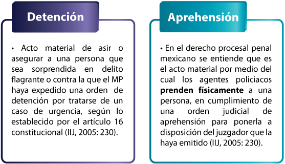
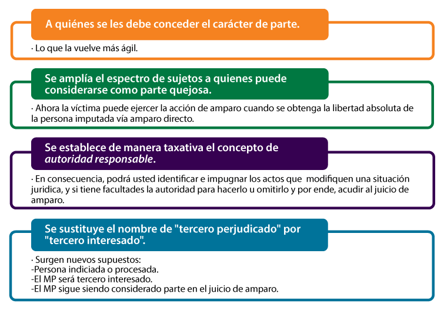
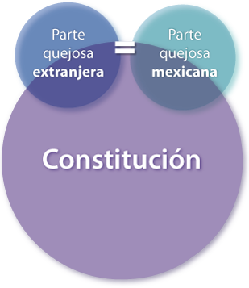

Derechos Públicos e Instituciones del Juicio de Amparo en Materia Penal
Introducción
En esta unidad se revisarán someramente las fuentes y los antecedentes históricos-jurídicos de la materia penal.

La materia penal, como parte del derecho público, es una de las más delicadas; ya que se trata de las penas que el Estado puede imponer por infringir las normas jurídicas que prevén delitos. 
 
Se estudiará de manera breve la evolución histórica del derecho penal en México, así como su evolución en la codificación. La perspectiva histórica permite conocer sus orígenes y no únicamente para allegarse de información, con el objeto de aprovechar las experiencias anteriores, en ese sentido la historia se torna dinámica convirtiéndose en una ciencia eminentemente activa y muy útil. Lo anterior va de la mano con que el derecho penal es fundamental en la formación de un estudioso en las ciencias jurídicas.

 

 

(1) Clío en el carro de la historia

 

Significa que, previa al conocimiento de los hechos pretéritos, ha de estar la convicción de evitar que en el presente se repitan los mismos errores e insistir en los aconteceres positivos y acertados.

Consecuentemente, en cualquier rama del conocimiento, la historia resulta imprescindible por ello. La primera unidad de esta asignatura es dedicada a ese objetivo.

 

  Actividad Introductoria
Conocimientos esenciales
Opción múltiple

Pulse en el boton iniciar para realizar su actividad introductoria

 
Objetivo
A lo largo de esta unidad, usted:

Identificará la evolución histórica de los derechos públicos subjetivos e instituciones del juicio de amparo en materia penal para poder explicar la situación actual de éstos.

Temario
Unidad 1. Derechos Públicos e Instituciones del Juicio de Amparo en Materia Penal

1.1. Fuentes
1.2. Antecedentes históricos y jurídicos
1.2.1. En la época precolonial y colonial
1.2.2. Hasta 1824
1.2.3. Hasta 1836
1.2.4. Hasta 1840
1.2.5. Hasta 1847
1.2.6. Hasta 1857
1.2.7. Hasta 1917
1.2.8. Hasta la fecha
 
Desarrollo de contenido
Fuentes

Para iniciar este tema, es necesario que recuerde que para el derecho una fuente es el elemento de donde brotan los derechos y las obligaciones. Sin las fuentes no podríamos concebir técnicamente del derecho. A continuación se revisarán de manera sintética los diversos tipos de éstas en materia de derecho penal.

 Pulse en cada uno de los conceptos que aparecen del lado izquierdo para desplegar la información correspondiente.

 

Fuentes reales
Del derecho en general, se entiende el conjunto de razones determinantes del contenido de las normas jurídicas. Las razones por las cuales el legislador les dio vida (contexto de lugar y tiempo) (Castellanos, 1997: 75).

Fuentes formales
Los procedimientos por los cuales se concreta la regla jurídica y se señala su fuerza obligatoria. Por ejemplo: el procedimiento legislativo; la ley, la costumbre, la jurisprudencia y la doctrina. (Castellanos, 1997: 75-76).

En materia penal, la única fuente que puede prever un delito es la ley.
Fuentes históricas
Medios materiales que permiten conocer el derecho vigente en el pasado, como libros, papiros, documentos, etcétera. Siempre que contengan el texto de una ley (Castellanos, 1997: 76).

 

¡Importante!
La fuente directa, inmediata y principal de derecho penal es la Ley.

 Antecedentes históricos y jurídicos

A continuación se hará una breve recopilación de los hechos históricos sucedidos en fechas representativas para la principal fuente de derecho, la Ley.

En general, se puede decir que la historia es la narración ordenada y sistémica de hechos importantes que han influido en el desarrollo de la civilización de la humanidad. Al aplicarse tales conceptos a la disciplina de interés, puede referirse que la historia del derecho penal es también la narración sistemática de las ideas que han determinado la evolución y desarrollo del derecho punitivo.

 
En la época precolonial y colonial

De lo acontecido antes de la llegada de los españoles se tienen escasas noticias, ya que existieron diversas naciones en lo que actualmente es nuestro país. Se aludirá de manera general a los mayas, tarascos y a los aztecas.

 

 

(3) Precolonial

 

Respecto a los mayas: sus leyes penales se caracterizaban por su severidad. Los batabs o caciques eran juzgadores y aplicaban la muerte como pena principal (a adúlteros, homicidas, incendiarios, raptores y corruptores de doncellas) y la esclavitud. Las sentencias penales eran inapelables (Castellanos, 1997: 40).

De los tarascos: eran penas crueles. Por ejemplo: el adulterio habido con la mujer de un soberano se castigaba con la muerte del adúltero y trascendía la pena a toda su familia. Los bienes del culpable eran confiscados (Castellanos, 1997: 41).

De los aztecas: quienes violaban el orden social eran colocados en un estatus de inferioridad y se aprovechaba su trabajo en una especie de esclavitud. Su derecho penal era escrito, se encuentra en los códigos que todavía existen; distinguieron entre los delitos dolosos y culposos, las circunstancias agravantes y atenuantes de la pena, las excluyentes de responsabilidad, la acumulación de sanciones, el indulto y la amnistía. Las penas eran: destierro, penas infamantes, pérdida de la nobleza, suspensión y destitución del empleo, esclavitud, arresto, prisión, demolición de la casa del infractor, corporales, pecuniarias y de muerte (Castellanos, 1997: 41-43).

La conquista hizo posible el intercambio entre el pueblo europeo con las poblaciones indígenas; se puede decir que los integrantes de éstas fueron los siervos y que los europeos quedaron como los amos. Es importante subrayar que las legislaciones existentes de los grupos indígenas en nada influyeron para la conformación del nuevo Estado, a pesar de la disposición del emperador Carlos V, establecida más tarde en la recopilación de las Indias, en donde se pedía respetar y conservar las leyes y costumbres, a menos que éstas se opusieran a la fe o a la moral; por lo tanto, es posible decir que la legislación existente en la Nueva España fue netamente europea.

 

 

(4) Palacio de las Leyes de Toro

 

En la Colonia entró en vigor la Legislación de Castilla, conocida con el nombre de Leyes de Toro; éstas tuvieron vigencia por disposición de las Leyes de Indias. “A pesar de que en 1596 se realizó la recopilación de esas Leyes de Indias, en materia jurídica reinaba la confusión y aplicaban el fuero real, las partidas, las ordenanzas reales de Castilla, las de Bilbao, los autos acordados, la Nueva y la Novísima Recopilaciones,”(Castellanos, 1997: 44)además de algunas ordenanzas dictadas para la Colonia, como la de minería, la de intendentes y las de gremios.

Puede afirmarse que la legislación colonial tendía a mantener las diferencias de castas, por ello no debe extrañar que en materia penal lo reflejara (Castellanos, 1997: 43-45).

De 1824 a la fecha

En el siguiente recurso se sintetizan los hechos más relevantes en cuanto a la defensa de los derechos fundamentales relacionados con el derecho penal en la historia del país. Revise cada una de la fechas para ver de manera muy resumida qué sucedía al respecto.

 Pulse en las flechas atrás y adelante para navegar entre los contenidos.

Hasta 1824
A partir de que México logra su independencia política en 1821 y después de una lucha intestina desgastante, que duró 11 años, el país se encontraba con graves problemas, que en su momento repercutieron durante todo el siglo XIX.

En los primeros años de vida independiente estuvo vigente el derecho español, es decir, las mismas disposiciones de la época colonial; la principal preocupación se encaminó por la organización política del naciente Estado.

No obstante, como caso excepcional, recién lograda la independencia se estableció la Soberana Junta Provisional Gubernativa del Imperio Mexicano, por Agustín de Iturbide; quien en su sesión del 12 de enero de 1822 designó una comisión para elaborar el Código Criminal de la nueva nación (López, 2012: 30).

Para 1824, emitió la primera Constitución del México independiente. Propiamente, no se habla del juicio de amparo, pero sí de formalidades en los juicios, fueran civiles o criminales, como se desprende de la lectura de los numerales 145 al 156 de la constitución aludida (Tena, 2008: 190).

Hasta 1836
En 1835, el estado de Veracruz aprobó el primer Código Penal vigente, debido a los trabajos de una comisión integrada por Bernardo Couto, Manuel Fernández Leal, José Julián Tornel y Antonio María Solorio (López, 2012: 31).

Estaba compuesto de tres partes, en las palabras del jurista Porte Petit (citado por el Dr. Eduardo López Betancourt): la primera, de las penas y de los delitos en general; la segunda, de los delitos contra la sociedad, y la tercera, de los delitos contra los particulares (López, 2012: 31).

Hasta 1840
En 1840 se elaboró el proyecto de Constitución yucateca, que preveía el juicio de amparo, como medio de defensa de los particulares contra los abusos del poder (En 1841, se expidió) (Ruiz, 2009: 44-48).

Hasta 1847
En 1847 se emitió el Acta Constitutiva y de Reformas, en la que se federalizó el juicio de amparo (López, 2012: 48).

Hasta 1857
“Como Veracruz ha sido un Estado de gran tradición jurídica, la legislatura estatal en 1848 comisionó a José Julián Tornel, ministro de la Suprema Corte de Justicia de la Nación, para formular un proyecto de Código Criminal y Penal, que no fue aprobado pero dejó constancia del interés por mejorar la legislación penal…” (López, 2012: 31).

Una nueva Constitución se emitió el 5 de febrero de 1857. Fue la primera Constitución federal que previó el juicio de amparo (Ruiz, 2009: 52-57).

Hasta 1917
En 1861, Benito Juárez ordena el restablecimiento de una Comisión para formular un proyecto de Código Penal, ésta fue presidida por Antonio Martínez de Castro. La Comisión concluyó en sus trabajos en 1868 y para 1871 se aprobó esta nueva ley (López, 2012: 31-32).

En 1869, el Estado de Veracruz aprobó un nuevo Código Penal, conocido con el nombre de Código Corona, por ser Fernando J. Corona su autor. Para 1871, es aprobada una nueva ley, influida por su orientación en favor de la escuela clásica del derecho penal (López, 2012: 31).

El Código Penal de 1871 fue revisado por una Comisión dirigida por Porfirio Díaz, en 1903, que tuvo diversas complicaciones y no fue sino hasta 1912 que se logró entregar un proyecto de Código Penal. Debido a los acontecimientos políticos del país, éste no logró aprobarse (López, 2012: 32).

El 5 de febrero de 1917 se emitió la actual Constitución, que prevé el juicio de amparo en sus artículos 28 (párrafo 20, fracción VII), 103 y 107 constitucionales.

En 1861, Benito Juárez ordena el restablecimiento de una Comisión para formular un proyecto de Código Penal, ésta fue presidida por Antonio Martínez de Castro. La Comisión concluyó en sus trabajos en 1868 y para 1871 se aprobó esta nueva ley (López, 2012: 31-32).

En 1869, el Estado de Veracruz aprobó un nuevo Código Penal, conocido con el nombre de Código Corona, por ser Fernando J. Corona su autor. Para 1871, es aprobada una nueva ley, influida por su orientación en favor de la escuela clásica del derecho penal (López, 2012: 31).

El Código Penal de 1871 fue revisado por una Comisión dirigida por Porfirio Díaz, en 1903, que tuvo diversas complicaciones y no fue sino hasta 1912 que se logró entregar un proyecto de Código Penal. Debido a los acontecimientos políticos del país, éste no logró aprobarse (López, 2012: 32).

El 5 de febrero de 1917 se emitió la actual Constitución, que prevé el juicio de amparo en sus artículos 28 (párrafo 20, fracción VII), 103 y 107 constitucionales.

Hasta la fecha
En 1929 se emitió otro Código Penal, conocido como Código Almaraz, vigente hasta 1931 y con influencia de la escuela positiva (Castellanos, 1997: 46-47).

El Código Penal de 1931, vigente y aplicable en materia federal.

Los Estados de la República y el Distrito Federal, en función del sistema federal, cada uno de ellos dicta su Ley Penal.

Hasta este punto se ha analizado el derecho público subjetivo en materia penal, interpretándolo a partir de su evolución histórica en México.

Lo que nos permitirá de esta manera crear un criterio amplio y objetivo de los alcances representativos en cada época partiendo de la cultura azteca, la diversidad de métodos que se empleaban para lograr una estabilidad social, hasta pasar por la conquista de los españoles y finalmente logrado establecer el Código Penal de 1931, el cual rige hasta la actualidad sin dejar a un lado la principal fuente de la materia de estudio que es la Ley.

 Pulse en Fuentes de consulta para visualizar la información.
 
Garantías de Igualdad
Introducción
En esta unidad, analizará el artículo 13 constitucional, referente a las garantías de igualdad, así como de la ley privativa, el tribunal especial y fuero.

Es relevante, en la formación de las personas que estudian la ciencia jurídica, conocer el tópico de las garantías de igualdad. Cabe mencionar que la igualdad guarda relación comparativa entre dos o más personas pertenecientes a una misma y determinada situación jurídica, la cual es regulada por el orden de derecho a través de distintas autoridades, que responden a diferentes circunstancias económicas, sociales y otras.

 

 

(1) Igualdad

 

¿Cómo es que la igualdad llega a ser una garantía constitucional?
 
Puede traducirse en una relación jurídica que media entre las personas gobernadas, por una parte, y el Estado y sus autoridades, por otra; constituye el primordial contenido de los derechos públicos subjetivos vinculados que derivan, es decir, aquellos elementos indispensables para el desarrollo de sus personalidades y el logro de su felicidad.

Debe mencionarse que la igualdad jurídica como garantía está integrada por la propia personalidad en su aspecto universal y abstracto, elimina toda diferencia entre grupos humanos e individuos desde un punto de vista de raza, nacionalidad, religión, posición económica, etcétera.

Una vez analizado lo anterior, es posible conocer de manera más específica el artículo 13 constitucional, definiendo los conceptos que lo integran: ley privativa, tribunal especial, fuero y fuero militar. Dichos conceptos le permiten crear un panorama para comprender con mayor claridad la finalidad de la asignatura y contar con los elementos necesarios que debe tener un estudiante de la materia.

  Actividad Introductoria
Garantía de igualdad 
Falso (F) o Verdadero (V)

Pulse en el botón Iniciar para realizar su actividad introductoria.

 
Objetivo
A lo largo de esta unidad, usted:

Argumentará sobre la importancia y aplicación de las garantías de igualdad en el derecho penal mexicano, mediante el análisis de las vicisitudes del artículo 13 constitucional, para detectar, en su caso, violaciones al derecho fundamental mencionado.

Temario
Unidad 2. Garantías de Igualdad

2.1. Artículo 13 constitucional
2.1.1. Ley privativa
2.1.2. Tribunal especial
2.1.3. Fuero
2.1.4. Fuero de guerra
 
Desarrollo de contenido
Artículo 13 constitucional

En esta unidad, analizará el artículo decimotercero constitucional e identificará cada una de las garantías de igualdad, cuyo objetivo es que las personas sean sujetos de derechos y contraigan obligaciones derivadas de determinadas situaciones jurídicas en las que se ubican según la ley que regule el acto o el hecho trascendente para el derecho.

Este artículo también menciona que no se permite procesar mediante leyes privativas y tribunales especiales (diferente de órganos jurisdiccionales especializados) a ninguna persona. Los fueros únicamente existen de manera excepcional para determinados servidores públicos (numerales 108 al 114 de la Constitución mexicana) y esto significa que, mediante un procedimiento previo, es posible despojarlos del mismo para que puedan ser juzgados como cualquier gobernado.

Nuestra Constitución
establece...

Artículo 13. 
Nadie puede ser juzgado por leyes privativas ni por tribunales especiales. Ninguna persona o corporación puede tener fuero, ni gozar más emolumentos que los que sean compensación de servicios públicos y estén fijados por la ley. Subsiste el fuero de guerra para los delitos y faltas contra la disciplina militar; pero los tribunales militares en ningún caso y por ningún motivo podrán extender su jurisdicción sobre personas que no pertenezcan al Ejército. Cuando en un delito o falta del orden militar estuviese complicado un paisano, conocerá del caso la autoridad civil que corresponda.
 

De acuerdo con Burgoa (1997: 281), este artículo contiene varias garantías específicas de igualdad:

Nadie puede ser juzgado por leyes privativas.
Nadie puede ser juzgado por tribunales especiales.
Ninguna persona o corporación puede tener fuero.
Ley privativa

Una ley privativa “crea, modifica, extingue o regula una situación en relación con una sola persona moral o física o con varias en número determinado” (Burgoa, 1997: 283).

De acuerdo con lo prescrito en el artículo decimotercero, un rasgo distintivo de la ley es que es general (no se aplica nada más a un individuo en particular), abstracta (es una hipótesis normativa) e impersonal (no se contrae a una persona determinada).

Características de la ley privativa:

Tribunal especial

Un tribunal es aquella autoridad competente, es decir, que está facultada expresamente por la ley para dictar o resolver una controversia en específico, está capacitado permanentemente para conocer dentro de una competencia diversa (Burgoa, 1997: 287).

En relación al concepto de tribunales especiales, según la Suprema Corte de Justicia de la Nación (SCJN) son los “creados exclusivamente para conocer, en un tiempo, de determinado negocio o de ciertas personas, sin tener un carácter permanente ni la facultad de resolver un número indeterminado de negocios de la misma materia” (Tesis aislada constitucional, 1a. CX/2011).

 
Por ejemplo...
Que le crearan un tribunal “personalizado” a usted para juzgarlo.

 
Los tribunales generales se distinguen de los especiales y de cualquier autoridad federal, estatal o municipal, desde el punto de vista de su capacidad jurídica o competencia en el conocimiento de un caso concreto, en la permanencia de sus funciones ejecutivas o decisorias y la posibilidad de tener injerencia válidamente en un número determinado de negocios singulares que encajen dentro de la situación determinada abstracta constitutiva de su ámbito competencial (Burgoa, 1997: 287).

 
Por ejemplo...
La Suprema Corte de Justicia, los tribunales colegiados de distrito, etcétera.

 

 

(2) Tribunal Superior de Justicia del Distrito Federal

 

En efecto, los tribunales especiales no son creados por la ley ni llevan un control en sus actuaciones por un ente que los verifique como un Consejo de la Judicatura, más bien se instituyen para conocer determinados asuntos mediante un decreto o determinada decisión, que resolverá únicamente el caso que juzgará.

Lo anterior es diferente a que existan tribunales especializados; éstos no están prohibidos por la Constitución. Por ejemplo, los tribunales en materia de competencia económica, familiares, civiles, penales, laborales, administrativos, mismos que tienen establecido legalmente su radio de acción.

 

Reflexión...
Cada entidad estructura el Poder Judicial de diferente manera; algunos tienen tribunales especializados que conocen de una materia en específico, otros son mixtos, ¿cómo está organizado el de su entidad?

 
Delimitadas las características más relevantes de los tribunales especiales, surge la cuestión de determinar el alcance de la garantía que prohíbe que una persona pueda ser juzgada por ellos.

Desde luego, la obligación que surge de dicha garantía es imputable directamente al Estado y consiste en que éste está facultado para no enjuiciar a una persona por responsabilidad civil o penalmente, mediante órganos jurisdiccionales que establezca ex profeso para conocer de un determinado caso en concreto (Burgoa, 1997).

Es decir, el Estado no puede permitir que existan estos órganos, para eso está obligado a crear los órganos jurisdiccionales necesarios.

La obligación originada del derecho fundamental regulado en el artículo 13 constitucional atribuible al Estado consiste en la imposición de la prohibición de elegir autoridades judiciales especiales de las autoridades federales, locales y municipales; la referida prohibición debe considerarse extensiva al órgano legislativo o administrativo a través de cuyos actos de autoridad consistentes en leyes, decretos, acuerdos y resoluciones que afecten la esfera del gobernado (Burgoa, 1997).

Por tanto, los actos de gobierno tienen permanencia independientemente del encargado de emitirlos.

Fuero

Definamos...
"Todo privilegio o prerrogativa de cualquier especie y contenido otorgado a alguna persona o corporación (persona moral)" (Burgoa, 1997: 291).

 
Lo que prohíbe el artículo constitucional es el llamado fuero personal, el cual es un conjunto de privilegios, prerrogativas o ventajas que se acuerdan en beneficio exclusivo de una o de varias personas, con las circunstancias de que éstas se colocan en una situación jurídica particular, sui generis, diversa de aquella en que se encuentran los demás individuos (Burgoa, 1997).

 
Por ejemplo...
Hacer un tribunal nada más para las y los académicos de la UNAM o para millonarios; entonces las y los académicos gozarían de un fuero por el grupo al que pertenecen, o, en el caso de los millonarios, por su clase económica y social.

 
Por ende, nuestra Ley fundamental “no excluye a los fueros reales, materiales u objetivos. Pues bien, el fuero de guerra que permite la Ley Suprema es eminentemente real u objetivo, puesto que se consigna en razón de la índole del delito que da origen a un juicio”. Así pues, el fuero de guerra o esfera de competencia jurisdiccional de los tribunales militares surge o tiene lugar cuando se trata de delitos o faltas del orden militar (Burgoa, 1997: 295).

 

 

(3) Fuero

 
Expresada la connotación utilizada en la palabra fuero en el artículo 13 constitucional, ¿de qué se trata la garantía específica de igualdad que prohíbe ser sujeto de fueros, en relación a las personas físicas y morales?

Primero, se debe considerar que el Estado está obligado a abstenerse de otorgar a ninguna persona física o persona jurídico-colectiva algún privilegio o prerrogativa de cualquier índole. Segundo, en caso de tenerlas, no las debe tomar en cuenta.

Esta prohibición de existencia de fueros a títulos de privilegios o prerrogativas a favor de una persona tiene salvedades constitucionales, en el sentido de que ciertas personas consideradas como “altos funcionarios” gozan de inmunidad en determinados casos, consistente en quedar excluidos de la jurisdicción común en materia penal mientras subsista el fuero mediante el procedimiento correspondiente (Burgoa, 1997: 291).

 
Reflexión...
La justificación histórica de la existencia del fuero es que debido a que las y los servidores públicos están expuestos a constantes acusaciones infundadas, es necesario envestirlas/los de esa protección para no entorpecer sus funciones. ¿Considera usted que sea conveniente o sano en este país? ¿Cree que se pueda prestar a abusos?

Fuero de guerra

 
Definamos...
El fuero de guerra o esfera de competencia de los tribunales militares surge cuando se trata de la comisión de un delito o falta, calificados por la ley como pertenecientes al orden militar.

 
Por el contrario, cuando un hecho no tiene un carácter delictivo militar, las personas competentes para conocer del proceso que a ese propósito se instruya serán los tribunales ordinarios (federales o locales, según sea el caso), aun cuando aquél lo haya realizado un miembro del ejército. (Burgoa, 1997: 296). 
 
Los tribunales militares carecen de facultad para extender su jurisdicción a personas que no pertenezcan a las fuerzas armadas mexicanas, así lo prevé el propio artículo 13 constitucional al establecer que los tribunales militares, en ningún caso y por ningún motivo, podrán extender su jurisdicción sobre personas que no pertenezcan al ejército.

Lo anterior se comprende dentro del tópico del derecho marcial, ya que jamás se debe aplicar el marco jurídico militar a un civil por delitos o faltas administrativas del medio castrense. Dichas normas jurídicas existen para que las y los miembros de la milicia acaten la disciplina de su medio; por ello, se les juzgará de acuerdo al delito o la falta administrativa que hubiesen cometido.

De no entenderse así, se puede prestar a que las autoridades cometan violaciones a los derechos humanos, como en el caso de Rosendo Radilla Pacheco. 
 
Fundamento legal

El fundamento constitucional del fuero de militar o de guerra constituye la única excepción al principio de igualdad ante la ley, regulado en la Constitución Política de los Estados Unidos Mexicanos, donde expresamente afirma que nadie puede ser juzgado por leyes privativas ni por tribunales especiales (art. 13).

El citado artículo constitucional prevé la subsistencia del fuero de guerra en relación a faltas y delitos cometidos contra la disciplina militar, con la salvedad de que, en ningún caso y por ningún motivo, los tribunales militares podrán extender su jurisdicción sobre personas que no pertenezcan a las Fuerzas Armadas, además puntualiza la participación de un civil en una falta o delito militar, es competencia de la autoridad civil que corresponda.

 

 

(4) Fuero militar

 
Entonces, el fuero de guerra queda interpretado y comprendido, de manera resumida, en el siguiente criterio judicial:

 
Interpretación de la ley
El artículo 13 constitucional ha reservado el fuero de guerra para los delitos contra la disciplina militar, debiendo entenderse como tales los que, al cometerse, perturban, disminuyen o ponen en peligro el servicio militar, se oponen a los deberes que impone el ordenamiento general del Ejército, o realizan durante un servicio militar (Tesis aislada penal, s.n. [reg. 285360]).
 
En conclusión, una vez analizado el artículo decimotercero constitucional e identificadas cada una de las garantías de igualdad, cuyo objetivo es que las personas sean sujetos de derechos y contraigan obligaciones derivadas de determinadas situaciones jurídicas en las que se ubican ante la presencia de una ley privativa que carece de universalidad o ante un tribunal especial aplica en un tiempo y caso determinado, o en el supuesto de un fuero que proporciona privilegios a determinada persona que perjudica el bienestar social, consecuentemente el Estado prohíbe o retira dicho privilegio al servidor público beneficiado. Ante la presencia de un fuero de guerra existen los límites a dicha jurisdicción.

 Pulse en Fuentes de consulta para visualizar la información.

 Fuentes de consulta
 
Garantías de Seguridad Jurídica
Introducción
En esta unidad analizará cada uno de los artículos constitucionales que hacen referencia a las garantías de seguridad; asimismo, abordará los distintos conceptos que implican a cada artículo que consagran las garantías de interés en este bloque teórico.

El nuevo sistema penal acusatorio debe entrar en vigor a mediados del año 2016 en todo el país y sin excepción. Sin embargo, como no es automático que todo lo anteriormente actuado quede eliminado y sin efectos, todavía van a estar en trámite los juicios penales que se iniciaron con el anterior sistema penal por varios años más. Es por esto que haremos el análisis de los artículos 16 al 21 con base en su redacción previa a la reforma constitucional de 2008, para que usted conozca el sistema previo y, al final, se incluye un apartado con las modificaciones hechas de manera general y resumida.

Es fundamental en la formación de una persona que estudie las ciencias jurídicas tener conocimiento de las garantías de seguridad. Toda persona debe contar con dicha garantía y estar consciente de que sus derechos serán respetados en todo momento, cuando exista una afectación sobre éstos por parte de la autoridad. Ésta deberá observar y apegarse a lo previsto por los diversos ordenamientos legales, cumpliendo en estricto acatamiento lo establecido por la Carta Magna.

En este rubro deberá revisar la importancia de la garantía de seguridad jurídica, haciendo referencia a la protección y la salvaguarda del derecho a la vida, integridad personal, propiedad, posesión, libertad de ambulación, entre otras.

 

 

(1) Garantías de seguridad

 

Otro aspecto por mencionar dentro de la seguridad jurídica son los derechos públicos subjetivos de las personas gobernadas, que son oponibles y exigibles al Estado y a sus agentes, quienes tienen la obligación de acatarlos u observarlos. De este tema se hablará más a profundidad en la presente unidad.

La igualdad jurídica como garantía está integrada por la propia personalidad en su aspecto universal abstracto, eliminando toda diferencia entre grupos humanos e individuos desde el punto de vista de la raza, nacionalidad, religión, posición económica, etcétera.

Una vez señalado lo anterior, los tópicos aludidos serán desarrollados ampliamente en el presente apartado, el cual desglosa cada artículo constitucional referente a la garantía de seguridad estableciendo sus límites, alcances y requisitos.

  Actividad Introductoria
Garantías de seguridad 
Falso (F) o Verdadero (V)

Pulse en el botón Iniciar para realizar su actividad introductoria.

 
Objetivo
A lo largo de esta unidad, usted:

Emitirá juicios sobre las violaciones de los derechos fundamentales protegidos por las garantías de seguridad jurídica en la Constitución, a partir de su interpretación, identificación en supuestos cercanos a la realidad y debate en grupo sobre los límites, alcances y requisitos de dichas garantías.

Temario
Unidad 3. Garantías de Seguridad Jurídica en la Constitución

3.1. Artículo 14
3.1.1. Garantía de irretroactividad
3.1.2. Garantía de audiencia
3.1.3. Garantía de tipicidad
3.2. Artículo 15
3.2.1. Tratados de extradición
3.2.2. Tratados internacionales
3.2.3. Tratados de extradición que no pueden ser celebrados
3.3. Artículo 16
3.3.1. Acto de molestia
3.3.2. Orden de detención y aprehensión
3.3.3. Cateo
3.4. Artículo 17
3.4.1. La impartición de justicia
3.4.2. Costas judiciales
3.4.3. Otros aspectos que toca el numeral analizado
3.5. Artículo 18
3.5.1.Prisión preventiva y establecimiento para cumplirla
3.5.2. La prisión como pena y establecimiento para cumplirla
3.5.3. Convenios respecto de personas sujetas a la ejecución de la pena de prisión
3.5.4. Personas aprehendidas en el extranjero
3.6. Artículo 19
3.6.1. Término constitucional para ejercitar la acción penal cuando hay detenido
3.6.2. Requisitos y especies de consignación
3.6.3. Requisitos y especies de autos de término constitucional
3.7. Artículo 20
3.7.1. Garantías de las personas inculpadas
3.7.2. Garantías de las víctimas o personas ofendidas
3.8. Artículo 21 y 22
3.8.1. Derecho a que el Ministerio Público persiga a las personas penalmente probables responsables ante los tribunales del orden penal
3.8.2. La imposición de las penas es propia y exclusiva de la autoridad judicial
3.8.3. La investigación y persecución de los delitos corresponden al Ministerio Público
3.9. Artículo 22
3.9.1. Penas prohibidas
3.9.2. La pena de muerte
3.9.3. La confiscación
3.9.4. Extinción de dominio
3.10. Artículo 23
3.10.1. Ningún juicio criminal deberá tener más de tres instancias
3.10.2. Nadie puede ser juzgado dos veces por el mismo delito
3.10.3. Se prohíbe la práctica de absolver de la instancia
3.11. Sistema Penal Acusatorio
 

Desarrollo de contenido
Garantías de seguridad jurídica

Las garantías de seguridad jurídica son los mecanismos que protegen los derechos más esenciales existentes a favor de las personas. Aquí se busca la protección de otros bienes: la vida, la libertad, las propiedades o posesiones, incluso la tranquilidad y certeza de las personas en las instituciones. Es posible decir que sin estos derechos, el juicio de amparo, no tendrían ninguna razón de ser.

De acuerdo con Ignacio Burgoa:

Éstas implican, en consecuencia, el conjunto general de condiciones, requisitos, elementos o circunstancias previas a que debe sujetarse una cierta actividad estatal autoritaria para generar una afectación válida de diferente índole en la esfera del gobernado, integrada por el summum de sus derechos subjetivos. Por ende, un acto de autoridad que afecte el ámbito jurídico particular de un individuo como gobernado, sin observar dichos requisitos, condiciones, elementos o circunstancias previos, no será válido a la luz del derecho (1997: 504).

 
Por ejemplo...
La tranquilidad que tiene usted en su casa para no ser molestado. Es decir, no puede entrar una autoridad a su casa sin el debido procedimiento previo.

 
Para realizar actos de molestia de manera legal, “el Estado y sus autoridades deben desempeñar, para cumplir dicha obligación, actos positivos, consistentes en realizar todos aquellos hechos que impliquen el cumplimiento de todos los requisitos, condiciones, elementos o circunstancias exigidas para que la afectación que generen sea jurídicamente válida” (Burgoa, 1997: 505).
 
Por ejemplo...
Si usted tiene un local que vende pasteles y también distribuye droga (es narcomenudista), vienen militares a inspeccionar el local, pero si no traen una orden de cateo no pueden entrar a revisar. Aun cuando sea cierto y evidente que usted vende droga, si no traen la orden, se anula el acto pues violan la garantía de seguridad jurídica.

 
Los preceptos constitucionales que consagran las garantías de seguridad jurídica son los artículos 14, 16, 17, 18, 19, 20, 21, 22 y 23, por mencionar algunos; los cuales se desarrollarán a detalle a lo largo de la unidad.

Artículo 14

Iniciaremos analizando el artículo 14, léalo y, posteriormente, revise el análisis de las garantías contenidas en éste.

 
Nuestra Constitución establece...

Artículo 14. 

A ninguna ley se dará efecto retroactivo en perjuicio de persona alguna. 

Nadie podrá ser privado de la libertad o de sus propiedades, posesiones o derechos, sino mediante juicio seguido ante los tribunales previamente establecidos, en el que se cumplan las formalidades esenciales del procedimiento y conforme a las Leyes expedidas con anterioridad al hecho. 
Párrafo reformado DOF 09-12-2005

En los juicios del orden criminal queda prohibido imponer, por simple analogía, y aún por mayoría de razón, pena alguna que no esté decretada por una ley exactamente aplicable al delito de que se trata.

En los juicios del orden civil, la sentencia definitiva deberá ser conforme a la letra o a la interpretación jurídica de la ley; a falta de ésta, se fundará en los principios generales del derecho.

 
El artículo 14 constitucional reviste trascendencia dentro del orden constitucional a través de las garantías de seguridad jurídica. Las personas gobernadas cuentan con una amplísima protección a los diversos bienes jurídicamente tutelados, como son la libertad personal, la propiedad, las posesiones y todos los derechos protegidos por el sistema jurídico mexicano.

 Pulse en los nombres de los conceptos que aparecen en la parte superior, se desplegará la información correspondiente.
 
Garantia de irretroactividad
-
Retroactivo, de acuerdo con el Diccionario de la Real Academia de la Lengua, significa “extensión de la aplicación de una norma a hechos y situaciones anteriores a su entrada en vigor o a actos y negocios jurídicos”.
Es decir, ningún cambio legal puede afectar situaciones jurídicas previas; pero puede beneficiarlas, puesto que la ley solamente prohíbe que sea “en perjuicio” de las personas.

Por ejemplo...
Juan está cumpliendo una pena de 10 años en prisión por un delito x, lleva ya 5 años, pero hoy modifican el Código Penal y le rebajan la pena de ese delito a 5 años; podría salir libre.

Sin embargo, si en vez de rebajarla la aumentaran a 20 años, Juan solamente está obligado a cumplir los 10 años por los que se le condenó.

La garantía de audiencia, 
-
una de las más importantes dentro de cualquier régimen jurídico, implica la principal defensa de que dispone toda persona gobernada frente a actos del poder público que pretendan privarlo de sus derechos y reconocidos intereses; está consignada en el segundo párrafo, artículo 14 constitucional.

Algunas generalidades del mencionado artículo constitucional fueron incluidas en el sistema legal mexicano desde la Constitución de 1857.

Audiencia, significa “acto de oír las personas de alta jerarquía u otras autoridades, previa concesión, a quienes exponen, reclaman o solicitan algo”, así como la “ocasión para aducir razones o pruebas que se ofrece a un interesado en juicio o en expediente” (Poder Judicial de la Federación, 2007: 49).

Algunos puntos a comentar de garantía de audiencia establecida en el segundo párrafo, artículo 14, son:

 ➢	“Nadie podrá ser…” refiere a que todas las personas (incluyendo a las personas extranjeras) sin excepción alguna, gozarán del beneficio de esta garantía, en relación con lo establecido por el artículo 1º de la Carta Magna.

 ➢	Que los “bienes jurídicamente tutelados” por esta garantía son la vida, la libertad, las propiedades, las posesiones y los derechos de cualquier persona.
Como puede apreciarse, dicha garantía tiene las siguientes implicaciones:

 a)	Que a quien se pretenda privar de alguno de los bienes jurídicos tutelados por dicha disposición constitucional, sea a través de un juicio ante los órganos jurisdiccionales respectivos o los que ejercen esa función de manera material. 
 b)	Que tal juicio se substancie ante tribunales establecidos o los órganos que desempeñen la función jurisdiccional de manera material.
 c)	Que en el juicio se observen las formalidades esenciales del procedimiento que se manifiestan en el derecho de defensa y la facultad de aportar pruebas.
 d)	Que el fallo respectivo sea dictado conforme a las leyes existentes como antelación al hecho o circunstancia que hubiere dado motivo al juicio.
Por lo tanto, se infiere que la garantía de audiencia consiste en proporcionarle a las personas gobernadas la oportunidad de defenderse previamente al acto privativo y para su cumplimiento impone a las autoridades la obligación de vigilar las formalidades esenciales del procedimiento, que consisten en la notificación de inicio y sus consecuencias, otorgamiento de la posibilidad de ofrecer pruebas y alegar su defensa y, por último, la emisión de una resolución que resuelva las cuestiones en conflicto.

Garantia de tipicidad
-
El tercer párrafo del artículo 14 constitucional prohíbe el uso de la analogía en la tipicidad; que no quiere decir que en materia penal no haya interpretación. Puesto que cada delito debe estar expresamente previsto en una ley proveniente del órgano legislativo competente para evitar excesos y arbitrariedades.

Por ejemplo, que copiar en un examen sea un delito porque coincide en algunos elementos con el fraude y en otros con el plagio, etcétera.

Algunos le llaman la garantía de la exacta aplicación de la Ley, o sea, la tipicidad es un derecho fundamental. Deben recordarse los principios básicos de nullum crimen sine lege y nulla poena sine lege. Dicha ley debe ser emitida por el órgano legislativo competente.

Aplicar la analogía (similitud entre un caso previsto y otro que no lo está) o la mayoría de razón en materia penal significa aplicar penas desproporcionadas respecto de una conducta delictuosa.

Un ejemplo de mayoría de razón sería: usted vende x sustancia química, científicamente está comprobado que causa más daño que algunas de las drogas prohibidas, pero como no está prohibida por la Ley, no ha cometido ningún delito.

Un ejemplo de pena desproporcionada sería que, quienes juzgan, no pueden cambiar el número de años de prisión de una pena si no lo dice la Ley.

Artículo 15

El presente artículo constitucional proporciona limitantes y regulaciones a seguir para la celebración de tratados internacionales para la extradición de "las y los reos políticos” y las personas delincuentes de fuero común.

A la letra, la Carta Magna menciona lo siguiente:

 
Nuestra Constitución establece...

Artículo 15. 

No se autoriza la celebración de tratados para la extradición de reos políticos, ni para la de aquellos delincuentes del orden común que hayan tenido en el país donde cometieron el delito, la condición de esclavos; ni de convenios o tratados en virtud de los que se alteren los derechos humanos reconocidos por esta Constitución y en los tratados internacionales de los que el Estado mexicano sea parte.
Artículo reformado DOF 10-06-2011

 
Los tratados internacionales
- 
se definen como “un acuerdo internacional celebrado por escrito entre Estados y regido por el derecho internacional público, ya conste en un instrumento único o en dos o más instrumentos conexos y cualquiera que sea su denominación particular” (Convención de Viena sobre el Derecho de los Tratados, 1969, parte I).

Aunque no es materia de esta asignatura, se menciona —grosso modo— que en el sistema jurídico mexicano se deben tomar en cuenta los siguientes ordenamientos legales para la celebración de los tratados internacionales:
- Constitución Política de los Estados Unidos Mexicanos
    - Quien los celebra es el Poder Ejecutivo Federal (CPEUM, art. 89)
    - El Senado de la República es quien los autoriza (CPEUM, art. 76)
        - Prohíbe celebrar tratados internacionales violatorios de derechos humanos (CPEUM, art. 15).
- La Ley sobre la Celebración de Tratados Internacionales.
- La Ley sobre la Aprobación de Tratados Internacionales en Materia Económica.

Tratados de extradición
-

Etimológicamente, “la palabra extradición proviene del vocablo latino ex, de la cual deriva la preposición latina extra, fuera de y traditionis, entrega o transmisión, derivado de tradere, transmitir o entregar” (SCJN/IIJ, 2006: 15). Para comprender mejor este término, revise la definición de la SCJN de tratado de extradición.

La extradición es una figura jurídica en la rama del derecho internacional que tiene como partes a dos o más Estados que firman un tratado con el objetivo de colaborar en la jurisdicción penal de una persona indiciada, procesada o sentenciada por un Estado requirente. Ésta no se utiliza únicamente para las personas extranjeras, ya que las personas nacionales también pueden ser obligadas a salir del país por esa figura.

No debe olvidarse que para que sea obligatoria obsequiarla, debe existir un tratado internacional.

En el mismo criterio judicial se establece que la extradición constituye un caso de excepción respecto de la soberanía del Estado requerido, por lo que dicho trámite está sujeto a los requisitos constitucionales, legales o convenios, a través de un Tratado Internacional de Extradición, los cuales deberán de ser cumplidos. En México, esta figura está regulada por…
El artículo 119 constitucional.
La Ley de Extradición Internacional, reglamentaria del artículo 119.
Los tratados específicos celebrados por México al respecto.

Si no existe un tratado específico, el proceso se ciñe a la Ley de Extradición Internacional.

De acuerdo con Contreras (2013: 153-154), existen algunos requisitos específicos para la celebración de tratados internacionales de extradición:
-  Solamente pueden tratar delitos intencionales (dolosos).
-  El delito debe ser punible en ambos Estados.
- El delito debe sancionarse con pena de prisión si es doloso o con un medio aritmético de por lo menos un año si es culposo y, si es culposo grave, no importa el término.
- Si, para el delito, la ley mexicana exige querella de parte legítima, deberá satisfacerse ese requisito.
- No opera si la persona reclamada fue objeto de absolución, indulto, amnistía o si se cumplió la condena del delito.
- No opera si caducó la acción o prescribió la ejecución de la pena conforme a las leyes de los estados requirente y requerido.
- No procede respecto a delitos cometidos dentro de la jurisdicción de los tribunales de la república (en caso de existir conflicto de competencia judicial, éste se resolverá y no se concederá la extradición).
- No opera si la persona es objeto de una persecución política o si tiene condición de esclavitud en el estado requirente.
- No se concede si el delito es del fuero militar.

Tratados que no pueden ser celebrados
-

Los tratados que se celebren por la Poder Ejecutivo Federal, con aprobación del Senado, deberán estar de acuerdo con la misma Constitución, lo que implica que no deben contravenir lo dispuesto por ésta. Es por eso que la Constitución no autoriza la celebración de tratados de extradición que alteren las garantías de las personas gobernadas.

Por ejemplo...
Un ejemplo de esta transgresión a las garantías individuales es que el país que requiere la persona privada de la libertad le pretenda aplicar una pena de las prohibidas por la Constitución Federal, tal como la pena de muerte o la privación de la vida.

Es más los tratados o convenios prohibidos no sólo son aquellos que alteren las garantías de la persona gobernada, sino también los que afecten los “derechos de la ciudadanía”, entendidos éstos en su aceptación política; por ejemplo, lanzarse para un cargo de elección popular.

Además de las establecidas en el artículo 15, existen otras limitaciones constitucionales para celebrar tratados internacionales por parte del Estado Mexicano: artículo 89 sobre las facultades y obligaciones del Poder Ejecutivo Federal y el artículo 1, en relación con el principio pro persona y, otras reglas de interpretación, además de las previstas en el numeral 14 constitucional.

Artículo 16

Para iniciar, lea cuidadosamente el primer párrafo de este artículo en donde se establece lo respectivo a los actos de molestia. Recuerde que a partir de este artículo hasta el 21 se explicará dentro del sistema inquisitorial, previo a la reforma que establece el sistema penal acusatorio.

- Nadie puede ser molestado en su persona, familia, domicilio, papeles o posesiones, sino en virtud de mandamiento escrito de la autoridad competente, que funde y motive la causa legal del procedimiento. En los juicios y procedimientos seguidos en forma de juicio en los que se establezca como regla la oralidad, bastará con que quede constancia de ellos en cualquier medio que dé certeza de su contenido y del cumplimiento de lo previsto en este párrafo.
Párrafo reformado DOF 15-09-2017
- Toda persona tiene derecho a la protección de sus datos personales, al acceso, rectificación y cancelación de los mismos, así como a manifestar su oposición, en los términos que fije la ley, la cual establecerá los supuestos de excepción a los principios que rijan el tratamiento de datos, por razones de seguridad nacional, disposiciones de orden público, seguridad y salud públicas o para proteger los derechos de terceros.
Párrafo adicionado DOF 01-06-2009
- No podrá librarse orden de aprehensión sino por la autoridad judicial y sin que preceda denuncia o querella de un hecho que la ley señale como delito, sancionado con pena privativa de libertad y obren datos que establezcan que se ha cometido ese hecho y que exista la probabilidad de que el indiciado lo cometió o participó en su comisión.
Párrafo reformado DOF 01-06-2009. Fe de erratas DOF 25-06-2009
- La autoridad que ejecute una orden judicial de aprehensión, deberá poner al inculpado a disposición del juez, sin dilación alguna y bajo su más estricta responsabilidad. La contravención a lo anterior será sancionada por la ley penal.
- Cualquier persona puede detener al indiciado en el momento en que esté cometiendo un delito o inmediatamente después de haberlo cometido, poniéndolo sin demora a disposición de la autoridad más cercana y ésta con la misma prontitud, a la del Ministerio Público. Existirá un registro inmediato de la detención.
- Sólo en casos urgentes, cuando se trate de delito grave así calificado por la ley y ante el riesgo fundado de que el indiciado pueda sustraerse a la acción de la justicia, siempre y cuando no se pueda ocurrir ante la autoridad judicial por razón de la hora, lugar o circunstancia, el Ministerio Público podrá, bajo su responsabilidad, ordenar su detención, fundando y expresando los indicios que motiven su proceder.
- En casos de urgencia o flagrancia, el juez que reciba la consignación del detenido deberá inmediatamente ratificar la detención o decretar la libertad con las reservas de ley.
- La autoridad judicial, a petición del Ministerio Público y tratándose de delitos de delincuencia organizada, podrá decretar el arraigo de una persona, con las modalidades de lugar y tiempo que la ley señale, sin que pueda exceder de cuarenta días, siempre que sea necesario para el éxito de la investigación, la protección de personas o bienes jurídicos, o cuando exista riesgo fundado de que el inculpado se sustraiga a la acción de la justicia. Este plazo podrá prorrogarse, siempre y cuando el Ministerio Público acredite que subsisten las causas que le dieron origen. En todo caso, la duración total del arraigo no podrá exceder los ochenta días.
- Por delincuencia organizada se entiende una organización de hecho de tres o más personas, para cometer delitos en forma permanente o reiterada, en los términos de la ley de la materia.
- Ningún indiciado podrá ser retenido por el Ministerio Público por más de cuarenta y ocho horas, plazo en que deberá ordenarse su libertad o ponérsele a disposición de la autoridad judicial; este plazo podrá duplicarse en aquellos casos que la ley prevea como delincuencia organizada. Todo abuso a lo anteriormente dispuesto será sancionado por la ley penal.
- En toda orden de cateo, que sólo la autoridad judicial podrá expedir, a solicitud del Ministerio Público, se expresará el lugar que ha de inspeccionarse, la persona o personas que hayan de aprehenderse y los objetos que se buscan, a lo que únicamente debe limitarse la diligencia, levantándose al concluirla, un acta circunstanciada, en presencia de dos testigos propuestos por el ocupante del lugar cateado o en su ausencia o negativa, por la autoridad que practique la diligencia.
- Las comunicaciones privadas son inviolables. La ley sancionará penalmente cualquier acto que atente contra la libertad y privacía de las mismas, excepto cuando sean aportadas de forma voluntaria por alguno de los particulares que participen en ellas. El juez valorará el alcance de éstas, siempre y cuando contengan información relacionada con la comisión de un delito. En ningún caso se admitirán
comunicaciones que violen el deber de confidencialidad que establezca la ley.
- Exclusivamente la autoridad judicial federal, a petición de la autoridad federal que faculte la ley o del titular del Ministerio Público de la entidad federativa correspondiente, podrá autorizar la intervención de
cualquier comunicación privada. Para ello, la autoridad competente deberá fundar y motivar las causas legales de la solicitud, expresando además, el tipo de intervención, los sujetos de la misma y su duración.
- La autoridad judicial federal no podrá otorgar estas autorizaciones cuando se trate de materias de carácter electoral, fiscal, mercantil, civil, laboral o administrativo, ni en el caso de las comunicaciones del
detenido con su defensor.
- Los Poderes Judiciales contarán con jueces de control que resolverán, en forma inmediata, y por cualquier medio, las solicitudes de medidas cautelares, providencias precautorias y técnicas de investigación de la autoridad, que requieran control judicial, garantizando los derechos de los indiciados y de las víctimas u ofendidos. Deberá existir un registro fehaciente de todas las comunicaciones entre
jueces y Ministerio Público y demás autoridades competentes.
- Las intervenciones autorizadas se ajustarán a los requisitos y límites previstos en las leyes. Los resultados de las intervenciones que no cumplan con éstos, carecerán de todo valor probatorio.
- La autoridad administrativa podrá practicar visitas domiciliarias únicamente para cerciorarse de que se han cumplido los reglamentos sanitarios y de policía; y exigir la exhibición de los libros y papeles indispensables para comprobar que se han acatado las disposiciones fiscales, sujetándose en estos casos, a las leyes respectivas y a las formalidades prescritas para los cateos.
- La correspondencia que bajo cubierta circule por las estafetas estará libre de todo registro, y su violación será penada por la ley.
- En tiempo de paz ningún miembro del Ejército podrá alojarse en casa particular contra la voluntad del dueño, ni imponer prestación alguna. En tiempo de guerra los militares podrán exigir alojamiento, bagajes, alimentos y otras prestaciones, en los términos que establezca la ley marcial correspondiente.
Artículo reformado DOF 03-02-1983, 03-09-1993, 03-07-1996, 08-03-1999, 18-06-2008

El artículo 16 de la Constitución es uno de los más trascendentales, puesto que proporciona mayor protección a cualquier persona gobernada, sobre todo a través de la garantía de legalidad que consagra. La cual, dada su extensión y efectividad jurídica, ubica a la persona a salvo de todo acto de molestia a su esfera de derecho que no sólo sea arbitrario, es decir, que no esté basado en norma legal alguna y que tampoco sea contrario a cualquier precepto, independientemente de la jerarquía o naturaleza del ordenamiento a que éste pertenezca.

Este precepto da al indiciado las garantías de un procesamiento equitativo y justo y garantiza a los individuos la inviolabilidad del domicilio, así como el derecho a la libertad personal, al disfrute de sus bienes y vida familiar cuando se carezca de base legal para proceder penalmente en su contra (Flores, 1985: 352). A continuación se desarrollan a detalle conceptos relevantes que regula.

Acto de molestia
-

Los actos de molestia, según la SCJN, son aquellos que sólo restringen de manera provisional o preventiva un derecho con el objeto de proteger determinados bienes jurídicos. De tal suerte que los actos de molestia constituyen una restricción temporal a los derechos las personas gobernadas (Poder Judicial de la Federación, 2007: 85-86).

Algunos de los actos que se consideran de molestia son: 
- Actos administrativos que causen a la persona gobernada una afectación sobre cualquiera de sus bienes jurídicos. Por ejemplo, una visita domiciliaria en materia fiscal sin la debida orden de inspección.
- Actos jurisdiccionales penales o civiles, por ejemplo, el cateo no se puede llevar a cabo sin la orden emitida por quien juzgue.
- Actos de privación, por ejemplo, cuando se pierde un bien inmueble en un juicio hipotecario.

De acuerdo con el Poder Judicial de la Federación (2007), para poder realizar cualquier acto de molestia, las autoridades deben cubrir los siguientes requisitos:

   a)	Mostrar el mandamiento escrito correspondiente.  
   b)	La orden debe provenir de una autoridad competente.  
   c)	El acto debe estar correctamente fundado y motivado.  
   
Orden de aprehensión y detención
-

Como ya se vio en el tema de competencia, la autoridad puede hacer solamente lo que la Ley le permite expresamente, luego entonces, en el caso de las órdenes de aprehensión, el artículo 16 otorga competencia exclusiva a la autoridad judicial para emitirlas, y deben cumplir los requisitos apegados a la garantía de legalidad. Aunque esta facultad tiene dos excepciones: en los casos de delito flagrante y en los urgentes. En los primeros, cualquier persona –sea o no autoridad– puede detener a una persona indiciada y ponerla en el acto a disposición de la autoridad inmediata para que la remita al Ministerio Público. En los casos urgentes, existe un riesgo de que la persona indiciada se sustraiga de la acción de la justicia, por lo que, el propio Ministerio Público podrá detenerla (Poder Judicial de la Federación, 2007: 93).

Nota
En los casos urgentes, la Carta Fundamental obliga al Ministerio Público a fundar y motivar los indicios que lo conduzcan a detener a una persona indiciada en un caso urgente (Poder Judicial de la Federación, 2007: 95).

Cateo
-

Registro y allanamiento de un domicilio particular por la autoridad, con el propósito de buscar personas u objetos que están relacionados con la investigación de un delito (Instituto de Investigaciones Jurídicas, tomo A-C, 2005: 509).

El artículo 16, párrafo undécimo, contempla los requisitos para que sea expedida una orden de cateo y se realicen visitas domiciliarias. Revíselo cuidadosamente y continúe leyendo. Aquí se prevé que la autoridad judicial debe expedir una orden de cateo por escrito.

El párrafo decimosexto prevé las facultades de comprobación del cumplimiento del marco jurídico: disposiciones administrativas, laborales, fiscales, ambientales, etcétera. Éstas deben fundarse, motivarse y sujetarse a las formalidades prescritas para los cateos y no pueden hacerse arbitrariamente. Esto no quiere decir que las órdenes de verificación en las materias aludidas las deba expedir una autoridad judicial.

Otros tópicos que prevé el artículo es la intervención de las comunicaciones privadas, el arraigo de una persona, la requisición (en caso de guerra un miembro del Ejército puede exigir determinadas prestaciones a los civiles pero según la ley marcial correspondiente).

Artículo 17

Revise en el siguiente recurso el contenido del artículo 17. En especial los párrafos primero y segundo.

 Pulse en cada una de las pestañas con números para ver la información correspondiente.
 
Artículo 17
Artículo reformado DOF 17-03-1987, 18-06-2008, 29-07-2010

1º.	Ninguna persona podrá hacerse justicia por sí misma, ni ejercer violencia para reclamar su derecho.

2º.	Toda persona tiene derecho a que se le administre justicia por tribunales que estarán expeditos para impartirla en los plazos y términos que fijen las leyes, emitiendo sus resoluciones de manera pronta, completa e imparcial. Su servicio será gratuito, quedando, en consecuencia, prohibidas las costas judiciales.

3º.	El Congreso de la Unión expedirá las leyes que regulen las acciones colectivas. Tales leyes determinarán las materias de aplicación, los procedimientos judiciales y los mecanismos de reparación del daño. Los jueces federales conocerán de forma exclusiva sobre estos procedimientos y mecanismos.

4º.	Las leyes preverán mecanismos alternativos de solución de controversias. En la materia penal regularán su aplicación, asegurarán la reparación del daño y establecerán los casos en los que se requerirá supervisión judicial.

5º. Las sentencias que pongan fin a los procedimientos orales deberán ser explicadas en audiencia pública previa citación de las partes.

6º. Las leyes federales y locales establecerán los medios necesarios para que se garantice la independencia de los tribunales y la plena ejecución de sus resoluciones.

7º. La Federación, los Estados y el Distrito Federal garantizarán la existencia de un servicio de defensoría pública de calidad para la población y asegurarán las condiciones para un servicio profesional de carrera para los defensores. Las percepciones de los defensores no podrán ser inferiores a las que correspondan a los agentes del Ministerio Público.

8º. Nadie puede ser aprisionado por deudas de carácter puramente civil.

El artículo 17 constitucional establece, de acuerdo con Flores Vilchis (1985: 352), una garantía de seguridad jurídica, que se traduce en la imposibilidad que tienen las autoridades judiciales de retardar o entorpecer indefinidamente la función de administrar justicia.

 Pulse en cada concepto para desplegar el contenido. Al pulsar en otro concepto el desplegado volverá a su posición inicial.
 
Garantía de impartición de justicia
.
La parte inicial del precepto (párrafo primero) se redactó para eliminar cualquier intento de venganza privada, vigente durante los albores de la Edad Media (Poder Judicial de la Federación, 2007: 97). Significa que queda prohibido hacerse “justicia por su propia mano”.

Aquí es donde se encuentra el sustento de un Estado de derecho, indica la vía por la cual las personas gobernadas pueden reclamar sus derechos, respetando en todo momento el sistema legal establecido; lo que implica respetar las instituciones del Estado, teniendo como consecuencia, entre otras, el orden social, uno de los fines primordiales del derecho.

Aunque existen en diversos ordenamientos legales, supuestos que dadas las circunstancias en que el Estado no puede intervenir para administrar justicia, se dan los casos de autotutela como la defensa legítima, la echazón, entre otras.

Expedita y eficaz administración de justicia
-
El segundo párrafo, complementario del primero, prevé la obligación del Estado de crear tribunales que se encuentren expeditos para impartir justicia, en los términos y plazos fijados por las leyes, siendo este servicio gratuito.

Es la posibilidad de ser parte dentro de un proceso judicial y de promover la actividad jurisdiccional que terminará en una determinación que resuelva el conflicto jurídico, con el fin de lograr que las instancias de justicia constituyan un mecanismo expedito, eficaz y confiable al que las personas gobernadas acudan a dirimir un litigio (Poder Judicial de la Federación, 2007: 98-100).

El carácter expedito de la impartición de justicia se fundamenta en que la seguridad jurídica de las personas gobernadas no permanezca en estado de incertidumbre durante mucho tiempo.

La impartición de justicia debe ser, completa e imparcial. Es decir, la exhaustividad en todas las sentencias y resoluciones, en tanto deben pronunciarse en todo lo planteado por las partes durante la substanciación del juicio y sin tendencias o favoritismos por alguna de ellas.

Por otra parte, en la parte final del párrafo segundo del artículo en estudio, se menciona que el servicio de administración de justicia será gratuito, quedando prohibidas las costas judiciales.

Costas judiciales
-
Nos referimos a costas judiciales como el cobro por el servicio público de impartición de justicia.

De acuerdo con el artículo 17, el servicio otorgado por los tribunales debe ser gratuito, ya que el acceso a la justicia no debe excluir a las personas con pocos recursos económicos; pues las y los servidores que prestan el servicio público de impartición de justicia están remunerados por el Estado.

No debe confundirse con la condena de una de las partes a cubrir gastos del juicio, que beneficia a la parte que obtuvo sentencia favorable y no a la autoridad judicial. Sólo se pagan costas procesales por las partes en el juicio, respecto a los gastos que generen el mismo como el pago de abogados o abogadas, copias, o por la parte que haya perdido en un juicio y así lo establezca la ley adjetiva respectiva.

Otros aspectos que toca el numeral analizado
Da las bases constitucionales de las acciones colectivas, para las leyes que prevean mecanismos alternativos de solución de controversias y la existencia de un servicio de defensoría pública de calidad para la población.

Por otro lado, el antepenúltimo párrafo, establece que las leyes federales y locales establecerán que los tribunales sean independientes y que sus resoluciones se ejecuten (garantías judiciales).

Además, se prevé la abolición de prisión por deudas de carácter puramente civil (que tengan su origen en el derecho civil).

Artículo 18

 

Revise el siguiente artículo constitucional que habla sobre la prisión preventiva y las garantías relacionadas con ésta.

 Pulse en los recuadros que se marcan como sensibles para que se despliegue la información correspondiente

 
1° Sólo por delito que merezca pena privativa de libertad habrá lugar a prisión preventiva. El sitio de ésta será distinto del que se destinare para la extinción de las penas y estarán completamente separados.

2° El sistema penitenciario se organizará sobre la base del respeto a los derechos humanos, del trabajo, la capacitación para el mismo, la educación, la salud y el deporte como medios para lograr la reinserción del sentenciado a la sociedad y procurar que no vuelva a delinquir, observando los beneficios que para él prevé la ley. Las mujeres compurgarán sus penas en lugares separados de los destinados a los hombres para tal efecto.

Párrafo reformado DOF 10-06-201

3° La Federación, los Estados y el Distrito Federal podrán celebrar convenios para que los sentenciados por delitos del ámbito de su competencia extingan las penas en establecimientos penitenciarios dependientes de una jurisdicción diversa.

4° La Federación y las entidades federativas establecerán en el ámbito de sus respectivas competencias, un sistema integral de justicia para los adolescentes, que será aplicable a quienes se atribuya la comisión o participación en un hecho que la ley señale como delito y tengan entre doce años cumplidos y menos de dieciocho años de edad. Este sistema garantizará los derechos humanos que reconoce la Constitución para toda persona, así como aquellos derechos específicos que por su condición de personas en desarrollo les han sido reconocidos a los adolescentes. Las personas menores de doce años a quienes se atribuya que han cometido o participado en un hecho que la ley señale como delito, sólo podrán ser sujetos de asistencia social.

Párrafo reformado DOF 02-07-2015

5° La operación del sistema en cada orden de gobierno estará a cargo de instituciones, tribunales y autoridades especializados en la procuración e impartición de justicia para adolescentes. Se podrán aplicar las medidas de orientación, protección y tratamiento que amerite cada caso, atendiendo a la protección integral y el interés superior del adolescente.

6° Las formas alternativas de justicia deberán observarse en la aplicación de este sistema, siempre que resulte procedente. El proceso en materia de justicia para adolescentes será acusatorio y oral, en el que se observará la garantía del debido proceso legal, así como la independencia de las autoridades que efectúen la remisión y las que impongan las medidas. Éstas deberán ser proporcionales al hecho realizado y tendrán como fin la reinserción y la reintegración social y familiar del adolescente, así como el pleno desarrollo de su persona y capacidades. El internamiento se utilizará sólo como medida extrema y por el tiempo más breve que proceda, y podrá aplicarse únicamente a los adolescentes mayores de catorce años de edad, por la comisión o participación en un hecho que la ley señale como delito.

Párrafo reformado DOF 02-07-2015

7° Los sentenciados de nacionalidad mexicana que se encuentren compurgando penas en países extranjeros, podrán ser trasladados a la República para que cumplan sus condenas con base en los sistemas de reinserción social previstos en este artículo, y los sentenciados de nacionalidad extranjera por delitos del orden federal o del fuero común, podrán ser trasladados al país de su origen o residencia, sujetándose a los Tratados Internacionales que se hayan celebrado para ese efecto. El traslado de los reclusos sólo podrá efectuarse con su consentimiento expreso.

8° Los sentenciados, en los casos y condiciones que establezca la ley, podrán compurgar sus penas en los centros penitenciarios más cercanos a su domicilio, a fin de propiciar su reintegración a la comunidad como forma de reinserción social. Esta disposición no aplicará en caso de delincuencia organizada y respecto de otros internos que requieran medidas especiales de seguridad.

9° Para la reclusión preventiva y la ejecución de sentencias en materia de delincuencia organizada se destinarán centros especiales. Las autoridades competentes podrán restringir las comunicaciones de los inculpados y sentenciados por delincuencia organizada con terceros, salvo el acceso a su defensor, e imponer medidas de vigilancia especial a quienes se encuentren internos en estos establecimientos. Lo anterior podrá aplicarse a otros internos que requieran medidas especiales de seguridad, en términos de la ley.

Artículo reformado DOF 23-02-1965, 04-02-1977, 14-08-2001, 12-12-2005, 18-06-2008

A continuación analizaremos a detalle lo establecido en el artículo respecto de esta garantía de seguridad jurídica, que, en palabras más simples, establece: “solamente en los casos en que el delito imputado tenga señalada por la ley la pena de prisión, podrá el sujeto ser privado de la libertad en forma preventiva, es decir, mientras se dicta sentencia ejecutoriada” (Flores, 1985: 353).

 Pulse en cada uno de los conceptos de la parte superior para ver la información correspondiente.
 
Prisión preventiva y establecimiento para cumplirla
-
La prisión preventiva se define como la excepción a la garantía de audiencia, es la privación de la libertad mientras se sigue el proceso, inferior a la de reclusión y superior a la de arresto. Tiene por objeto impedir que una persona a la que se le ha imputado la comisión de una conducta delictiva calificada como grave por la Ley, evada la acción de la justicia mientras se sustancia el proceso, en el que se concluirá si la persona detenida es responsable del delito que se le ha imputado. Es una medida preventiva y uno de los motivos por los que se puede restringir la libertad personal; es una excepción para la garantía de previa audiencia (Poder Judicial de la Federación, 2007: 111-112 y 114).

Por ejemplo…
La portación ilegal de un arma de fuego es un delito grave, éste no alcanza una garantía para salir (por ejemplo, fianza), en este caso la persona queda privada de la libertad mientras se lleva a cabo el proceso penal. Esto, para evitar que la persona se escape de la acción de la justicia (se dé a la fuga).

La procedencia de la prisión preventiva se determina según el delito que se hubiera cometido. Si la conducta delictiva no amerita una pena privativa de libertad, sino una alternativa, la prisión preventiva no podrá tener lugar. No obstante, la aplicación de una pena alternativa queda siempre a discreción del juez o jueza.

Además, como lo prevé la segunda parte del primer párrafo del artículo 18, el lugar en que se lleve a cabo la prisión preventiva debe ser diferente a donde se cumpla la pena. No podemos juntar a quienes ya recibieron una sentencia con los que todavía no la han recibido, pues se corre el riesgo de agrupar a personas sentenciadas con inocentes.

También, en el párrafo noveno, prevé que para la reclusión preventiva y la ejecución de sentencias en materia de delincuencia organizada se destinarán centros especiales, también se podrá aplicar a otros internos que requieran medidas de seguridad en términos de la ley.

La prisión como pena y establecimiento para cumplirla
-
El objetivo de la imposición de las penas, ya que éstas deben tender, en cuanto a las formas de extinguirlas por diversas conductas, es la regeneración de la persona que delinque (Burgoa, 1997: 641); o sea, busca su “readaptación social” a través del trabajo, la capacitación para éste, la educación, la salud y el deporte como medios para que no vuelva a delinquir, observando los beneficios que prevé la ley. El artículo también establece que las mujeres compurgarán sus penas en lugares separados de los destinados a los hombres para tal efecto.

La federación y los estados están obligados a organizar el sistema penitenciario, al ser una obligación, deben elaborar disposiciones federales y locales que prevean las condiciones en que las personas privadas de su libertad deben cumplir con sus penas, además, en determinadas condiciones, purgar sus penas en los centros penitenciarios cercanos a su domicilio (Poder Judicial de la Federación, 2007: 120-121); con excepción de la delincuencia organizada y respecto de otros internos que requieran medidas especiales de seguridad.

Los párrafos cuarto, quinto y sexto se refieren a la justicia para adolescentes, es un sistema especializado para juzgar a los menores de edad.

Convenios respecto de las personas sujetas a la ejecución de la pena de prisión
-
El tercer párrafo no establece una obligación, sino una mera potestad para los ejecutivos locales o el federal de poder realizar convenios a efectos de que los sentenciados por algún delito compurguen sus penas en un centro penitenciario diferente al de su jurisdicción, sujetando su ejercicio a la legislación de cada entidad federativa, cuya autonomía por este motivo no se lesione. Estos convenios no pueden pactarse en relación con las personas procesadas (no sentenciadas) (Burgoa, 1997: 642).

Personas aprehendidas en el extranjero
-
En cuanto a la situación de las y los reos ubicados en el extranjero: aunque esa parte del precepto desglosado, puede generar varios problemas, ya que en caso de ser mexicanos que se encuentren compurgando una pena en el extranjero, se tendría que determinar si por los delitos condenados están tipificados en el sistema jurídico mexicano y, si durante el proceso respectivo, se observaron las garantías equivalentes a nuestras garantías constitucionales; si esos derechos fundamentales no se satisfacen por el solo hecho de que la o el reo penetre al país, produciría su inmediata libertad (Burgoa, 1997: 644).

Artículo 19

Antes de comenzar con el análisis, dé lectura rápida a lo contenido en el artículo que prevé la forma en que habrá de aplicarse la prisión preventiva.

 Pulse en los recuadros que se marcan como sensibles para que se despliegue la información correspondiente
 
Ninguna detención ante autoridad judicial podrá exceder del plazo de setenta y dos horas, a partir de que el indiciado sea puesto a su disposición, sin que se justifique con un auto de vinculación a proceso en el que se expresará: el delito que se impute al acusado; el lugar, tiempo y circunstancias de ejecución, así como los datos que establezcan que se ha cometido un hecho que la ley señale como delito y que exista la probabilidad de que el indiciado lo cometió o participó en su comisión.

El Ministerio Público sólo podrá solicitar al juez la prisión preventiva cuando otras medidas cautelares no sean suficientes para garantizar la comparecencia del imputado en el juicio, el desarrollo de la investigación, la protección de la víctima, de los testigos o de la comunidad, así como cuando el imputado esté siendo procesado o haya sido sentenciado previamente por la comisión de un delito doloso. El juez ordenará la prisión preventiva, oficiosamente, en los casos de delincuencia organizada, homicidio doloso, violación, secuestro, trata de personas, delitos cometidos con medios violentos como armas y explosivos, así como delitos graves que determine la ley en contra de la seguridad de la nación, el libre desarrollo de la personalidad y de la salud.
Párrafo reformado DOF 14-07-2011

La ley determinará los casos en los cuales el juez podrá revocar la libertad de los individuos vinculados a proceso.

El plazo para dictar el auto de vinculación a proceso podrá prorrogarse únicamente a petición del indiciado, en la forma que señale la ley. La prolongación de la detención en su perjuicio será sancionada por la ley penal. La autoridad responsable del establecimiento en el que se encuentre internado el indiciado, que dentro del plazo antes señalado no reciba copia autorizada del auto de vinculación a proceso y del que decrete la prisión preventiva, o de la solicitud de prórroga del plazo constitucional, deberá llamar la atención del juez sobre dicho particular en el acto mismo de concluir el plazo y, si no recibe la constancia mencionada dentro de las tres horas siguientes, pondrá al indiciado en libertad.

Todo proceso se seguirá forzosamente por el hecho o hechos delictivos señalados en el auto de vinculación a proceso. Si en la secuela de un proceso apareciere que se ha cometido un delito distinto del que se persigue, deberá ser objeto de investigación separada, sin perjuicio de que después pueda decretarse la acumulación, si fuere conducente.

Si con posterioridad a la emisión del auto de vinculación a proceso por delincuencia organizada el inculpado evade la acción de la justicia o es puesto a disposición de otro juez que lo reclame en el extranjero, se suspenderá el proceso junto con los plazos para la prescripción de la acción penal.

Todo mal tratamiento en la aprehensión o en las prisiones, toda molestia que se infiera sin motivo legal, toda gabela o contribución, en las cárceles, son abusos que serán corregidos por las leyes y reprimidos por las autoridades.
Artículo reformado DOF 03-09-1993, 08-03-1999, 18-06-2008

El plazo constitucional de 72 horas
-
Este plazo comienza a correr desde el momento en que la persona, como probable autora del delito, es puesta a disposición de la autoridad judicial (Poder Judicial de la Federación, 2007: 125).

Si dentro de esas 72 horas no se dicta un auto de formal prisión, deberá dictarse uno de soltura, de libertad o de sujeción a proceso, pero en ningún caso se permitirá que la persona continúe detenida si no se gira un auto de formal prisión en su contra en el tiempo dicho. (Poder Judicial de la Federación, 2007: 127). Este plazo podrá prorrogarse a petición de la persona indiciada o la persona que lo defienda hasta por 72 horas más (art. 161 del Código Federal de Procedimientos Penales).
En el caso de que, dentro de las primeras 72 horas, las personas encargadas del establecimiento donde se halle la persona indiciada, no hayan recibido ningún pronunciamiento por parte del juez o jueza, le deben llamar la atención a éste o ésta sobre el particular. Si dentro de las tres horas siguientes no hay constancia de que se haya expedido un auto de formal prisión, a la persona indiciada se le deberá poner en libertad de inmediato.
Se actualiza la responsabilidad penal para el juez o jueza que no dicte ningún auto después de transcurridos los términos constitucionales y legales para que se defina la situación jurídica de la persona inculpada (Poder Judicial de la Federación, 2007: 128).
Por otra parte, la puesta en libertad de la persona inculpada deberá responder al dictado de un auto de libertad por falta de elementos para procesar —auto de libertad por falta de méritos— donde conste que no se comprobó la responsabilidad de la persona indiciada en el delito imputado (Poder Judicial de la Federación, 2007: 128).

Se debe aclarar que este auto tiene naturaleza provisional, ya que el MP, al tener el monopolio de la acción penal y de persecución de los delitos (CPEUM, art. 21), puede recabar nuevas y mejores pruebas e insistir en la acción penal, a fin de que se dicte un auto de formal prisión. Esto no quiere decir que a la persona inculpada se le esté juzgando dos veces por el mismo delito por no constituir sentencia firme.

Si se comprueba que la persona detenida cometió un delito, pero de los que no son castigados con pena corporal o sancionados con pena alternativa, se dictará un auto de sujeción a proceso, en que se establezca la naturaleza de la conducta delictiva por la que la persona puesta en libertad será procesada (Poder Judicial de la Federación, 2007: 128-129).

Requisitos del auto de formal prisión
-
Sus requisitos están previstos en el primer párrafo, del numeral 19 constitucional, que ordena que en el auto de formal prisión se expresarán: el delito que se impute a la persona inculpada; el lugar, tiempo y circunstancias de ejecución, así como los datos que arroje la averiguación previa. Éstos deberán ser suficientes para comprobar el cuerpo del delito y hacer probable la responsabilidad de la persona indiciada.

- Cuerpo del delito. Elementos que constituyen la materialidad del hecho que la ley señala como delito.
- La probable responsabilidad. Cuando de los medios probatorios existentes, se deduzca su participación en el delito, la comisión dolosa o culposa de éste (Poder Judicial de la Federación, 2007: 130-131).

Es importante mencionar que el auto de formal prisión fija el tema del proceso (abre el periodo de instrucción) al establecer por qué delito o delitos deberá ser procesada la persona contra quien se dictó. Debe mencionar todos los elementos constitutivos del delito, incluyendo sus modalidades o calificativas, referirse a las circunstancias de lugar, tiempo, modo u ocasión en el que se llevó a cabo (Poder Judicial de la Federación, 2007: 133-134).

Artículo 20

El 21 de septiembre de 2000, el artículo 20 de la Constitución Federal sufrió reformas y adiciones, su contenido se dividió en dos apartados. El primero establece las garantías que asisten a las personas inculpadas, mientras que el segundo consigna prerrogativas para las personas ofendidas o víctimas de un delito (Poder Judicial de la Federación, 2007: 137).

El proceso penal será acusatorio y oral. Se regirá por los principios de publicidad, contradicción, concentración, continuidad e inmediación.

A. 	De los principios generales:

I. 	El proceso penal tendrá por objeto el esclarecimiento de los hechos, proteger al inocente, procurar que el culpable no quede impune y que los daños causados por el delito se reparen;

II. 	Toda audiencia se desarrollará en presencia del juez, sin que pueda delegar en ninguna persona el desahogo y la valoración de las pruebas, la cual deberá realizarse de manera libre y lógica;

III. 	Para los efectos de la sentencia sólo se considerarán como prueba aquellas que hayan sido desahogadas en la audiencia de juicio. La ley establecerá las excepciones y los requisitos para admitir en juicio la prueba anticipada, que por su naturaleza requiera desahogo previo;

IV. 	El juicio se celebrará ante un juez que no haya conocido del caso previamente. La presentación de los argumentos y los elementos probatorios se desarrollará de manera pública, contradictoria y oral;

V. 	La carga de la prueba para demostrar la culpabilidad corresponde a la parte acusadora, conforme lo establezca el tipo penal. Las partes tendrán igualdad procesal para sostener la acusación o la defensa, respectivamente;

VI. 	Ningún juzgador podrá tratar asuntos que estén sujetos a proceso con cualquiera de las partes sin que esté presente la otra, respetando en todo momento el principio de contradicción, salvo las excepciones que establece esta Constitución;

VII. 	Una vez iniciado el proceso penal, siempre y cuando no exista oposición del inculpado, se podrá decretar su terminación anticipada en los supuestos y bajo las modalidades que determine la ley. Si el imputado reconoce ante la autoridad judicial, voluntariamente y con conocimiento de las consecuencias, su participación en el delito y existen medios de convicción suficientes para corroborar la imputación, el juez citará a audiencia de sentencia. La ley establecerá los beneficios que se podrán otorgar al inculpado cuando acepte su responsabilidad;

VIII. 	El juez sólo condenará cuando exista convicción de la culpabilidad del procesado;

IX. 	Cualquier prueba obtenida con violación de derechos fundamentales será nula, y

X. 	Los principios previstos en este artículo, se observarán también en las audiencias preliminares al juicio.

B. 	De los derechos de toda persona imputada:

I. 	A que se presuma su inocencia mientras no se declare su responsabilidad mediante sentencia emitida por el juez de la causa;

II. 	A declarar o a guardar silencio. Desde el momento de su detención se le harán saber los motivos de la misma y su derecho a guardar silencio, el cual no podrá ser utilizado en su perjuicio. Queda prohibida y será sancionada por la ley penal, toda incomunicación, intimidación o tortura. La confesión rendida sin la asistencia del defensor carecerá de todo valor probatorio;

III. 	A que se le informe, tanto en el momento de su detención como en su comparecencia ante el Ministerio Público o el juez, los hechos que se le imputan y los derechos que le asisten. Tratándose de delincuencia organizada, la autoridad judicial podrá autorizar que se mantenga en reserva el nombre y datos del acusador.

La ley establecerá beneficios a favor del inculpado, procesado o sentenciado que preste ayuda eficaz para la investigación y persecución de delitos en materia de delincuencia organizada;

IV. 	Se le recibirán los testigos y demás pruebas pertinentes que ofrezca, concediéndosele el tiempo que la ley estime necesario al efecto y auxiliándosele para obtener la comparecencia de las personas cuyo testimonio solicite, en los términos que señale la ley;

V. 	Será juzgado en audiencia pública por un juez o tribunal. La publicidad sólo podrá restringirse en los casos de excepción que determine la ley, por razones de seguridad nacional, seguridad pública, protección de las víctimas, testigos y menores, cuando se ponga en riesgo la revelación de datos legalmente protegidos, o cuando el tribunal estime que existen razones fundadas para justificarlo.

En delincuencia organizada, las actuaciones realizadas en la fase de investigación podrán tener valor probatorio, cuando no puedan ser reproducidas en juicio o exista riesgo para testigos o víctimas. Lo anterior sin perjuicio del derecho del inculpado de objetarlas o impugnarlas y aportar pruebas en contra;

VI. 	Le serán facilitados todos los datos que solicite para su defensa y que consten en el proceso.

El imputado y su defensor tendrán acceso a los registros de la investigación cuando el primero se encuentre detenido y cuando pretenda recibírsele declaración o entrevistarlo. Asimismo, antes de su primera comparecencia ante juez podrán consultar dichos registros, con la oportunidad debida para preparar la defensa. A partir de este momento no podrán mantenerse en reserva las actuaciones de la investigación, salvo los casos excepcionales expresamente señalados en la ley cuando ello sea imprescindible para salvaguardar el éxito de la investigación y siempre que sean oportunamente revelados para no afectar el derecho de defensa;

VII. 	Será juzgado antes de cuatro meses si se tratare de delitos cuya pena máxima no exceda de dos años de prisión, y antes de un año si la pena excediere de ese tiempo, salvo que solicite mayor plazo para su defensa;

VIII. 	Tendrá derecho a una defensa adecuada por abogado, al cual elegirá libremente incluso desde el momento de su detención. Si no quiere o no puede nombrar un abogado, después de haber sido requerido para hacerlo, el juez le designará un defensor público. También tendrá derecho a que su defensor comparezca en todos los actos del proceso y éste tendrá obligación de hacerlo cuantas veces se le requiera, y

IX. 	En ningún caso podrá prolongarse la prisión o detención, por falta de pago de honorarios de defensores o por cualquiera otra prestación de dinero, por causa de responsabilidad civil o algún otro motivo análogo.

La prisión preventiva no podrá exceder del tiempo que como máximo de pena fije la ley al delito que motivare el proceso y en ningún caso será superior a dos años, salvo que su prolongación se deba al ejercicio del derecho de defensa del imputado. Si cumplido este término no se ha pronunciado sentencia, el imputado será puesto en libertad de inmediato mientras se sigue el proceso, sin que ello obste para imponer otras medidas cautelares.

En toda pena de prisión que imponga una sentencia, se computará el tiempo de la detención.

C. 	De los derechos de la víctima o del ofendido:

I. 	Recibir asesoría jurídica; ser informado de los derechos que en su favor establece la Constitución y, cuando lo solicite, ser informado del desarrollo del procedimiento penal;

II. 	Coadyuvar con el Ministerio Público; a que se le reciban todos los datos o elementos de prueba con los que cuente, tanto en la investigación como en el proceso, a que se desahoguen las diligencias correspondientes, y a intervenir en el juicio e interponer los recursos en los términos que prevea la ley.

Cuando el Ministerio Público considere que no es necesario el desahogo de la diligencia, deberá fundar y motivar su negativa;

III. 	Recibir, desde la comisión del delito, atención médica y psicológica de urgencia;

IV. 	Que se le repare el daño. En los casos en que sea procedente, el Ministerio Público estará obligado a solicitar la reparación del daño, sin menoscabo de que la víctima u ofendido lo pueda solicitar directamente, y el juzgador no podrá absolver al sentenciado de dicha reparación si ha emitido una sentencia condenatoria.

La ley fijará procedimientos ágiles para ejecutar las sentencias en materia de reparación del daño;

V. 	Al resguardo de su identidad y otros datos personales en los siguientes casos: cuando sean menores de edad; cuando se trate de delitos de violación, trata de personas, secuestro o delincuencia organizada; y cuando a juicio del juzgador sea necesario para su protección, salvaguardando en todo caso los derechos de la defensa.
Párrafo reformado DOF 14-07-2011

El Ministerio Público deberá garantizar la protección de víctimas, ofendidos, testigos y en general todas los sujetos que intervengan en el proceso. Los jueces deberán vigilar el buen cumplimiento de esta obligación;

VI. 	Solicitar las medidas cautelares y providencias necesarias para la protección y restitución de sus derechos, y

VII. 	Impugnar ante autoridad judicial las omisiones del Ministerio Público en la investigación de los delitos, así como las resoluciones de reserva, no ejercicio, desistimiento de la acción penal o suspensión del procedimiento cuando no esté satisfecha la reparación del daño.
Fe de erratas al artículo DOF 06-02-1917. Artículo reformado DOF 02-12-1948, 14-01-1985, 03-09-1993, 03-07-1996, 21-09-2000, 18-06-2008

Artículos 21 y 102

Antes del 10 de febrero de 2014, la PGR era una dependencia del Poder Ejecutivo federal con base, entre otras legislaciones, en la Ley Orgánica de la Administración Pública Federal; a partir de esta reforma, se convierte en Fiscalía General de la República, un órgano constitucional autónomo. Previamente, el ejecutivo designaba a la persona titular, ahora existe un proceso de elección establecido en el artículo 102, apartado A. El numeral 102, apartado A, primero al tercer párrafo, primer párrafo después de la fracción VI, constitucional, actualmente ordena:

 
Nuestra Constitución establece...

Artículo 102.
A.      El Ministerio Público se organizará en una Fiscalía General de la República como órgano público autónomo, dotado de personalidad jurídica y de patrimonio propios.

Para ser fiscal general de la República se requiere: ser ciudadano mexicano por nacimiento; tener cuando menos 35 años cumplidos el día de la designación; contar, con antigüedad mínima de 10 años, con título profesional de licenciado en derecho; gozar de buena reputación y no haber sido condenado por delito doloso.

El fiscal general durará en su encargo nueve años, y será designado y removido conforme a lo siguiente:
[…]
Corresponde al Ministerio Público la persecución, ante los tribunales, de todos los delitos del orden federal; y, por lo mismo, solicitará las medidas cautelares contra los imputados; buscará y presentará las pruebas que acrediten la participación de éstos en hechos que las leyes señalen como delito; procurará que los juicios federales en materia penal se sigan con toda regularidad para que la impartición de justicia sea pronta y expedita; pedirá la aplicación de las penas, e intervendrá en todos los asuntos que la ley determine.
[…]

 
Derecho a que el Ministerio Público persiga a las personas penalmente probables responsables ante los tribunales del orden penal

El Ministerio Público es una institución que representa a la sociedad en las funciones que constitucionalmente tiene encomendadas, que son la persecución de los delitos del orden federal ante los tribunales y su intervención en la administración de justicia impartida en los juicios federales, en el juicio de amparo; como un prejuzgador debe determinar la presunta responsabilidad penal mediante la ponderación imparcial de los elementos de convicción de los que se allegue oficiosamente o que se le proporcionen (Burgoa, 2001: 808-809). Lea lo siguiente para que aprecie la reforma a la naturaleza jurídica de la PGR.

DECRETO por el que se reforman, adicionan y derogan diversas disposiciones de la Constitución Política de los Estados Unidos Mexicanos, en materia política-electoral (Publicado en el DOF el 10 de febrero de 2014).

 
Decimosexto 

Las adiciones, reformas y derogaciones que se hacen a los artículos 28; 29, párrafo primero; 69, párrafo segundo; 76, fracciones II, por lo que se refiere a la supresión de la ratificación del Procurador General de la República por el Senado y XII; 78, fracción V; 82, fracción VI; 84; 89, fracción IX; 90; 93, párrafo segundo; 95; 102, Apartado A; 105, fracciones II, incisos c) e i) y III; 107; 110 y 111 por lo que se refiere al fiscal general de la República; 116, fracción IX y 119, párrafo primero de esta Constitución, entrarán en vigor en la misma fecha en que lo hagan las normas secundarias que expida el Congreso de la Unión necesarias por virtud de las adiciones, reformas y derogaciones a que se refiere el presente transitorio, siempre que se haga por el propio congreso la declaratoria expresa de entrada en vigor de la autonomía constitucional de la Fiscalía General de la República.

El procurador general de la República que se encuentre en funciones al momento de expedirse la declaratoria a que se refiere el párrafo anterior, quedará designado por virtud de este Decreto Fiscal General de la República por el tiempo que establece el artículo 102, Apartado A, de esta Constitución, sin perjuicio del procedimiento de remoción previsto en la fracción IV de dicho artículo.

 
Sin desdeñar que, la única autoridad que puede imponer penas es la autoridad judicial.

Artículo 22

A continuación se analizará el artículo 22, que establece las penas prohibidas. Se hará énfasis en la pena de muerte antes de que se prohibiera expresamente en el 2005; y la confiscación para evitar que se confunda con el decomiso. Puede revisar el contenido del artículo en el siguiente recurso.

 
Nuestra Constitución establece...

Artículo 22.
Quedan prohibidas las penas de muerte, de mutilación, de infamia, la marca, los azotes, los palos, el tormento de cualquier especie, la multa excesiva, la confiscación de bienes y cualesquiera otras penas inusitadas y trascendentales. Toda pena deberá ser proporcional al delito que sancione y al bien jurídico afectado.

No se considerará confiscación la aplicación de bienes de una persona cuando sea decretada para el pago de multas o impuestos, ni cuando la decrete una autoridad judicial para el pago de responsabilidad civil derivada de la comisión de un delito. Tampoco se considerará confiscación el decomiso que ordene la autoridad judicial de los bienes en caso de enriquecimiento ilícito en los términos del artículo 109, la aplicación a favor del Estado de bienes asegurados que causen abandono en los términos de las disposiciones aplicables, ni la de aquellos bienes cuyo dominio se declare extinto en sentencia. En el caso de extinción de dominio, se establecerá un procedimiento que se regirá por las siguientes reglas:

I. Será jurisdiccional y autónomo del de materia penal;

II. Procederá en los casos de delincuencia organizada, delitos contra la salud, secuestro, robo de vehículos, trata de personas y enriquecimiento ilícito, respecto de los bienes siguientes:
Párrafo reformado DOF 27-05-2015

Aquellos que sean instrumento, objeto o producto del delito, aun cuando no se haya dictado la sentencia que determine la responsabilidad penal, pero existan elementos suficientes para determinar que el hecho ilícito sucedió.
Aquellos que no sean instrumento, objeto o producto del delito, pero que hayan sido utilizados o destinados a ocultar o mezclar bienes producto del delito, siempre y cuando se reúnan los extremos del inciso anterior.
Aquellos que estén siendo utilizados para la comisión de delitos por un tercero, si su dueño tuvo conocimiento de ello y no lo notificó a la autoridad o hizo algo para impedirlo.
Aquellos que estén intitulados a nombre de terceros, pero existan suficientes elementos para determinar que son producto de delitos patrimoniales o de delincuencia organizada, y el acusado por estos delitos se comporte como dueño.
III. Toda persona que se considere afectada podrá interponer los recursos respectivos para demostrar la procedencia lícita de los bienes y su actuación de buena fe, así como que estaba impedida para conocer la utilización ilícita de sus bienes.
Artículo reformado DOF 28-12-1982, 03-07-1996, 08-03-1999, 09-12-2005, 18-06-2008

 
 Pulse en cada una de las pestañas para ver la información correspondiente.

 
Penas prohibidas

El artículo prohíbe las penas de muerte, de mutilación, de infamia, la marca, los azotes, los palos, el tormento de cualquier especie, la multa excesiva, la confiscación de bienes y cualesquiera otras penas inusitadas y trascendentales; estas líneas garantizan la integridad corporal de las personas (Burgoa, 1997: 662). Las leyes actuales prevén penas respetuosas del estado físico de quienes las sufren, ya que antiguamente la pena corporal se entendía como la destinada a martirizar a quienes delinquían (Poder Judicial de la Federación, 2007: 160-170).

La pena inusitada se entiende como la no contemplada por las leyes como procedente para castigar un delito. En cuanto a lo trascendental de una pena, son las repercusiones que ésta tendrá en las personas allegadas a la persona condenada a sufrirla (Poder Judicial de la Federación, 2007: 170).

Es decir, los hijos o familiares, no tienen por qué pagar las penas de una persona. Al respecto es relevante señalar que con el principio de proporcionalidad de la pena se pretende que el Poder Legislativo, al momento de determinar las penas, busque la congruencia entre la sanción y la importancia del bien jurídico tutelado, así, entre mayor sea la afectación, la pena deberá ser mayor y viceversa.

La pena de muerte

Anteriormente a la reforma constitucional publicada en el DOF el 9 de diciembre de 2005, en la que se prohibió la pena de muerte expresamente en México, la misma estaba prevista en nuestro texto constitucional.

La pena de muerte estaba prohibida por el artículo 22 constitucional, no podía aplicarse para los delitos políticos (tendientes a derrocar a un régimen gubernamental determinado) u otras conductas delictivas.

Pero se preveían como excepciones para aplicar dicha sanción, a las autoridades federales o locales (legislativas), según el caso: respecto a la traición a la patria, parricida, actos delictivos cometidos mediante incendio, plagio o secuestro, según el ordenamiento punitivo respectivo; piratería con la definición legal prevista por la ley penal respectiva y los delitos graves del orden militar previstos en el Código de Justicia Militar (Burgoa, 1997: 664-665).

La confiscación

Es la pérdida total del patrimonio de la persona culpable como sanción al delito cometido. Lo típico es que la persona penada pierde la totalidad de sus bienes en razón del delito cometido. Si pierde sólo parte de ellos, estaremos frente a la confiscación parcial, pérdida de los efectos o instrumentos del delito. (Instituto de Investigaciones Jurídicas, tomo A-C, 2005: 724)

Es decir, si una persona se enriquece ilícitamente, se le decomisarán los bienes, pero no pueden llegar al grado de dejar a la persona en la ruina.

Lo que no prohíbe la Constitución, es que, cuando los objetos materiales sean de uso prohibido (por ejemplo, armas prohibidas), se decomisarán por disposición del órgano legislativo, en sanción a su ilicitud, en perjuicio de personas ajenas. Si son de uso lícito, se decomisarán cuando el delito sea intencional (Instituto de Investigaciones Jurídicas, tomo A-C, 2005: 725).

Extinción de dominio

La extinción de dominio es una figura jurídica que es una acción de naturaleza civil que, de manera autónoma, sirve para recuperar los activos de origen criminal, en los casos de secuestro, trata de personas, narcotráfico, robo de vehículos, crimen organizado y actualmente, el enriquecimiento ilícito. Para ser ejercida no se requiere acreditar la existencia del delito previo, sino que por su autonomía procede independientemente de la materia penal. Por supuesto que es adecuado que se regule en la materia civil, mediante la extinción de dominio, la recuperación de activos en el enriquecimiento ilícito (aunque se ha criticado que para los demás delitos cometidos por servidores públicos que tengan que ver con la corrupción todavía le falta regulación)” (Fernández de Cevallos y Torres).

En el caso de la extinción de dominio, los diferentes Códigos Penales regulan el decomiso de los instrumentos, objetos y productos de delito. Cuando hablamos de corrupción, la entendemos como el ejercicio desviado del poder público en beneficio particular, que en muchos casos se traduce en una ventaja económica indebida, razón por la cual la figura del decomiso constituye una medida eficaz en la recuperación de activos criminales producto de la corrupción. Sin embargo, para ejercerlo, debe regularse, es decir, el tipo penal concreto debe señalar como sanción el decomiso.

Reflexión...
Alguien renta un bien inmueble, la persona que lo ocupa, guarda objetos o instrumentos del delito; con base en la extinción de dominio, la autoridad podría cometer el abuso de involucrar a la persona que arrienda en el delito.

¿Considera usted que esta figura se puede prestar a abusos por parte de la autoridad en este país? ¿Podríamos hablar de una violación a la seguridad jurídica de las personas?

Artículo 23

 
Nuestra Constitución establece...

Artículo 23. 

Ningún juicio criminal deberá tener más de tres instancias. Nadie puede ser juzgado dos veces por el mismo delito, ya sea que en el juicio se le absuelva o se le condene. Queda prohibida la práctica de absolver de la instancia.

Artículo original DOF 05-02-1917

 
A continuación, analizaremos a profundidad cada una ellas. La primera garantía de seguridad jurídica contenida en dicho precepto está concebida en los siguientes términos:

 Pulse en cada concepto para desplegar el contenido. Al pulsar en otro concepto el desplegado volverá a su posición inicial.
 
Ningún juicio criminal deberá tener más de tres instancias
-
Aun cuando no sean tan rápidos como se quisiera, los procesos penales no se pueden continuar indefinidamente, es decir, se debe agotar todas las instancias y decidirse algo.

“Cada uno de los grados jurisdiccionales que la ley tiene establecidos para ventilar y sentenciar, en jurisdicción expedita, lo mismo sobre el hecho que sobre el derecho, en los juicios y demás negocios de justicia. Con estas bases, puede definirse a la instancia como el conjunto de actos procesales que actor y demandado realizan desde el ejercicio de la acción procesal hasta que se dicta sentencia definitiva, a fin de que se resuelvan determinadas cuestiones” (Poder Judicial de la Federación, 2007: 179-180).

Al concluir un juicio penal con una sentencia, las leyes prevén que éste puede recurrirse, cuya interposición da inicio a la segunda instancia, que no es un nuevo proceso, sino un nuevo conjunto de actos procesales destinados a resolver una instancia más, donde participan los mismos actores y se tienen las mismas pretensiones. Resuelto el recurso, existe la posibilidad de interponer una impugnación más, lo que supondría el inicio de la tercera instancia.

Lo que expresa el artículo, es que al terminar la tercera instancia en un juicio penal, no habrá lugar a otra, luego entonces, lo que se falle permanecerá como verdad absoluta (Poder Judicial de la Federación, 2007: 180-181). Un juicio puede tener tres instancias, que son:

Nadie puede ser juzgado dos veces por el mismo delito
-
La segunda garantía de seguridad jurídica que se encuentra en el artículo 23 constitucional está concebida de la siguiente manera: nadie puede ser juzgado dos veces por el mismo delito, ya sea que en el juicio se le absuelva o se le condene.

Lo anterior se sintetiza con la expresión en latín non bis in idem. Por el mismo delito debe entenderse como “los mismo hechos,” no importa el nombre del delito para la procedencia, sino los hechos que hayan entrañado su configuración —la conducta observada por un sujeto; es decir, al dictarse una sentencia válida, los hechos que hayan sido materia no deben volver a someterse a la consideración de un juzgador (cosa juzgada), incluso si se sobreseyó el proceso— (Poder Judicial de la Federación, 2007: 182-184).

Se prohíbe la práctica de absolver de la instancia
-
Se pretende evitar que el proceso penal se suspenda por la falta de una sentencia que dirima el litigio surgido entre las partes. Debe existir una resolución que deje en claro si el acusado es o no culpable del delito que se le imputó desde un principio, recabándose los elementos necesarios para que el juzgador sentencie (Poder Judicial de la Federación, 2007: 184-185).

Podrá alegarse que se absolvió de la instancia solamente cuando ésta haya comenzado. Es decir, mediante el auto de formal prisión contra el inculpado, pues dicho acto fija el tema del proceso y, por tanto, impulsa la instancia.

Por ejemplo, en la preinstrucción no se puede hablar de cosa juzgada, porque todavía no hay una sentencia, solamente es un acto antes del procedimiento penal.

Recuerde que…
Si se dictara por el MP un auto de libertad por falta de elementos para procesar, el MP está legitimado para hacerse de nuevas pruebas y ejercer de nuevo la acción penal, y el inculpado no puede alegar el non bis in idem, ya que no era cosa juzgada (Poder Judicial de la Federación, 2007: 186). En otras palabras, mientras no exista una sentencia firme, no se está juzgando el caso.

Nuevo sistema penal acusatorio constitucional

Esta reforma, aprobada el 18 de junio de 2008, trae los principios novedosos que rigen el procedimiento penal, que son: contradicción, publicidad, concentración, inmediación y continuidad (Ojeda, 2014: 24).

De acuerdo con Moreno (2014: 41-45), se dan las siguientes definiciones de los principios en materia penal:

Concentración

En una sola audiencia se deben realizar todas las diligencias necesarias para estar en aptitud de que el juez o tribunal emita su sentencia.

Continuidad

Debe haber una secuencia ininterrumpida, o bien interrumpida por intervalos breves entre los distintos actos procesales que se tengan que realizar.

Contradicción

Las partes están en aptitud, derecho y compromiso, para atender los intereses que representan y contradecir los argumentos de su contraria. Garantiza la igualdad entre las partes y le permite conocer al juez de los argumentos de cada parte.

Publicidad

Las actuaciones judiciales serán conocidas por quienes deseen enterarse de éstas, salvo determinadas restricciones.

Inmediación

Marca el compromiso de que el juez de manera directa y personal esté en contacto con el desenvolvimiento de la audiencia, así como que conozca a las partes y directamente las escuche.

Libre valoración de las pruebas

El juez conocedor del debate, en nombre del principio de contradicción, es que se determina que la prueba se valore de manera libre y lógica. Todos los hechos pueden probarse con todas las pruebas.

Proceso penal oral

Las audiencias que precedan a la del juicio se harán oralmente. Las actuaciones por escrito serán mínimas. Los principios se manifiesten con la fuerza y relevancia suficiente, para que el juzgador pueda emitir su resolución, después de haber presentado en público todos los elementos de cargo y descargo.

Según lo establecido por los artículos 16, 17, 18, 19, 20 y 21 constitucionales, transformaron todo el sistema penal que abarca la prevención del delito, la procuración y administración de justicia, la ejecución de penas y la reinserción social. De acuerdo con (Ojeda 2014: 24-25), existen cuatro etapas que se deben apreciar:

 Pulse en Siguiente para navegar por los contenidos. Puede regresar a la información precedente pulsando en Anterior.
 

Etapa de investigación
Comprende dos subetapas:
•	Investigación inicial. Que comienza con la denuncia y concluye con la puesta a disposición del juez que se lleva a cabo por la policía especializada y la institución del Ministerio Público.
• Investigación complementaria. Se lleva ante el juez de control, que comienza con la audiencia inicial y termina con el auto de vinculación a proceso, regido por el 19 constitucional, en la que se debe resolver sobre las medidas cautelares o precautorias, la orden de aprehensión, la formulación de imputación, la primera de la declaración y el auto de vinculación a proceso.

Etapa intermedia
Comienza con la formulación de la acusación, ante el juez de control, quien vigilará la actuación del órgano investigador, establece las pruebas que serán desahogadas en el juicio y determina si debe o no abrirse el juicio oral mediante auto de vinculación al proceso.

Etapa de juicio (stricto sensu)
Como fase del proceso penal, aquí desempeñan sus funciones jueces de sentencia, diferentes a quienes hacen labores jurisdiccionales de control, ante quienes se desahogarán las pruebas aportadas por las partes, procesados y ofendidos en igualdad de circunstancias, y representados, respectivamente, por el abogado defensor y el fiscal o agente del Ministerio Público para que las valoren y emitan la sentencia correspondiente.

Etapa de ejecución
En esta fase, la persona sentenciada compurgará la pena que le fue impuesta, cuya vigilancia estará a cargo de los Órganos Judiciales de Ejecución de Sentencias, es decir, un juez de ejecución.

Algunas críticas que se le hacen a este modelo es que no encaja con el sistema constitucional mexicano, porque la reforma constitucional de 2008 mezcló elementos garantistas de modelos acusatorios con elementos de corte inquisitivo, en función del interés social y nacional, como son los temas de delincuencia organizada (artículo 16), arraigo (artículo 16), prisión preventiva (artículo 18) y proceso abreviado (artículo 20 inciso A, fracción VII); la propia Constitución dejó disposiciones más garantistas (artículo 14) que no tiene el modelo acusatorio oral, como son: formalidades del procedimiento, procedimiento escrito, fundamentación y motivación, entre otras y; suprimió derechos fundamentales como la libertad provisional bajo caución y el careo constitucional (Ojeda, 2014: 26). La reforma constitucional penal tiene como plazo de aplicación de ocho años, término que se venció el 18 de junio de 2016 y por lo tanto, actualmente ya está en vigor en toda la República Mexicana.

Para que se pueda comparar entre el antiguo sistema penal (que se ha explicado en apartados anteriores) y el nuevo sistema penal oral acusatorio, le recomendamos hacer la lectura de los siguientes numerales constitucionales.

 Pulse en Fuentes de consulta para visualizar la información

 Fuentes de consulta
 
Derechos Humanos en Materia Penal
Introducción
Los derechos humanos se han visto como el conjunto de prerrogativas a favor de las personas, que tienen como centro básico la dignidad del ser humano, que están previstos en las disposiciones internacionales en la materia. Al momento en que la constitución los prevé y les identifica mecanismos procesales para hacerlos efectivos, se puede hablar de derechos fundamentales.

En las unidades anteriores, se desglosaron tanto los derechos fundamentales de seguridad jurídica como los de legalidad, que son garantes de todo el sistema penal nacional.

De la misma manera, se explicó el procedimiento penal mixto, como el sistema penal acusatorio, que deberá tener vigencia a más tardar el 18 de junio de 2016 en todo el territorio nacional, sin excepciones.
 

 

(1) Derechos humanos

 

De igual manera, en esta unidad se conocerá uno de los brazos ejecutores de esta reforma penal que es la seguridad pública y revisaremos los elementos que forman parte de ella, que está a cargo de cada nivel de gobierno y abarca diferentes aristas como la prevención de los delitos, su investigación y persecución, la sanción de las infracciones administrativas.

Asimismo, se revisará la actuación de las diferentes instituciones de seguridad pública que se rigen por los principios de legalidad, objetividad, eficiencia, profesionalismo, honradez y respeto a los derechos humanos. Éstas son de carácter civil, disciplinado y profesional, sin dejar de lado la importante función del Ministerio Público.

Es así que una gran responsabilidad del Estado mexicano es proteger los derechos humanos que debe proveer y mantener las condiciones necesarias para que, dentro de una situación de justicia, paz y libertad, las personas puedan gozar realmente de todos sus derechos.

El bienestar común será otro de los fines de las autoridades estatales, que deben hacer todo lo necesario para que, de manera paulatina, se superen las desigualdades, la pobreza y la discriminación.

 

  Actividad Introductoria
Derechos humanos en materia penal
Falso o Verdadero

Pulse en el botón Iniciar para realizar su actividad introductoria.

 
 
 
Objetivo
A lo largo de esta unidad, usted:

Calificará a los derechos humanos como sinónimo de Estado de derecho y la nueva proyección de éstos a nivel estadual y transnacional, mediante la interrelación de las garantías de seguridad jurídica con la obligación del Estado de proveer seguridad pública.

Temario
Unidad 4. Derechos Humanos en Materia Penal

4.1. Breve referencia a la relación entre los derechos humanos y la materia penal 

4.2. Una breve alusión a la reforma constitucional en materia de derechos humanos de junio de 2011
4.2.1. Algunos de los derechos humanos y la Constitución Política de los Estados Unidos Mexicanos

4.3. El tópico de la seguridad pública
 

Desarrollo de contenido
Breve referencia a la relación entre los derechos humanos y la materia penal

 
Recuerde que...
El derecho penal es la parte del derecho público que regula las penas y los delitos que el Estado determina. Una de las tantas funciones del Estado es proveer seguridad pública dentro de un marco jurídico en donde se actualizan los derechos humanos y la seguridad pública. Una de las formas en que el Estado provee seguridad pública es a través de las sanciones de carácter punitivo.

Es decir, el Estado tiene la responsabilidad de proveer la seguridad pública pero al hacerlo tiene que respetar los derechos fundamentales previstos en la Constitución.

 
Las autoridades, en todos los niveles de gobierno, deben propiciar el respeto irrestricto a la constitucionalidad y Estado de derecho, darle preeminencia a la prevención, persecución delictiva, así como a la investigación criminal científica; lo anterior, sin descuidar programas de carácter económico, social y educativo que vayan correlacionados con la prevención de delitos —se requerirá de paciencia y tiempo—.

Existen diferentes definiciones del concepto derechos humanos, que dependen del punto de vista desde el que se aborde de acuerdo con su fundamentación filosófica.

En el estudio filosófico-jurídico de los derechos humanos destacan dos escuelas o corrientes de pensamiento:

a) El iusnaturalismo afirma que la persona cuenta con ciertos derechos subjetivos, que no son una concesión de las y los gobernantes, sino que derivan de la naturaleza y dignidad humanas.

Para las y los iusnaturalistas los derechos humanos son inherentes al ser humano, por el simple hecho de serlo (es como un “ropaje” que traemos).

Uno de los problemas que se presentan en esta corriente es la tendencia general de sus teóricos de reducir la validez de la norma jurídica a la justicia que, de manera muy general, para quienes siguen esta teoría, es dar a cada quien lo que le pertenece. Para una persona iusnaturalista, una norma jurídica injusta debería dejar de observarse.

Desafortunadamente esta corriente no ofrece una opción de estudio disciplinado del derecho porque se queda en el nivel de los valores sin establecer cómo llegar a ellos.

b) El positivismo jurídico se ha desarrollado a partir de los siglos XIX y XX. De hecho, desde el siglo XIX la corriente del positivismo jurídico fue ganando espacios al iusnaturalismo. El positivismo jurídico (también conocido como iuspositivismo) se sustentaba en los principios del sistema filosófico positivista, dominante en Europa en este siglo. Este sistema se caracterizó por otorgar importancia y validez únicamente a los datos comprobables empíricamente, afirmándose como reales sólo aquellas cosas que se conocen directamente y sólo aquellos datos positivos suministrados por la experiencia. En el ámbito jurídico, el jurista austriaco Hans Kelsen es uno de sus principales exponentes, quien ha plasmado sus principales ideas en este campo en su obra La teoría pura del derecho. Al respecto, asevera que la teoría pura del derecho es la teoría del positivismo jurídico.

Dicha teoría niega la validez de algún orden superior al derecho positivo, por lo que la validez del derecho es independiente de la moral o de algún otro sistema normativo del mismo género. Es decir, niegan la visión de las y los iusnaturalistas sobre el valor la justicia.

Para las y los positivistas, primero debe haber una legislación, unas normas jurídicas que se tienen que acatar para llegar a la seguridad jurídica. Es decir, que la autoridad sepa sus límites y que yo como persona gobernada tenga la seguridad de que va a cumplir el marco jurídico establecido. Entre este marco jurídico se encuentran los derechos humanos.

III
 
Actualmente, se está en el debate de comprender al derecho como objeto de estudio ya sea desde una perspectiva iusnaturalista, iuspositivista o desde el neoconstitucionalismo. Sin lugar a dudas, es necesario conocer el iusnaturalismo, el iuspositivismo, para comprender el neoconstitucionalismo. Eso nos permitirá la concreción prudente del Estado de derecho. Primero hay que lograr la seguridad jurídica para después llegar a la justicia.

Se ha aseverado en otros foros que los derechos humanos son el nuevo nombre del derecho natural (como un iusnaturalismo disfrazado) por la gran presencia de los principios o valores, a diferencia de cómo se construyó la noción de derecho por Kelsen. Finalmente, el quid de los derechos humanos es la dignidad humana, que podríamos decir que es la seguridad jurídica y la calidad de vida de un ser humano.

 
Reflexión...
¿Con qué corriente se identifica más? ¿Qué corriente considera que adoptaría?

 
A continuación revise la definición de la Comisión Nacional de los Derechos Humanos:

 
Definamos...
"Los derechos humanos son el conjunto de prerrogativas inherentes a la naturaleza de la persona, cuya realización efectiva resulta indispensable para el desarrollo integral del individuo que vive en una sociedad jurídicamente organizada. Estos derechos, establecidos en la Constitución y en las leyes, deben ser reconocidos y garantizados por el Estado" (CNDH, s. f.).

 
En esta asignatura se destacan los derechos de libertad, igualdad y seguridad jurídica. Su consagración y reconocimiento jurídico en nuestro país se realiza a finales del siglo XVIII y en el siglo XIX, como una reacción frente al Estado absolutista. Es decir, equilibrar a los Estados-fuerza y a las personas gobernadas en que la persona gobernada tendrá un radio de acción mientras no infrinja el orden jurídico.
 
Una breve alusión a la reforma constitucional en materia de derechos humanos de junio de 2011

En este apartado, concretamente, se exponen las reformas referentes a los derechos humanos en su parte sustantiva del 10 de junio de 2011, que modificó 11 preceptos de la constitución: 1, 3, 11, 15, 18, 29, 33, 89, 97, 102 y 105.

En esa reforma se modificó el nombre del título primero constitucional denominado de las garantías individuales por el de los derechos humanos y sus garantías. Es decir, antes existían las garantías individuales, lo que excluía a los tratados internacionales en materia de derechos humanos.

Todas las y los jueces nacionales dentro de sus atribuciones están obligadas y obligados a promoverlos, respetarlos, protegerlos y garantizarlos de acuerdo con los principios de universalidad, interdependencia, indivisibilidad y progresividad; lo que tendrá relación con sus deberes de prevención, investigación, sanción y reparación de violaciones a tales derechos en observación a los tratados internacionales, como la Declaración Universal de los Derechos Humanos, el Pacto de San José, etcétera. 

Esto tiene diversas implicaciones en materia penal. Entre ellas, se modifica el paradigma con el que el Estado otorgaba las garantías individuales. Anteriormente, solamente se limitaba a proteger lo establecido por la Constitución; con esta reforma, se incluye también la interpretación pro persona y el reconocimiento de los derechos establecidos en otras fuentes internacionales en materia de derechos humanos con implicación penal.

En otras palabras, antes de este paradigma constitucional que se trata de operar en México, el amparo era concebido para proteger solamente la transgresión de las garantías individuales por un agente estatal. Con esta reforma, el amparo deberá proteger también a la persona gobernada ante las violaciones de derechos establecidos en tratados internacionales y en otras fuentes de derecho internacional.

 
Reflexión...
Nuestro país ha celebrado más de cien tratados internacionales en materia de derechos humanos. Existe una cantidad inmensa de jurisprudencia y otras fuentes de derecho internacional. ¿Cree usted que, a nivel operativo, será viable atender los casos con la calidad esperada pro persona?

No debe olvidarse que una de las finalidades de la reforma constitucional de 2008 era evitar la dilación en la procuración e impartición de justicia; en ésta se estableció el procedimiento abreviado y los medios alternativos de solución de controversias penales conforme al numeral 17 constitucional.
 
Dicha transformación constitucional, en un primer plano, va relacionada con la reforma constitucional de 2008, abordada en la unidad anterior. Pero, por ejemplo, al no existir la prisión bajo caución —figura que desaparece con la reforma—, en algunos casos, se podría prestar a violaciones de derechos humanos pues ya no tenemos la garantía que se tenía previamente. Esto se puede prestar a una “relajación” en la exhaustividad de la fundamentación y motivación que tenían que hacer las y los jueces en el viejo sistema para las resoluciones.

 
Reflexión...
Supuestamente, la idea era proteger los derechos humanos; sin embargo, al buscar la reducción de tiempos, ¿cree usted que se puede caer en violaciones a dichos derechos por la ausencia de la exhaustividad?

 
Otra de las implicaciones de esta reforma es que, actualmente, adquiere una nueva dimensión el derecho de las víctimas de promover un juicio de amparo y se les da una participación más activa en el proceso penal, cuestiones no consideradas en el viejo sistema.

 

Para saber más...
Revise la Reforma en materia de amparo de 2011 en donde se pueden apreciar los cambios realizados a la Constitución con la reforma en comparación con el texto previo.

 Algunos de los derechos humanos y la Constitución Política de los Estados Unidos Mexicanos

Los derechos humanos que, en un esquema dogmático, se relacionan más directamente con la materia penal son:

Derechos de igualdad: goce por todas las personas de los derechos humanos reconocidos en la Constitución y en los tratados internacionales de los que México sea parte (art. 1º), entre otros.
Derechos de seguridad jurídica: garantía de irretroactividad de la ley (art. 14); garantía de audiencia y de debido proceso (art. 14); garantía de legalidad (art. 16); derechos en el proceso penal (art. 20); prohibición de penas de muerte, mutilación, tormento (art. 22).
Con la reforma mencionada, es necesario interrelacionar los derechos fundamentales de la Constitución con los que forman parte los compromisos internacionales en materia de derechos humanos.

Para poder hacerlo, algunas personas han jerarquizado las disposiciones jurídicas (que contienen los derechos humanos) con base en la reciente discusión (septiembre de 2013) por parte del Pleno de la SCJN dentro del contexto de la contradicción de tesis 293/2011 en donde se concluyó que cuando en la Constitución esté prevista una restricción expresa al ejercicio de los derechos humanos, se deberá estar a lo que indica la norma constitucional.

 
Reflexión...
Existe el Sistema Universal de Derechos Humanos, del cual México forma parte al haber celebrado el tratado internacional correspondiente. Sin embargo, la Constitución tiene restricciones expresas para algunos de estos derechos, de acuerdo con el criterio de la SCJN, ¿sería congruente que el Estado mexicano dejara de observar estos derechos universales?

 
Otra manera de verlo es simplemente ubicar el sistema que mayor protección le da a la persona gobernada y observarlo. Es decir, si la fuente internacional protege mejor los derechos se observará aun cuando la Constitución lo restrinja. Es decir, observando el principio pro persona.

Además de lo antes mencionado, en el contexto de la aludida contradicción de tesis 293/2011, se tocó un segundo tema relativo al valor de la jurisprudencia emitida por la Corte Interamericana de Derechos Humanos (CIDH) en el que, ahora es obligatorio para el Estado mexicano observar los criterios de la CIDH aun cuando éste no haya sido parte del litigio; antes, esto no era así.

En otras palabras, el Pleno de la SCJN determinó que la jurisprudencia emitida por la CIDH es vinculante para todos los órganos jurisdiccionales mexicanos, siempre que dicho precedente favorezca en mayor medida a las personas.

Es decir, los criterios jurisprudenciales de la CIDH son vinculantes, con independencia de que el Estado mexicano haya sido parte en el litigio ante dicho tribunal, pues constituyen una extensión de los tratados internacionales que interpretan, toda vez que en dichos criterios se determina el contenido de los derechos humanos previstos en ellos.

El tópico de la seguridad pública

En párrafos anteriores se habló de manera dogmática sobre los derechos fundamentales de seguridad jurídica en materia penal. Ahora, hablaremos sobre el
“brazo operativo” de la prevención y sanción las conductas delictivas.

El artículo 21, párrafo noveno, de la Constitución Política de nuestro país define el concepto seguridad pública de la siguiente forma:

 
La Ley establece…
La seguridad pública es una función a cargo de la Federación, el Distrito Federal, los Estados y los Municipios, que comprende la prevención de los delitos; la investigación y persecución para hacerla efectiva, así como la sanción de las infracciones administrativas, en los términos de la ley, en las respectivas competencias que esta Constitución señala. La actuación de las instituciones de seguridad pública se regirá por los principios de legalidad, objetividad, eficiencia, profesionalismo, honradez y respeto a los derechos humanos reconocidos en esta Constitución.

Las instituciones de seguridad pública serán de carácter civil, disciplinado y profesional. El Ministerio Público y las instituciones policiales de los tres órdenes de gobierno deberán coordinarse entre sí para cumplir los objetivos de la seguridad pública y conformarán el Sistema Nacional de Seguridad Pública, que estará sujeto a las siguientes bases mínimas:[…].
 
Es función del Estado para proteger la integridad tanto física como psicológica de las personas, así como sus bienes y derechos. Es así que el Estado tiene como finalidad la realización del bien común y un sistema de vida basado en el reconocimiento de los derechos ajenos. Es decir, la libertad llega hasta donde entra en conflicto con la de otras personas.

Por su parte, la Ley General del Sistema Nacional de Seguridad Pública define el concepto seguridad pública de la siguiente forma:

 
La Ley establece…
Artículo 2.
La seguridad pública es una función a cargo de la Federación, el Distrito Federal, los estados y los municipios, que tiene como fines salvaguardar la integridad y derechos de las personas, así como preservar las libertades, el orden y la paz públicos y comprende la prevención especial y general de los delitos, la investigación para hacerla efectiva, la sanción de las infracciones administrativas, así como la investigación y la persecución de los delitos y la reinserción social del individuo, en términos de esta ley, en las respectivas competencias establecidas en la Constitución Política de los Estados Unidos Mexicanos.

El Estado desarrollará políticas en materia de prevención social del delito con carácter integral, sobre las causas que generan la comisión de delitos y conductas antisociales, así como programas y acciones para fomentar en la sociedad valores culturales y cívicos, que induzcan el respeto a la legalidad y a la protección de las víctimas (Ley General del Sistema Nacional de Seguridad Pública).
 
Con la reforma ya mencionada, en el caso de la seguridad pública, al ser una fibra muy sensible para la sociedad, es indispensable buscar el equilibrio entre el Estado de derecho y la prevención y sanción del delito respetando el bloque de constitucionalidad que ahora incluye también las fuentes internacionales.

Por lo tanto, el sistema de seguridad pública debe tener bien prevista y operada la aplicación de la coerción de la norma jurídica.

 
Reflexión...
¿Será operante en todos los casos y contra el crimen organizado, observar todas las disposiciones jurídicas para sancionar a las y los probables delincuentes? ¿Cómo lograr capacitar a los diferentes cuerpos de seguridad pública para evitar que violen los derechos establecidos en las fuentes nacionales e internacionales? Y, ¿cómo evitar que por violaciones a la legalidad por parte de los cuerpos de seguridad pública, las y los probables delincuentes se zafen de la acción de la justicia?

 
Entonces, de todo lo anterior podemos concluir que para el ejercicio de la fuerza pública deberá seguirse toda la normatividad jurídica y su uso deberá ser proporcional a la situación que se presente.

 Pulse en Fuentes de consulta para visualizar la información.

 Fuentes de consulta
 
Principio de Instancia de Parte
Introducción
Los derechos humanos en materia penal, sin lugar a dudas, son la parte sustantiva más delicada del juicio de amparo; ya que, se trata de la protección de los bienes jurídicos tutelados como la seguridad jurídica, la legalidad, la vida y la libertad personal.

En esta unidad estudiaremos la manera de accionar el amparo en materia penal, sus particularidades en la legitimación, sus efectos, así como las partes que intervienen en dicho medio de control de la constitucionalidad.
 

 

(1) Accionar el amparo

Al ser este curso de licenciatura, se comprenderá uno de los tipos de juicio de amparo que admite nuestro sistema jurídico, en materia penal.

Como futuros abogados y abogadas que se dedicarán a la materia penal, es de vital importancia dominar los principios de instancia de parte en esta materia, pues es el último camino legal con el que se cuenta para proteger la seguridad jurídica.

 

  Actividad Introductoria
Actividad Introductoria
Principio de Instancia de Parte Agraviada

Pulse en el botón Iniciar para realizar su actividad introductoria
 
Objetivo
A lo largo de la unidad, usted:

Distinguirá quiénes pueden promover y presentar el amparo, la afectación que ocasionan en una persona en su esfera personal por medio del análisis del agravio en el juicio de amparo y sus particularidades, requisitos y excepciones en materia penal.
 
Temario
Unidad 5. Principio de Instancia de Parte

5.1. Contenido del principio de instancia de parte. La legitimación activa
5.1.1. El agravio en el juicio de amparo
5.1.2. El agravio en el juicio de amparo en materia penal
5.1.3. La promoción del amparo en materia penal por terceros
 
Desarrollo de contenido
Contenido del principio de instancia de parte. La legitimación activa.

Este principio, encuentra su fundamento en el artículo 107, fracción I, de la Constitución federal, y en los diversos quinto al séptimo de la nueva Ley de Amparo. Establece que la parte quejosa es la persona física o moral de derecho privado, social, que se ve afectada en su esfera jurídica y en sus derechos humanos, en virtud de la norma general, acto u omisión de la autoridad.

Asimismo, establece que debe haber una afectación de un derecho subjetivo o de un interés legítimo individual o colectivo, pero con la condicionante de que la norma, acto u omisión reclamados violen sus derechos humanos reconocidos y las garantías otorgadas para su protección por la Constitución mexicana y por los tratados internacionales de los que el Estado mexicano sea parte, produciéndose una afectación real y actual a su esfera jurídica, ya sea de manera directa, o en virtud de su especial situación frente al orden jurídico. Es decir, debe haber una violación a la esfera jurídica de derechos de la persona.

Es importante mencionar que, en casos excepcionales, la autoridad también puede promover la acción de amparo, siempre y cuando se le afecten sus derechos patrimoniales.

 

Por ejemplo…

La Segob tiene un patrimonio para ejercer sus funciones, dentro de este patrimonio se encuentra un bien inmueble que está en juicio hipotecario; si llegara a perder todas las instancias, se puede promover el amparo, pues éste es parte del haber patrimonial de la secretaría.

Anterior a las reformas constitucionales en materia de amparo, la jurisprudencia aducía que para hacer procedente la acción de amparo, la persona quejosa debía acreditar además de su interés jurídico, el que resentía de manera directa y personal de un agravio en su esfera de derechos por "la ley" o el acto de autoridad.

Pero, actualmente, a partir de la entrada en vigor de la reforma constitucional publicada en el DOF de 6 de junio de 2011, se parte de la premisa de un marco protector más amplio de los derechos humanos, es así que ahora, como requisito de procedencia del amparo, se prevén dos supuestos:
 Pulse en cada una de las pestañas para ver la información correspondiente.

 

Amparos indirectos
-

En los amparos indirectos, la parte quejosa debe acreditar tener interés jurídico o, ahora también, un interés legítimo y, que ese interés se vea agraviado. Así, tratándose del interés jurídico, el agravio debe ser personal y directo. En cambio, para el legítimo no se requieren dichas exigencias, pues la afectación a la esfera jurídica puede ser indirecta, en virtud de la especial situación de la persona gobernada frente al orden jurídico y, además, provenir de un interés individual o colectivo. Es muy importante distinguir este interés del interés simple para no caer en el error de promover el amparo por cualquier interés aducido. Un ejemplo de un interés que no entra en esta configuración es el interés simple:

Por ejemplo…

Si un sujeto que es defensor del ambiente y, al saber lo que es el calentamiento global, se le ocurre promover un juicio de amparo porque la cúspide —que antes estaba saturada de nieve— del nevado de Toluca se está derritiendo; en ese caso no demuestra la titularidad de un derecho previsto en una ley ni la situación de hecho que le afecte.

Un ejemplo de interés legítimo, en que sí procede el juicio de amparo es el siguiente:

Por ejemplo…

El artículo 4 constitucional prevé el derecho humano de protección a la salud. Una comunidad requiere de una clínica cercana, con médicos y medicamentos. El gobierno no le responde, incluso se promovieron los recursos administrativos correspondientes (previamente), puede promover el juicio de amparo indirecto, aduciendo a la violación del derecho mencionado.

 
Nota

en materia penal son más contados los casos en que se actualiza el interés legítimo, puesto que lo que se litiga es el agravio personal y directo.

Amparos directos 
-

En el caso de los amparos directos, se mantuvo igual, es decir, solamente se debe acreditar el interés jurídico, pues debemos recordar que éste es contra “los actos o resoluciones provenientes de tribunales judiciales, administrativos o del trabajo, en los que continúa exigiéndose que la quejosa acreditara ser titular de un interés jurídico, que se afecte de manera personal y directa” (Ley de Amparo, art. 5, fracción I, párrafo cuarto).

En ambos casos, la parte quejosa debe probar el interés; de lo contrario, su demanda de amparo será improcedente en términos de lo dispuesto por la fracción XII, del numeral 61 de la nueva Ley de Amparo, que a la postre traerá como consecuencia el sobreseimiento del juicio, tal como lo señala el dispositivo 63, fracción V, de la ley en mención.

El agravio en el juicio de amparo
-
La parte agraviada es la persona que tiene la calidad de gobernada y que resiente en su esfera jurídica los efectos de un acto de autoridad o de gobierno.

Para que el juicio de amparo se inicie, es necesario que la persona sea afectada por un acto de gobierno que tenga influencia en su esfera de derechos, de donde surge la idea de interés jurídico y promueva la demanda respectiva ante el tribunal competente.

 

(2) Persona agraviada

 

 

La parte quejosa en amparo siempre es un persona que tiene la condición de gobernada, siendo la persona física o moral cuya esfera de derechos (patrimonio) puede ser afectada por actos de gobierno (en su sentido positivo o negativo, o sea, como acción u omisión). También se le identifica como la persona sujeta a la jurisdicción de un Estado, con independencia de que se trate de que sea un nacional o un extranjero; excepcionalmente, lo puede promover la autoridad, si sus intereses de corte patrimonial se ven afectados.

Es decir, el o la juez de amparo no puede presentar de motu proprio la demanda de amparo, aunque exista un acto de gobierno o una norma jurídica en sentido amplio, que sea violatorio de los derechos humanos (Ojeda, 2014: 92).

El agravio en el juicio de amparo
-
La parte agraviada es la persona que tiene la calidad de gobernada y que resiente en su esfera jurídica los efectos de un acto de autoridad o de gobierno.

Para que el juicio de amparo se inicie, es necesario que la persona sea afectada por un acto de gobierno que tenga influencia en su esfera de derechos, de donde surge la idea de interés jurídico y promueva la demanda respectiva ante el tribunal competente.

 

(2) Persona agraviada

 

 

La parte quejosa en amparo siempre es un persona que tiene la condición de gobernada, siendo la persona física o moral cuya esfera de derechos (patrimonio) puede ser afectada por actos de gobierno (en su sentido positivo o negativo, o sea, como acción u omisión). También se le identifica como la persona sujeta a la jurisdicción de un Estado, con independencia de que se trate de que sea un nacional o un extranjero; excepcionalmente, lo puede promover la autoridad, si sus intereses de corte patrimonial se ven afectados.

Es decir, el o la juez de amparo no puede presentar de motu proprio la demanda de amparo, aunque exista un acto de gobierno o una norma jurídica en sentido amplio, que sea violatorio de los derechos humanos (Ojeda, 2014: 92).

El agravio en el juicio de amparo en materia penal
-
En materia penal, debe decirse que contra los actos jurisdiccionales de los jueces se requiere necesariamente de un interés jurídico. Sin embargo, en lo referente a los actos del Ministerio Público o demás autoridades administrativas deberán ir desde un interés que sea legítimo hasta uno jurídico (Ojeda, 2014: 98).

La razón del porqué procede el juicio de amparo en este caso, y no un recurso ordinario, se debe a que es el único medio que se admite en esa situación, según lo resuelto por la SCJN.

Para los efectos de este principio, por agravio se entiende la lesión o afectación que un gobernado resiente con motivo de la emisión y/o ejecución de un acto de autoridad, y se desprenden los siguientes tipos:

 Pulse en cada uno de las imágenes que aparecen del lado izquierdo para desplegar la información correspondiente.

 

(3) Patrimonio

El agravio personal

Es la lesión que resiente una persona gobernada en su patrimonio, promoviendo por sí misma o por conducto de su representante o apoderado o apoderada, la demanda de amparo

 

(4) Esfera jurídica

El agravio directo

Es la afectación que resiente una persona en su esfera jurídica (no se habla de un interés económico) con motivo de la lesión que produce ese acto en su esfera de derechos, lesión que se actualiza en forma inmediata entre la emisión del acto y el surtimiento de los efectos de éste

 
La promoción del amparo en materia penal por terceros

Por otra parte, es importante mencionar que existen excepciones a la regla general de que la persona quejosa accione el juicio de amparo. En actos de naturaleza penal de imposible reparación, como son aquellos que importen peligro de privación de la vida, ataques a la libertad personal fuera de procedimiento, incomunicación, deportación o expulsión, proscripción o destierro, extradición, desaparición forzada de personas o alguno de los prohibidos por el artículo 22 de la Constitución mexicana, así como la incorporación forzosa al Ejército, Armada o Fuerza Aérea nacionales, podrá presentar la demanda de amparo cualquier persona en nombre del agraviado, aun cuando sea menor de edad.

Dicha situación se da sin la voluntad de la persona agraviada, pues es una tercera persona quien solicita el amparo, atendiendo a que la demanda se deberá presentar en nombre de la persona quejosa, ante la imposibilidad de hacerlo personalmente. Sin dejar de lado que el órgano jurisdiccional del conocimiento deberá dictar todas las medidas pertinentes para lograr la comparecencia de la persona agraviada, en caso contrario, la demanda se tendrá por no presentada y quedarán sin efectos las providencias dictadas.
 

Por ejemplo…

Un amigo de usted está incomunicado en las oficinas de la PGJ de su entidad, usted o cualquier persona podría presentar la demanda de amparo contra ese acto. La persona que juzgue dictará la suspensión de oficio del acto para que su a amigo incomunicado comparezca ante la persona juzgadora. Asimismo, es importante mencionar que el amigo incomunicado debe ratificar la demanda de amparo o, si no, se tendrá por no presentada.

 

La nueva Ley de Amparo incluyó nuevos actos, como incomunicación, expulsión, proscripción, extradición, desaparición forzada de personas, incorporación forzosa al Ejército, Armada o Fuerza Aérea nacionales.

Es de resaltarse que, con la nueva Ley de Amparo, sí se está ante la posible comisión del delito de desaparición forzada de personas, porque así lo manifieste la persona que presenta la demanda en lugar de la quejosa o por las circunstancias del caso, el o la juez están obligados a dar trámite al amparo en un término no mayor a 24 horas, incluso, deberán dictar la suspensión de los actos reclamados y requerir a las autoridades correspondientes toda la información que pueda resultar conducente para la localización y liberación de la probable víctima, sin que éstas puedan hacer valer cualquier argumento tendiente a entorpecer la búsqueda y liberación de aquélla.

 

(2) Desaparición forzada

 

La otra excepción a la regla de instancia de parte agraviada, es cuando, en un procedimiento penal, el abogado o abogada promueve el amparo sin la solicitud directa de la persona quejosa, deberá acreditar posteriormente que es la defensa de la parte quejosa. Esta norma quedó tal cual estaba en el artículo 14 de la nueva Ley de Amparo.

 Pulse en Fuentes de consulta para visualizar la información.

 

 Fuentes de consulta

Principio de Definitividad

Introducción
 

En esta parte del curso, se analizará y estudiará el principio de definitividad en el juicio de amparo, que se debe observar en varios casos. Se ha estudiado desde la asignatura de Teoría General del Proceso sobre la falibilidad que las y los juzgadores pueden tener al dictar sus fallos y que, para ello, las legislaciones procesales prevén recursos para corregir las apreciaciones de hecho o de derecho que puedan tener las personas encargadas de impartir justicia.

En materia penal, también el amparo ofrece un remedio procesal para el caso de las violaciones de la libertad personal fuera del proceso, contra el auto de formal prisión, los actos privativos de la libertad, penas prohibidas o actos que atenten contra la vida de una persona; en esos casos, es un medio de impugnación extraordinario el que destruirá el acto que combate.

Antes de entrar a mostrar los caminos procesales con que se cuentan dentro del juicio de amparo, es necesario precisar que los casos mencionados en el párrafo anterior, son ejemplo de acudir a la sede de amparo sin necesidad de interponer recurso alguno; ya que se violan los derechos fundamentales de seguridad jurídica y, el amparo significa darles jurisdicción para litigarlos.

Es fundamental en la formación de una persona versada en leyes, que conozca las formas en que puede defenderse de los actos de gobierno que puedan atentar contra su vida, libertad personal, bienes y derechos.

 

  Actividad Introductoria
Principio de definitividad
Falso o Verdadero

Pulse en el botón Iniciar para realizar su actividad introductoria.

 
 
 
Objetivo
A lo largo de esta unidad, usted:

Argumentará, con base en la Ley de Amparo y en el artículo 107 constitucional, sobre las razones teleológicas en las que se puede promover el juicio de amparo contra diversos actos de gobierno, sin la necesidad de agotar todos los recursos de impugnación, como excepción al principio de definitividad, a través del estudio de sus alcances, límites y características.

Temario
Unidad 6. Principio de Definitividad

6.1. Alcances del principio de definitividad

6.2. Excepción al principio de definitividad en materia penal

6.3. Límites a la excepción

 Desarrollo de contenido
Alcances del principio de definitividad

 
Recuerde que...
El principio de definitividad consiste en agotar todos los remedios procesales antes de acudir al último reducto legal: el amparo.

 
Tanto la antigua Ley de Amparo, como la actual del año 2013, tratan este principio de la misma manera, pero, la última agrega nuevas hipótesis de excepción, que se verán en el siguiente punto.

El ordinal 107, fracciones III, IV y V, de la Constitución mexicana, en armonía con los dispositivos 61, fracciones XVIII, XIX y XX, y 171, ordenan que el quejoso deberá agotar todos los medios de impugnación que prevea la ley que rige el acto u omisión reclamado, por el que puede ser modificado, revocado o nulificado, pues, de lo contrario, se incurre en las causales de improcedencia previstas en las fracciones anteriores y, en consecuencia, la autoridad de amparo decretará el sobreseimiento con base en la fracción V, del precepto 63 de la ley que rige la materia. Dichos artículos rezan lo siguiente:

 
Nuestra Constitución establece...

Artículo 107. 
[…]
III. Cuando se reclamen actos de tribunales judiciales, administrativos o del trabajo, el amparo sólo procederá en los casos siguientes:

a) Contra sentencias definitivas, laudos y resoluciones que pongan fin al juicio, ya sea que la violación se cometa en ellos o que, cometida durante el procedimiento, afecte las defensas del quejoso trascendiendo al resultado del fallo. En relación con el amparo al que se refiere este inciso y la fracción V de este artículo, el tribunal colegiado de circuito deberá decidir respecto de todas las violaciones procesales que se hicieron valer y aquéllas que, cuando proceda, advierta en suplencia de la queja, y fijará los términos precisos en que deberá pronunciarse la nueva resolución. Si las violaciones procesales no se invocaron en un primer amparo, ni el tribunal colegiado correspondiente las hizo valer de oficio en los casos en que proceda la suplencia de la queja, no podrán ser materia de concepto de violación, ni de estudio oficioso en juicio de amparo posterior.

La parte que haya obtenido sentencia favorable y la que tenga interés jurídico en que subsista el acto reclamado, podrá presentar amparo en forma adhesiva al que promueva cualquiera de las partes que intervinieron en el juicio del que emana el acto reclamado. La Ley determinará la forma y términos en que deberá promoverse.

Para la procedencia del juicio deberán agotarse previamente los recursos ordinarios que se establezcan en la ley de la materia, por virtud de los cuales aquellas sentencias definitivas, laudos y resoluciones puedan ser modificados o revocados, salvo el caso en que la Ley permita la renuncia de los recursos.

Al reclamarse la sentencia definitiva, laudo o resolución que ponga fin al juicio, deberán hacerse valer las violaciones a las leyes del procedimiento, siempre y cuando el quejoso las haya impugnado durante la tramitación del juicio mediante el recurso o medio de defensa que, en su caso, señale la ley ordinaria respectiva. Este requisito no será exigible en amparos contra actos que afecten derechos de menores o incapaces, al estado civil, o al orden o estabilidad de la familia ni en los de naturaleza penal promovidos por el sentenciado.
Inciso reformado DOF 10-08-1987, 06-06-2011

b) Contra actos en juicio cuya ejecución sea de imposible reparación, fuera de juicio o después de concluido, una vez agotados los recursos que en su caso procedan, y

c) Contra actos que afecten a personas extrañas al juicio;

Fracción reformada DOF 25-10-1967

V. En materia administrativa el amparo procede, además, contra actos u omisiones que provengan de autoridades distintas de los tribunales judiciales, administrativos o del trabajo, y que causen agravio no reparable mediante algún medio de defensa legal. Será necesario agotar estos medios de defensa siempre que conforme a las mismas leyes se suspendan los efectos de dichos actos de oficio o mediante la interposición del juicio, recurso o medio de defensa legal que haga valer el agraviado, con los mismos alcances que los que prevé la ley reglamentaria y sin exigir mayores requisitos que los que la misma consigna para conceder la suspensión definitiva, ni plazo mayor que el que establece para el otorgamiento de la suspensión provisional, independientemente de que el acto en sí mismo considerado sea o no susceptible de ser suspendido de acuerdo con dicha ley.

No existe obligación de agotar tales recursos o medios de defensa si el acto reclamado carece de fundamentación o cuando sólo se aleguen violaciones directas a esta Constitución;

Fe de erratas a la fracción DOF 14-03-1951.
Fracción reformada DOF 25-10-1967, 06-06-2011

V. El amparo contra sentencias definitivas, laudos o resoluciones que pongan fin al juicio se promoverá ante el Tribunal Colegiado de Circuito competente de conformidad con la ley, en los casos siguientes:

a) En materia penal, contra resoluciones definitivas dictadas por tribunales judiciales, sean éstos federales, del orden común o militares.

b) En materia administrativa, cuando se reclamen por particulares sentencias definitivas y resoluciones que ponen fin al juicio dictadas por tribunales administrativos o judiciales, no reparables por algún recurso, juicio o medio ordinario de defensa legal;

Inciso reformado DOF 10-08-1987

c) En materia civil, cuando se reclamen sentencias definitivas dictadas en juicios del orden federal o en juicios mercantiles, sea federal o local la autoridad que dicte el fallo o en juicios del orden común.

En los juicios civiles del orden federal las sentencias podrán ser reclamadas en amparo por cualquiera de las partes, incluso por la Federación, en defensa de sus intereses patrimoniales, y

d) En materia laboral, cuando se reclamen laudos dictados por las Juntas Locales o la Federal de Conciliación y Arbitraje o por el Tribunal Federal de Conciliación y Arbitraje de los Trabajadores al Servicio del Estado.

La Suprema Corte de Justicia, de oficio o a petición fundada del correspondiente Tribunal Colegiado de Circuito, del Fiscal General de la República, en los asuntos en que el Ministerio Público de la Federación sea parte, o del Ejecutivo Federal, por conducto del Consejero Jurídico del Gobierno, podrá conocer de los amparos directos que por su interés y trascendencia así lo ameriten.

Párrafo adicionado DOF 10-08-1987. Reformado DOF 31-12-1994, 10-02-
2014 Fracción reformada DOF 25-10-1967, 06-08-1979

[…]
 

 Por lo que respecta al dispositivo 61, fracciones XVIII, XIX y XX, y 171, de la nueva Ley de Amparo, en donde, como se dijo, se indica el sobreseimiento del acto:

 
La Ley establece…
Artículo 61. 
El juicio de amparo es improcedente:

[…]

XVIII. Contra las resoluciones de tribunales judiciales, administrativos o del trabajo, respecto de las cuales conceda la ley ordinaria algún recurso o medio de defensa, dentro del procedimiento, por virtud del cual puedan ser modificadas, revocadas o nulificadas.

Se exceptúa de lo anterior:

a) Cuando sean actos que importen peligro de privación de la vida, ataques a la libertad personal fuera de procedimiento, incomunicación, deportación o expulsión, proscripción o destierro, extradición, desaparición forzada de personas o alguno de los prohibidos por el artículo 22 de la Constitución Política de los Estados Unidos Mexicanos, así como la incorporación forzosa al Ejército, Armada o Fuerza Aérea nacionales.

b) Cuando el acto reclamado consista en órdenes de aprehensión o reaprehensión, autos de vinculación a proceso, resolución que niegue la libertad bajo caución o que establezca los requisitos para su disfrute, resolución que decida sobre el incidente de desvanecimiento de datos, orden de arresto o cualquier otro que afecte la libertad personal del quejoso, siempre que no se trate de sentencia definitiva en el proceso penal;

c) Cuando se trate de persona extraña al procedimiento.

Cuando la procedencia del recurso o medio de defensa se sujete a interpretación adicional o su fundamento legal sea insuficiente para determinarla, el quejoso quedará en libertad de interponer dicho recurso o acudir al juicio de amparo;

XIX. Cuando se esté tramitando ante los tribunales ordinarios algún recurso o medio de defensa legal propuesto por el quejoso que pueda tener por efecto modificar, revocar o nulificar el acto reclamado;

XX. Contra actos de autoridades distintas de los tribunales judiciales, administrativos o del trabajo, que deban ser revisados de oficio, conforme a las leyes que los rijan, o proceda contra ellos algún juicio, recurso o medio de defensa legal por virtud del cual puedan ser modificados, revocados o nulificados, siempre que conforme a las mismas leyes se suspendan los efectos de dichos actos de oficio o mediante la interposición del juicio, recurso o medio de defensa legal que haga valer el quejoso, con los mismos alcances que los que prevé esta Ley y sin exigir mayores requisitos que los que la misma consigna para conceder la suspensión definitiva, ni plazo mayor que el que establece para el otorgamiento de la suspensión provisional, independientemente de que el acto en sí mismo considerado sea o no susceptible de ser suspendido de acuerdo con esta Ley.

No existe obligación de agotar tales recursos o medios de defensa, si el acto reclamado carece de fundamentación, cuando sólo se aleguen violaciones directas a la Constitución o cuando el recurso o medio de defensa se encuentre previsto en un reglamento sin que la ley aplicable contemple su existencia.

Si en el informe justificado la autoridad responsable señala la fundamentación y motivación del acto reclamado, operará la excepción al principio de definitividad contenida en el párrafo anterior;

[…]

Artículo 171. Al reclamarse la sentencia definitiva, laudo o resolución que ponga fin al juicio, deberán hacerse valer las violaciones a las leyes del procedimiento, siempre y cuando el quejoso las haya impugnado durante la tramitación del juicio, mediante el recurso o medio de defensa que, en su caso, señale la ley ordinaria respectiva y la violación procesal trascienda al resultado del fallo.

Este requisito no será exigible en amparos contra actos que afecten derechos de menores o incapaces, al estado civil, o al orden o estabilidad de la familia, ejidatarios, comuneros, trabajadores, núcleos de población ejidal o comunal, o quienes por sus condiciones de pobreza o marginación se encuentren en clara desventaja social para emprender un juicio, ni en los de naturaleza penal promovidos por el inculpado. Tampoco será exigible el requisito cuando se alegue que, la ley aplicada o que se debió aplicar en el acto procesal, es contrario a la Constitución o a los tratados internacionales de los que el Estado mexicano sea parte.

 
En otras palabras, el principio de definitividad exige que, previamente a la interposición de la demanda de amparo, se hayan agotado todos los recursos ordinarios o medios legales de defensa que tiendan a anular, invalidar, revocar o modificar el acto reclamado, entendiendo por agotar esas instancias, la presentación del escrito en que se haga valer y el desahogo del proceso o procedimiento respectivo en todas sus partes e, incluso, hacer valer los incidentes correspondientes.

Lo mencionado anteriormente no es absoluto, ya que hay supuestos de excepción a éste, en esos casos es posible que la persona gobernada enderece la demanda de amparo contra un acto de gobierno, a pesar, de no haber promovido ni agotado la vía ordinaria antes de ese juicio.

Excepción al principio de definitividad en materia penal

Como se mencionó, la Ley Reglamentaria de los artículos 103 y 107 constitucionales prevé diversas hipótesis que indican que no es necesario agotar los recursos legales, recordar lo que indica el numeral 61, fracciones XVIII, XIX y XX, de la Nueva Ley de Amparo. Dichos casos son:

 Pulse en cada una de las pestañas con letras para ver la información correspondiente.
 
a) Cuando sean actos que importen peligro de privación de la vida, ataques a la libertad personal fuera de procedimiento, incomunicación, deportación o expulsión, proscripción o destierro, extradición, desaparición forzada de personas o alguno de los prohibidos por el artículo 22 de la Constitución Política de los Estados Unidos Mexicanos, así como la incorporación forzosa al Ejército, Armada o Fuerza Aérea Nacionales (actos de imposible reparación).

b) Una novedad en materia penal, que prevé la Ley de Amparo, es cuando el acto reclamado consista en órdenes de aprehensión o reaprehensión, autos de vinculación a proceso, resolución que niegue la libertad bajo caución o que establezca los requisitos para su disfrute, resolución que decida sobre el incidente de desvanecimiento de datos, orden de arresto (ya sea que lo dicte un juez penal, uno civil, una Junta de Conciliación y Arbitraje o una autoridad administrativa por violación a un reglamento de esa naturaleza) o cualquier otro que afecte la libertad personal del quejoso, siempre que no se trate de una sentencia definitiva dictada en el proceso penal.

c) Cuando se trate de persona extraña al procedimiento.

d) Cuando la ley conceda recurso; sin embargo, imponga mayores requisitos que los que la Ley de Amparo dispone para obtener la suspensión de los actos reclamados, con independencia de que los actos en sí mismo considerados sean o no susceptibles de ser suspendibles de acuerdo con la Ley.

e) Cuando la procedencia del recurso o medio de defensa se sujete a interpretación adicional o su fundamento legal sea insuficiente para determinarla, el quejoso quedará en libertad de interponer dicho recurso o acudir al juicio de amparo.

f) Si el acto reclamado carece de fundamentación. Esto es así porque si la autoridad responsable no funda sus actos, el quejoso no sabrá qué norma general, qué precepto se le aplica, menos aún si el ordenamiento establece algún recurso o medio de defensa en su favor.

g) Cuando sólo se aleguen violaciones directas a la Constitución (por ejemplo, omisión de dar respuesta a una petición o falta de motivación legal del acto).

h) Cuando el recurso o medio de defensa se encuentre previsto en un reglamento sin que la ley aplicable contemple su existencia.

i) Amparo contra normas generales: cuando contra los actos que emanen de una norma heteroaplicativa proceda un recurso ordinario, por impugnarse la norma no hay necesidad de agotar el recurso ordinario.

j) En amparo contra órdenes verbales.

k) Por existir pluralidad de recursos (uno judicial y otro administrativo).

l) Por proceder un recurso fáctico.

m) En el caso de la sentencia definitiva, laudo o resolución que ponga fin al juicio, deberán hacerse valer las violaciones a las leyes del procedimiento, siempre y cuando el quejoso las haya impugnado durante la tramitación del juicio, mediante el recurso o medio de defensa que, en su caso, señale la ley ordinaria respectiva y la violación procesal trascienda al resultado del fallo.

a)
b)
c)
d)
e)
f)
g)
h)
i)
j)
k)
l)
m)
a) Cuando sean actos que importen peligro de privación de la vida, ataques a la libertad personal fuera de procedimiento, incomunicación, deportación o expulsión, proscripción o destierro, extradición, desaparición forzada de personas o alguno de los prohibidos por el artículo 22 de la Constitución Política de los Estados Unidos Mexicanos, así como la incorporación forzosa al Ejército, Armada o Fuerza Aérea Nacionales (actos de imposible reparación).

b) Una novedad en materia penal, que prevé la Ley de Amparo, es cuando el acto reclamado consista en órdenes de aprehensión o reaprehensión, autos de vinculación a proceso, resolución que niegue la libertad bajo caución o que establezca los requisitos para su disfrute, resolución que decida sobre el incidente de desvanecimiento de datos, orden de arresto (ya sea que lo dicte un juez penal, uno civil, una Junta de Conciliación y Arbitraje o una autoridad administrativa por violación a un reglamento de esa naturaleza) o cualquier otro que afecte la libertad personal del quejoso, siempre que no se trate de una sentencia definitiva dictada en el proceso penal.

c) Cuando se trate de persona extraña al procedimiento.

d) Cuando la ley conceda recurso; sin embargo, imponga mayores requisitos que los que la Ley de Amparo dispone para obtener la suspensión de los actos reclamados, con independencia de que los actos en sí mismo considerados sean o no susceptibles de ser suspendibles de acuerdo con la Ley.

e) Cuando la procedencia del recurso o medio de defensa se sujete a interpretación adicional o su fundamento legal sea insuficiente para determinarla, el quejoso quedará en libertad de interponer dicho recurso o acudir al juicio de amparo.

f) Si el acto reclamado carece de fundamentación. Esto es así porque si la autoridad responsable no funda sus actos, el quejoso no sabrá qué norma general, qué precepto se le aplica, menos aún si el ordenamiento establece algún recurso o medio de defensa en su favor.

g) Cuando sólo se aleguen violaciones directas a la Constitución (por ejemplo, omisión de dar respuesta a una petición o falta de motivación legal del acto).

h) Cuando el recurso o medio de defensa se encuentre previsto en un reglamento sin que la ley aplicable contemple su existencia.

i) Amparo contra normas generales: cuando contra los actos que emanen de una norma heteroaplicativa proceda un recurso ordinario, por impugnarse la norma no hay necesidad de agotar el recurso ordinario.

j) En amparo contra órdenes verbales.

k) Por existir pluralidad de recursos (uno judicial y otro administrativo).

l) Por proceder un recurso fáctico.

m) En el caso de la sentencia definitiva, laudo o resolución que ponga fin al juicio, deberán hacerse valer las violaciones a las leyes del procedimiento, siempre y cuando el quejoso las haya impugnado durante la tramitación del juicio, mediante el recurso o medio de defensa que, en su caso, señale la ley ordinaria respectiva y la violación procesal trascienda al resultado del fallo.

 
Pero, dicho requisito no es exigible en amparos contra actos que afecten derechos de menores o incapaces, al estado civil o al orden o estabilidad de la familia, ejidatarios, comuneros, trabajadores, núcleos de población ejidal o comunal, o quienes por sus condiciones de pobreza o marginación se encuentren en clara desventaja social para emprender un juicio, ni en los de naturaleza penal promovidos por el inculpado. Tampoco será exigible el requisito cuando se alegue que la ley aplicada o que se debió aplicar en el acto procesal, es contraria a la Constitución o a los tratados internacionales de los que el Estado mexicano sea parte (numeral 171 de la Ley de Amparo).

Límites de la excepción

No debe perderse de vista que se cumple con el principio de definitividad sólo cuando el recurso ordinario o medio legal que se substancia en todos sus términos, no basta con que se promueva y, al mismo tiempo, se haga valer la acción de amparo. No debe olvidarse que el amparo es improcedente si coexiste el recurso ordinario, según el artículo 61, fracción XIX, de la Ley de Amparo; por lo que, si ya se interpuso el recurso ordinario, debe agotarse en todos sus términos y, una vez que se resuelva, será el acto que se combatirá en el juicio de amparo.

 
¡Importante!
Nunca deje de revisar la evolución de la jurisprudencia mexicana emitida por la Suprema Corte de Justicia de la Nación en Salas o en Pleno, respecto a las causales de improcedencia del juicio de amparo. Puede ser la luz que uno requiere para comprender lo intrincado que es el juicio de amparo.

No se mencionan los Tribunales Colegiados de Circuito, porque no son la última palabra en establecer criterios jurídicos. Respecto a los plenos de circuito, si revisan un criterio que emitan de improcedencia del juicio de amparo, siempre revisen que no haya algo al respecto de la Suprema Corte.

Nota

En materia de telecomunicaciones y competencia económica, se debe promover el juicio de amparo indirecto (no procede ningún otro recurso) ya que, así lo dispone el artículo 28, constitucional, párrafo veinte, fracción VII, que será resuelto por juzgados de distrito y Tribunales Colegiados de Circuito especializados en esas materias.

 
Reflexión...
Estos supuestos que hemos mencionado atienden a principios de justicia, ¿qué tan benéfico sería que existieran más excepciones al principio de definitividad?

 
 Pulse en Fuentes de consulta para visualizar la información.

 Fuentes de consulta
 
La Suplencia de la Queja
Introducción
 

En la presente unidad se enunciarán los principios, características y concepciones relativas al estudio de la suplencia de la queja en el juicio de amparo, teniendo como finalidad que usted identifique, analice y distinga a esta figura y sus alcances dentro del juicio de garantías en materia penal.

La suplencia de la queja es la potestad de la autoridad en la revisión de amparo, para auxiliar a la parte quejosa en las formalidades que se hayan dejado sin observar en las excepciones, como en la materia penal.

 

 

(1) Suplencia de la queja

 

Es de vital importancia entrar al estudio de esta figura, pues es el procedimiento jurisdiccional, como instrumento del Estado, para conducir la solución de controversias. Ésta presenta características generales y sistematizadas en la teoría general del proceso.

En materia penal, es tema destacado la tutela de derechos públicos subjetivos a favor de la persona inculpada y de la víctima o persona ofendida del delito, como figuras principales en el hecho ilícito, la protección de los bienes jurídicos de ambas son de relevancia para la sociedad.

 

  Actividad Introductoria
La queja 
Completar escribiendo

Pulse en el botón Iniciar para realizar su actividad introductoria.

 
 
 
Objetivo
A lo largo de esta unidad, usted:

Analizará los principios en que se funda la figura de la suplencia de la queja en el juicio de amparo en materia penal para comprender la razón de ser de ésta y su importancia en esta materia.

Temario
Unidad 7. La Suplencia de la Queja

7.1. El principio de estricto derecho
  7.1.1. Alcances
  7.1.2. Características
  7.1.3. Concepto

7.2. La suplencia de la queja
  7.2.1. Alcances
  7.2.2. Concepto
  7.2.3. Su aplicación en el juicio de amparo en materia penal

 
Desarrollo de contenido
El principio de estricto derecho

Doctrinariamente, el principio de estricto derecho estriba en que la persona encargada del despacho (el o la juez) debe concretarse a examinar la constitucionalidad del acto reclamado a la luz de los argumentos externados en los conceptos de violación expresados en la demanda, y, si se trata de resolver un recurso interpuesto contra la resolución pronunciada por el o la juez de distrito en que el revisor o la revisora se limite a apreciar tal resolución. En la primera instancia, si se trata de amparo indirecto o en única instancia, si es directo, o de la resolución recurrida si el amparo es biinstancial, pues debe limitarse a establecer, respectivamente, si los citados conceptos de violación y, en su oportunidad, los agravios, son o no fundados, de manera que no está legalmente en aptitud de determinar que el acto reclamado es contrario a la Carta Magna por un razonamiento no expresado en la demanda, ni que la sentencia o resolución recurrida se aparta de la ley por una consideración no aducida en los agravios respectivos.

 
¡Importante!
La SCJN consideró que la suplencia en materia penal también opera en los recursos de revisión, aun cuando los agravios que los sustentan, referidos a la constitucionalidad de una ley, sean novedosos respecto de los conceptos de violación en la demanda original, circunstancia que en otra materia ocasionaría que los recursos de revisión fueran improcedentes.

 

 

(2) Juez de amparo

 
En virtud de este principio, puede ocurrir que, no obstante que el acto reclamado sea notoriamente inconstitucional, se niegue la protección de la justicia federal solicitada por no haberse hecho valer el razonamiento idóneo, conducente a aquella conclusión, y que, siendo ostensiblemente ilegal, la resolución recurrida deba confirmarse por no haber expuesto el agravio apto que condujera a su revocación. Siendo patente la ilegalidad, se termine por negar rotundamente el amparo a la parte quejosa que, en el aspecto que planteó indebidamente, pudo haber tenido toda la razón.

De manera tradicional, en materia judicial y legislativamente, se ha entendido por estricto derecho, el que no consiente la suplencia de la queja, sino que debe ser tratado y resuelto dentro de los límites de la actuación de la parte quejosa; la actuación del juez o la juez no puede rebasar ni reemplazar la actuación de la parte quejosa.

En materia penal, es amplio el criterio a utilizarse, porque consiente tres tipos de suplencia de la queja:

 

1. La suplencia de la queja por mero error en la cita de la garantía constitucional violada.

2. Cuando se encuentra que ha habido en contra de la persona agraviada una violación manifiesta de la ley que le ha dejado sin defensa.

3. Cuando se le haya juzgado por una ley que no es exactamente la aplicable al caso.

Alcances

El fundamento del principio de estricto derecho se encuentra consagrado en los artículos 76 y 79 de la Ley de Amparo vigente, al disponer que:

La Ley establece…
Artículo 76. 
El órgano jurisdiccional deberá corregir los errores u omisiones que advierta en la cita de los preceptos constitucionales y legales que se estimen violados, y podrá examinar en su conjunto los conceptos de violación y los agravios, así como los demás razonamientos de las partes, a fin de resolver la cuestión efectivamente planteada, sin cambiar los hechos expuestos en la demanda.

Artículo 79
La autoridad que conozca del juicio de amparo deberá suplir la deficiencia de los 
conceptos de violación o agravios, en los casos siguientes:

I. En cualquier materia, cuando el acto reclamado se funde en normas generales que han sido consideradas inconstitucionales por la jurisprudencia de la Suprema Corte de Justicia de la Nación y de los Plenos de Circuito. La jurisprudencia de los Plenos de Circuito sólo obligará a suplir la deficiencia de los conceptos de violación o agravios a los juzgados y tribunales del circuito correspondientes;
[…]
III. En materia penal:
   a) En favor del inculpado o sentenciado; y
   b) En favor del ofendido o víctima en los casos    en que tenga el carácter de quejoso o    adherente;
[…]
En los casos de las fracciones I, II, III, IV, V y VII de este artículo la suplencia se dará aún ante la ausencia de conceptos de violación o agravios.

La suplencia de la queja por violaciones procesales o formales sólo podrá operar cuando se advierta que en el acto reclamado no existe algún vicio de fondo.

 
Por lo anterior, es que se faculta a los órganos judiciales mencionados para corregir el error en que se haya incurrido la parte agraviada al citar la garantía cuya violación reclame.

El principio de estricto derecho, visto desde la suplencia de la queja, permite al órgano de control constitucional que, en ciertas materias y en determinadas circunstancias, supla las omisiones, imperfecciones o irregularidades de la demanda de amparo, así como de los recursos que la ley establece.

A través del estudio de esta institución procesal, nos podemos dar cuenta del camino que va siguiendo la jurisprudencia de la Suprema Corte de Justicia de la Nación en relación al principio de estricto derecho, que se orienta hacia la total eliminación del mismo, incluso en las materias que tradicionalmente no le era permitido (administrativo y civil).

El juicio de amparo en materia penal se regula por disposiciones legales expresas y criterios jurisprudenciales, que otorgan múltiples beneficios a la parte inculpada. Estas regulaciones se hayan inspiradas por la finalidad tutelar del juicio de amparo y el valor superior que representa la libertad física, menoscabada por las restricción a que puede someterse en los procesos penales.

Existen reglas del juicio de amparo en materia penal, que específicamente atienden a los altos valores implicados en él. Entre las principales se encuentra:

 

•	La suplencia de la queja a favor de la parte implicada, aun ante la falta de conceptos de violación y agravios.
•	Eximir al amparo directo en materia penal de la “preparación de la reclamación de violaciones procesales, a través de la reiteración de violaciones procesales en los agravios de la apelación contra dicha sentencia” (LA, art. 79).
 
Nota jurídica
Consulte el  Comparativo de ambas leyes de amparo hecho por la SCJN, para apreciar las diferencias respecto de la suplencia de la queja (arts. 79 y 76).

 Características

El principio de estricto derecho nace como una excepción a la regla general. De forma desnaturalizada, se ha convertido en la regla general lo que nació como una excepción.

Los numerosos y en ocasiones injustificados requisitos que debe satisfacer la parte quejosa en los amparos de estricto derecho, so pena de no alcanzar justicia, significan una trampa para la parte promovente.

Estos requisitos y formalidades tienen repercusiones cotidianas en la administración de justicia, la persona encargada del despacho (el o la juez) no está en posibilidad de suplir ninguna de esas formalidades o requisitos, aunque el o la juez advierta, por la narración de los hechos y por las pruebas allegadas, que la parte quejosa tiene de su lado a la justicia y la razón no podrá concedérselas si la parte solicitante del amparo no le ofrece probada satisfactoriamente toda la argumentación que ésta debe utilizar, contrariando absolutamente el derecho de acceso a la justicia que se estable en la Constitución Federal.

 
Desde la práctica…
En la práctica, estos requisitos estrictos en el amparo de estricto derecho favorecen la tarea del juez o la juez al permitirle desechar el mayor número de amparos posibles, al excluir los defectuosamente planteados. Por ello, como parte quejosa, es importante atender al estudio de todo el marco legal para presentar demandas de amparo que cumplan con los requisitos de admisión y, posteriormente, sólo se subsanen las cuestiones de fondo, no de forma.

 
Para concluir, como se ha mencionado en líneas que anteceden, este principio de estricto derecho sólo impone una norma de conducta al órgano de control, consistente en que en los fallos que aborde la cuestión constitucional planteada en un juicio de garantías sólo debe analizar los conceptos de violación expuestos en la demanda discutida, sin formular consideraciones de inconstitucionalidad de los actos reclamados que no se relacionen con dichos conceptos.

El citado principio equivale a la imposibilidad de que a persona encargada del despacho del amparo (el o la juez) supla las deficiencias de la demanda respectiva, colme las omisiones en que haya incurrido la parte quejosa en la parte impugnativa de los actos reclamados o de que los sustituya en la estimación jurídica de dicho acto desde el punto de vista constitucional.

El principio de estricto derecho opera en amparos sobre materia civil, en los que se prohíbe a los órganos de control (jueces de distrito, tribunales colegiados de circuito) suplir la deficiencia de la queja, salvo algunos casos.

Tratándose de juicios en cualquier materia, el citado principio rige, en el caso en que los actos reclamados se funden en leyes declaradas inconstitucionales, por la jurisprudencia de la Suprema Corte o la parte quejosa sea menor de edad o personas incapaces.

En materia penal, el principio de estricto derecho es observable con los órganos de control, quienes deben suplir la deficiencia de la queja (demanda), aun en la ausencia de conceptos de violación o agravios del imputado.

La suplencia de la queja

La suplencia de la queja en materia penal es una institución en el juicio de amparo. Esta figura consiste en que el o la juez de amparo oficiosamente haga valer argumentos de inconstitucionalidad del acto reclamado, que no se comprenda entre los expresados por la parte quejosa o aquellos que se hubieran formulado defectuosamente. Antes, en materia penal, según la fracción II del artículo 76 bis, de la multicitada ley, este beneficio se otorgaba únicamente al reo, aun en ausencia de conceptos de violación.

Actualmente se concede a la víctima u ofendido, de acuerdo al artículo 79 de la Ley de Amparo vigente, esto deviene de la elevación de los derechos de la víctima a que pueda reclamar vía amparo la reparación del daño.

 
La Ley establece…
Artículo 79
La autoridad que conozca del juicio de amparo deberá suplir la deficiencia de los 
conceptos de violación o agravios, en los casos siguientes:
[…]
III. En materia penal:
a) En favor del inculpado o sentenciado; y
b) En favor del ofendido o víctima en los casos en que tenga el carácter de quejoso o adherente;

[…]
 
Alcances

Como se mencionaba, esta figura debe concederse a favor de la víctima o parte ofendida por el delito, lo anterior motivado en el papel que tiene la víctima como parte del proceso penal y la importancia de sus derechos fundamentales, los fines constitucionales del proceso penal y a los cuales también sirve la adecuada defensa de la víctima, y la tendencia procesal constitucional a eliminar el principio de estricto derecho.

En la práctica, existe precedente del análisis que dos tribunales colegiados de circuito han realizado sobre el tema; los Tribunales del Segundo Colegiado del Décimo Circuito y el Segundo Tribunal Colegiado del Décimo Séptimo Circuito, sostienen que no se debe suplir la deficiencia de la queja, en las siguientes tesis:

 
Interpretación de la ley
“Suplencia de la queja en materia penal. Es improcedente si el promovente del amparo es la parte ofendida.” (Tesis aislada penal, X.2o.4 P)

“Suplencia de la deficiencia de la queja. Es procedente cuando el ofendido en el delito promueve juicio de amparo contra la resolución de no ejercicio de la acción penal.” (Tesis aislada penal, I.5o.P.15 P)

“Ofendido. No procede la suplencia de la queja a su favor (artículo 76 bis, fracción II, de la Ley de Amparo)” (Tesis aislada penal, XVII.2o.34 P)

 
En las dos anteriores tesis se advierte el criterio apegado a la literalidad de la fracción II del artículo 76 bis de la Ley de Amparo, que admite la procedencia de la suplencia de la queja únicamente en favor del reo. 
Cabe precisar que el concepto reo únicamente es aquella persona que compurga una pena impuesta, en el nuevo sistema penal acusatorio y oral, se conoce como la persona imputada como presunta responsable del delito (imputado). Remítase a la ley vigente. 
Los principios procesales son máximas o reglas que dan forma, estructuran y limitan las diversas fases del proceso de forma que se logre el reconocimiento de derechos consagrados en la norma sustantiva. Son criterios o ideas fundamentales contenidos en forma explícita o implícita en el ordenamiento jurídico, que señalan las características principales del derecho procesal y sus diversos sectores, y que orientan el desarrollo de la actividad procesal. Tienen una doble función: permiten determinar cuáles son las características más importantes de los sectores del derecho procesal, así como las de sus diferentes ramas, y, por el otro, contribuyen a dirigir la actividad procesal, ya sea proporcionando criterios para la interpretación de la ley procesal o ya sea en auxilio en la integración de la misma. Para mayor análisis y comprensión, tomaremos en cuenta la siguiente jurisprudencia:

 
Interpretación de la ley
“Suplencia de la queja deficiente en el amparo. Interpretación del artículo 79, fracción VI, segunda parte, de la ley de la materia.”

El precepto citado, vigente a partir del 3 de abril de 2013, establece que en materias de estricto derecho, como es la administrativa, la suplencia de la queja deficiente procede cuando se advierta que ha habido en contra del quejoso una violación evidente de la ley que lo haya dejado sin defensa, siempre que con el ejercicio de esa facultad no se afecten situaciones procesales resueltas en el procedimiento en el que se dictó la sentencia o resolución reclamada. En consecuencia, debe entenderse por situaciones procesales resueltas, aquellas que hayan sido atendidas por la autoridad jurisdiccional responsable, incluso a través del medio ordinario de defensa que el afectado con su comisión haya interpuesto en su contra en el curso del procedimiento, pero cuyo resultado adverso no fue materia de los conceptos de violación pues, en ese supuesto, la violación que pudo haberse cometido debe estimarse consentida, porque habiendo quedado resuelta en el procedimiento, el quejoso optó por prescindir de su reclamo en el amparo, no obstante estar en aptitud legal de impugnarla.

Primer Tribunal Colegiado en Materias Penal y Administrativa del Vigésimo Primer Circuito.

Amparo directo 378/2014. Innova Grupo Constructor, S.A. de C.V. 29 de enero de 2015. Unanimidad de votos. Ponente: Jorge Carreón Hurtado. Secretario: Gustavo Salvador Parra Saucedo.

 
Como se puede observar, derivado de la reforma a la Ley de Amparo, se da cabida a la suplencia de la queja en la materia administrativa y civil, donde anteriormente operaba el principio de estricto derecho.

Asimismo, la suplencia de la queja deficiente en materia penal permite salvaguardar los derechos de la parte inculpada cuya defensa se haya realizado en forma deficiente o nula.

En cualquier proceso penal pueden existir deficiencias en la estrategia de la defensa, ya sea particular o de oficio, pero tal posibilidad no conlleva a afirmar que el o la juez está obligado u obligada a subsanarlas, pues exigir lo contrario sería tanto como que tuviera que, forzosamente velar por los intereses de la parte inculpada, lo cual resultaría contrario al principio básico de imparcialidad que debe caracterizar su actuación. No obstante, debe señalarse que la suplencia de la queja deficiente en beneficio de la parte imputada, ante la ausencia de los conceptos de violación o de agravios, permite salvaguardar los derechos de la parte inculpada cuya defensa se haya realizado en forma deficiente o nula, pues esta figura obliga a la persona encargada del despacho del amparo (la o el juez) a analizar de oficio las posibles violaciones a derechos humanos.

Concepto

Para entender esta figura jurídica, es necesario analizarla doctrinariamente iniciando desde su concepto.

De acuerdo con el Diccionario de la Real Academia Española,  la idea de deficiencia tiene dos acepciones: la falta o carencia de algo y la imperfección. Suplir una deficiencia es integrar lo que falta, remediar una carencia o subsanar una imperfección, es decir, complementar o perfeccionar lo que está incompleto o imperfecto (DRAE).

Por lo tanto, una demanda de amparo puede ser deficiente por omisión (falta o carencia) o por imperfección, por lo que suplir la deficiencia, significa colmar las omisiones en que haya incurrido o perfeccionarla, esto es, complementarla.

Suplir la deficiencia de la queja implica no ceñirse a los conceptos de violación expuestos en la demanda de amparo, sino que, para conceder a la parte quejosa la protección federal, el órgano control puede hacer valer oficiosamente cualquier aspecto inconstitucional de los actos reclamados.

El error de la parte quejosa se presenta cuando se equivoca al citar o invocar una garantía individual que la parte agraviada considera contravenida, tanto en su denominación, como en el precepto constitucional que la contenga.

La suplencia del error sólo significa que el o la juez de amparo, en la sentencia respectiva, puede corregir dicha equivocación, citación o invocación pero sin cambiar los hechos o conceptos de violación expuestos en la demanda.

La facultad de suplir la queja es obligatoria en amparos sobre materia penal; discrecional en materia administrativa y civil; obligatoria en los casos en que la parte quejosa sea menor de edad o una persona incapaz.

 Pulse en cada una de las pestañas para ver la información correspondiente.

 
Para Castro y Castro la suplencia de la queja deficiente es una institución procesal constitucional de carácter proteccionista y antiformalista y aplicación discrecional, que integra las omisiones, parciales o totales, de la demanda de amparo presentada a favor del quejoso, siempre a favor y nunca en perjuicio de éste, con las limitaciones y bajo los requisitos señalados por las disposiciones conducentes (Castro y Castro, 2002: 228-229).

Alfonso Trueba Olivares afirma que la suplencia tiene por objeto restituir al quejoso respecto de una violación no hecha valer por éste: Suplir la queja deficiente es, en resumen, una facultad otorgada a los jueces para imponer, en ciertos casos, el restablecimiento del derecho violado sin que el actor o quejoso haya reclamado de modo expreso la violación (Trueba, 1995: 7).

Héctor Fix Zamudio, citado por Alfredo Gutiérrez Quintanilla, asevera que la suplencia de la queja consiste en la corrección: “por el juez de amparo, de las omisiones, errores o deficiencias en que hubiese incurrido el promovente al formular su demanda, protegiendo a la parte débil en el proceso y evitando la aplicación de las leyes inconstitucionales” (cfr. Ruiz, 2011: 105).

Ignacio Burgoa considera que la suplencia lo es de la demanda: "Por tanto, suplir la deficiencia de la queja implica no ceñirse a los conceptos de violación expuestos en la demanda de amparo, sino que, para conceder al quejoso la protección federal, el órgano de control puede hacer vales, oficiosamente cualquier aspecto inconstitucional de los actos reclamados. La suplencia de la queja no opera cuando el amparo es improcedente por cualquier causa inconstitucional, legal o jurisprudencial, ya que no tiene el alcance de sustituir o de obviar tal improcedencia" (Burgoa, 2004: 300).

El concepto de queja que importa la materia sobre la que se ejerce la mencionada facultad, equivale al de “demanda de amparo”, de donde de colige objetivamente que suplir la deficiencia de la queja, entraña, “suplir la deficiencia de la demanda de garantías”.

Raúl Chávez Castillo, considera que la suplencia que nos ocupa: "Consiste en que la sentencia que se dicte en el juicio de amparo, la autoridad judicial federal deberá tener en consideración no sólo los conceptos de violación aducidos por el quejoso en su demanda o los agravios expresados por el recurrente en los medios de impugnación que permita la ley de la materia, sino de todas aquellas violaciones que hayan sido alegadas, debiendo corregir los defectos o imperfecciones en que haya incurrido siempre que se encuentre dentro de las hipótesis que enmarca la ley" (Chávez, 203: 60).

Su aplicación en el juicio de amparo en materia penal

La suplencia de la deficiencia de la queja en materia penal opera en los recursos de revisión competencia de la SCJN, aun cuando los agravios que lo sustentan, referidos a la constitucionalidad de una ley, sean novedosos respecto de los conceptos de violación ausentes en la demanda original.

Resulta procedente dicha suplencia cuando se trate de recursos de revisión competencia de la SCJN en los que se introducen, vía agravios, planteamientos novedosos en cuanto a que no formaron parte de los conceptos de violación sostenidos en la demanda de garantías natural, que versen sobre inconstitucionalidad de leyes. Ello es así, en primer lugar, porque ni la Constitución Federal ni la Ley de Amparo contienen disposición expresa que lo prohíba y, en segundo, la referida suplencia se hace extensiva hacia los agravios que se formulen en los recursos previstos en las leyes respectivas.

Además, si la citada figura constituye una obligación para las y los jueces de amparo, entre los que se encuentra la Suprema Corte, y el recurso de revisión, cuyo conocimiento le compete, tiene su razón de ser en que alguna de las hipótesis del asunto, sujeto a estudio, subsista en el problema de constitucionalidad, no puede aceptarse que dicha institución opere privativamente para los negocios de mera legalidad, pues ello generaría el riesgo de hacer nugatorio su efectivo alcance.

En materia penal, la suplencia de la queja consiste únicamente en suplir razonamientos por los cuales la parte quejosa estima que se violaron sus garantías constitucionales y los preceptos que consideró violados con el acto reclamado, pero no autoriza a cambiar los elementos del juicio de amparo que la parte quejosa señaló en la demanda, es decir la indicación del acto reclamado y de la autoridad responsable.

 

 

(3) Sala de juicios orales

 
La suplencia de la deficiencia de la queja que existe en la materia penal sólo tiene como fin resolver la cuestión efectivamente planteada y sobre la legalidad o constitucionalidad del acto impugnado, no obstante las imperfecciones o ausencia de conceptos de violación o agravios, para evitar que por una defensa inadecuada o insuficiente, se prive de la libertad de manera injustificada a una persona, pero de ninguna manera llega al extremo de admitir juicios o recursos no permitidos por la Constitución Política y las leyes que de ella emanan.

La figura de la suplencia de la queja también debe concederse a favor de la víctima o persona ofendida por el delito, lo anterior, inspirado en el nuevo papel que tiene la víctima como parte del proceso penal y la importancia de sus derechos fundamentales; los fines constitucionales del proceso penal y a los cuales también sirve la adecuada defensa de la víctima.

 
El juicio de amparo es una acción dirigida contra actos de autoridad determinados o determinables, como la privación ilegal de la libertad y el llamado amparo exploratorio. Tal es el límite al ejercicio de la función de control: que el o la juez no puede emitir una declaración de inconstitucionalidad contra actos que no fueron impugnados, ni siquiera a través de una pretendida “suplencia de la queja”. Éste es un límite connatural a cualquier clase de función jurisdiccional, en la materia constitucional restringe los importantes poderes de sus tribunales.

 
Por ejemplo...
Podríamos tener en la hipótesis de que un juez de amparo analizara la constitucionalidad del tipo delictivo aplicado en el auto de vinculación a proceso, sin que el mismo se hubiera señalado como acto reclamado. Correspondería a la parte imputada y a su defensor o defensora reclamar la disposición legal relativa con las formalidades del amparo contra normas generales. Si el juez “supliera” la demanda, incluso si fuera evidente esa irregularidad, trascendería los límites de la cuestión que efectivamente se le planteó y a los cuales se confina su competencia. El juzgador se “subrogaría” así en el lugar de la defensa de la parte imputada, algo que impide su calidad imparcial y trasgrediría la naturaleza de la “suplencia” que se ocupa de subsanar las deficiencias argumentativas sobre la materia que conforma la litis, pero no alcanza a corregir las deficiencias estratégicas de la parte quejosa.

 
Cualquier exceso de los límites materiales de la controversia puesta a decisión del tribunal, constituye una incongruencia prohibida por el artículo 17 constitucional. Esto aplica también a la suplencia de la queja en el amparo, que debe referirse a la litis propuesta en la demanda, es decir a la constitucionalidad del acto reclamado y no de cualquier otro. En relación con dicho acto, el o la juez de amparo podrá hacer valer argumentos contra su regularidad que hayan sido expresados por la parte quejosa, pero no podrá integrar a la litis un acto diferente; y así, por ejemplo, no podrá invalidar el desechamiento de una prueba de la cuerda principal, por ilegal que sea, al analizar una resolución incidental.

La única diferencia que cabría establecer entre la suplencia de la queja otorgada a la parte acusada y a la víctima sería que dicha figura debe operar de manera “absoluta” exclusivamente a favor de la primera; es decir, incluso en ausencia de conceptos de violación o agravios, como en la actualidad. Esto debido a que, en el proceso penal, las garantías constitucionales de la parte imputada adquieren un “especial relieve” frente a la víctima.

Este trato diferenciado se justificaría por la diversa posición que guardan ambas partes, y que implícitamente reconoce el último párrafo del nuevo artículo 107, fracción III, inciso a y la V, inciso a constitucional, al dar a la persona sentenciada la prerrogativa de no “preparar” su amparo directo contra la sentencia condenatoria.

 
Consulte la Ley vigente…
Para poder observar lo dicho anteriormente, consulte la CPEUM, art. 107 fracc. III inciso a y fracc. V inciso a.

 
Es muy plausible que se haya concedido esta prerrogativa a la víctima del delito por:

 

Su relevancia como parte del proceso penal y la importancia de sus derechos fundamentales, cuya protección y promoción corresponde a todas las autoridades según el artículo primero constitucional.
Los fines constitucionales del proceso penal y a los cuales también sirve la adecuada defensa de la víctima.
La tendencia procesal constitucional a eliminar el principio de estricto derecho.
 
Lo anterior cobra relevancia con el análisis de la siguiente tesis aislada que sirve como antecedente de la ponderación de los derechos de la víctima del delito en el caso específico del tráfico de personas indocumentadas, menores de edad:

 
Interpretación de la ley
“Suplencia de la queja deficiente en el recurso de revisión en materia penal. Opera en su expresión más amplia, a través del ministerio público de la federación, en favor de un menor migrante no acompañado, víctima del delito de tráfico de indocumentados.” (Tesis aislada común, XVII.9 P, 10a.)

 
A manera de conclusión, es importante que, en los casos procedentes, usted como futuro o futura postulante, observe la figura de la suplencia de la queja como un auxiliar a la defensa adecuada, sin dejar de estudiar, los requisitos de procedencia a la demanda de amparo. Es decir, que más que buscar que las deficiencias sean suplidas, tenga conocimiento de los requisitos de procedencia.

 Pulse en Fuentes de consulta para visualizar la información.

 Fuentes de consulta
 

Las Partes
Introducción
 

En la presente unidad se describe y analiza de manera individual a las partes en el juicio de amparo.

Es de vital importancia conocer las reformas a las que ha sido sometida la Ley de Amparo, siendo de trascendencia la participación de los órganos jurisprudenciales del PJF, el perfeccionamiento de la nueva Ley de Amparo y los criterios jurisprudenciales emitidos por la SCJN, pues forjaron una base sólida para reformar la anterior Ley de Amparo y con ello establecieron la procedencia del amparo contra las resoluciones del Ministerio Público (MP) que confirmen el no ejercicio o el desistimiento de la acción penal, además se construyó la procedencia del amparo promovido por autoridades cuando se afecte su patrimonio respecto de relaciones jurídicas en las que se encuentre en un plano de igualdad con los particulares.

Es vital revisar estos cambios en nuestra legislación para legitimar la defensa de las partes que pueden llegar a intervenir dentro de un juicio de amparo.

 
¡Importante!
Es necesario mencionar que, aun cuando tanto en el temario como en la legislación se utiliza el masculino genérico, en toda esta unidad (como se ha hecho en las anteriores) haremos uso de un lenguaje inclusivo, por lo que, ciertos términos como “imputado” o “juzgador” serán adecuados a esta perspectiva, utilizando la voz “parte imputada” y “la persona encargada del despacho” (entendida como el o la juez de amparo).

 

(1) Las partes en el juicio de amparo

 

 
  Actividad Introductoria
La importancia de identificar a las partes en el juicio de amparo 
Falso (F) o Verdadero (V)

Pulse en el botón Iniciar para realizar la actividad introductoria.

 
 
 
Objetivo
A lo largo de esta unidad, usted:

Identificará las funciones que tiene cada una de las partes en el juicio de amparo y, a través de la jurisprudencia, conocerá cómo la Suprema Corte de Justicia de la Nación ha sentado precedentes en relación a la actividad de las partes en el juicio de amparo.

Temario
Unidad 8. Las Partes

8.1. El quejoso
8.1.1. La víctima del delito u ofendido
8.2. La autoridad responsable
8.3. El Ministerio Público Federal
8.4. Tercero interesado
 

Desarrollo de contenido
Las partes

Es de imperiosa necesidad que se analice la legislación actual, debido a que, a diferencia de la Ley de Amparo anterior, la nueva ley describe en su artículo 5 lo siguiente:

 
Este mismo artículo de la Ley de Amparo vigente indica como partes en el juicio de amparo a los siguientes:

 Pulse en cada una de las pestañas para ver la información correspondiente.

I. El quejoso

El quejoso, teniendo tal carácter quien aduce ser titular de un derecho subjetivo o de un interés legítimo individual o colectivo, siempre que alegue que la norma, acto u omisión reclamados violan los derechos previstos en el artículo 1º de la presente ley y con ello se produzca una afectación real y actual a su esfera jurídica, ya sea de manera directa o en virtud de su especial situación frente al orden jurídico.

El interés simple, en ningún caso, podrá invocarse como interés legítimo. La autoridad pública no podrá invocar interés legítimo.

El juicio de amparo podrá promoverse conjuntamente por dos o más quejosos cuando resienta una afectación común en sus derechos o intereses, aun en el supuesto de que dicha afectación derive de actos distintos, si éstos les causan un perjuicio análogo y provienen de las mismas autoridades.

Tratándose de actos o resoluciones provenientes de tribunales judiciales, administrativos, agrarios o del trabajo, el quejoso deberá aducir ser titular de un derecho subjetivo que se afecte de manera personal y directa;

La víctima u ofendido del delito podrán tener el carácter de quejosos en los términos de esta ley. (Ley de Amparo, art. 5)

II. La autoridad responsable

La autoridad responsable, teniendo tal carácter, con independencia de su naturaleza formal, la que dicta, ordena, ejecuta o trata de ejecutar el acto que crea, modifica o extingue situaciones jurídicas en forma unilateral y obligatoria; u omita el acto que de realizarse crearía, modificaría o extinguiría dichas situaciones jurídicas.

Para los efectos de esta ley, los particulares tendrán la calidad de autoridad responsable cuando realicen actos equivalentes a los de autoridad, que afecten derechos en los términos de esta fracción, y cuyas funciones estén determinadas por una norma general. (Ley de Amparo, art. 5)

III. El tercero interesado

El tercero interesado, pudiendo tener tal carácter:

- La persona que haya gestionado el acto reclamado o tenga interés jurídico en que subsista;
- La contraparte del quejoso cuando el acto reclamado emane de un juicio o controversia del orden judicial, administrativo, agrario o del trabajo; o tratándose de persona extraña al procedimiento, la que tenga interés contrario al del quejoso;
- La víctima del delito u ofendido, o quien tenga derecho a la reparación del daño o a reclamar la responsabilidad civil, cuando el acto reclamado emana de un juicio del orden penal y afecte de manera directa esa reparación o responsabilidad;
- El indiciado o procesado cuando el acto reclamado sea el no ejercicio o el desistimiento de la acción penal por el Ministerio Público;
- El Ministerio Público que haya intervenido en el procedimiento penal del cual derive el acto reclamado siempre y cuando no tenga el carácter de autoridad responsable.

V. El Ministerio Público Federal

El Ministerio Público Federal en todos los juicios, donde podrá interponer los recursos que señala esta ley, y los existentes en amparos penales cuando se reclamen resoluciones de tribunales locales, independientemente de las obligaciones que la misma ley le precisa para procurar la pronta y expedita administración de justicia.

Sin embargo, en amparos indirectos en materias civil y mercantil, y con exclusión de la materia familiar, donde sólo se afecten intereses particulares, el Ministerio Público Federal podrá interponer los recursos que esta ley señala, sólo cuando los quejosos hubieren impugnado la constitucionalidad de normas generales y este aspecto se aborde en la sentencia.

El quejoso [parte quejosa]

Es la parte que tiene interés legítimo, que ha sido violentado por alguna autoridad y que puede ejercer vía juicio de amparo evitar que se vulnere alguna garantía por medio de un acto de imposible reparación, que en materia penal lo sería, la privación de la libertad.

Es dable explicar qué es un gobernado o gobernada, quién es la persona agraviada y quién es la parte quejosa, para identificar el carácter que tendría cada uno de ellos para impugnar vía juicio de amparo y sus excepciones, así como explicar el supuesto de que la parte quejosa, fuera una persona extranjera conforme a los artículos 65, 66 y 103 de la Ley de Migración.

 Pulse en los conceptos que aparecen junto a la imagen para desplegar la información correspondiente.

Persona agraviada
- 
Persona que resulta perjudicada con motivo de un acto de autoridad por violatorio de garantías o por haberse realizado con invasión de jurisdicciones.

Persona quejosa
-
Quien dice ser titular de un derecho subjetivo o de un interés legítimo individual o colectivo, siempre que alegue que la norma, acto u omisión emitidos por parte de los poderes públicos o de particulares señalados en la Ley de Amparo reclamados violan los derechos y garantías previstos en el artículo 1º de la Ley de Amparo, y con ello se produzca una afectación real y actual a su esfera jurídica, ya sea de manera directa o en virtud de su especial situación frente al orden jurídico.

Gobernado o gobernada
-
El gobernado es aquella persona particular en quien recae la tarea del funcionario público o administrativo, responsable de la dirección de un Estado, provincia o dependencia, teniendo así una figura de autoridad.

El amparo puede ser promovido en cualquier tiempo, en el caso de que la parte quejosa fuera una persona extranjera en términos de los ordinales 65, 66 y 103 de la Ley de Migración, derivado de lo expresado el artículo 1º de la CPEUM, se otorga el derecho a la seguridad personal al indicar que en los Estados Unidos Mexicanos todo individuo gozará de las garantías que otorga esta Constitución; por lo que aun y cuando no demuestren su situación migratoria ello no impedirá el ejercicio de sus derechos y libertades también reconocido en tratados y convenios internacionales de los cuales forme parte México y deberá de dar los correspondientes avisos al instituto de migración.

Ahora bien, el artículo 79 en su fracción III de la Ley de Amparo refiere que la autoridad que conozca del juicio de amparo deberá suplir los conceptos de violación o agravios en materia penal a favor de la persona inculpada o sentenciada; sin embargo, dichas figuras no son sinónimos pues la persona inculpada es probable responsable; en tanto que la persona sentenciada es responsable penalmente; lo correcto es que, la suplencia opere en favor del la persona inculpada y de la persona sentenciada; o en su caso, de la persona imputada en su determinado momento procedimental o bien, que indicara en favor del sujeto activo del delito; siendo la mejor propuesta la persona imputada.

 
Recuerde que...
La víctima o persona ofendida pueden tener el carácter de quejosos. Esto conforme al art. 20, apartado C (CPEUM), aunado al art. 5, último párrafo de la Ley de Amparo.

 
Como sabemos, existen dos tipos de amparo, por los cuales puede ejercitar una defensa.

 Pulse en las áreas que se marcan como sensibles para visualizar la información

Amparo indirecto

En términos del 107 fracción VII de la LA, el MP incurra en omisiones en la investigación de los delitos, en las resoluciones de reserva, no ejercicio, desistimiento de la acción penal o suspensión del procedimiento y no esté satisfecha la reparación del daño.

Amparo directo

En términos del 170 y 173 fracción XIX (requisitos esenciales del procedimiento) de la LA, las sentencias absolutorias y los autos que se refieran a la libertad de la persona imputada, las cuales podrán ser impugnadas por la víctima o la parte ofendida del delito pues se acredita su legitimación y calidad procesal activa para demostrar derecho a la reparación del daño pues afecta el nacimiento de tal derecho fundamental; y tiene la facultad de impugnar todos los aparatos que conforman la sentencia definitiva condenatoria sin que exista improcedencia por hacerlo contra los aparatos jurídicos diversos al de la reparación del daño pues su derecho se amplía con los principios convencionales de progresividad y recurso efectivo al existir afectación personal y directa de algunos derechos humanos, aunado al penal de equilibrio de las partes y con ello exigir el derecho a conocer la verdad, que el delito no quede impune, que se sancione al culpable y se obtenga la reparación del daño. Cabe indicar que dicho amparo no lo puede promover el MP pues, conforme al diseño del sistema constitucional, el MP actúa como autoridad y no tiene el carácter de gobernado, solo la parte ofendida es quien tiene derecho al mismo nivel que la parte inculpada.

La víctima del delito u ofendido

Como hemos visto, en esta nueva ley, se le otorga el derecho de promover amparo, ahora también a la víctima del delito o persona ofendida; al respecto podemos observar la siguientes tesis jurisprudenciales:

 
Interpretación de la Ley
 “Víctima u ofendido del delito. La legitimación para promover juicio de amparo directo contra la sentencia definitiva que absuelve al acusado no implica que adquiera facultades que corresponden al Ministerio Público” (Tesis jurisprudencial común, 1a./J. 22/2012, 10a.).

Interpretación de la Ley
“Víctima u ofendido del delito. Está legitimado para promover juicio de amparo directo contra la sentencia definitiva que absuelve al acusado” (Tesis jurisprudencial común, 1a./J. 21/2012, 10a.).

 

 
Interpretación de la ley
“Amparo directo en materia penal. La víctima u ofendido del delito tiene legitimación para promoverlo cuando se impugnan apartados jurídicos diversos al de la reparación del daño de la sentencia definitiva” (Tesis jurisprudencial constitucional común, 1a./J. 40/2013, 10a.).

 

Como se puede observar, en estas tesis se enfatiza la acreditación del interés legítimo por parte de la víctima o persona ofendida.

 
La autoridad responsable

La autoridad responsable es una de las partes que intervienen en el juicio de amparo. Es la parte demandada o sujeto pasivo de la acción el órgano estatal al que la parte quejosa le atribuye el acto que estima conculcatorio de sus garantías individuales, y que interviene en el juicio con el objeto de defender la constitucionalidad de su actuación. Así, según el artículo 11, de la Ley de Amparo vigente:

 
La Ley establece…
Artículo 11. 
Es autoridad responsable la que dicta, promulga, publica, ordena, ejecuta o trata de ejecutar la ley o el acto reclamado.

 
Cabe señalar que, en todos los casos, los órganos del Estado, para ser considerados como autoridades, deben actuar de manera unilateral, imperativa y coercitiva, lo que implica que para que sus decisiones tengan validez no requieren ser consultadas con las personas a quienes van dirigidas, pues con éstas no se presenta una relación de coordinación sino de supra a subordinación; además de que se imponen aun contra la voluntad de éstas y, en caso necesario, se ejecutan mediante el uso de la fuerza pública.

Por tanto, es autoridad el órgano del Estado que tiene poder de decisión o ejecución y que, en consecuencia, puede realizar actos que inciden en la esfera jurídica de la persona gobernada incluso contra la voluntad de ésta, por lo que no a todos los órganos del Estado corresponde el carácter de autoridad, pues algunos no están investidos de facultades de decisión y ejecución, y menos aún de la potestad de imponer sus determinaciones.

En este tenor, todas las autoridades, federales, estatales o municipales; ejecutivas, legislativas o jurisdiccionales, de iure o de facto, pueden tener el carácter de autoridades responsables, estableciéndose como único requisito para ello que por circunstancias legales o de hecho estén en posibilidades de ejercer actos públicos, por ser pública la fuerza que hacen valer cuando infringen los derechos de la persona gobernada, cuestión que se corrobora con el siguiente criterio:

 
La Suprema Corte de Justicia de la Nación sostiene que para efectos del juicio de amparo no sólo es autoridad responsable aquella que se encuentra constituida con ese carácter conforme a la ley, sino también la que dispone de la fuerza pública en virtud de circunstancias legales o de hecho y que por lo mismo esté en la posibilidad formal o material de obrar como individuo que ejerza actos públicos, dictando resoluciones obligatorias para los gobernados, cuyo cumplimiento pueda ser exigible mediante el uso directo o indirecto de la fuerza pública, o bien a través de otras autoridades.

 
 Luego, pueden señalarse como los principales atributos de las autoridades responsables, los siguientes:

 Pulse en los números que aparecen a la izquierda para poder ver los contenidos respectivos.

 
1. Tienen el carácter de parte en el juicio, pues deben realizar los actos procesales tendentes a defender el acto que de ellas se reclama.

2. Pueden pertenecer a cualquiera de los tres niveles de gobierno, federal, estatal o municipal, y a cualquiera de los tres poderes Ejecutivo, Legislativo o Judicial e, incluso, a los entes autónomos.

3. Pueden ser autoridades de hecho o de derecho, pues no es necesario que su actuación se apoye en una norma que las faculte para ello, sino que basta con la existencia de un ente que establece una relación de supra a subordinación con un particular.

4. Su relación con los particulares tiene nacimiento en la ley, lo que dota a los entes de una facultad administrativa cuyo ejercicio es irrenunciable, al ser de naturaleza pública la fuente de esa potestad.

5. Emiten actos unilaterales a través de los cuales se crean, modifican o extinguen, por sí o ante sí, situaciones jurídicas que afectan la esfera legal del particular.

6. Para emitir sus actos no requieren acudir ante los órganos judiciales ni tampoco precisan del consenso de la voluntad del afectado e, incluso, pueden hacer cumplir sus determinaciones aún en contra de dicha voluntad.

7. Actúan en uso del poder público; es decir, con imperio, dotadas de poder de mando con el correlativo deber de obediencia.

Las autoridades responsables pueden clasificarse en ordenadoras y ejecutoras, es necesario precisar y hacer la distinción entre éstas:

 

 
Por ejemplo…

En el caso de actos legislativos se debe considerar como autoridad ordenadora la que expide la ley reclamada, y como ejecutoras a las encargadas de su promulgación, refrendo y aplicación.

El Ministerio Público Federal

El Ministerio Público Federal sigue teniendo el carácter de parte en todos los juicios, donde podrá interponer los recursos necesarios, y los existentes en amparos penales cuando se reclamen resoluciones de tribunales locales.

El Ministerio Público de la Federación puede intervenir en todos los juicios de amparo cuando, a su juicio, se afecte el interés público, para buscar que se observe el orden constitucional y se respeten las garantías individuales de las y los gobernados, así como para defender los intereses sociales o del Estado.

Luego, el Ministerio Público, aun cuando actúa como parte en el juicio de amparo no tiene un interés particular propio ni se inclina por los intereses de alguna de las otras partes quejosas o autoridad responsable, sino que su función es armonizar los intereses que están en controversia y, sobre todo, velar por el interés social que representa, procurando que en todos los casos el juicio se resuelva conforme a derecho.

 

 
 

 

Son terceros interesados, conforme al art. 5 fracción III, inciso d) de la Ley de Amparo, “el indiciado o procesado cuando el acto reclamado sea el no ejercicio o el desistimiento de la acción penal por el ministerio público”. 
 
El ofendido o la víctima son terceros interesados cuando el acto reclamado afecte en los hechos a la reparación del daño. De acuerdo con el inciso c de la misma fracción del mismo artículo “la víctima del delito u ofendido, o quien tenga derecho a la reparación del daño o a reclamar la responsabilidad civil, cuando el acto reclamado emane de un juicio del orden penal y afecte de manera directa esa reparación o responsabilidad”.

En apoyo a lo anterior, es necesario recurrir a dar lectura a las siguientes tesis jurisprudenciales:

 
Interpretación de la Ley
“Ofendido o víctima del delito. Puede acudir al juicio de amparo indirecto con el carácter de tercero perjudicado cuando el acto reclamado sea una orden de aprehensión o un auto de formal prisión” (Tesis jurisprudencial común, 1a./J. 25/2011).

Interpretación de la Ley
“Ofendido o víctima del delito. Pueden acudir al juicio de amparo indirecto con el carácter de tercero perjudicado cuando el acto reclamado afecte en los hechos a la reparación del daño, aunque no se refiera directamente a ella” 
(Tesis jurisprudencial penal, 1a./J. 114/2009).

 
El Ministerio Público de cualquier fuero podrá ser tercero interesado en todos los juicios de amparo que se promuevan en contra de los respectivos procesos penales en los que haya participado como parte, siempre y cuando no tenga el carácter de autoridad responsable y materialmente pueda realizar cualquier actividad (recursos, pruebas, etc.).

Siendo él el de la causa, puede realizar cualquier actividad en el juicio de amparo, no tiene limitación alguna y puede hacerlo aún y cuando exista un homólogo en el tribunal de amparo.

Podemos entender entonces, al tercero interesado como la persona que haya gestionado el acto reclamado o tenga interés jurídico en que subsista el acto:

 

- Tratándose de persona extraña al procedimiento, que tenga interés contrario al de la parte quejosa.
- Quien tenga derecho a la reparación del daño o a reclamar la responsabilidad civil.
 
Con las reformas a la Ley de Amparo y al sistema de impartición de justicia penal, se adhieren nuevos supuestos:

 

- La víctima del delito o la parte ofendida.
- La persona indiciada o procesada cuando el acto reclamado sea el no ejercicio         o el desistimiento de la acción penal por el Ministerio Público.
- Será tercero interesado el Ministerio Público que haya intervenido en el procedimiento penal del cual derive el acto reclamado, siempre y cuando no tenga el carácter de autoridad responsable.
 
 Pulse en Fuentes de consulta para visualizar la información.

 Fuentes de consulta

Oportunidad para la Promoción
Introducción
 

En esta unidad se estudiarán los plazos o términos desde el punto de vista   teórico, ya que son medulares para promover el juicio de amparo.

Iniciaremos con la revisión de los términos regulares establecidos en la Ley, los que se dividen en plazos prejudiciales y judiciales; posteriormente, se revisarán las excepciones a la regla de los plazos para interponer juicios de amparo en materia penal. Como se ha revisado en la asignatura, existen actos de autoridad en materia penal de imposible reparación, que requieren tomar medidas extraordinarias para proteger a las personas de los perjuicios que pudiera ocasionar ese acto de autoridad.

 

 

(1) Plazos para interponer el juicio de amparo

 
La utilidad práctica del conocimiento y efectos de los plazos o términos son primordiales para que la autoridad responsable deje de ejecutar su acto autoridad y tenga un medio legal para exigir el respeto a su derecho y esfera jurídica vulnerada.

 
  Actividad Introductoria
Fundamento básico sobre los plazos de interposición de amparo 
Completar arrastrando

Pulse en el botón Iniciar para realizar la actividad introductoria.

 
 
Objetivo
A lo largo de esta unidad, usted:

Analizará los términos para interponer la demanda de amparo en materia penal, establecidos en la Ley de Amparo, haciendo énfasis en las particularidades del sistema penal acusatorio.

 

Temario
Unidad 9. Oportunidad para la Promoción

9.1. Término para interponer la demanda del juicio de amparo. Regla

9.2. Excepciones a la regla para interponer el juicio de amparo en materia penal
 

Desarrollo de contenido
Término para interponer la demanda del juicio de amparo. Regla

De acuerdo con la doctrina, el término procesal es un periodo, lapso o intervalo dentro del cual se puede y debe ejercitar una acción, o un derecho para realizar válidamente cualquier acto procesal ante una autoridad. En el juicio de amparo existen dos clases de términos:

 Pulse en los conceptos que aparecen junto a la imagen para desplegar la información correspondiente.

Plazos prejudiciales
- 
Son aquellos de los que dispone todo individuo después de que una ley o acto de autoridad viola sus garantías individuales. A partir de ese momento surge el término para ejercitar la acción constitucional, por lo cual se contabilizan antes del inicio del juicio de amparo.

Plazos judiciales
-
Consisten en periodos que legalmente se otorgan a las partes dentro del juicio de amparo para desplegar determinados actos procesales.

 
La Ley de Amparo, en su capítulo III, establece los plazos para presentar la demanda de amparo, mencionando en el mismo numeral las excepciones. A la letra dice:

La Ley establece…
Artículo 17.

El plazo para presentar la demanda de amparo es de quince días, salvo:

I. Cuando se reclame una norma general autoaplicativa, o el procedimiento     de extradición, en que será de treinta días;
 
II. Cuando se reclame la sentencia definitiva condenatoria en un proceso penal, que imponga pena de prisión, podrá interponerse en un plazo de hasta ocho años;

III. Cuando el amparo se promueva contra actos que tengan o puedan tener por efecto privar total o parcialmente, en forma temporal o definitiva, de la propiedad, posesión o disfrute de sus derechos agrarios a los núcleos de población ejidal o comunal, en que será de siete años, contados a partir de que, de manera indubitable, la autoridad responsable notifique el acto a los grupos agrarios mencionados;

IV. Cuando el acto reclamado implique peligro de privación de la vida, ataques a la libertad personal fuera de procedimiento, incomunicación, deportación o expulsión, proscripción o destierro, desaparición forzada de personas o alguno de los prohibidos por el artículo 22 de la Constitución Política de los Estados Unidos Mexicanos, así como la incorporación forzosa al Ejército, Armada o Fuerza Aérea nacionales en que podrá presentarse en cualquier tiempo.

 
El numeral que antecede trae consigo un cambio en el tiempo con que contaba la parte quejosa para presentar su demanda en materia penal en relación con la anterior Ley de Amparo; ahora cuenta hasta con 8 años cuando se reclame la sentencia definitiva condenatoria, salvo este caso y el de la materia agraria, que es de 7 años, para interponerlo, continúa siendo el plazo general para presentar la demanda de amparo de 15 días, amén que se trate de normas generales autoaplicativas, cuyo caso será de 30 días o actos que impliquen peligro.

Los plazos a que se refieren en el numeral señalado, se computarán a partir del día siguiente a aquél en que surta efectos, conforme a la ley del acto, la notificación a la parte quejosa del acto o resolución que reclame o en el que haya tenido conocimiento o se ostente sabedora del acto reclamado o de su ejecución, salvo en la fracción I del artículo 17 de la Ley de Amparo, en el que se computará a partir del día siguiente de su entrada en vigor.

Para la práctica, deberá, sin duda alguna, conocer el conteo de los plazos, para este efecto, se debe contemplar el artículo 22 de la Ley de Amparo.

 
La Ley establece…
Artículo 22.

Los plazos se contarán por días hábiles, comenzarán a correr a partir del día siguiente al en que surta sus efectos la notificación y se incluirá en ellos el del vencimiento, inclusive para las realizadas en forma electrónica a través del uso de la firma electrónica, salvo en materia penal, en donde se computarán de momento a momento.

Correrán para cada parte desde el día siguiente a aquél en que para ella hubiese surtido sus efectos la notificación respectiva.

En relación con el amparo directo penal, se promueve ante los Tribunales Colegiados de Circuito, por conducto de la autoridad responsable, con fundamento en el artículo 107, fracción V, de la CPEUM y los artículos 163 y 166 de la Ley de Amparo.

 Pulse en las áreas que se marcan como sensibles para visualizar la información
 
CPEUM
-

Artículo 107

V. El amparo contra sentencias definitivas, laudos o resoluciones que pongan fin al juicio se promoverá ante el Tribunal Colegiado de Circuito competente de conformidad con la ley, en los casos siguientes:

Párrafo reformado DOF 10-08-1987, 06-06-2011

a) En materia penal, contra resoluciones definitivas dictadas por Tribunales Judiciales, sean éstos federales, del orden común o militares…

 
Ley de amparo
-

Artículo 163

Cuando el amparo se pida contra actos que afecten la libertad personal dentro de un procedimiento del orden penal, de conformidad con lo dispuesto en el artículo 166 de esta Ley, la suspensión producirá el efecto de que el quejoso quede a disposición del órgano jurisdiccional que conozca del amparo, sólo en lo que se refiere a dicha libertad, pero a disposición de la autoridad que deba juzgarlo, para la continuación del procedimiento.

Artículo 166

Cuando se trate de orden de aprehensión o reaprehensión o de medida cautelar que implique privación de la libertad, dictadas por autoridad competente, se estará a lo siguiente: I. Si se trata de delitos de prisión preventiva oficiosa a los que se refiere el artículo 19 constitucional, la suspensión sólo producirá el efecto de que el quejoso quede a disposición del órgano jurisdiccional de amparo en el lugar de que éste señale únicamente en lo que se refiera a su libertad, quedando a disposición de la autoridad a la que corresponda conocer el procedimiento penal para los efectos de su continuación; II. Si se trata de delitos que no impliquen prisión preventiva oficiosa, la suspensión producirá el efecto de que el quejoso no sea detenido, de acuerdo con las medidas de aseguramiento que el órgano jurisdiccional de amparo estime necesarias, a fin de que no evada la acción de la justicia y se presente al proceso penal para los efectos de su continuación y pueda ser devuelto a la autoridad responsable en caso de que no obtenga la protección de la justicia federal. Cuando el quejoso ya se encuentre materialmente detenido por orden de autoridad competente y el Ministerio Público que interviene en el procedimiento penal solicite al juez la prisión preventiva porque considere que otras medidas cautelares no sean suficientes para garantizar la comparecencia del imputado en el juicio, del desarrollo de la investigación, de la protección a la víctima y de los testigos o de la comunidad, así como cuando el imputado esté siendo procesado, o haya sido sentenciado previamente por la comisión de un delito doloso, y el juez del proceso penal acuerde la prisión preventiva, el efecto de la suspensión sólo será el establecido en la fracción I de este artículo.

.png)

Es importante resaltar el numeral 20 de la Ley de Amparo, ya que contiene excepciones importantes, destinadas a salvaguardar la libertad personal y la vida.

 
La Ley establece…
Artículo 20.

El juicio puede promoverse por escrito, comparecencia o medios electrónicos en cualquier día y hora, si se trata de actos que importen peligro de privación de la vida, ataques a la libertad personal fuera de procedimiento, incomunicación, deportación o expulsión, proscripción o destierro, extradición, desaparición forzada de personas o alguno de los prohibidos por el artículo 22 de la Constitución Política de los Estados Unidos Mexicanos, así como la incorporación forzosa al Ejército, Armada o Fuerza Aérea nacionales. En estos casos, cualquier hora será hábil para tramitar el incidente de suspensión y dictar las providencias urgentes, a fin de que se cumpla la resolución en que se haya concedido.

Para los efectos de esta disposición, los jefes y encargados de las oficinas públicas de comunicaciones estarán obligados a recibir y transmitir, sin costo alguno para los interesados, los mensajes en que se demande amparo por alguno de los actos enunciados, así como las resoluciones y oficios que expidan las autoridades que conozcan de la suspensión, fuera de las horas del despacho y a pesar de que existan disposiciones en contrario de autoridades administrativas.

 
Para mayor abundamiento en la excepción que marca la Ley de Amparo respecto de la extradición, se cita la siguiente tesis:

 
Interpretación de la Ley
“Extradición internacional. Aplicación supletoria del Código Federal de Procedimientos Penales para determinar cuándo surte efectos la notificación de la resolución de.” (Tesis aislada penal, I.2o.P.178 P).

 
Esta tesis se publicó el viernes 22 de mayo de 2015 a las 9:30 horas en el Semanario Judicial de la Federación y, por ende, se considera de aplicación obligatoria a partir del lunes 25 de mayo de 2015, para los efectos previstos en el punto séptimo del Acuerdo General Plenario 19/2013.

Para la práctica, deberá, sin duda alguna, conocer el conteo de los plazos, para este efecto, se debe contemplar el artículo 22 de la Ley de Amparo.

 
La Ley establece…

Artículo 22.

Los plazos se contarán por días hábiles, comenzarán a correr a partir del día siguiente al en que surta sus efectos la notificación y se incluirá en ellos el del vencimiento, inclusive para las realizadas en forma electrónica a través del uso de la firma electrónica, salvo en materia penal, en donde se computarán de momento a momento.

Correrán para cada parte desde el día siguiente a aquél en que para ella hubiese surtido sus efectos la notificación respectiva.

 
De la lectura de este artículo se desprenden las reglas del conteo de los plazos que incluye, de manera novedosa, las notificaciones que fueron realizadas de forma electrónica a través del uso de la firma electrónica, quedando como excepción la materia penal, que se siguen computando de momento a momento.

Asimismo, para efectos prácticos, es importante estudiar los numerales 26 al 29 de la Ley de Amparo en donde se explican las reglas para la notificación en forma personal por oficio y lista.

El juicio de amparo tiene reglas y éstas son estrictas. En forma general, tienen el carácter de improrrogables y fatales.

Son improrrogables porque para la realización de los diversos actos procesales se requiere de un periodo cronológico especial, cuya duración no puede ampliarse.
Son fatales derivado del transcurso del periodo en que debieron ejercitarse sin haber desplegado un acto que se debió haber realizado, automáticamente se pierde ese derecho.
En materia penal, es necesario atender a las reglas que rigen al Sistema Procesal Acusatorio y Oral para conocer los actos u omisiones en que incurra la autoridad responsable, para interponer en los plazos que impone la Ley de Amparo, y llevar una defensa adecuada a la que tiene derecho la persona procesada. Por ello la importancia de observar el numeral 173 de la Ley de Amparo. Es importante que revise el contenido de este artículo cuidadosamente, en especial las fracciones II, IV, V, VI, VIII, X, XI, XIII y XVIII.

 Pulse en los recuadros que se marcan como sensibles para que se despliegue la información correspondiente.
 
Artículo 173. En los juicios del orden penal se considerarán violadas las leyes del procedimiento con trascendencia a las defensas del quejoso, cuando:

Apartado B. Sistema de Justicia Penal Acusatorio y Oral

I. 	Se desarrolle cualquier audiencia sin la presencia del órgano jurisdiccional actuante o se practique diligencias en forma distinta a la prevenida por la ley;

II. 	El desahogo de pruebas se realice por una persona distinta a la autoridad judicial que deba intervenir;

III. 	Intervenga en el juicio el órgano jurisdiccional que haya conocido del caso previamente;

IV. 	La presentación de argumentos y pruebas en el juicio no se realice de manera pública, contradictoria y oral, salvo las excepciones previstas por la legislación procedimental aplicable;

V. 	La oportunidad para sostener la acusación o la defensa no se realice en igualdad de condiciones;

VI. 	No se respete al imputado el derecho a declarar o guardar silencio, la declaración del imputado se obtenga mediante incomunicación, intimidación, tortura o sin presencia de su defensor, o cuando el ejercicio del derecho a guardar silencio se utilice en su perjuicio;

VII. 	El Órgano jurisdiccional reciba a una de las partes para tratar el asunto sujeto a proceso sin la presencia de la otra, salvo las excepciones previstas por la legislación procedimental aplicable;

VIII. 	El imputado no sea informado, desde el momento de su detención en su comparecencia ante el Ministerio Público o ante el órgano jurisdiccional, de los hechos que se le imputan y los derechos que le asisten;

IX. 	No se le haga saber o se le niegue al imputado extranjero, el derecho a recibir asistencia consular de las embajadas o consulados del país respecto del que sea nacional, salvo que haya declinado fehacientemente a este derecho;

X. 	No se reciban al imputado los medios de prueba o pruebas pertinentes que ofrezca o no se reciban con arreglo a derecho, no se le conceda el tiempo para el ofrecimiento de pruebas o no se le auxilie para obtener la comparecencia de las personas de quienes ofrezca su testimonio en los términos señalados por la ley;

XI. 	El imputado no sea juzgado en audiencia pública por un juez o tribunal, salvo cuando se trate de los casos de excepción precisados por las disposiciones aplicables;

XII. 	No se faciliten al imputado todos los datos que solicite para su defensa y que consten en el procedimiento o se restrinja al imputado y a la defensa el acceso a los registros de investigación cuando el primero esté detenido o se pretenda recibirle declaración o entrevistarlo;

XIII. 	No se respete al imputado el derecho de contar con una defensa adecuada por abogado que elija libremente desde el momento de su detención, o en caso de que no quiera o no pueda hacerlo, el juez no le nombre un defensor público, o cuando se impida, restrinja o intervenga la comunicación con su defensor; cuando el imputado sea indígena no se le proporcione la asistencia de un defensor que tenga conocimiento de su lengua y cultura, así como cuando el defensor no comparezca a todos los actos del proceso;

XIV. 	En caso de que el imputado no hable o entienda suficientemente el idioma español o sea sordo o mudo y no se le proporcione la asistencia de un intérprete que le permita acceder plenamente a la jurisdicción del Estado, o que tratándose de personas indígenas no se le proporcione un intérprete que tenga conocimiento de su lengua y cultura;

XV. 	Debiendo ser juzgado por una autoridad judicial, no se integre en los términos previstos en la ley o se le juzgue por otro tribunal;

XVI. 	No se permite interponer los recursos en los términos que la ley prevea respecto de las providencias que afecten partes sustanciales del procedimiento que produzca indefensión;

XVII. 	No se hayan respetado los derechos de la víctima y ofendido en términos de la legislación aplicable;

XVIII. 	Cuando seguido el proceso por un delito, el quejoso haya sido sentenciado por un ilícito diverso a los mismos hechos materiales que fueron objeto de la investigación, sin que hubiese sido oído en defensa sobre la nueva clasificación, en términos de la legislación procedimental aplicable.

No se considerará que el delito es diverso cuando el que se exprese en la sentencia sólo difiera en grado del que haya sido materia del proceso, o bien sea el resultado de la reclasificación jurídica del delito en términos del Código Nacional de Procedimientos Penales;

XIX. 	Se trate de casos análogos a las fracciones anteriores a juicio del Órgano jurisdiccional de amparo.
Apartado con fracciones adicionado DOF 17-06-2016
Artículo reestructurado DOF 17-06-2016 (se suprimen del artículo las anteriores fracciones I a XXII y se adicionan los Apartados A y B)

¡Importante!
Estas violaciones procesales, y cualquier otra en materia penal, deben ser impugnadas en el amparo directo adhesivo que interponga la contraparte del quejoso principal. En caso contrario, precluirá el derecho a impugnar con posterioridad las violaciones cuya impugnación se omitió. Lo anterior no será aplicable tratándose del inculpado, como establece el artículo 182, tercer párrafo, de la Ley de Amparo vigente.

 

Para complementar su estudio del tema, le invito a que revise las siguientes tesis:

 

Interpretación de la Ley
“Formal prisión. Si la notificación del auto que la decreta se llevó a cabo en diversas fechas al inculpado y a su defensor, respectivamente, el plazo de quince días para la presentación de la demanda de amparo en su contra, debe computarse a partir de que se practicó la última” (Tesis jurisprudencial común, 1a./J. 48/2015 [10a.]).

“Víctima u ofendido del delito. Forma de computar el plazo para que promueva amparo directo contra la sentencia de segunda instancia que confirma un fallo absolutorio cuando la ley no le reconoce el carácter de parte en el recurso de apelación para intervenir en él” (Tesis aislada común, 1a. CLXXXIX/2015 [10a.]).

“Amparo indirecto. El plazo para promover el juicio relativo contra autos restrictivos de la libertad personal dictados en el proceso penal a partir del 3 de abril de 2013, es el genérico de 15 días previsto en el artículo 17 de la ley de la materia” (Tesis jurisprudencial común, P./J. 12/2015 [10a.]).
 
Excepciones a la regla para interponer el juicio de amparo en materia penal

Existen excepciones a la regla general, tratándose de actos penales de imposible reparación, como lo son aquellos que importen peligro de privación de la vida, ataques a la libertad personal fuera de procedimiento, incomunicación, deportación o expulsión, proscripción o destierro, extradición, desaparición forzada de personas o alguno de los prohibidos por el artículo 22 de la Constitución Mexicana, así como la incorporación forzosa al Ejército, Armada o Fuerza Aérea nacionales, podrá presentar la demanda de amparo cualquier persona en nombre de la persona agraviada, aun cuando sea menor de edad. 
Esta situación se da sin la voluntad de la persona agraviada, pues es una tercera persona quien solicita el amparo, atento a que la demanda se deberá́ presentar en nombre de la parte quejosa, ante la imposibilidad de hacerlo personalmente, aunado a que el órgano jurisdiccional del conocimiento deberá́ dictar todas las medidas permitentes para lograr la comparecencia de la parte agraviada, pues, de lo contrario, ésta se tendrá́ por no presentada y quedarán sin efectos las providencias dictadas.
Los actos restrictivos de la libertad, que son analizados a través del juicio de garantías, pueden emanar de órdenes dictadas por la autoridad judicial y los que proceden de autoridades distintas de la judicial. Los actos restrictivos de la libertad pueden estar en vías de ejecución o ya consumados, en ambos casos la procedencia del juicio de amparo es evidente (LA, art. 17 fracc. IV). Más adelante se tocará de nueva cuenta esta excepción.

Continuado con el artículo 17 de la Ley de Amparo, recordemos la excepción indicada en la fracción I, en donde establece que, si se reclama una norma general autoaplicativa o el procedimiento de extradición, el plazo para presentar la demanda de amparo no será de 15 días sino de 30. Para efectos de la fracción primera es pertinente poner considerable atención a la siguiente tesis jurisprudencial:

 
Interpretación de la Ley
“Extradición internacional. Es aplicable supletoriamente la Ley Federal de Procedimiento Administrativo, para determinar el momento en que surte efectos la notificación de la resolución de” (Tesis jurisprudencial penal, PC.I.P. J/7 P [10a.]).

 
Esta tesis resulta útil en la práctica para los casos en los que se tenga duda o se pretenda invocar en el conteo para promover el juicio de amparo en caso de extradición internacional a partir del momento en que se notifique la resolución.

 Relativo al juicio de amparo, la fracción II del artículo ya mencionado establece que el plazo para interponer la demanda de amparo directo contra la sentencia condenatoria dictada en un proceso penal es de ocho años.

Los criterios judiciales han subrayado el papel de la víctima en el proceso penal y su derecho a promover amparo contra la sentencia que absuelve a la persona acusada y, especialmente, cuando estime que la pena impuesta a la persona inculpada es indebida; por otra parte, la importancia del valor de la libertad personal y otros afectados por una sentencia condenatoria, inclinan a favorecer su más amplia tutela.

Aunque el plazo de ocho años es amplio, la persona sentenciada, gozará de mejor oportunidad para defenderse pudiendo impugnar la resolución definitiva del proceso penal en cualquier tiempo.

En este caso, la libertad personal de la persona acusada está ampliamente protegida con la posibilidad de que reclame en amparo directo la sentencia definitiva del proceso penal. Sin embargo, con el objeto de que esta impugnación no afecte la resolución que beneficia a la víctima con lo relativo a la responsabilidad civil, podemos revisar la siguiente tesis jurisprudencial:

 
Interpretación de la Ley
 “Principio de progresividad. La aplicación del plazo de ocho años para impugnar en amparo directo sentencias condenatorias que imponen pena de prisión, dictadas antes del tres de abril de dos mil trece no vulnera aquél, tomando en cuenta el principio de interdependencia, específicamente la que se da entre los derechos humanos de los sentenciados y de las víctimas u ofendidos (legislación vigente a partir del tres de abril de dos mil trece)” (Tesis jurisprudencial constitucional, P./J. 42/2014 [10a.])

 
Como se pudo observar, en la tesis citada, plantea el principio de interdependencia que se da entre los derechos de la víctima o persona ofendida y los derechos del sentenciado. Buscando así un balance entre los derechos de ambas partes.

 Al retomar las excepciones indicadas en la fracción IV del artículo 17 de la ley referente a que cuando se trate de actos en materia penal que sean de imposible reparación, el amparo podrá ser presentado en cualquier tiempo. Al respecto, podemos atender los siguientes criterios que han adoptado los tribunales en la materia, que le pueden servir de ejemplo sobre la manera en que se ha estudiado el amparo en la materia penal, observando los razonamientos lógico-jurídicos que se exponen en ellas.

 
Interpretación de la Ley
 “Actos dictados fuera de procedimiento que afectan a la libertad personal. Conforme al artículo 17, fracción IV de la Ley de Amparo, la demanda promovida en su contra no está sujeta a plazo alguno” (Tesis aislada común, IX.3o.17 K [10a.]).

“Desaparición forzada de personas. Acorde con la Ley de Amparo, el juez de distrito puede tramitar y dictar las medidas necesarias para la localización de los desaparecidos, aun sin haber admitido la demanda” (Tesis aislada común, I.9o.P.60 P [10a.])
 
Como pudimos observar, existen plazos específicos y casos de excepción con plazos excepcionales para salvaguardar derechos supremos como la libertad y seguridad personal en materia penal, de los cuales es importante conocer pues están íntimamente ligados con la reforma sobre derechos humanos y el nuevo sistema de justicia penal.

 Pulse en Fuentes de consulta para visualizar la información.

 Fuentes de consulta
