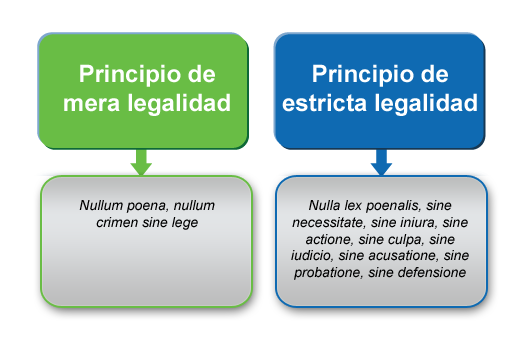
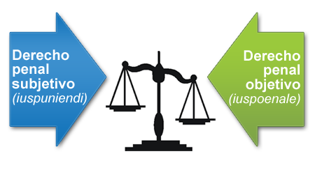
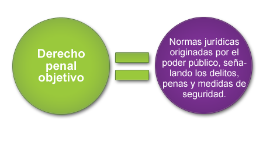
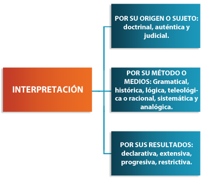
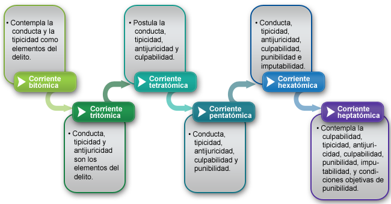
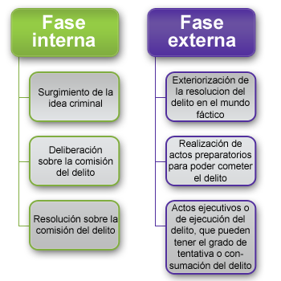
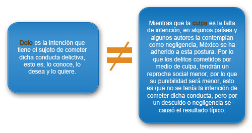
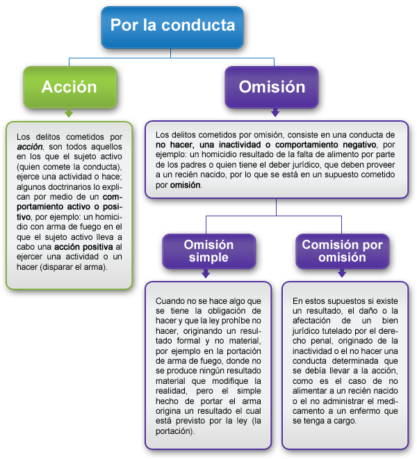
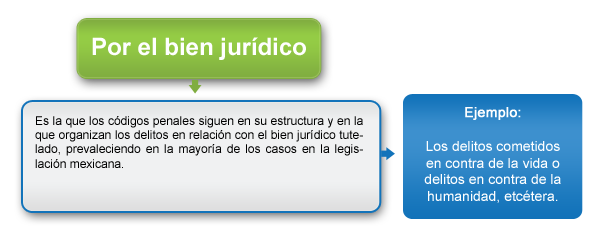
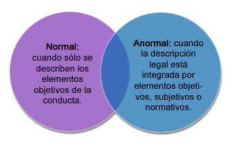

# Unidad 1. Derecho Penal Subjetivo Ius Puniendi

Introducción

Toda teoría nace de una realidad social que impera y origina conciencia social, influyendo en los líderes y teóricos para que constituyan una teoría y normas para enfrentar dicha realidad social. Nuestro sistema jurídico en la actualidad es centralizado y letrista; sin embargo, la justicia sólo existe cuando la letra de la ley pasa por la conciencia humana y por un operador jurídico (juez), el cual la aplica de forma concreta.

En el mundo moderno se intenta implementar un Estado “garantista” en el cual se debe un mayor respeto a algunos principios del derecho en general y del derecho penal en particular; sin embargo, en palabras de Ferrajoli: “Es imposible garantizar un derecho penal absolutamente justo y válido” (1995: s. p.).

En esta primera unidad se estudiarán las estructuras que dan fundamento a la potestad punitiva del Estado, el denominado ius puniendi, en relación con el orden penal y a las teorías de legitimación y deslegitimación del poder penal del Estado que lo faculta para discernir de lo ilícito y determinar la aplicación de una sanción, esto en relación con su poder político y con los conceptos y principios que históricamente han justificado el ius puniendi.

Daremos explicación de los principios inherentes a las garantías penales y procesales los cuales marcan la diferencia que distingue al moderno Estado Constitucional de Derecho y que sólo a través del número, calidad y nivel de efectividad de los principios incorporados en la norma penal, puede valorarse su justicia y su grado de garantismo.

## Derecho penal subjetivo

La vida política se refiere a un campo de existencia social, marcado por los fines comunes que se persiguen y que demanda una fuerza rectora para cumplir con los requerimientos sociales que la convivencia política demanda, ordenando los comportamientos generales para la realización de un fin común, en busca de la cooperación social que nos ayuda a tener una vida social mejor que la que cada uno por sus propios esfuerzos pudiera tener, pero existen conflictos de intereses en este campo social, ya que los hombres no somos indiferentes a la distribución de los beneficios y cada uno preferiría una porción mayor al buscar sus propios fines.

La convivencia es explicada por la unidad, estabilidad y desenvolvimiento común y no por la ruptura y el conflicto; sin embargo, este último origina la búsqueda de reciprocidad y proporcionalidad en las relaciones sociales.

Sabía que...
Rawls considera que la vida en común implica naturalmente enfrentamientos de intereses y objetivos; sin embargo, la vida comunitaria se da por puntos de acuerdo, coincidencias o concordancia y no por conflictos.

 
La convivencia entre concordia y conflicto es explicada por el poder, como capacidad, energía, potestad y fuerza dentro de las relaciones, dicho poder lo encontramos en un ente al que llamamos Estado, el cual busca el bien común dentro del territorio subordinado a su poder.

**Norberto Bobbio** (1987: 84-85) propone tres teorías básicas del poder:

 Haga clic en cada una de las teorías que aparecen del lado izquierdo para desplegar la información correspondiente.

 

**Sustancialista**
• Asignándola al pensamiento de Hobbes, donde el poder se asume como un objeto, conformado por los medios para la obtención de un resultado..

**Subjetivista**
• Centrada en el concepto jurídico de derecho subjetivo, refiriéndola a Locke, el cual asigna al poder la idea de una capacidad otorgada para la obtención de ciertos efectos

**Relacional**
• A partir de la relación intersubjetiva, dentro de la cual uno de los sujetos obtiene del otro un comportamiento que no lograría de otro modo.

 

La noción de capacidad se vincula con la noción de potestad y no necesariamente con la de un derecho subjetivo, el poder se asume como una relación como instancia de comunicación, como potestad. La política supone así la actividad de ordenar e impeler, de prescribir conductas, creando así una programación de conductas, según el fin que pretende obtener.

Dentro de la política se toman decisiones constantemente, pero éstas deben ser justificadas en relación con los beneficios, sacrificios, cargas y limitaciones exigidos a los ciudadanos para obtener esos objetivos, para ello no sólo se requiere de coacción o sanción, sino de racionalidad instrumental o técnica, moral y axiológicamente operativa, ya que toda decisión debe ir acompañada de razón reflexiva, toda vez que el acto de mandar debe estar constituido por la presencia del intelecto y la voluntad, por la razón, como elemento principal del mandato político y no por la fuerza o ímpetu. Por lo que el Estado (teoría del Estado), la política (teoría política) y el poder (teoría del poder), están estrechamente implicados unos con otros.

La necesidad de la coacción se debe a que el poder se ejerce en diferentes contextos y con intereses diversos que generan conflictos y la coacción es una propiedad del poder que busca asegurar los objetivos últimos de la convivencia, como son la paz, la seguridad, la tranquilidad, etcétera, por lo que la coacción es un instrumento asegurador de las relaciones comunitarias, siendo un atributo del poder sin ser lo esencial de éste.

 

El autor nos dice...
Dice Weber que la comunidad política tiene numerosas exigencias para los participantes y que gran parte de éstos sólo las cumplen porque saben que detrás está la posibilidad gde ejercer una coacción física.

El poder implica imponer la voluntad dentro de las relaciones sociales, en contra de la resistencia y, cual sea su fundamento, busca la obediencia a un mandato determinado. En sentido weberiano, supone la existencia de una obediencia fundada en un modelo normativo que origina la aceptación de instrumentos del poder.

Los autores nos dicen...
Para Luhmann el poder supone la idea de poder causar resultados a pesar de una posible resistencia.

Foucault, en su obra Microfísica del poder, compara los procedimientos judiciales del antiguo derecho germánico (duelo, caminata sobre brasas, etcétera) con los de la modernidad, afirmando que la concentración del poder coactivo en manos del Estado ha dado lugar a formas inéditas de violencia, por lo que cada forma de dominación tiene, a su vez, una forma diversa de violencia institucionalizada y los riesgos emergen hacia los individuos

 
Sin embargo, las acepciones de los diversos doctrinarios se deben entender en los diferentes contextos históricos y en sus momentos culturales.

Reflexión...
¿Pero que es el ius puniendi o derecho penal subjetivo del Estado?

Es el derecho a castigar, el derecho a imponer una coacción, a hacer uso de la fuerza por medio del poder delegado por los ciudadanos al Estado, el cual impone una conducta determinada para obtener un fin deseado; es el derecho del Estado a aplicar el derecho penal objetivo, que es el conjunto de normas penales existentes.

 
Con todo lo que ya hemos revisado hasta el momento, estamos en posibilidad de describir lo que se considera como ius puniendi o derecho penal subjetivo, mediante sus dos características más importantes:

Es la potestad penal del Estado, explicada por medio del poder, la coacción y la pena. Por lo que la concretización de la amenaza por medio de una consecuencia real, apreciable y ponderable, origina la coactividad política del Estado.

Es el poder de comunidad (sociedad), quien ejerce el poder físico para salvaguardar los intereses de esta misma. En la evolución histórica este poder fue ejercido primero por el propio particular o las familias (etapa de la venganza privada), posteriormente se ejerció por medio de la religión (etapa de la venganza divina), y con la creación del Estado, se le trasfirió esta potestad (etapa de la venganza publica); por lo que, la evolución nos permite comprender un monopolio del poder legítimo por medio de las asociaciones políticas y sus instituciones, y es en esta etapa en donde podemos hablar de una función punitiva, de ius puniendi, que atiende a un proceso gradual de institucionalización de la respuesta sancionadora, busca la paz social, busca satisfacer a la víctima, a su grupo, a la sociedad, al Estado, apareciendo lo grupal o comunitario como presupuesto para la reacción punitiva.

 
El Estado tiene el monopolio de la fuerza pública, esto es el monopolio del ius puniendi, por lo que el poder punitivo se encuentra centralizado, éste proviene de una asunción de potestad otorgada por las personas a través de la organización política de las sociedades, es un poder institucionalizado –elaborado sobre la base de estructuras normativas, controles y competencias–, por medio de un pacto entre las comunidades e instancias de poder superior –en un principio–, en la actualidad este pacto es meramente hipotético, ideológico, una premisa teórica que justifica determinadas estructuras políticas.

El sentido contractualista que fundamenta el ius puniendi origina la monopolización en una sola instancia y asegura el ejercicio de los derechos individuales en un ámbito pacífico y de seguridad, mediante la amenaza del castigo.


(2) ) El Estado como impartidor de justicia

Por lo que se habla de un poder punitivo, representado por el ius puniendi, esto es la capacidad en la relación político-individuo, que supone la superioridad política y el reconocimiento del individuo para ejercerlo. El poder punitivo del Estado se constituye en las funciones punitivas y es entendido como un derecho subjetivo del Estado por medio de la centralización del poder que origina una vida política. El Monopolio y la formalización son características del ius puniendi, el cual se va constituyendo en forma paralela al nacimiento del Estado, entendido éste en términos maquiavélicos como la estructura centralizada de poder, ejercitado en forma autónoma y soberana que monopoliza las competencias, originando una demarcación entre lo público y lo privado.

 

El autor nos dice…
Feuerbach ve al derecho penal como la ciencia de un derecho del Estado fundado en las leyes contra los súbditos cuando éstos infringen los mandatos del poder.

 
El ius puniendi se acentúa en el campo dogmático, donde Franz Von Liszt define al derecho penal, distinguiendo un sentido objetivo y uno subjetivo. El primero constituido por las reglas jurídicas que el Estado posee, por medio de las cuales se vincula un crimen con una pena. El sentido subjetivo considera que el derecho penal significa el derecho a castigar, ius puniendi. Por lo que existirá un vínculo entre la ley penal y el ius puniendi en consecuencia a la violación del derecho.

Por último, para sustentar el poder punitivo del Estado debemos considerar la legitimación, sin embargo…

Reflexión...
¿Qué es la legitimización?

La legitimación se considera como un atributo que tiende a la justificación de la asimetría surgida del control diferente de los recursos de coacción que definen el sistema como tal.

El autor nos dice…
Beccaria dice que “las leyes son las condiciones con las que los hombres independientes y aislados se reunieron en sociedad, cansados de vivir en un continuo estado de guerra y gozar una libertad hecha inútil, sacrificaron una parte de esa libertad y constituyeron la soberanía nacional y el soberano, su legítimo administrador” (1974:  s. p.).

## Principios que rigen el poder punitivo del Estado ius puniendi


A continuación se presentarán los diez principios que rigen el poder punitivo del Estado ius puniendi.

 Haga clic en cada uno de los números que aparecen a la izquierda para poder ver los contenidos respectivos.

# Principios del poder punitivo 

Principios | Definición
--- | ---
I)	Principio de la necesidad de intervenci�n | El cual podemos entenderlo como la intervenci�n de la regulaci�n penal justificada en la medida en que se hace necesaria para garantizar la convivencia social, pero con una proporcionalidad entre el crimen cometido y la pena prevista. 
II)	Principio de intervenci�n m�nima | Este principio considera que el Estado debe intervenir lo menos posible, lo m�nimo, en el ejercicio de su poder punitivo, al llevar a cabo procedimientos o actuaciones que limiten los derechos o garant�as de las personas o comunidad (sociedad). Esto es el l�mite que el propio Estado se pone a s� mismo para no hacer uso excesivo o abuso de su poder, es una autorregulaci�n. 
III) Principio de proporcionalidad | Hace referencia y relaciona el principio de intervenci�n m�nima con la gravedad de las consecuencias jur�dicas del delito, bajo la idea rectora de que es preferible la sanci�n m�s leve que la m�s grave, toda vez que a lo largo de la historia se ha constatado que la severidad en las sanciones no resuelve la criminalidad, e incluso es m�s dif�cil restablecer el orden jur�dico perdido al aumentar la severidad de las sanciones. El principio de proporcionalidad es una idea de justicia inmanente a todo el derecho y m�s a�n en un Estado que pretende ser garantista, en donde por medio de las diversas reformas en favor de la protecci�n de los derechos y garant�as penales y procesales se ha dado incluso el favorecimiento bajo el principio pro persona sustentado en el art�culo primero constitucional de la imposici�n de penas y se han dejado sin nulidad algunas que sobrepasaban la lesividad y se desviaban del fin que busca la imposici�n de las penas que es la readaptaci�n, o mejor a�n, la prevenci�n del delito, desde tiempos de Beccaria. 
IV)	Principio de legalidad | Considera la delimitaci�n y precisi�n jur�dica de las funciones de la autoridad penal bajo la estricta aplicaci�n de la ley penal, evitando as� la arbitrariedad y el abuso del poder.  El principio de legalidad es nulla poena sine lege, que significa �nula pena sin ley�, esto es que no puede existir un castigo sin una ley previa que prevea el crimen. Tambi�n, non bis in idem, principio que impide sancionar dos veces por el mismo delito.  Este principio tambi�n es conocido como el principio de tipicidad, consistente en que el derecho penal debe estar previamente determinado en la norma penal con la mayor precisi�n posible y con la sanci�n respectiva y proporcional a dichos cr�menes, nullum crimen sine lege, nullum poena sine crimen, entendido como �No hay crimen sin ley, ni pena sin crimen�. Tambi�n es conocido como el principio de reserva de ley, por ser exclusivo de la ley determinar qu� conductas son consideradas como cr�menes, su pena y los jueces que deber�n conocer de �ste, por lo que se determina como un principio de legalidad procesal y que se aplica en conjunto con el principio de exacta aplicaci�n de la ley penal, el cual no admite la analog�a en materia penal. El principio de legalidad garantiza la preexistencia de la norma autentica, cierta y precisa que den certeza y seguridad jur�dica a la sociedad o comunidad. Tambi�n es conocido como el principio de taxatividad, el cual hace referencia a la obligaci�n de que la ley defina �expresamente� las caracter�sticas del hecho delictivo, de modo que se se�ale exactamente su �mbito. 
V)	Principio de legitimaci�n | La legitimaci�n del dominio, hist�rica y sociol�gicamente, depende, seg�n Weber, de ciertos est�ndares explicativos o modelos. Como el uso de la violencia en el Estado moderno, ya que para este autor el Estado est� definido por los instrumentos coactivos de que se vale. La legitimaci�n de la coacci�n o fuerza del poder pol�tico debe versar sobre una reflexi�n valorativa, y presuponer la justificaci�n previa del poder que la ejercita en concreto, ya que el poder pol�tico reducido a monopolio de la fuerza y la coacci�n y la pol�tica entendida como violencia asumen una legitimaci�n encubierta. 
VI)	Principio de culpabilidad | Este principio considera que no puede existir una pena sin culpabilidad del sujeto que cometi� la conducta il�cita y que dicha pena no puede sobrepasar la medida de dicha culpabilidad. Por tal raz�n, la esencia de la culpabilidad radica en la reprochabilidad del crimen, esto es que la pena o infracci�n s�lo ser� reprochable al autor. 
VII)	Principio de especialidad | Refiere a la aplicaci�n de la ley m�s especial al caso concreto en ponderaci�n mayor en su aplicabilidad. 
VIII)	Principio de absorci�n | Este principio, tambi�n llamado de consunci�n, hace referencia a la aplicaci�n de la ley penal en un caso espec�fico y se�ala que se deber� aplicar la norma de mayor jerarqu�a jur�dica, ya que �sta absorber� a la de menor jerarqu�a o menor tutela del bien jur�dico tutelado. 
IX)	Principio de subsidiariedad | Refiere a la prevalencia de la norma primaria sobre la secundaria. 
X)	Principio de alternatividad | Cuando ninguno de los principios de especialidad, absorci�n o subsidiariedad es aplicable, entrar� en la aplicaci�n el principio de alternatividad, que refiere a que se puede aplicar cualquiera de las normas existentes, v�lidas y vigentes.

¿Sabía que…?
“Toda autoridad puede ejecutar los actos para los que se encuentra debidamente facultada, siempre que los funde y los motive” (artículo 14 y 16 constitucionales), principio de legalidad.

 
Los principios señalados, los podemos identificar con algunos de los axiomas que rigen al derecho penal en forma general, tanto sustantiva como procesalmente, y que son reconocidos por la mayoría de los autores y de las legislaciones.

Axiomas del derecho penal | Principios que rigen el poder punitivo del Estado
--- | ---
nulla poena sine crimine (nula pena sin crimen) | 1) Principio de retributividad
nullum crimen sine lege (nulo crimen sin ley) | 2) Principio de legalidad
nulla lex (poenalis) sine necessitate. (nula ley penal sin necesidad) | 3) Principio de necesidad
nulla necessitas sine iniuria (nula necesidad sin injuria)| 4) Principio de lesividad
nulla iniuria sine actione (nula injuria sin acción) | 5) Principio de materialidad
nulla actio sine culpa (nula acción sin culpa) | 6) Principio de culpabilidad o de la responsabilidad personal
nulla culpa sine iudicio (nula culpa sin juicio) | 7) Principio de jurisdiccionalidad
nullum iudicium sine accusatione (nulo juicio sin acusación) | 8) Principio acusatorio o de la separación entre juez y acusación
nulla accusatio sine probatione (nula acusación sin prueba) | 9) Principio de la carga de la prueba o de verificación
nulla probatio sine defensione (nula prueba sin defensa) | 10) Principio del contradictorio

### Instancia Legislativa, Judicial y Ejecutiva

Como se ha explicado al principio de esta unidad, el ius puniendi es el derecho a castigar que el Estado tiene, es decir, es la facultad y/o potestad delegada por medio de un contrato social al gobernante. Sin embargo, en la actualidad el Estado como Soberano, aunque es un solo Ente, distribuye sus funciones, en un poder Legislativo, Judicial y Ejecutivo, esto a partir de las ideas de que el poder solo puede ser limitado por el poder, ideas que nos legó Montesquieu, por tal razón la potestad, el ius puniendi, es distribuido entre estas instancias, la legislativa, la ejecutiva y la judicial.


**Ius puniendi ejecutivo**
Potestad otorgada al Poder Ejecutivo para ejecutar las normas penales individuales y concretas.


**Ius puniendi legislativo**
Otorgado al Poder Legislativo para legislar leyes generales y abstractas en materia penal.


**Ius puniendi judicial**
Potestad otorgada al Poder Judicial para la elaboración de normas penales individuales y concretas (Islas, 1997: 2003).

Finalmente, para concluir con el estudio de la unidad, podemos representar los principios de mera legalidad y de estricta legalidad con el siguiente esquema:




# Unidad 2. Derecho Penal Objetivo Ius Poenale

Introducción
 

Para el entendimiento de la materia penal es indispensable conocer la distinción entre derecho penal subjetivo (iuspuniendi) y derecho penal objetivo (iuspoenale).

Como se ha mencionado en la unidad anterior el llamado iuspuniendi es el derecho que el Estado tiene para castigar, para ejercer su poder punitivo en contra de quien ha violentado el derecho y sus instituciones. Por lo que en esta unidad conoceremos al derecho penal objetivo llamado ius poenale. Ambos, tanto derecho penal subjetivo iuspuniendi, como el derecho penal objetivo ius poenale, dan las bases de la normatividad penal, es decir, son parte fundamental de la norma penal.

El estudio del derecho penal fundamentalmente radica en el estudio de la Ley, el delito, el delincuente y la pena. También identificaremos la estructura de la ley penal y la diferencia entre una norma completa, incompleta o en blanco, así como la función de la norma penal, la protección a bienes jurídicos como el fin último que persigue el derecho penal, el delito, la pena y la medida de seguridad.

Trataremos, por tanto, de dar explicación al principio rector del derecho penal conocido como ius poenale, el cual faculta tanto al órgano legislativo como al judicial para llevar a cabo la creación normativa en materia penal, con las diferencias respectivas de cada proceso.



## Concepto de norma penal

Las normas son enunciados gramaticales imperativos por medio de los cuales se da una orden: “cállate”, “vete”, “deténgase”, etcétera; las normas penales tienen, además, la característica de ser coercibles –legalmente–, debido al poder delegado, esto es iuspuniendi y iuspoenale, –el poder del Estado para imponer una determinada conducta–, por medio de un enunciado gramatical imperativo que determina a los sujetos a actuar o abstenerse; prohibiendo o bien facultando para una determinada conducta (en el caso de los servidores públicos). Algunos autores, como H. L. A Hart, las explican cómo “ordenes respaldadas por amenazas”.

La norma penal es, por lo tanto, un conjunto de expectativas, toda vez que cuando el legislador sanciona una conducta está realizando una valoración negativa, al prohibirla espera que el individuo se abstenga de realizarla, pero cuando alguien no o hace, se hace acreedor a una sanción, esto es a lo que algunos autores llaman “juicio de desvalor”, por ser un reproche, una desaprobación que se le hace al autor de esa conducta.

Hemos señalado que la norma penal es la creada por el legislador y por medio de la cual se puede llegar a generar una ley penal, como bien podría ser la ley de delincuencia organizada, la ley de víctimas, la ley de justicia para adolescentes, etcétera, pero no es necesariamente la única norma penal, ya que dentro del ejercicio del iuspoenale judicial existen otras normas jurídicas que no necesariamente atraviesan por un proceso legislativo, con este “poder” los legisladores tienen la facultad de crear normas que no son leyes pero que forman parte del ordenamiento penal, como lo son las jurisprudencias del poder judicial de la federación en materia penal (las cuales, sin llegar a ser leyes, toda vez que no pasan por un proceso legislativo propio de las leyes, sí son normas que ayudan a resolver los casos similares al crear recedentes) de tal forma que tanto la ley penal como los precedentes del poder judicial, los reglamentos, etcétera, son normas jurídico-penales.

Por último, el Poder Legislativo será el encargado de llevar a cabo la creación de normas escritas, por medio de su proceso o labor legislativa, de la facultad ius poenale, siendo el poder que faculta a órganos legislativos para la elaboración de normas legales, creando así leyes sustantivas, adjetivas y reglamentos, etcétera.

## La ley jurídico penal

Como se sabe, la ley es una norma jurídica que atraviesa por un proceso legislativo forzoso, ¿pero qué es la ley penal?

La ley penal es la norma jurídica que se refiere a los delitos y a las penas o medidas de seguridad (Amuchategui, 2010: 23).

La ley penal es un enunciado gramatical descriptivo y/o prescriptivo de una determinada conducta penal (sujeto + verbo + complemento), por lo que establecerá una conducta delictiva, esto es, considerada como delito dentro de nuestro sistema jurídico y se contemplará también su sanción o pena.

La Ley establece…
Articulo 123 Código Penal para el Distrito Federal:

“Al que prive de la vida a otro, se le impondrá de ocho a 20 años de prisión”.
 
Como se pueden dar cuenta, el articulo trascrito es un enunciado gramatical que nos está determinando un sujeto (al que), un verbo (prive) y un complemento (de la vida a otro), además de que es un enunciando que nos está describiendo una conducta (al que prive de la vida a otro) a la cual se le atribuye una sanción penal (se le impondrá de ocho a 20 años).

Podemos entender que la ley penal está conformada tanto por las normas establecidas en el Código Penal, federal o local, como por los llamados delitos especiales, los cuales son conductas delictivas que tienen una sanción penal y se encuentran tipificadas en “otras” leyes, pero que tienen validez en el Código Penal, por ejemplo, la defraudación fiscal, contemplada en el Código Fiscal de la Federación, pero todas bajo un proceso de creación legislativo, por lo que resulta falso creer que la ley penal solamente es el conjunto de normas contenidas en el Código Penal.

Más adelante se abordará cómo la norma penal llega a irradiar otras materias, describiendo conductas delictivas que la ley penal tipifica como delitos.

Estructura de la norma penal

Ya se ha aclarado la diferencia entre la norma jurídico penal y la ley penal, ahora revisaremos la estructura de la norma penal.

El autor nos dice…
Muñoz Conde nos dice en su libro Derecho penal. Parte general, que la norma penal consta de un "supuesto de hecho y de una consecuencia jurídica”(2014: 35).
 
Es importante hacer notar que el autor llama “supuesto de hecho” a lo que podemos entender por la descripción de la conducta delictiva en sí, y a la “consecuencia jurídica” como la consecuencia legal de llevar a cabo dicha conducta delictiva, esto es la sanción o pena.

El mismo autor nos dice que la diferencia entre la norma penal y las demás normas jurídicas radica en que en la norma penal el supuesto de hecho lo constituye un delito,y la consecuencia jurídica una pena y/o medida de seguridad.

En razón de lo anterior podemos entender grosso modo que toda norma jurídica estará formada por un enunciado descriptivo, que explica la conducta o bien un enunciado prescriptivo, que ordena determinada conducta, y una consecuencia jurídica; sin embargo, el legislador no siempre prevé esta situación, además de que existen en casos muy específicos conductas que pueden ser consideradas como delitos, pero que están descritas en otras normas diferentes a las penales, o bien como una forma de “economía legislativa”, el legislador prevé una consecuencia jurídica para varias conductas, por lo que los juristas nos hemos dado a la tarea de identificarlas y definirlas, gracias a esto se puede señalar la siguiente clasificación de manera general: las normas penales completas, incompletas y en blanco.

**a) Norma penal completa**

La norma penal completa es aquélla en donde encontramos el supuesto de hecho o bien el enunciado que describe la conducta delictiva en forma clara, esto es “quien prive de la vida a otro”,y la consecuencia jurídica, “la pena de prisión de ocho a 20 años”.

La norma penal no es igual ni mucho menos lo mismo que el artículo del Código Penal, toda vez que no siempre la conducta delictiva y la consecuencia jurídica coinciden en un mismo artículo del Código Penal, ejemplo:

Artículo 302 del Código Penal Federal:

```
“Comete el delito de homicidio: el que priva de la vida a otro”.
```


Artículo 307, del Código Penal Federal:

“Al responsable de cualquier homicidio simple intencional que no tenga prevista una sanción especial en este código, se le impondrá de doce a veinticuatro años de prisión”.

Como nos podemos percatar, en el Código Penal Federal el artículo que señala el supuesto de hecho que describe la conducta no contempla la sanción penal; sin embargo, como dice Muñoz Conde, nos encontramos con la llamada “consecuencia jurídica”, esto es la sanción penal a la que se hace acreedor el sujeto que lleve a cabo dicha conducta.

Sin embargo, las conductas delictivas que puede llevar a cabo el hombre son muy diversas, por tal razón en muchas ocasiones se debe acudir a otros artículos que no están en forma directa o tan fácilmente conectados, incluso se puede recurrir a diversas normas jurídicas, este tipo de supuestos es lo que puede llevar a originar lo que llamamos normas penales incompletas o normas penales en blanco.

**b) Norma penal incompleta**

Por razones de economía procesal y técnica en el procedimiento, los códigos penales en su mayoría se dividen en dos partes: una parte general del derecho penal (contenida por lo general en el primer Libro del Código), en donde el legislador ha previsto algunas “generalidades”que pueden presentarse en varios supuestos o aplicarse en varias consecuencias jurídicas, como podría ser la atenuación de la pena en caso de delitos culposos o las excluyentes de responsabilidad como el “uso de la legítima defensa”, o bien, la imposición de un porcentaje mayor o menor de la pena en “una tercera parte”,como los agravantes,etcétera, la segunda parte de la mayoría de los códigos prevé un catálogo de delitos identificados por el bien jurídico que se está tutelando, por ejemplo, la vida en delitos de homicidio, la integridad para delitos de lesiones, la propiedad para delitos de robo o daño en propiedad ajena, el desarrollo psicosexual en delitos de estupro, etcétera.

El autor nos dice…
Al respecto, Muñoz Conde nos explica que las normas penales incompletas o dependientes son: “aquellos preceptos que sólo tienen sentido como complemento o aclaración del supuesto de hecho o de la consecuencia jurídica de una norma penal completa” (2014: 36).
 
Un ejemplo claro lo encontramos en el artículo 15 del Código Penal Federal, el cual señala las causas de exclusión del delito y nos da una especie de catálogo explicado en 10 fracciones sobre cuando una conducta delictiva puede presentarse, y en qué casos al sujeto activo que la cometió no se le aplicará ninguna sanción por tratarse de un hecho en donde no haya estado presente la voluntad de dicho sujeto activo, este sujeto por lo tanto, será inimputable –esto es que no se le pueda hacer responsable de la comisión de dicha conducta–, o bien exista un “permiso”, una “aceptación” por parte de la sociedad y del derecho para que no se le reproche el acto que dicho sujeto ha cometido, como lo puede ser el ejercicio de un derecho, el cumplimiento de un deber o a legítima defensa, en donde no existirá antijurídica del acto delictivo, digamos que está permitido en dichos supuestos.

Por lo que la función del legislador será prever las “particularidades” que puedan ocurrir en los diversos supuestos y para no tener que repetirlo en cada uno de los delitos, lo abrevia por economía procesal y lo contempla en una parte general de la norma penal, es decir, en la parte general de los códigos penales, sean federales o locales.

Este tipo de normas se consideran normas penales incompletas, toda vez que propiamente no señalan un supuesto de hecho y una consecuencia jurídica, como ocurre en la norma penal completa; sin embargo, las normas penales incompletas, nos ayudan a integrar o completar, la norma jurídico penal, en el momento que la aplicamos, esto es en el momento procesal.

 

**c) Norma penal en blanco**

La norma penal en blanco es aquella en la que el supuesto de hecho se encuentra descrito en “otro” ordenamiento jurídico, en uno no penal. En la mayoría de las veces esto sucede cuando el supuesto de hecho se relaciona con otra rama del derecho ya sea por su finalidad o por su alcance, como pudiera ser el medio ambiente, la materia fiscal en relación con las contribuciones o las nuevas tecnologías.

La razón de que este tipo de normas exista es como Muñoz Conde lo señala “para evitar el deterioro legislativo de la norma penal” (2014: 38), a partir del razonamiento de que exista o no el supuesto jurídico y de que provenga o no dicha norma jurídica de un proceso legislativo o uno administrativo, la norma penal existirá en forma independiente.

Por ejemplo…
Es cuando la ley misma señala: … contraviniendo este ordenamiento u otras disposiciones en materia de… se sancionará por lo señalado en el Código Penal.
 
Este tipo de normas en blanco deben ser completadas por el propio Código Penal y en ese momento serán tan normas penales como cualquiera.

## Funciones de la norma penal

Desde que el hombre creó comunidades y posteriormente sociedades, este ha visto la necesidad de crear mecanismo de protección a sus derechos, a sus bienes, pensándolos no sólo como “cosas materiales”, también como bienes intangibles o inmateriales, que son necesarios proteger para poder tener una convivencia humana. Y en todos los casos se tuvo la necesidad de aplicar castigos a aquellos miembros de la sociedad que no respetaban dichos bienes ajenos.

 

**a) De protección al bien jurídico**

En un principio la protección de los bienes jurídicos era mediante la venganza privada, ésta era la venganza que el propio individuo que había sido afectado en sus bienes ejercía en contra de quien había dañado tales bienes.

Posteriormente se dio la venganza familiar, toda vez que en algunas ocasiones no era posible que el propio individuo que era violentado en sus derechos pudiera realizar la misma conducta en contra de quien hubiera causado dicho daño, como ocurría en un homicidio, por ejemplo, por lo que se aceptaba que un familiar vengara la violación de dichos derechos, esta venganza se extendía a las estirpes y a los propios grupos sociales.

En algún momento este derecho de venganza se transfirió a la venganza divina en donde se infundía el miedo o temor a una venganza más allá de la propia muerte de quien había violentado el bien jurídico de otro, era, por tanto, un castigo impuesto a quien ocasionaba un daño en virtud de creencias divinas.

Por último, se llegó a una etapa en la cual el poder para castigar se trasfiere a la sociedad en general, por medio de la creación de un ente público, esto es lo que se conoce como la etapa de la venganza pública ejercida por un representante del poder público, quien representaba el interés de la comunidad hasta la evolución de lo que conocemos hoy día como Estado, la severidad del castigo era lo que caracterizaba a esta etapa por medio de la semejanza en el castigo en relación con el daño causado. El Código de Hammurabi, Las doce tablas y el Pentateuco mosaico son ejemplos de las disposiciones que caracterizaban esta etapa.

**b) De motivación a la norma penal y al control social**

La imposición de las penas por parte del Estado se caracterizó por la crueldad de éstas, existía inseguridad jurídica, ya que no había un legislador que señalara con anticipación la conducta delictiva y la sanción o pena a la que se hacía acreedor el sujeto que llevara a cabo dicha conducta, por lo que en forma arbitraria se señalaba la conducta, la forma de juzgar y la sanción que se debía recibir, observándose formas crueles e inhumanas de castigo y un exceso de poder por parte de los entes públicos encargados de proteger los bienes jurídicos de la sociedad.

Ante esto, comenzaron a aparecer etapas en las que se desarrollaron escuelas que trataban de explicar el fin, la función y las consecuencias de los castigos, como son la etapa humanitaria, donde aparece explicaciones de filósofos y humanistas, juristas y pensadores que tratan de explicar la motivación de las penas, y el fin de éstas, que era mantener el control social y no infringir más daño a la misma sociedad.

Uno de los representantes más relevantes de esta etapa fue César Marqués de Beccaria, quien, por medio de su obra titulada Tratado de los delitos y de las penas, trata de explicar cómo los tratos arbitrarios e inhumanos para la obtención de confesiones –tortura–, son contradictorios a la motivación que dio origen a la norma penal y al fin que persigue dicha norma, de tal forma que rompe con el paradigma de su época en relación con la eficacia de la pena.

Posterior a la etapa humanitaria, surgió la etapa científica, la cual buscó explicar dicha motivación, fin y función de la pena por medio de la explicación del estudio científico del delincuente, realizando estudios de personalidad del sujeto y analizando a la víctima con el objetivo de conocer y dar explicación de la comisión de un delito para responder con un tratamiento adecuado, readaptar al sujeto y prevenir futuros delitos.

En la época contemporánea, a partir de la etapa humanitaria y científica, surgen escuelas penales para explicar al delincuente, al delito y a la pena.

Escuelas | Definición
--- | ---
**Escuela clásica**  | a) La escuela clásica, caracterizada por un derecho natural, buscaba explicar el libre albedrío, la igualdad de los derechos, la responsabilidad moral, el método empleado al cometer el delito y una pena proporcional al delito cometido.
**Escuela positivista** |  b) En la escuela positivista destacaron los estudios de antropología y psiquiatría del delincuente, por lo que se centra en este individuo y trata de explicar que la pena debía ser emitida con base en la peligrosidad del delincuente y niega el libre albedrío postulado en la escuela clásica, toda vez que sus postulados se centran en el estudio de éste buscando la prevención del delito y considerando que las medidas de seguridad son más útiles que la pena en sí. 
**Escuela ecléctica** | c) La escuela ecléctica, por su parte, es una mezcla de las escuelas anteriores por medio de la cual se afirman y se niegan algunos de los postulados expuestas por las anteriores.

La evolución histórica del derecho penal ha tratado de dar explicación en específico al delincuente, al delito y a la pena, como partes que conforman el enunciado gramatical que describe la norma penal, sin embargo, la evolución histórica continúa, porque aún no hemos aprendido a prevenir dichas conductas más que a castigarlas; seguimos confundiendo que la protección de los bienes jurídicos se lleva a cabo por medio del castigo, de la coacción, del temor infundido y no de la prevención de la delincuencia.

## Elementos de la norma penal

Los elementos de la norma penal son: el delito, la pena y la medida de seguridad, elementos esenciales para levar a cabo la comprensión de la norma penal.


**a) El delito o tipo penal**

La definición del delito necesariamente debe ser dada por un derecho positivo vigente, toda vez que la filosofía, sociología o moral nos darán explicaciones del delito, pero no su concepto legal.

Bajo el principio nullum crimen sine lege, el cual rige nuestro derecho penal positivo, el delito es:

Definamos…
Delito: es toda conducta que el legislador sanciona con una pena.
 
Al limitarnos a este concepto, se busca que las conductas consideradas como delito no se vean presas de la arbitrariedad jurídica, además de crear seguridad jurídica para las personas, quienes podrán saber cuándo una conducta es delito por encontrarse descrita en una legislación por medio del proceso legislativo y que contiene los elementos de una conducta delictiva y así poder determinar el precepto legal legislado en una ley o norma penal.

Pero el jurista debe tener en cuenta no sólo las normas jurídicas penales, debido a que existen supuestos contemplados en otras materias, además de esto, las circunstancias de época y las concepciones dominantes de la sociedad, toda vez que en la época moderna nos encontramos con sociedades multiculturales donde algunas normas deben prevalecer sobre otras, en razón a la protección de bienes jurídicos tutelados por el mismo derecho, por ejemplo, en relación con la jerarquía normativa, pero también en valoración de la época y sociedad de la que se trate, ya que cada época y sociedad determinan las conductas en sus normas penales que se conocerán como delito y del juicio de desvalor o reproche hecho al delincuente.

Es importante mencionar que es el cambio social e histórico lo que determina el concepto de delito, pues dicho concepto es relativo en relación con la época y sociedad, lo que se dificulta cada vez más al encontrarnos en sociedades complejas, formadas por personas de varias provincias o naciones, indígenas y la multiculturalidad que nuestro tiempo comprende.

La valoración del hecho delictivo también se realiza a partir de la protección al bien jurídico tutelado y la posible irreparabilidad que puede producir el ataque a dichos bienes jurídicos –el resultado del hecho–, lo cual justifica la sanción incluso al simple ataque, como bien podrá ser el ataque a la vida, ya sea en forma intencional o sin intención, lo cual no ocurriría con un bien jurídico como el patrimonio, la falta de intención en los delitos patrimoniales se castiga, por ende, según su intencionalidad.

Como es el caso del juicio de desvalor, este es un proceso mental por medio del cual se lleva a cabo una valoración social de las conductas que dicha sociedad considera correctas e incorrectas, así como las que atentan en su contra (a la sociedad en general) creando una afectación a todos; se hace primeramente sobre las conductas realizadas, acción u omisión, y que ponen en peligro un bien protegido por el derecho fundamentado en la delegación de poder que la sociedad hace al Estado para que proteja estos bienes sociales.

El juicio de desvalor también se hace según la responsabilidad del sujeto, esto es la imputación de un hecho a una persona que pueda responder por ese hecho en medida de sus facultades mentales o edad.

De tal forma que la identificación de los delitos se hará a partir del juicio de desvalor a la conducta realizada por el sujeto activo, en relación con el resultado que ésta produce y basándose en la responsabilidad a la que puede hacer frente el sujeto que cometió dicha conducta.

**b) La pena: legitimación, legalidad y finalidad**

La pena se puede definir como el castigo impuesto al infractor de la ley penal, como “el mal que impone el legislador por la comisión de un delito al culpable o culpables del mismo” (Muñoz, 2014: 46).

Pero no basta con saber esto sobre la pena; como hemos visto, a lo largo de la historia, el hombre ha impuesto diferentes penas y/o sanciones buscando la más idónea y efectiva para lograr el fin último del derecho penal, la protección de bienes jurídicos y la convivencia humana en sociedad. Por lo que la pena cumple diferentes funciones.

Por tal razón, en la pena podremos encontrar tres aspectos fundamentales: la justificación, el sentido y el fin (Muñoz, 2014: 9).

En este punto podemos entender que la imposición de las penas se justifica por sí misma prácticamente, por su necesidad, toda vez que, sin la represión que ejerce la pena, sería imposible el control social y, por lo tanto, la convivencia social.

Recordemos que desde que abordamos la evolución histórica del derecho penal y al explicar la motivación de la norma penal, se mencionó cómo han surgido diferentes pensamientos en relación con la consecuencia jurídica, esto es en relación con la pena, discrepancia de posturas que aun hoy día sigue subsistiendo; las corrientes de pensamiento más relevantes en este tema son:

```
1) Las teorías absolutistas, que consideran un sentido retribucionista, esto es infringir un mal por un mal cometido, como función de la pena, toda vez que ésta es la consecuencia justa y necesaria de delito cometido
```
```
2) Las teorías relativas, dan mayor valor al “fin” que la pena persigue, esto es a la finalidad de la pena, su objetivo, su fin.

        a)	Teoría de la prevención general: postula que la pena tiene un fin de intimidación psicológica, en la población en general y así evita la comisión del delito, su representante fue Von Feuerbach (1775-1833).

    b)	Teoría de la prevención especial: su representante fue Von Liszt, que buscó una intimidación psicológica individual del sujeto que ya delinquió de nuevos delitos, por medio del aislamiento social, considerando la pena como una corrección del delincuente.
```
```
3) La teoría de la unión, parte de la idea de la retribución, pero añade el fin preventivo, es una mezcla de ambas y domina en la actualidad.
```

Al respecto Roxin (Muñoz, 2014: 51) piensa que la retribución no es el único efecto de la pena, sino es una más de sus características, y que el demostrar la superioridad de la norma sobre el delincuente que la infringió, tiene un efecto preventivo en la comunidad, hablándose de prevención general positiva, que refuerza la confianza social en el derecho.

 

**c) La medida de seguridad: legitimación, legalidad y finalidad**

En el derecho penal moderno, junto con la imposición de la pena, se puede llevar a cabo la aplicación de otras sanciones como las medidas de seguridad, a esto se le conoce como un sistema dualista de consecuencias jurídicas del delito, por imponerse la pena y la medida de seguridad en el sistema jurídico.

La diferencia entre la pena y la medida de seguridad atiende al hecho de que la pena tiene como base la culpabilidad y al acto cometido, y la medida de seguridad atiende a la peligrosidad del sujeto, que es la probabilidad de que se produzca un resultado, un delito futuro, y para evitarlo se implementa una medida de seguridad que garantice que no se cometerá ese probable delito.

## Principios rectores del ejercicio del ius poenale

En la introducción de esta unidad se ha señalado que tanto el derecho penal subjetivo iuspuniendi, como el derecho penal objetivo iuspoenale dan las bases de la normatividad penal, esto es la norma penal.

El iuspoenale es una dupla que emerge, sucesivamente, del ejercicio del iuspuniendi legislativo y del ejercicio del iuspuniendi judicial (Islas, s. a.: 203). Y busca limitar la arbitrariedad del poder público, del “iuspuniendi”, por medio de la creación normativa que pretende dar seguridad jurídica a los gobernados sobre las conductas consideradas como delitos y las sanciones de éstos.

Además intenta que no existan analogías y que no se castigue por conductas que no estén específicamente descritas en una ley penal, ni que se impongan sanciones por analogías o a capricho de los gobernantes, por lo tanto, busca como señalaba Montesquieu, limitar el poder por medio del poder.



### Instancia legislativa

El iuspoenale legislado o legislativo puede entenderse como el conjunto de todas las normas penales generales y abstractas, las cuales emergen de los procesos legislativos, esto es, de la creación legislativa de normas de derecho positivo por parte de los legisladores, es decir, por el poder legislativo, poder encargado de dicha creación a partir de la distribución de funciones del poder del Estado descrita por Montesquieu.

La norma penal general y abstracta, desarrolladas por los legisladores, contienen tres elementos indispensables: el sujeto al cual se le puede imputar dicha conducta, el tipo que es la descripción de una conducta delictiva (acción u omisión) y la punibilidad o sanción penal a la que el sujeto se hará acreedor al realizar la conducta penal descrita.

 

Definamos…
Sujeto: el sujeto que comete una conducta antisocial o delictiva es conocido como sujeto activo cuando tiene la capacidad de comprender dicha conducta se le llama imputable, esto es que tiene la capacidad para comprender el hecho y responder por él; pero cuando no cuenta con ésta, no tiene entendimiento de la conducta que realizó, se le llama inimputable, en este caso tendrá un tratamiento diferente: lo contemplará la norma penal general y abstracta también.

Recuerde...
La conducta delictiva o antisocial puede cometerse por medio de una acción o de una omisión, por tal razón es incorrecto hablar de acción u omisión cuando se habla en forma general de la comisión de un delito sin determinarlo.

 
### Instancia judicial

El iuspoenale judicial es el conjunto de todas las normas penales individuales y concretas, emergentes de las sentencias penales de condena que ponen fin a los diversos procedimientos penales, como son las sentencias de la Suprema Corte de Justicia de la Nación, de los tribunales colegiados de circuito, de los tribunales unitarios, de juzgados de distrito y de toda autoridad que forme parte del poder judicial federal o local y que esté facultada para emitir una resolución judicial que ponga fin a un caso específico y, en algunos supuestos, marque precedentes para la posible solución de otro caso similar en un futuro. Caso claro de este supuesto son las jurisprudencias emitidas por el Poder Judicial.

# Unidad 3. Fuentes de la Norma Jurídico-Penal

Introducción

Las fuentes del derecho penal son las que dan origen a la materia penal, nos referimos al origen de la ley, del delito, del delincuente y de la pena, elementos que hacen posible el estudio de la rama del derecho.

La importancia en el estudio de las fuentes del derecho es conocer la evolución y trascendencia de las normas en materia penal en el mundo fáctico, con ellas podrá advertir la enorme diferencia entre una ley que necesariamente proviene de un proceso legislativo y que es una fuente real y la fuente histórica, por ejemplo: que gracias a su estudio podemos denotar qué normas han dado resultados satisfactorios y cuáles no han podido evolucionar según sus factores determinados.

En esta tercera unidad estudiaremos las fuentes, que en general pueden ser: real, formal e histórica, para así entender como dan origen al derecho penal y, por supuesto, a la ley penal.

## Fuentes reales

La fuentes reales, también llamadas materiales, son los hechos en el mundo fáctico que originan la necesidad de que surja y se cree una norma jurídica como medio de protección de bienes jurídicos tutelados, nos referimos a las razones de necesidad fáctica en el mundo que nos obliga a crear una norma jurídica, por ejemplo, en nuestra actualidad se han presentado nuevas conductas que anteriormente no podía concebir la mente humana y que han originado la creación de “nuevas” normas jurídicas.

En materia de nuevas tecnologías, otro ejemplo, nos encontramos con modalidades de secuestros virtuales, extorsión telefónica, cyberbuying, sexting o grooming, etcétera, que han llevado a las legislaturas a promover iniciativas para tipificar tales conductas en tipos penales especiales, aunque por desgracia en algunos casos las figuras delictivas en comento se siguen homologando, se cree que no tardaremos en ver aparecer nuevos tipos penales por el propio alcance del daño al bien jurídico que se vulnera con dichas conductas.

## Fuentes formales

 

Las fuentes formales “son procesos de creación de la norma jurídica en sí”(Amuchategui, 2010: 25), por lo que la ley penal es por excelencia la fuente formal, pero también la jurisprudencia, la costumbre, los principios generales del derecho y la doctrina, aunque a esta última no se le había dado el reconocimiento que merecía, cada vez más operadores jurídicos, jueces, magistrados y litigantes la consultan para entender y dar respuesta a los hechos jurídicos tan complejos que se presentan en la actualidad y para fundamentar sus argumentos de forma fuerte y sostenibles.

Definamos…
Las fuentes formales son procesos de creación de normas jurídicas que le dan contenido y validez a un enunciado descrito en dicha norma jurídica, además de que dan seguridad jurídica e intentan prevenir la arbitrariedad de las autoridades.

 
Estas fuentes pueden ser directas o indirectas:

 Haga clic en los nombres o conceptos que aparecen del lado izquierdo para desplegar la información correspondiente.

**Fuente formal directa**
• Existe una norma jurídica general y abstracta que es la ley en sí misma.

**Fuente formal indirecta**
• Es aquella que crea una norma de interpretación, de estudio o de integración de la norma jurídica general y abstracta, como la jurísprudencia, la costumbre, los principios generales del derecho y la doctrina.

 
Las fuentes formales del derecho se fundamentan en los principios rectores del derecho penal a partir del iuspuniendi y del iuspoenale; fundamentando el principio de tipicidad de la norma penal y la conducta tipificada como delito en ella: nullum crimen sine lege, nullum poena sine crimen, que busca la exacta aplicación de la norma penal impidiendo la analogía.

## Fuentes históricas

Gracias a estas fuentes podemos conocer el derecho que fue vigente en el pasado a través de documentos y en las diversas etapas y fases en que éste se dividió: en la evolución del derecho penal y de la humanidad, el código Hammurabi, las doce tablas, etcétera, éstos son ordenamientos que constituyen los antecedentes del sistema jurídico vigente, además nos muestran los resultados de la aplicación de ese derecho y podemos aprender de los errores del pasado, como es que la eficacia de las penas no depende de su gravedad, o los resultados producidos por los tratos crueles e inhumanos que aun hoy día se intentan erradicar y no se ha podido o querido.

En materia penal, las fuentes históricas que tenemos son: Las ordenanzas de Alcalá, El Fuero Juzgo, Las Siete Partidas, entre otros documentos que establecían sanciones para el caso de supuestos de hecho y conductas delictivas, como el robo o el homicidio.

El autor nos dice…
Amuchategui define las fuentes históricas como “los medios objetivos en los cuales se contienen las normas jurídicas” (2010: 25).
 
Algunos autores consideran sólo a la ley como fuente del derecho penal; sin embargo, ha sido la propia historia la que nos ha hecho darnos cuenta de la necesidad de integrar esa ley penal por medio de la jurisprudencia, de principios, de doctrina y únicamente la razón aplicada en la necesidad fáctica del derecho penal y no el capricho humano, lo que dará una integración verdadera, absoluta y eficaz de la aplicación de norma jurídica penal.

# Unidad 4. Interpretación, Integración de la Norma Jurídico-Penal

Introducción 

En la práctica del derecho nos encontramos con situaciones de hecho que superan el contenido previsto y sancionado por las leyes penales, con lagunas u oscuridades que dificultan su aplicación, en especial en las sociedades modernas que son sociedades complejas y multiculturales que sobrepasan en algunos casos el sistema legal, obligándonos a acudir a las fuentes del derecho, o bien, a medios y mecanismos de solución de los supuestos de hechos penales que se presentan en nuestra práctica legal, por ejemplo la interpretación de la norma penal y su integración, todo con el fin de conocer y substanciar la oscuridad o vacío que la norma penal puede llegar a dejar.

Por tal razón, en esta cuarta unidad se llevará a cabo un complejo estudio del fenómeno que constituye el proceso de formación y validación de los contenidos que forman la norma jurídico-penal.

## Interpretación, concepto e importancia

Como se sabe la ley puede ser imprecisa, contradecirse, encontrarse regulada en diferentes normas o bien no encontrar una respuesta directa, clara y precisa a las diversas conductas delictivas que en el mundo fáctico pueden presentarse. Con base en esta necesidad surge la interpretación como un medio para desentrañar o descifrar el sentido y significado de la norma, facilitar la comprensión de la ley y poder utilizarla en un caso concreto.

El autor nos dice...
Como lo asegura el autor Francisco Muñoz Conde, catedrático de la Universidad Pablo de Olavide, Sevilla, la interpretación es: "una operación intelectual por la que se busca establecer el sentido de las expresiones utilizadas por la ley para decidir los supuestos contenidos en ella y, consecuentemente, su aplicabilidad al supuesto de hecho que se le plantea al intérprete (Muñoz, 2014: s. p.)".
 

Grosso modo, podemos pensar en la interpretación como entender, explicar y/o aclarar algo que resulta confuso o difícil de comprender.

La importancia de la interpretación radica en el rigor que se le atribuye a la ley penal por medio de sus principios rectores como el principio de taxatividad, de exacta aplicación de la ley penal, el principio de legalidad, entre otros. Estos principios fundamentados en la norma suprema del ordenamiento jurídico mexicano, la Constitución Política y reconocidos tratados internacionales y cartas de derechos en el ámbito internacional, trascienden las fronteras del Estado mexicano para la protección de los ciudadanos.

La Constitución Política de los Estados Unidos Mexicanos en su artículo 14, párrafo tercero, señala:

Nuestra constitución establece…
“En los juicios del orden criminal queda prohibido imponer, por simple analogía, y aun por mayoría de razón pena alguna que no esté decretada por una ley exactamente aplicable al delito que se trata”.

 
Por lo que, el principio de legalidad considera la delimitación y precisión jurídica de las funciones de la autoridad penal bajo la estricta aplicación de la ley penal, evitando así la arbitrariedad y el abuso del poder.

El principio de legalidad conocido como nulla poena sine lege significa que será nula la pena sin ley previa que la establezca, esto es, no puede existir un castigo sin una ley previa y que ésta, a su vez, prevea el crimen; mientras que el principio de legalidad conocido como non bis in idem es el que impide sancionar dos veces por el mismo delito.

El principio de legalidad también es conocido como el principio de tipicidad, consistente en que el derecho penal debe estar previamente determinado en la norma penal con la mayor precisión posible y con la sanción respectiva y proporcional a dichos crímenes, nullum crimen sine lege, nullum poena sine crimen, entendido como no hay crimen sin ley, ni pena sin crimen.

Esto último también es conocido como el principio de reserva de ley por ser exclusivo de la ley determinar qué conductas son consideradas como crímenes, su pena y los jueces que deberán conocer de éste, por lo que se considera un principio de legalidad procesal y que se aplica en conjunto con el principio de exacta aplicación de la ley penal, el cual no admite la analogía en materia penal.

¡Importante!
El principio de legalidad garantiza la preexistencia de la norma auténtica, cierta y precisa que dé certeza y seguridad jurídica a la sociedad y/o comunidad.

 
El principio de taxatividad es otro de sus sinónimos y refiere a la obligación de que la ley defina “expresamente” las características del hecho delictivo, de modo que se señale exactamente su ámbito.

Como se ha explicado, es necesario que el sistema jurídico mexicano y la mayoría de los sistemas admitan la interpretación bajo el arbitrio judicial, con el objetivo de evitar la aplicación mecánica de la ley penal, y por la necesidad de motivar sus decisiones basadas en los principios mencionados, pero también en la actualidad, con el objetivo de seguir principios que fundamentan un sistema jurídico garantista como el que México intenta implementar desde que firmó tratados internacionales en los que se obligó a implementar dichos sistemas como el de justicia penal, con la reforma de 2008 o la reforma en materia de derechos humanos firmada en 2011, las cuales centran su fundamento en el principio pro persona, también conocido como pro homine.

**Para entenderlo, analicemos el artículo 1° constitucional:**

Constitución | Análisis
--- | ---
Artículo 1°. … En los Estados Unidos Mexicanos todas las personas gozarán de los derechos humanos reconocidos en esta Constitución y en los tratados internacionales de los que el Estado Mexicano sea parte, así como de las garantías para su protección, cuyo ejercicio no podrá restringirse ni suspenderse, salvo en los casos y bajo las condiciones que esta Constitución establece… | En este primer párrafo podemos observar cómo el reconocimiento a la igualdad de la ley se extiende a todas las personas por el simple hecho de serlo, evitando las restricciones que en el pasado existía al señalar ciudadanos donde se debía tener esa calidad, por lo que este reconocimiento de respeto de corte garantista es adoptado por nuestro sistema jurídico en forma general y no restrictiva en ningún caso para la comunidad pluricultural que existe hoy día en nuestro país.
Artículo 1°.Las normas relativas a los derechos humanos se interpretarán de conformidad con esta Constitución y con los tratados internacionales de la materia favoreciendo en todo tiempo a las personas la protección más amplia… | Este párrafo es fundamental para el tema de interpretación, ya que se sustenta jurídicamente con la norma de más alta jerarquía dentro de nuestro ordenamiento jurídico, es decir, con la Constitución, este párrafo nos abre la puerta para una interpretación en favor de la persona en materia penal, incluso para la aplicación retroactiva de la ley, siempre que se beneficie a la persona y nos ayuda a resolver el conflicto de normas bajo el entendido de que se aplique la norma más proteccionista, como el reconocimiento de los tratados internacionales, incluso en forma superior, si éstos benefician a la persona, ‒principio pro persona‒.
Artículo 1°. … Todas las autoridades, en el ámbito de sus competencias, tienen la obligación de promover, respetar, proteger y garantizar los derechos humanos de conformidad con los principios de universalidad, interdependencia, indivisibilidad y progresividad. En consecuencia, el Estado deberá prevenir, investigar, sancionar y reparar las violaciones a los derechos humanos, en los términos que establezca la Ley. | Así pues, el último párrafo del artículo primero constitucional faculta a las autoridades para actuar bajo el entendido de un sistema proteccionista de la persona, de un sistema jurídico garantista de los derechos humanos y protector de los principios que rigen este sistema dentro del ejercicio jurídico.

El tema de la interpretación es un tema demasiado extenso que día a día nutre cada vez más nuestro sistema jurídico, dando explicación no sólo a la ley sino al actuar de las autoridades. Es pilar fundamental del nuevo sistema de justicia penal y del modelo de sistema jurídico que domina la actualidad; sin embargo, podemos concluir señalando que la interpretación es más que un simple desentrañar el sentido de la norma, como anteriormente se definía, hoy día la interpretación busca resolver los problemas de interculturalidad, de protección, de confiabilidad de la norma jurídica y, de lo más importante, la armonización del sistema jurídico y su aplicabilidad en la forma más exacta para el ciudadano, con el objetivo de brindar seguridad y certeza jurídica.

## Clasificación de la interpretación

 

Para llevar a cabo la interpretación, los juristas nos vemos en la necesidad de llevar a cabo diferentes criterios de clasificación de la interpretación, los cuales se agrupan en tres categorías, explicadas a continuación.



### Por su origen o sujeto: doctrinal, auténtica, judicial

 

Veamos a continuación cada una de las subcategorías de la interpretación:

 Haga clic en los nombres de las fichas para poder ver la información correspondiente.

**Doctrinal**
• También llamada científica o privada, toda vez que es aquella interpretación realizada en forma particular por científicos, doctrinarios o estudiosos del derecho, por ejemplo, al realizar una obra escrita o dar una conferencia.

**Auténtica**
• Es aquella llevada por el propio legislador por lo que se le conoce también como interpretación legislativa, cuando el legislador trata de llevar a cabo aclaración de una ley emitida por medio de la interpretación de dicha norma precisando los términos utilizados en ella.

**Judicial**
• Es llamada también jurisdiccional y es aquella que realizan los juzgadores (órganos judiciales) por medio de la interpretación que hacen al aplicar la ley a un caso concreto, buscando, explicando o aclarando, el sentido que el legislador ha intentado dar a la norma cuando la creó.

### Por su método: Histórica, gramatical, lógica, sistemática y analógica


**Histórica** 
Es aquella que atiende a los antecedentes de las normas con motivo de que esta sea entendida conforme al momento histórico en que fue creada y que dio motivación a su creación como respuesta a un momento histórico determinado.

**Gramatical** 
Busca dar sentido a la norma en forma literal de la disposición interpretada, por lo que se le conoce también como interpretación literal o textual, la cual intenta esclarecer el sentido de las palabras contenidas en la norma en forma contextual.

**Lógica**
Utiliza las herramientas de la lógica con el objetivo de que la interpretación sea congruente, buscando la coherencia del ordenamiento jurídico, en algunos casos la legislación resulta incongruente y caer en contradicciones; sin embargo, no puede ser interpretada de manera aislada, ya que, como lo hemos señalado, el sistema jurídico versa sobre diversos ordenamientos y parte de la labor de la interpretación es buscar la armonía de dichos ordenamientos para una adecuada función. Esta interpretación lógica también es conocida como sistemática, teleológica o racional, aunque algunos autores la señalan como diversas entre sí, se relacionan de forma muy estrecha, por lo que se conoce como interpretación teleológica a la que busca la finalidad perseguida por la norma, por medio de la orientación de los preceptos penales en la protección de un bien jurídico que determina el uso de determinados supuestos de hecho.

**Sistemática**
Es la interpretación que implica conocer el sistema jurídico, comprenderlo y con ello saber la pertenecía de la norma que se interpreta con el objetivo de que la norma no se interprete de forma aislada, por medio del razonamiento lógico sistemático, busca la armonización legal del ordenamiento.

**Analógica**
Busca la similitud entre la norma con los supuestos de hecho, para que se aplique en forma similar.

### Por sus resultados: declarativa, extensiva, progresiva y restrictiva

 

Finalmente, otra de sus subcategorías de la interpretación son:

 Haga clic en los nombres de las fichas para poder ver la información correspondiente.

**Declarativa**
• Como su nombre lo dice, declara el sentido de la norma jurídica, es decir, es acorde con lo que el legislador quiso decir en ella.

**Restrictiva**
• Al contrario de la declarativa, esta interpretación asume que la norma reduce el ámbito, alcance o contenido de la norma con su texto en forma literal, por lo que el texto expresa más de lo que el legislador quiso señalar en la norma.

**Extensiva**
• El sentido de la norma se amplía más allá de lo que el mismo legislador quiso señalar. Como lo señala Muñoz Conde "Cuando esta interpretación no rebasa el alcance de la Ley puede llegar a considerarse respetuosa del principio de legalidad y ser aceptable" (Muñoz, 2014: s. p.).

**Progresiva**
• Busca la armonía legal por medio de la adecuación de la ley a través de la interpretación según el momento histórico, por esta razón algunos autores la consideran una interpretación evolutiva, ya que busca la adaptación a las necesidades del momento histórico.

Como se puede notar, resulta erróneo pensar que la interpretación está prohibida en materia penal, toda vez que es por medio de la ella que se puede aplicar la ley y fundamentar el actuar de las autoridades, además de que ésta sirve como criterios que dirigen el actuar de los órganos jurisdiccionales como lo es la jurisprudencia y la doctrina.

## Aplicación, analogía e ignorancia de la ley penal

 

Cuando hablamos de aplicar la ley nos referimos a utilizar el enunciado descrito por el legislador en una norma empleándola para un caso concreto, a un supuesto de hecho. En el uso de la ley penal debemos saber que la aplicación de la analogía está prohibida, mas no la interpretación analógica.

La prohibición de la aplicación de la analogía está fundamentada en el artículo 14 constitucional y refiere a que está prohibido imponer una pena a un delito no previsto por la ley que sea semejante a otro delito que si esté previsto en la norma penal, toda vez que resulta violatorio de garantías constitucionales, de legalidad y originaria la ausencia de certeza jurídica.

La ignorancia de la ley no exime de la culpa a un sujeto que sea acreedor de una pena o sanción por cometer un delito; sin embargo, el operador jurídico (juez, magistrado o ministro) se encuentra facultado para considerar la educación, la destreza, ilustración del sujeto activo, pero más aún, está obligado a observar los usos y costumbres de pueblos o etnias indígenas, en observancia a la misma constitución que garantiza la protección de estos grupos en su artículo 2o constitucional. Por lo que el juzgador no podrá ser omiso y deberá considerar los factores determinantes de la comisión del delito, así como observar los criterios de valoración que debe observar al juzgar a algún miembro de estos grupos.


## Integración de la norma penal

 

Como se ha señalado en esta unidad, la Ley en algunos casos no es suficientemente clara para cada uno de los supuestos de hechos que en el mundo fáctico se pueden llegar a dar, pues se presentan lagunas o vacíos legales, por lo que se hace necesaria la integración de la norma penal por distintos medios, es necesario que esto no se confunda con la interpretación, toda vez que mientras esta última trata de aclarar la Ley, como ya se ha señalado, la integración busca complementarla, llenar esos vacíos o lagunas que la Ley presente al momento de aplicarla.

El Poder Judicial de la federación, a través de sus órganos jurisdiccionales (Suprema Corte de Justicia de la Nación, tribunales colegiados de circuito, tribunales unitarios), al llevar a cabo su función jurisdiccional y judicial, se ven en la necesidad de comprender y determinar el contenido de las normas penales, esto es de la legislación penal, buscando en todo momento el sentido –significado– que el legislador quiso señalar en la norma. Al realizar dicha función los ministros, magistrados y jueces se ven en la necesidad de interpretar, como hace algunos años se decía “desentrañar” el sentido de la norma, que es propiamente entenderla, darle significado y aplicarla en un caso práctico al dictar una sentencia o una resolución, al realizar sus funciones, algunos jueces difieren en el significado de dicha norma y puede ocurrir una contradicción entre tribunales, por ello se busca la unificación de dichos criterios por medio de la creación de jurisprudencia que no son más que criterios a los que todos los tribunales y jueces se deberán apegar al resolver una controversia, por tal razón esta actividad resulta muy interesante para su formación como estudiante y futuro profesionista, en ella advertirá dichos criterios del tribunal y por medio de qué tipo de interpretación se efectúa la toma de estos criterios.

Como se pudo dar cuenta a lo largo de la unidad y en la actividad anterior, la interpretación es fundamental al aplicar el derecho. Parte de esta interpretación fundamenta lo que en materia penal conocemos como ignorancia de la Ley para determinar la aplicación del derecho penal y la impartición de justicia, por tal razón resulta indispensable que conozca en dónde están fundamentados estos conceptos e ideas para la aplicación del derecho, esto lo podrá advertir al realizar la siguiente actividad, en la que desarrollará sus habilidades de investigación y comprensión lectora de nuestra norma fundamental, nuestra Constitución, la norma jerárquicamente superior del sistema jurídico mexicano y que fundamenta los temas estudiados en esta unidad, por lo que le será de suma importancia realizarla.

# Unidad 5. Ámbitos de Validez

Introducción

 

 

El derecho penal tiene como fin la protección de bienes jurídicos en busca de una vida en sociedad. Esta vida en sociedad puede tener distintos ámbitos en donde el ser humano conviva y le sea necesario determinar reglas para tener esa convivencia, por lo que se crean los ámbitos de validez de la norma penal y sus cuatro diferentes ámbitos son: material, temporal, espacial y personal.

En esta quinta unidad se conocerán los ámbitos en los que la norma penal es válida, explicando el alcance y los límites de la ley penal en relación con la materia, al tiempo de vigencia de la norma, a las personas involucradas, al espacio o territorio donde la norma es válida, con el fin de poder llevar a cabo la aplicación de la norma penal adecuada en la solución de problemas jurídicos, toda vez que no basta con conocer el origen, conformación o contenido normativo, sino que es necesario el ámbito de aplicación de la norma penal válida.

También analizaremos los ámbitos en donde la norma penal puede aplicarse, de acuerdo con su materia, espacio, persona y tiempos, además de reconocer los principios que rigen la aplicación de la norma penal en caso de conflicto.

En el ámbito temporal se explicarán los principios que rigen la ley penal válida; en el material se distinguirá el carácter federal, local o militar de dichas normas; en el personal se desarrollarán las reglas y excepciones legales respecto a los sujetos involucrados en hechos delictivos y en el ámbito espacial se estudiará la aplicación de la norma penal a partir de sus reglas territoriales que regulan la aplicación de la norma penal.


## Material

En el ámbito de validez material de la ley penal, existen tres órdenes de aplicación de la norma penal:


 
Estos ámbitos se han determinado a partir de la creación del Estado y por la trasferencia del poder (la soberanía) a un ente jurídico, el cual encuentra su fundamento en la Constitución política, título segundo, capítulo primero. Por lo que por medio de este pacto federal y de la propia soberanía se originan estas esferas u órdenes de aplicación de las normas en relación con los órganos jurídicos que las crean y de la naturaleza de los bienes jurídicos que protegen.

**Orden común**
* Es la legislación que crea cada uno de los Estados y el Distrito Federal en materia penal, por lo que existen delitos y procedimientos diversos en cada uno de los Estados de la república.
* Los delitos de orden común son los que se cometen en una entidad federativa y producen su resultado o efecto en dicha entidad, por lo que será regulado por el Código Penal local.

**Materia u orden federal**
* Es determinado como una excepción, esto es que es reservado en forma específica a la federación, los delitos federales son aquellos que expresamente y por excepción la ley determina como federales.
* En este orden quedan comprendidos los delitos que afectan directamente a la federación y se denominan delitos federales, en su mayoría están regulados por el artículo 50 de la Ley Orgánica del Poder Judicial de la Federación y el artículo 1 del Código Penal Federal, el cual establece la aplicación de los delitos de orden federal en toda la república.

**Orden militar**
* Llamado también castrense, rige a las fuerzas armadas y tienen una legislación especial denominada Código de Justicia Militar, el cual señala los delitos y las penas a las que serán sujetos los miembros de estas organizaciones militares.

En materia penal, existe un Código Penal Federal y códigos penales de cada una de las entidades federativas, estos son los códigos locales o de orden común.

## Temporal

 

La validez temporal delimita la aplicación de las normas penales, primero al superar el procedimiento legislativo y, posteriormente, al exigirse que entren en vigor dichas leyes. Dicha vigencia puede ser de forma inmediata, a partir del día siguiente de su publicación o en una fecha expresamente determinada o en forma diferida, esto es en diferentes momentos según las zonas.

De tal forma que el ámbito de validez de una norma jurídica penal determina cuándo es aplicable, por lo que una norma jurídica que no ha sido publicada no podrá ser aplicada, pero tampoco una norma jurídica abrogada o derogada.

La extinción de la norma es por medio de la vía de abrogación, esto es cuando una norma jurídica se extingue en forma total, o bien por medio de la derogación, que es cuando una norma se extingue en forma parcial.

Un punto importante en el ámbito de aplicación temporal es la retroactividad. En principio, la materia penal no acepta la retroactividad de la norma penal, por lo que no se puede aplicar: esto es que ninguna norma puede aplicarse a un hecho ocurrido antes del surgimiento de dicha norma.

Esta retroactividad normativa queda limitada al perjuicio de la persona, por lo que ciertamente la ley puede y debe aplicarse en forma retroactiva cuando beneficia a una persona, según una interpretación conforme a derecho y a nuestra Constitución política, en específico por el principio pro persona que establece el artículo primero, así como la limitación de la retroactividad del artículo 14 de la Constitución, los derechos del inculpado señalados en el artículo 20 constitucional y el principio pro reo “a favor del reo”, por lo que la retroactividad tiene las excepciones señaladas.

## Espacial

 

El ámbito de validez espacial considera que la ley debe ser aplicada en el territorio en el cual es creada, en razón del principio de soberanía delegada a cada Estado, el cual ejerce su poder punitivo en su territorio, personas o cosas dentro de él.

Los principios que rigen este ámbito de aplicación son: de territorialidad, extraterritorialidad, personal, real y universal.

Principios | Defniciones
---| ---
Principio de territorialidad | Señala que cada Estado aplicará sus normas jurídicas válidas dentro de su territorio, este principio normalmente se encuentra descrito en cada uno de los ordenamientos penales locales dentro de su libro primero o parte general y contempla el delito. El principio de territorialidad trata dos niveles de aplicación según la materia (federal y local), por lo que se adapta a la materia sin perder de vista la supremacía constitucional ya comentada.
Principio de extraterritorialidad | Es una excepción al principio de territorialidad, el cual considera que, en condiciones previamente señaladas por la norma jurídica mexicana, la ley puede aplicarse fuera de territorio nacional siempre que se cumplan con los principios siguientes.
Principio personal | Atiende la nacionalidad de la persona –sujeto activo o pasivo– y que determina la aplicación de la ley independiente del lugar de los hechos.
Principio real | Refiere a los bienes tutelados y considera la aplicación de la ley, aun fuera del territorio nacional cuando el objeto del delito o bien jurídico tutelado es nacional.
Principio universal | A través del control de convencionalidad, que busca erradicar la impunidad, se faculta a las naciones para sancionar a quien infrinja la ley, por medio del derecho internacional y de la firma de tratados donde se facultan los Estados para la imposición sus normas fuera de sus fronteras, incluso cuando el derecho interno no lo contempla.

Dentro de este ámbito de validez de la norma surgen figuras como la extradición o la expulsión de una persona.

## Personal

 

La validez de la ley penal en relación con la persona a quien va dirigida la norma, fundamentándose en el principio de igualdad consagrado en la Constitución como norma suprema, así como en diversos tratados internacionales firmados por el Estado mexicano. Por lo que el ámbito de validez en relación con la persona prohíbe la creación de leyes privativas y de tribunales especiales, estableciendo un trato igual a los ciudadanos.

Las excepciones a este principio son la declaración de procedencia y la inmunidad diplomática:


**Declaración de procedencia**
• Se le da un trato especial con base en las funciones que lleva a cabo, por medio de un procedimiento especial se le quita la protección como servidor público para posteriormente podérsele juzgar por un delito cometido.

**Inmunidad diplomática**
• Es una protección a funcionarios extranjeros en relación con las funciones que realiza en territorio nacional, busca que dichas funciones se lleven a cabo y que se garantice su cumplimiento evitando falsas acusaciones que trascendieran en desprestigio internacional.

## Concurso aparente de normas

 

Como hemos visto, la aplicación de la norma penal no es tan simple y se rige por diversos principios y reglas, por lo que en algunos casos una misma norma puede estar regulando un mismo supuesto de hecho o bien encontrar vaguedad en una norma de tipo incompleta o en blanco, por lo que en estos casos se habla de un concurso de normas, conflicto de leyes o concurrencia de normas incompatibles entre sí (Murcio: 2004: 92).

 
La solución a este tipo de conflictos se da bajo los principios de especialidad, consunción o absorción, subsidiariedad y alternatividad, aclarando que en el uso de estos principios es fundamental seguir el orden en el que se han descrito.

Cuando encontramos un supuesto de hecho y/o su respectiva consecuencia jurídica regulado en dos o más ordenamientos, debemos pensar en resolver este problema, primero por medio del principio de especialidad, el cual nos señala que se deberá privilegiar la norma más especial en relación con la más general, prevaleciendo en todo momento la especial. Sin embargo, cuando no resuelve el problema del concurso de normas, debemos aplicar el principio de consunción o absorción, que nos señala que debemos optar por la aplicación de la normas de mayor jerarquía, la cual absorberá a la de menor, pero cuando este principio tampoco da la solución al conflicto de normas se puede optar por la aplicación de la norma primaria, la cual prevalecerá sobre la secundaria y a este principio se le conoce como principio de subsidiariedad; en ocasiones los supuestos de hechos son tan complejos que ninguno de estos principios da una solución exacta y determinante, por lo que se podrá otra por la aplicación del principio de alternatividad, aplicando cualquiera de las normas que contemplan el hecho jurídico que se trata de sancionar.

---
El reconocimiento del ámbito de validez de una norma es fundamental para su aplicación, así como conocer no sólo la norma que aplica al hecho fáctico, sino dónde, a quién, cuándo y por quién se aplica. Sin conocimiento de lo anterior sería imposible llevar un caso o resolverlo.

Por lo que esta actividad, busca que pueda advertir el ámbito de validez de la norma para que en su práctica profesional pueda ejercer el derecho y saber cuándo, dónde, a quién y por quién se aplica una determinada norma penal.

De acuerdo con lo anterior, tendrá que realizar una búsqueda en periódico, televisión, radio, internet o hasta en una agencia del ministerio público, diario oficial de la federación o una resolución judicial revisada en una jurisprudencia en la página de la corte por medio del Semanario Judicial de la Federación y señalar que se aplique un ámbito de validez, es decir, exponer un caso del por qué aplica el ámbito de validez específico, una vez   

# Unidad 6. Tipicidad y Tipo penal

Introducción

 

 

En esta sexta unidad podrá conocer cómo la descripción del legislador contempla un supuesto de hecho al cual se le conoce como tipo penal, éste puede presentar algunos vacíos o lagunas. También podrá distinguir entre tipicidad a manera de “encuadramiento” de la conducta tipificada como delito y a la atipicidad como su aspecto negativo.

Reflexión...
¿Qué pasaría si en un accidente automovilístico mueren sólo los hijos y los padres sobreviven? ¿La conducta podría considerarse delito? ¿Los padres tendrían responsabilidad penal?, o bien, ¿qué pasa con el médico que sacrifica la vida del menor por preservar la vida de la madre? ¿Existiría delito? ¿Existiría responsabilidad penal?
 
Al igual tendremos oportunidad de reflexionar sobre las preguntas que aparecen en el recuadro, con el objetivo de ubicarnos en el contexto actual de la ley penal y así entender qué conductas son consideradas como delito y por qué, esto al reconocer los elementos del tipo penal, el significado e importancia de la antijuricidad de una conducta y se expondrá como la ausencia de cualquiera de los elementos del tipo penal (que la responsabilidad o el delito sea excluido), por la presencia de una causa de justificación, que exista inculpabilidad o bien la ausencia del tipo penal, por lo que se explicará cómo se puede llegar a integrar el sistema jurídico por medio de la interpretación normativa siguiendo los principios que rigen al derecho penal y a la tipicidad.

## Concepto de tipo penal y tipicidad

Lo que conocemos como tipo penal es aquella descripción contenida en la ley penal, esto es, el enunciado hecho por el legislador al describir una conducta considerada como delito y la cual es sancionada por el derecho penal.

Definamos...
El tipo es la descripción legal de un delito, o bien, la abstracción plasmada en la ley de una figura delictiva (Amuchategui, 2010: s. p.).

 
El tipo penal es una figura conceptual por medio de una descripción en forma general y abstracta que hace el legislador de un supuesto jurídico que puede ocurrir y lo plasma en la legislación penal; sin embargo, esta descripción debe hacerse bajo el principio de mínima intervención, esto es una selección de las conductas que la sociedad rechaza o reprocha al ser cometidas y que sean las más dañinas, con el objetivo de satisfacer este principio de mínima intervención y no excederse en el principio de legalidad.

La tipicidad refiere a la conducta delictiva (acción u omisión) prevista en los tipos penales, que es contraria a derecho (antijurídica) y atribuible a una persona (culpabilidad).

La tipicidad se rige por el principio nullum crimen sine lege, el cual refiere al principio de legalidad y, como se sabe, éste limita la aplicación penal al contenido de la ley, por lo que sólo aquellas conductas descritas y contenidas en la Ley pueden ser consideradas como crímenes o delitos, por lo que si una conducta se realiza y posterior a esta aparece una ley, no podrá sancionarse, toda vez que sería una legislación retroactiva que afecta a la persona y, como se ha señalado, la aplicación retroactiva de la Ley está prohibida a menos que se aplique bajo el principio pro persona que la constitución prevé en su artículo primero, esto es, que sea en beneficio de la persona, o bien bajo el principio pro reo, en beneficio del reo.

Definamos...
Por lo que la tipicidad es: “la adecuación de la conducta al tipo, el encuadramiento de un comportamiento real a la hipótesis legal” (Amuchategui, 2010: s. p.).


## Principios que rigen la tipicidad

 

El sistema jurídico mexicano se encuentra fundamentado y regido por diversos principios, de igual manera y en forma particular la tipicidad es regida por los siguientes principios:


 
### Tipo y antijuridicidad

 

Hemos señalado que el sujeto que comete una conducta delictiva se le hace un reproche por parte de la sociedad, éste es un juicio de desvalor, el cual recae sobre el comportamiento humano (la conducta delictiva), y es por este juicio de desvalor sobre ese reproche hecho al delincuente que su conducta es castigada, por ir en contra de lo acordado por la sociedad, por medio del contrato social y la trasmisión del poder al Estado, el cual creó normas para proteger estos intereses; pues la conducta delictiva atenta en contra de estas normas, por eso es contraria a derecho, es antijurídica, a lo jurídicamente establecido por la norma penal.

¡Importante!
Anti=contra
Jurídica= jurídico

 
Por lo tanto, el tipo penal es la descripción de una conducta que el legislador previó como posible de atentar en contra de bienes jurídicos, así, el tipo, es una conducta prevista como delito por lo que es contraria a derecho, es antijurídica. Pero la conducta antijurídica necesariamente debe ser típica, esto con fundamento en los principios ya señalados, como el de legalidad, tipicidad, taxatividad y de mínima intervención; por tal razón sólo los comportamientos antijurídicos, y que además son típicos, serán sancionados por la ley penal.

Debemos diferenciar también que en ocasiones la conducta delictiva puede estar tipificada, ser típica, encontrarse en un tipo penal, pero no ser necesariamente antijurídica, esto es que no existe un reproche social al autor de dicha conducta, por ejemplo: en los casos de existencia de una causa de justificación o excluyente de responsabilidad.

En el ordenamiento penal federal, en el Código Penal Federal, podemos encontrar las causas que excluyen al delito, en su artículo 15, el cual hace mención de diez fracciones en donde contempla:

 Haga clic en cada uno de los números que aparecen a la izquierda para poder ver los contenidos respectivos.

 
1.	Causas de atipicidad: referidas a que no se “encuadra” el tipo penal; falta uno de los elementos del tipo, por ejemplo en la fracción I, que señala: “… el hecho se realice sin la intervención de la voluntad del agente”; por ejemplo, en un temblor donde un sujeto haya matado a otro, cuando el movimiento del temblor lo hizo empujarlo por unas escaleras, sin su voluntad, esto es que, no tenía la voluntad de empujarlo.

2.	Causas de justificación; referidas por ejemplo en la fracción IV: “Se repela una agresión real, actual o inminente, y sin derecho, en protección de bienes jurídicos propios o ajenos, siempre que exista necesidad de la defensa y racionalidad de los medios empleados y no medie provocación dolosa suficiente e inmediata por parte del agredido o de la persona a quien se defiende.

“Se presumirá como defensa legítima, salvo prueba en contrario, el hecho de causar daño a quien por cualquier medio trate de penetrar, sin derecho, al hogar del agente, al de su familia, a sus dependencias, o a los de cualquier persona que tenga la obligación de defender, al sitio donde se encuentren bienes propios o ajenos respecto de los que exista la misma obligación; o bien, lo encuentre en alguno de aquellos lugares en circunstancias tales que revelen la probabilidad de una agresión”.

Como podemos observar, el legislador prevé supuestos en donde se justifica la conducta delictiva aun sea típica, en razón a la lógica de que en situación normal “cualquier persona” actuaría de determinada manera, protegiendo su vida más que la de un tercero, por ejemplo, cuando un asaltante nos dispara y nosotros arrancamos el vehículo y lo atropellamos matándolo, por lo que en este supuesto se consideraría que estamos actuando bajo una legítima defensa al proteger nuestra propia vida y nuestra conducta seria justificada para el derecho y no se sancionaría.

3.	Supuestos de inculpabilidad: esto es que existe la conducta delictiva, es típica y es antijurídica, pero el sujeto no puede responder frente al derecho toda vez que no tiene capacidad jurídica, por ejemplo al tratarse de un menor de edad (12 años), o sufre un padecimiento mental, etcétera, un ejemplo dentro de nuestra legislación es la fracción que contempla este supuesto es:

La fracción VII: “Al momento de realizar el hecho típico, el agente no tenga la capacidad de comprender el carácter ilícito de aquél o de conducirse de acuerdo con esa comprensión, en virtud de padecer trastorno mental o desarrollo intelectual retardado, a no ser que el agente hubiere provocado su trastorno mental dolosa o culposamente, en cuyo caso responderá por el resultado típico siempre y cuando lo haya previsto o le fuere previsible.

“Cuando la capacidad a que se refiere el párrafo anterior sólo se encuentre considerablemente disminuida, se estará a lo dispuesto en el artículo 69 bis de este Código”.

 
Como podemos darnos cuenta, para que una conducta sea sancionada por el derecho penal debe ser típica (encontrarse descrita en una norma penal) y ser antijurídica (que se pueda hacer el reproche social por medio de un juicio de desvalor en el cual se le pueda responsabilizar, imputar, dicha conducta a un sujeto responsable frente al derecho.

## Tipos abiertos y norma penal en blanco

Definamos…
La norma penal en blanco es aquella en la que el supuesto de hecho se encuentra descrito en “otro” ordenamiento jurídico, en uno no penal.

 
Cuando hablamos de tipo penal abierto, nos estamos refiriendo a la norma penal en blanco, ésta es la que se encuentra en otro ordenamiento, en la mayoría de las veces esto sucede cuando el supuesto de hecho se relaciona con otra rama del derecho, ya sea por su finalidad o por su alcance. Por tal razón, en algunos casos debemos revisar el ordenamiento jurídico de otras materias, con el objetivo de dar entendimiento al tipo penal, esto es llevar a cabo la función de interpretación e integración de la norma penal, por medio del entendimiento de la materia de la que verse la conducta delictiva o supuesto de hecho que nos lleve a determinar en forma clara y precisa el tipo penal para no ir en contra del principio rector de la tipicidad, el principio de legalidad.

Por ejemplo…
Por ejemplo, en el caso de la materia fiscal, para llevar a cabo el entendido de los delitos fiscales, debemos conocer primeramente cuáles son las obligaciones de este tipo a las que se está obligado a cumplir, y a partir de ahí podemos determinar si una conducta infringe una obligación o no y, por lo tanto, si se encuadra en el supuesto de hecho que el legislador prevé en la norma por medio de un tipo penal, por lo que podremos determinar en forma verdadera y legal si la conducta es típica o no. 

**Elementos del tipo**


A lo largo de la evolución del derecho penal han surgido diferentes escuelas que han estudiado el concepto de delito, al delincuente y a la pena. Estas escuelas, a su vez, han desarrollado corrientes de pensamiento en donde dan explicación a lo que debe de entenderse como delito, delincuente y pena, y con ello han tratado de explicar los elementos que componen a éstos.

En este tema abordaremos los elementos del delito que conforman el tipo penal, señalando en forma breve cómo cada corriente incluye o resta algún elemento con el objetivo de precisar la norma penal y su aplicación.



La importancia de conocer los elementos del delito radica en que a partir de ellos podemos identificar los delitos en forma particular, distinguiéndolos entre sí, por lo que si no se conocen adecuadamente estos elementos, sin duda la práctica del derecho penal jamás podrá desarrollarse.

### Objetivos

Los elementos objetivos del delito son calidad del sujeto activo, calidad del sujeto pasivo, nexo causal, condiciones de tiempo y lugar, medios o modos especiales de comisión.

La calidad de los sujetos activos y pasivos hace referencia a características cualitativas y cuantitativas de los sujetos que participan en el delito, en caso del sujeto, los tipos penales determinan características especiales que deben cumplir aquellos que realizan una conducta delictiva para que pueda ser tipificada como delito, esto es encuadrarla como delito y que por la ausencia de estas características ocurriría la atipicidad de ésta.
Por ejemplo…

2. 1. En los delitos cometidos por servidores públicos, la característica cualitativa del sujeto activo es que sea servidor público; en los delitos en pandilla, surgiría una característica del sujeto activo en forma cuantitativa, más de tres.

2. En el delito de feminicidio, el sujeto pasivo debe tener la característica cualitativa de ser mujer, sino seria homicidio y no feminicidio que resulta una forma agravada del homicidio y que la punibilidad es mayor.

 
Como se ve, la importancia de determinar la cualidad de los sujetos activos y pasivos es fundamental para llevar a cabo la tipificación de los delitos.

Por su parte, el nexo causal es la unión entre la conducta realizada y el resultado producido, algunos autores lo explican como una especie de ”liga”o“unión”, de la actividad o inactividad de la conducta del sujeto activo por medio de la cual produce un resultado típico.

Por ejemplo…
La acción de disparar un arma, y como resultado la muerte de una persona, por lo que la unión entre la conducta de acción (disparo) y la muerte de la persona producto del disparo, es a lo que conocemos como nexo causal.

 
Mientras tanto, las condiciones de tiempo y lugar, están determinadas como elementos que el legislador señala en la norma penal con el objetivo de agravar o atenuar la punibilidad de una conducta por medio de detallar el tiempo en el que se comete determinada conducta y que a partir de dicho tiempo se considera si es o no delito.

Por ejemplo…
En el caso del aborto, en el Distrito Federal está permitido hasta la semana doce, por lo que la intervención para interrumpir el embarazo como se le ha llamado, no es considerada como delito; sin embargo, en términos médicos es un aborto.

 
En relación con los medios o modos especiales de comisión, son aquellos elementos o características que el legislador también prevé para poder considerar una conducta como delito o bien distinguirla entre diversos delitos o tipos penales.

Por ejemplo…
El medio de comisión especial del delito de fraude es el engaño y el lucro indebido, por lo que en tanto no se acredite engaño y lucro indebido será tipificada dicha conducta con otro tipo penal como el abuso de confianza mas no como fraude. La importancia radica en la punibilidad del delito, ya que mientras el fraude amerita una pena privativa de libertad, en el caso del abuso de confianza no se es acreedor a dicha pena.

## Subjetivos

Los elementos subjetivos del delito son palabras que explican el tipo penal por medio del sujeto y la intención en la comisión del delito por medio de la culpabilidad y sus elementos: el dolo y la culpa, como por la explicación de iter criminis.

El iter criminis es el análisis que se hace del delincuente y su pensamiento para llevar a cabo la comisión de un delito.

Definamos…
Iter criminis significa: iter=dentro; criminis=del crimen; por lo que refiere a lo que ocurre dentro del crimen o del criminal para que la conducta sea exteriorizada en el mundo fáctico.

 
El iter criminis se divide en dos etapas o faces:



La culpabilidad hace referencia al dolo y la culpa, debemos hacer todo lo posible por no confundir culpabilidad con culpa, ya que la culpabilidad es un elemento que constituye la tipicidad y antijuridicidad de una conducta delictiva.

El Código Penal establece que las acciones u omisiones sólo se cometerán por dolo o culpa.


 
## Normativos

Los elementos normativos del delito son tipicidad y atipicidad; refieren a aspectos que restringen la conducta en tiempo y lugar determinado, ya que, como se ha dicho, cada época y tipo de sociedad determinan que conductas serán consideradas como contrarias a derecho y tipificadas como delito, en relación con su momento histórico y cultural.

Definamos...
La tipicidad es la adecuación de la conducta delictiva a un tipo penal, que es un enunciado que el legislador plasmó en la ley penal y que contempla la conducta delictiva

La atipicidad es la falta de alguno de los elementos que integran dicho tipo penal y, por ende, es la forma negativa de la tipicidad, el prefijo “a”, significa “sin”; esto es, sin tipicidad
 
## Tipicidad, atipicidad y distinción con ausencia de tipo


Como se ha mencionado anteriormente la tipicidad es: “la adecuación de la conducta al tipo” (Amuchategui, 2010: 61)

Por lo que existirá atipicidad de una conducta cuando ésta sea lo más exacta al tipo penal, “encuadre” con el tipo penal, mientras que existirá atipicidad cuando uno de los elementos del tipo penal falte, es el aspecto negativo de la tipicidad, como en los casos planteados, cuando se excluye el delito, como es la falta de la voluntad del sujeto activo o en los casos de delitos por omisión, que no exista la “calidad de garante”, esto es que no se tenga la obligación legal de cuidar de ese bien jurídico;

Por ejemplo…
Dejar de alimentar a mi hijo recién nacido y que éste muera de hambre, toda vez que yo tengo la calidad de garante del bien jurídico que sería su vida; sin embargo, no tengo la calidad de garante de los hijos de mis vecinos, por lo que no estaría cometiendo un delito por omisión al no alimentarlos.

 
Podemos entender por lo tanto como atipicidad a “la no adecuación de la conducta al tipo penal” (Amuchategui, 2010: 61), lo cual origina que no exista delito.

Pero, también puede ocurrir otro supuesto en donde no exista delito, y esto sucede cuando no existe el tipo penal, por lo tanto hay una ausencia de tipo, esto sucede cuando en la ley penal u ordenamientos legales no existe una descripción hecha de la conducta determinada, ya sea por omisión o negligencia legislativa.

Amuchategui hace referencia en su libro Derecho penal que, por ejemplo, en México no existe el delito de blasfemia, el cual si se tipifica en legislaciones europeas, por lo que en México si alguien hace insultos o denostaciones en contra de una imagen religiosa no estará cometiendo delito alguno, por lo que existirá ausencia de tipo (2010: 71).

# Unidad 7. Clasificación de los Tipos Penales

Introducción


Como se sabe, el tipo penal es una figura conceptual por medio de la cual se tipifica una conducta delictiva, describiéndola en la legislación, por lo que es contraria a derecho (antijurídica) y la cual se puede imputar a un sujeto activo (culpable), por lo que podemos señalar que:

El tipo es “la descripción legal de un delito, o bien, la abstracción plasmada en la ley de una figura delictiva” (Amuchategui, 2010: s. p.).

Sin embargo, para poder determinar el tipo penal que corresponde a una determinada conducta delictiva, los abogados litigantes y operadores jurídicos, como son Ministerio Publico, jueces, magistrados, etcétera, se valen de la clasificación de dicho tipo penal, por ejemplo, al determinar la forma de comisión de la conducta, el daño que se causó al bien jurídico tutelado o su bien el resultado causado, entre otras clasificaciones; toda vez que la aplicación de la ley penal es en forma estricta y rigurosa para no violar principios que rigen el derecho penal y la intervención del Estado frente a los particulares.

¡Importante!
Sin una clasificación seria, no se podría determinar qué delito es el cometido o bien no se podría desacreditar la responsabilidad en un caso donde existirá la inexistencia del delito o causa de justificación de la conducta, etcétera.

 
Como podrá darse cuenta, es fundamental para el ejercicio profesional, estudiar e identificar en forma muy clara dicha clasificación, por lo que esta última unidad le ayudará a lograrlo.

 
## Por la conducta (tipos de acción y omisión)


Es importante referirnos al delito como la conducta delictiva, ésta puede manifestarse por medio de una acción o de una omisión, como se puede apreciar en el siguiente esquema:



## Por el daño
 

Esta clasificación atiende a la afectación del bien jurídico tutelado por el derecho penal, pudiendo originar un daño o lesión o una puesta en peligro.

Nos referimos a daño o lesión, cuando ocurre una afectación real al bien jurídico tutelado, por ejemplo: en el caso del menor que no es alimentado y muere o bien cuando se dispara una arma de fuego y la persona muere, el bien jurídico tutelado, en este caso la vida, es dañado en forma real pues se pierde por completo, este es un delito catalogado anteriormente como de acción u omisión, así podemos ver que las clasificaciones se complementan una con otra.

En el caso de la categoría de puesta en peligro, el bien jurídico tutelado no se anula ni sufre un detrimento necesariamente, sólo se pone en peligro; sin embargo, la ley castiga en relación con el riesgo en que se colocó el bien jurídico según el grado de riesgo en que se puso en peligro.

 
## Por el resultado
 

El resultado refiere a la consecuencia que originó la conducta delictiva y puede considerarse formal o material.

**Formal**
Cuando se realiza la conducta aunque no origine resultado alguno, esto es la realización de la acción u omisión, aun no se tenga un resultado material. Por ejemplo, la portación de arma prohibida.


**Material**
La conducta delictiva, ya sea por medio de la acción u omisión, necesariamente debe originar un resultado material originando, así como un cambio o alteración en el mundo fáctico, por ejemplo, la muerte de una persona en un homicidio.
 
## Por la intencionalidad (delitos dolosos y culposos)

 

Es indispensable distinguir y valorar la intencionalidad del sujeto activo al llevar a cabo una conducta delictiva, con el objetivo de determinar el grado de responsabilidad penal de dicho sujeto; atendiendo a esta intencionalidad el delito puede ser doloso o intencional y culposo o imprudencial, cabe señalar que en la actualidad, tanto la doctrina como la legislación refieren más –en estos momentos– a delitos imprudenciales, con el objetivo de evitar confusiones.

¡Importante!
La culpa no debe confundirse con la culpabilidad, la cual contiene a la culpa y al dolo; mientras la culpa es la falta de intención en el hecho, la culpabilidad advierte la responsabilidad del sujeto activo.

 
Veamos a continuación, en lo que consiste cada tipo de delito en razón de su intencionalidad:

**Doloso**
Refiere al delito cometido con intención de ejecutarlo y producir el resultado de dicha conducta, por lo que el sujeto tiene la voluntad de ir en contra del derecho, en contra de la ley.

**Culposo**
Es aquella conducta delictiva originada sin la intención de cometerla por parte del sujeto activo, pero ocurre por falta de cuidado, imprevisión, negligencia, imprudencia, etcétera, por ejemplo: daño en propiedad ajena por tránsito de vehículos.

 
 

## Por su estructura

 

El delito también puede clasificarse según el grado de afectación producido al bien jurídico tutelado, por lo que será: simple o complejo.

**Simple**
Referido al delito que sólo produce una lesión.

**Complejo**
Refiere al delito, origina más de una afectación, generando un delito de mayor gravedad, por ejemplo: el robo hecho por un servidor público, la muerte a una mujer (feminicidio), etcétera.
 
## Por el número de sujetos

 

Según el número de sujetos activos que participen en el delito, clasificándose como unisubjetivo y plurisubjetivo.

**Unisubjetivo**
Cuando sólo interviene un sujeto en la comisión del delito, ya sea por acción u omisión.

**Plurisubjetivo**
Cuando intervienen dos o más sujetos en la comisión de la conducta delictiva, por ejemplo, la pandilla, o delincuencia organizada.

 
 

## Por el número de actos

 

Esta clasificación depende del número de actos efectuados al realizar la conducta delictiva, por lo que puede ser unisubsistente o plurisubsistente.

**Unisubsistente**
Cuando unicamente se necesitó un solo acto.

**Plurisubsistente**
Cuando existe concurrencia de actos en la conducta, ya que cada acto en forma aislada no se consideraría delito.
 
 

## Por su duración

 

En relación con el tiempo trascurrido desde que se realiza la conducta hasta que se consuma el resultado de ésta, podemos clasificar el delito como instantáneo, instantáneo con efectos permanentes, continuados o permanentes.
   
**I. Instantáneo**
Es el delito consumado al realizarse todos sus elementos. En el momento que se agota la conducta se produce el delito, como es el caso del homicidio.

**II. Instantáneo con efectos permanentes**
Cuando en el instante se afecta el bien jurídico tutelado pero quedan en forma permanente consecuencias durante un tiempo, como en las lesiones.

**III. Continuado**
Cuando por medio de varias conductas, encaminadas a un mismo objetivo, ocurre un solo resultado, existiendo pluralidad de conductas y unidad de resultados, por ejemplo: el robo a un banco donde se portan armas, se priva de la libertad a las personas, se ocurren homicidios, se daña a la propiedad (en algunos casos), con el objetivo de apoderarse del dinero.

**IV. Permanentes**
Determinados por la prolongación de la conducta en el tiempo con la voluntad del sujeto activo, como en el secuestro.  


## Por su procedibilidad

 

Esta clasificación del delito obedece a la forma en que se persigue dicho delito, esto es, cómo se procede en contra del delincuente, en relación con el delito cometido. Pudiendo ser de dos tipos: por oficio o de querella.

**Por oficio**
Se persiguen aquellos delitos que necesitan una denuncia de hechos por parte de cualquiera que tenga conocimiento de dicho delito, por lo que la autoridad competente deberá proceder en contra del delito en cuanto tenga conocimiento de éste. Además, en este tipo de delitos, aunque se otorgue el perdón del ofendido no cesará su persecución.

**De querella**
Son llamados aquellos delitos que en forma necesaria exigen que el sujeto pasivo –quien ha sido afectado en su bien jurídico tutelado–, o bien el legítimo representante de éste, denuncie el delito.
 
Para saber más…
Es la forma en que un determinado delito se persigue. En los casos por querella, la distinción la hace el Código Penal dentro del mismo precepto legal o bien en otro, en el mismo ordenamiento. En los casos perseguidos por oficio, el Código Penal no lo señalará y esto es por qué pertenecen a esta forma de procedibilidad, por lo que cuando no advierta que se señale que el delito se persigue por querella, querrá decir que se perseguirá de oficio.

 
 

## Por la materia

 

Esta clasificación obedece al ámbito de validez material, por lo que podemos clasificar al delito como de fuero común, fuero federal o militar, político, o bien, contra el derecho internacional, como se presenta a continuación:

**Común**, se conoce al delito creado por medio de un proceso legislativo local, esto es de su propia legislatura. Como puede ser el caso de la interrupción legal del embarazo –aborto–, donde en algunas entidades federativas es considerado delito y en otras, legal.

**Federal**, es emitido por la legislatura federal, ya que toda la federación es afectada en caso de ocurrir dicha conducta, por ejemplo, el robo de bioenergéticas como la gasolina.

**Militar**, son los delitos señalados en la legislación militar, afectando sólo a integrantes de una organización militar y la misma Constitución autoriza el fuero especial para este sector en relación con sus funciones.

**Político**, en estos delitos se afecta a la federación en su organización y/o representación, como en los delitos de traición a la patria
Contra el derecho internacional, es el delito que afecta bienes jurídicos internacionales, como es el caso de los delitos en contra de la humanidad.
 
## Por el bien jurídico

 

En esta clasificación penal expone lo siguiente:


 
## Por su autonomía

 

Esta clasificación se conforma según la existencia del delito, ya sea por sí mismos o dependan de otro, por lo que puede ser un delito autónomo o dependiente.

**Autónomo**
Es el delito que existe por sí mismo.

**Dependiente o subordinado**
Es el delito que depende de otro para su existencia, por ejemplo, tráfico de drogas por delincuencia organizada o el homicidio en riña.
 
## Por su formulación

 

Esta clasificación depende de la forma en que se describe el delito dentro del ordenamiento penal y puede ser casuístico o amplio.

**Casuístico**
Es el delito que puede integrarse por varias hipótesis, puede ser alternativo cuando basta una sola alternativa planteada por la norma para que el delito quede consumado, como es el caso del robo; o acumulativo, si es necesario que ocurran todas las hipótesis planteadas por la legislación para que el delito se integre, como es el caso del delito de estupro.

**Amplio**
En los casos en que el tipo no plantee un medio específico de comisión, por lo que cualquier medio lo originara, como es el caso del homicidio o la violación.

## Por la descripción de sus elementos

 

Se refiere a la descripción que el legislador realiza sobre el delito con base en los elementos de éste, pueden ser: descriptivo, normativo o subjetivo.

**Descriptivo**
Describe el delito con base en todos sus elementos.
 

**Normativo**
El legislador hace especial énfasis al describir los elementos normativos, como son la antijuricidad de dicho delito, vinculándose a la conducta y los medios de ejecución de la conducta, haciendo el reconocimiento por palabras o expresiones lingüísticas como indebidamente, por medio del engaño, sin derecho, etcétera, y por medio de estas expresiones indica la conducta contraria a derecho.

**Subjetivo**
Este tipo de clasificación obedece a la descripción de la conducta considerada como delito en relación con el sujeto o bien a la subjetividad de dicha conducta, esto considerado como un aspecto interno del propio sujeto, por ejemplo, en el homicidio en razón de parentesco, el tipo penal contempla que el victimario conoce la relación que lo une con su víctima.
 
## Por su composición

 

Esta clasificación se basa en los elementos que hace la descripción legal del delito, por lo que este puede ser normal o anormal.




 
## Por su orden metódico

 

El delito también puede tener una clasificación según el método usado para su comisión: básico, especial y complementado.

**Básico**
Es la base en la cual se derivan otros delitos, por ejemplo: el homicidio simple, del cual procede el homicidio calificado, el homicidio en razón del parentesco, el feminicidio, etcétera.

**Especial**
Deriva del básico, pero se le suman otros elementos como el parentesco (homicidio en razón el parentesco), etcétera.

**Complementado**
El cual deriva del delito base, pero se adiciona de aspectos y circunstancias específicas que determinan en forma más especializada su punibilidad, esto es, atenúa o agrava la pena que se recibirá por dicha comisión de la conducta, por ejemplo, el robo en trasporte público, con arma de fuego.
 
 


