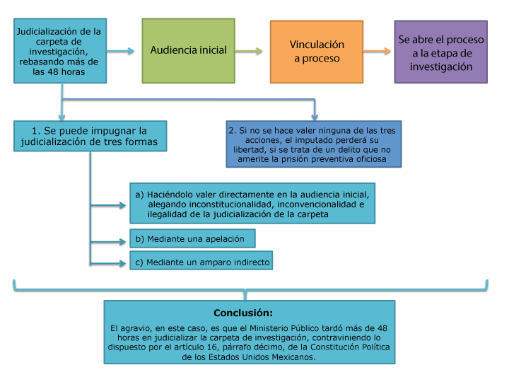
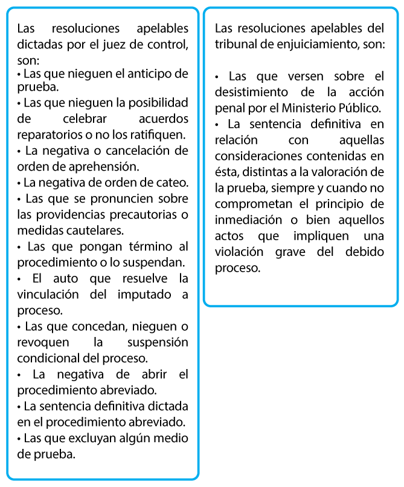

# Guía de Examen del Procedimientos del Fuero Federal

## La Segunda Instancia en el Procedimiento Penal

Introducción
---
Una vez que se emite la sentencia definitiva por parte del Tribunal de Enjuiciamiento en la etapa de juicio, o el juez de control en el procedimiento abreviado, se inicia la segunda instancia del proceso penal.

En términos pragmáticos, la segunda instancia se inicia con la interposición de un recurso (revocación o apelación) ante la sentencia definitiva dictada en el proceso penal, y termina hasta que causa ejecutoria, es decir, hasta que ya se hayan agotado los recursos ordinarios o extraordinarios.

La justificación de la segunda instancia es proporcionada por Hernández Pliego, quien afirma lo siguiente:

El autor dice

Hernández Pliego

“Del juez en tanto director y conductor del proceso, se espera absoluta imparcialidad, tanto en la vigilancia de la prosecución normal del proceso, como en la solución del litigio, lo cual, aunque muchas veces se logra, otras, por un sinfín de motivos entre los que cuenta de manera importante la natural imperfección de los hombres, se pronuncian determinaciones que pugnas con los fines del derecho… (de aquí que) el Estado no puede garantizar el dictado de resoluciones perfectas” (Hernández, 2006: 325 y 326).
 

Lo anterior permite sostener que existe la posibilidad de que una resolución judicial pueda causar agravio en la esfera jurídica de los particulares. De tal suerte, que ese agravio puede ser reparado por algún medio de impugnación, específicamente, por la interposición de algún recurso, ya sea de revocación, apelación, amparo directo o indirecto.

Desde esta perspectiva, la importancia de los medios de impugnación radica en el hecho de que, directamente, buscan un equilibrio entre los intereses de los particulares y el bien común, con la finalidad de respetar las normas que han de observarse en la investigación, el procesamiento y la sanción de los delitos, e, indirectamente, esclarecer los hechos, proteger al inocente, procurar que el culpable no quede impune y que se repare el daño.

Dada la relevancia de esta unidad, iniciaremos estudiando la naturaleza jurídica del tribunal ad quem, como premisa teórica, para que nos permita entender las generalidades de los medios de impugnación. De esta forma, estaremos en condiciones de distinguir entre un medio de impugnación y un recurso.

Finalizaremos el estudio de esta unidad con el análisis del recurso de revocación, así como la aclaración y queja, como medios de impugnación.

 
(1) Medios de impugnación

  Actividad Introductoria
¿Qué sé? y ¿qué quiero saber sobre la segunda instancia en el procedimiento penal? 
Cuestionario

Pulse en el boton iniciar para iniciar su actividad introductoria

 
Objetivo
A lo largo de esta unidad, usted:

Distinguirá los términos medios de impugnación y recursos, que se utilizan en la segunda instancia del procedimiento penal, por medio del estudio de la naturaleza jurídica del tribunal ad quem para aplicarlos en un hecho real.

 

Temario
Unidad 1. La Segunda Instancia en el Procedimiento Penal

1.1. Naturaleza jurídica del Tribunal ad quem
1.2. Generalidades sobre los medios de impugnación
1.3. Diferencias entre medios de impugnación y recursos
1.4. El recurso de revocación, concepto y función
1.5. Tramitación y requisitos de procedibilidad del recurso de revocación
 

Desarrollo de contenido
Naturaleza jurídica del tribunal ad quem

Como afirma Hernández Pliego, “el Estado no puede garantizar el dictado de resoluciones perfectas” (Hernández, 2006: 326), pues existe la posibilidad de que una resolución judicial pueda causar agravio en la esfera jurídica de los particulares. De tal suerte que ese agravio puede ser reparado por algún medio de impugnación.

De esta forma, el medio de impugnación se hace efectivo mediante un recurso que se interpone ante un tribunal ad quem, este último, en términos prácticos, es el juez superior, el cual, dentro del sistema acusatorio penal, será la Sala Penal del Poder Judicial del Distrito Federal o entidad federativa o, en su caso, del Poder Judicial de la Federación, según el delito por el cual se inició el proceso penal.

El objeto del procedimiento de impugnación ante el tribunal ad quem es la resolución judicial emitida por el juez de control o tribunal de enjuiciamiento, en la cual se observarán en conjunto actos, formas y formalidades establecidos para que la sentencia, sea ésta absolutoria o condenatoria.

Así inicia la segunda instancia, mediante la interposición de un recurso ante la sentencia definitiva dictada en el proceso penal, y hasta que causa ejecutoria.

Según Hernández Pliego (2006: 326), los fines que animan a los recursos, representados tanto por la protección de los intereses y expectativas de los particulares, como por la defensa del interés público, forman lo que se puede denominar la deontología de la impugnación, siendo el tribunal ad quem el encargado de resolver el recurso, sea ordinario o extraordinario.

Es decir, en esencia, el tribunal ad quem es el órgano judicial revisor, encargado de determinar si la sentencia definitiva está dictada dentro de los plazos y términos que fijen las leyes, sea la Constitución Política de los Estados Unidos Mexicanos, el Código Nacional de Procedimientos Penales e, inclusive, los Instrumentos Internacionales, tales como la Convención Interamericana sobre Derechos Humanos y el Pacto Internacional de Derechos Civiles y Políticos.

Por ello, José Ovalle Favela (2005: 330) afirma que cuando el medio de impugnación debe ser conocido y resuelto por un juez distinto, el tribunal ad quem, debe decidir en definitiva sobre la admisión y los efectos de aquél.

Generalidades sobre los medios de impugnación

¿Recuerda en qué consiste el término impugnación?

Definamos...
La palabra “impugnación proviene del latín impugnatio, acción y efecto del verbo impugnare, el cual significa combatir, contradecir, refutar, luchar contra, y que su objeto lo constituyen los actos, omisiones, y resoluciones judiciales, y que pueden ser ordinarios y extraordinarios” (Ovalle Fabela, 2005: 326). 

Esta palabra tiene un sentido muy amplio, ya que se utiliza para atacar jurídicamente actos y resoluciones judiciales.

De acuerdo con el Código Nacional de Procedimientos Penales, son objeto de impugnación los actos, omisiones, y resoluciones judiciales. Revisemos en qué consisten:

 Pulse en cada una de las pestañas para ver la información correspondiente.

ACTOS PROCESALES

Son acontecimientos que aparecen dominados por una voluntad humana idónea para crear, modificar, o extinguir derechos procesales (Ovalle Favela, 2005: 326).

Eduardo J. Couture afirma que un acto procesal es el acto jurídico emanado de las partes, de los agentes de la jurisdicción o aun de los terceros ligados al proceso, susceptible de crear, modificar o extinguir efectos procesales (Couture, 1974: 201).

Algunos ejemplos de actos procesales son la presentación de denuncia o querella, entrevistas, la audiencia de formulación de imputación, audiencia de control de detención, audiencia de medidas cautelares, audiencia de cierre de investigación, escrito de acusación, audiencia sobre admisión, y depuración de medios de prueba, audiencia de debate de juicio, entre otros.

RESOLUCIONES JUDICIALES

Las resoluciones judiciales son el auto y la sentencia.

La primera tiene el objetivo de resolver cuestiones diversas al fondo del asunto. Es decir, son resoluciones judiciales de trámite administrativo que no ponen fin al procedimiento y que son necesarias dictar para la continuación del proceso penal, a fin de que se respeten los derechos fundamentales y humanos, tanto del imputado como los de la víctima u ofendido.

Por su parte, la segunda es aquella resolución judicial que decide en definitiva y pone término al procedimiento penal.

OMISIONES PROCESALES

Se refiere a las conductas omisivas de los jueces por no realizar un acto procesal dentro del plazo señalado por el Código Sustantivo Penal.

Por ejemplo, cuando se pasa a la etapa intermedia, sin haberse celebrado la audiencia de cierre de investigación.

Otro ejemplo sería cuando el abogado defensor solicita una audiencia especial para sustitución o revocación de la medida cautelar y el juez de control hace caso omiso a esa solicitud.

Actos procesalesResoluciones judicialesOmisiones procesales
 

Derivado de lo anterior, podemos sostener que los medios de impugnación presentan dos dimensiones:

Dimensión amplia

Se refiere a cualquier forma de inconformarse sobre un acto, omisión, o resolución procesal judicial. En esta dimensión entra la queja y la aclaración, revocación, apelación y amparo.

Dimensión estricta

Se refiere a los recursos estrictamente reconocidos por el Código Nacional de Procedimientos Penales. En ésta se encuentra la revocación, la apelación, y el amparo indirecto.

 
Una definición más amplia respecto a los medios de impugnación es proporcionada por Carlos Barragán y Salvatierra, quien sostiene que “la impugnación está configurada por los instrumentos jurídicos consagrados por las leyes procesales para corregir, modificar, revocar o anular los actos y resoluciones judiciales cuando adolecen de deficiencias, errores, legalidad o injusticia” (Barragán y Salvatierra: 2009: 635).

La anterior definición nos permite afirmar que los efectos de los medios de impugnación son la confirmación, revocación o modificación de la resolución impugnada (Barragán y Salvatierra: 2009: 637).

De acuerdo con José Ovalle Favela, los medios de impugnación son los procedimientos a través de los cuales las partes y los demás sujetos legitimados controvierten la validez o la legalidad de los actos procesales o las omisiones del órgano jurisdiccional, y solicitan una resolución que anule, revoque o modifique el acto impugnado o que ordene subsanar la omisión (Ovalle Favela: 2005, 330). Procedimientos en los cuales intervienen los siguientes sujetos:

La parte o el sujeto legitimado para interponer el medio de impugnación, al que podemos denominar genéricamente el impugnador.
El órgano jurisdiccional responsable del acto o de las omisiones impugnadas (juez o tribunal a quo).
El órgano jurisdiccional competente para conocer y resolver el medio de impugnación (juez o tribunal a quem).
La contraparte del impugnador, a la que normalmente se le permite intervenir en la defensa de la validez o la legalidad del acto reclamado.
Ahora bien, atendiendo al órgano jurisdiccional competente para resolver el medio de impugnación, seguimos la tesis de Hernández Pliego (Hernández Pliego: 2006, 330), conforme a la cual los medios de impugnación son:

Ordinarios
Son aquellos recursos que se interponen contra las resoluciones que no han causado estado. El Código Nacional de Procedimiento Penales prevé como recursos ordinarios a la revocación, queja, aclaración, apelación. Sin embargo, podemos incluir como recurso ordinario al amparo indirecto.

Extraordinarios
Son aquellos que se hacen valer en contra de la cosa juzgada. El amparo directo es el recurso extraordinario por excelencia.

Reflexión...
De acuerdo con las definiciones previas sobre los medios de impugnación, reflexione: ¿cuáles son las diferencias entre dichas definiciones? ¿Existe alguna que usted considere sea la más completa? ¿Usted cómo definiría los medios de impugnación?

Diferencias entre medios de impugnación y recursos

¿Recuerda en qué consiste el término recurso?

 

Definamos...
El recurso es un medio de impugnación intraprocesal, por lo que puede ser interpretado en sentido amplio y estricto (Barragán y Salvatierra: 2009, 642 y Hernández Pliego: 2006, 329).

Dicha palabra se deriva del latín ricorso-ricorsi, cuyo significado es “volver al camino andado o volver a tomar el curso” (Barragán y Salvatierra: 2009, 642).

 

Podemos estudiar a los recursos desde dos perspectivas: “en sentido amplio es aquel medio de defensa que se inicia como la acción, de manera procesalmente independiente y comienza un nuevo juicio” (Hernandez Pliego: 2009, 329), “en sentido estricto, es aquel que supone siempre un procedimiento anterior en que se dictó una resolución contraria a los intereses del recurrente y que lo irrogó agravios” (Hernández Pliego: 2009: 329).

 

Reflexión...
Después de lo estudiado previamente, puede decir ¿cuál es la diferencia entre los medios de impugnación y los recursos?

 

Pues bien, los medios de impugnación son el género, y los recursos son la especie. Esto es así ya que existen medios de impugnación que no son recursos, como es el caso de la queja. De aquí, que “todo recurso es un medio de impugnación; por el contrario, existen medios de impugnación que no son recursos” (Barragán y Salvatierra, 2009: 635).

Como género, “los medios de impugnación son procedimientos a través de los cuales las partes y los demás sujetos legitimados controvierten la validez o la legalidad de los actos procesales, o las omisiones del órgano jurisdiccional, y solicitan una resolución que anule, revoque o modifique el acto impugnado o que ordene subsanar la omisión” (Ovalle Fabela, 2005: 330).

Por su parte, el recurso técnicamente es la especie, es decir, “un medio de impugnación intraprocesal, en el sentido de que vive y se da dentro del seno mismo del proceso, ya sea como un reexamen parcial de ciertas cuestiones, o como segunda etapa o instancia de este proceso” (Barragán y Salvatierra: 2009: 642).

 

Por ejemplo...
Si el juez de control abre el proceso a la etapa intermedia, sin antes haber cerrado la etapa de investigación, lo correcto es interponer el medio de impugnación denominado “queja”, debido a que no realizó un acto procesal dentro del plazo señalado por el Código Nacional de Procedimientos Penales.

Por el contrario, si durante una audiencia el juez de control le impone una multa por desacato judicial (hipótesis: “contestar una llamada en plena audiencia”), usted debe interponer el recurso de revocación con la finalidad de hacer que el juez de control examine de nueva cuenta la resolución emitida y vuelva a dictar una nueva resolución que considere correcta.

Otro elemento que diferencia a los medios de impugnación y a los recursos es que los primeros contienen presupuestos legales y los segundos elementos. Así, los medios de impugnación cuentan con presupuestos objetivos y subjetivos (Constantino Rivera: 2012, 8-9):
 

Objetivos
Se encuentran comprendidos la resolución impugnable, recaudos de forma y tiempo, fundamentación, tipificación legal.

Subjetivos
Se encuentra compuesto por los agravios o interés, legitimación y Competencia.

Por su parte, los recursos tienen tres elementos: subjetivo, objetivo y temporal (De Castro: 2012, 7-10), tal como se muestran a continuación:

Pulse en cada una de las pestañas para ver la información correspondiente.
 

Elemento subjetivo
Vendrá determinado por quien se considera legitimado (legitimación activa); en tanto que sólo puede recurrir la parte o partes que se hayan visto perjudicadas por una decisión judicial

Elemento objetivo
Viene determinado por la recurribilidad de la resolución. Sólo cabe impugnar las resoluciones que tienen legalmente previsto un recurso y, como se ha indicado, esta circunstancia es la más frecuente, sin perjuicio de que la previsión legal relativa a decisiones irrecurribles es perfectamente constitucional.

Elemento temporal
Supone el plazo previsto legalmente para recurrir, de tal forma que sólo podrá admitirse a trámite un recurso si se ha presentado dentro de los plazos legales establecidos. A tal efecto habrá que tener en cuenta el criterio establecido por la legislación procesal a efectos del cómputo de éstos, así como los días hábiles o inhábiles (sábados, domingos, feriados) para poder interponer el recurso en vía penal.

Como hemos estudiado, es importante comprender la diferencia entre medios de impugnación y recursos, ya que todo recurso es un medio de impugnación, pero no todo medio de impugnación es un recurso.
De hecho, el artículo 456 del Código Nacional de Procedimientos Penales es muy claro al respecto, pues sólo se reconocen como recursos a la revocación y apelación.
En términos prácticos, si interpone el recurso de revocación en contra del juez de control ante el consejo de la Judicatura por haber abierto el proceso a la etapa intermedia, sin antes haber cerrado la etapa de investigación, se expone a que su prestigio profesional se vea mermado, pero lo más grave que le puede suceder es que en audiencia le revoquen el cargo de abogado defensor por deficiencia técnica, ya que lo que usted debió haber interpuesto es el medio de impugnación denominado “queja.”
Es importante resaltar el hecho de que la consecuencia más grave de no interponer el medio de impugnación o recurso correcto, es que se subsanan los defectos procesales por tratarse de actos procesales consentidos, derivado de que ya se venció el término para interponer el medio de impugnación o recurso correcto.

El recurso de revocación, concepto y función

El recurso de revocación es un recurso ordinario previsto por el Código Nacional de Procedimientos Penales, que se interpone en cualquiera de las etapas del procedimiento penal en las que interviene la autoridad judicial, en contra de las resoluciones de mero trámite que se resuelvan sin sustanciación.

Nota jurídica
De acuerdo con el artículo 465, párrafo segundo, del Código Nacional de Procedimientos Penales, “el objeto del recurso de revocación es que el mismo órgano jurisdiccional que dictó la resolución impugnada, la examine de nueva cuenta y dicte la resolución que corresponda”.

 

Tramitación y requisitos de procedibilidad del recurso de revocación

Conforme al artículo 466 del Código Nacional de Procedimientos Penales, “el recurso de revocación se interpone de manera oral o escrita, conforme a las siguientes reglas:

I. Si el recurso se hace valer contra las resoluciones pronunciadas durante audiencia, deberá promoverse antes de que termine ésta. La tramitación se efectuará verbalmente, de inmediato y de la misma manera se pronunciará el fallo.

II. Si el recurso se hace valer contra resoluciones dictadas fuera de audiencia, deberá interponerse por escrito en un plazo de dos días siguientes a la notificación de la resolución impugnada, expresando los motivos por los cuales se solicita. El órgano jurisdiccional se pronunciará de plano, pero podrá oír previamente a las demás partes dentro del plazo de dos días de interpuesto el recurso, si se tratara de un asunto cuya complejidad así lo amerite”.

Asimismo, la resolución judicial se dictará de la siguiente manera:

Si el recurso es interpuesto de manera oral, la resolución que decida la revocación interpuesta oralmente en audiencia deberá emitirse de inmediato.
Si el recurso es interpuesto por escrito, la resolución que decida la revocación interpuesta por escrito deberá emitirse dentro de los tres días siguientes a su interposición.
Si el recurso representa un caso complejo, el órgano jurisdiccional citará a audiencia a las partes para resolverlo.
 

Resoluciones revocables

Conforme al artículo 465, párrafo primero, del Código Nacional de Procedimientos Penales, el recurso de revocación se interpone en contra de los autos de primera instancia (a quo), y los autos que se dictan en la segunda instancia (a quem) hasta antes de la emisión de la sentencia.

Legitimación procesal activa

La legitimación procesal activa se refiere a los sujetos que pueden interponer el recurso (en este caso el de revocación). Del análisis de los artículos 109 fracción XIV, 110, 117 fracción XV, 131 fracción XIII, del Código Nacional de Procedimientos Penales, podemos sostener que los sujetos procesales facultados para interponer el recurso de revocación son:

•  Ministerio Público
•  Victima u ofendido
•  Asesor jurídico
•  Imputado (acusado)
•  Abogado defensor

Efectos procesales

De acuerdo con el artículo 465, párrafo segundo, del Código Nacional de Procedimientos Penales, cuando el recurso de revocación sea procedente, el órgano jurisdiccional dictará una nueva resolución, que conforme a derecho proceda.

Es importante señalar que, de acuerdo con el Código Nacional de Procedimientos Penales, la resolución que pone fin al recurso de revocación no admite recurso ordinario alguno.

Por lo que la única opción que le resta, en su calidad de abogado defensor, asesor jurídico, ministerio público, víctima u ofendido, es interponer el amparo indirecto, y con ello, lograr que se emita una nueva resolución a favor de los intereses de la parte que representa.
 

Otros medios de impugnación

Como se ha destacado, de las máximas jurídicas, en materia de medios de impugnación, podemos encontrar que “no todos los medios de impugnación son recursos” y “todos los recursos son medios de impugnación.”

Derivado de lo anterior, el Código Nacional de Procedimientos Penales, en su artículo 456, señala que en el procedimiento penal sólo se admitirán los recursos de revocación y apelación, según corresponda.

Sin embargo, el Código Adjetivo Penal en cita prevé dos medios de impugnación diferentes a la revocación y apelación: la aclaración y la queja.

Aclaración

La aclaración es un medio de impugnación ordinario, que se interpone para aclarar los términos oscuros, ambiguos o contradictorios en que estén emitidas las resoluciones judiciales, siempre que tales aclaraciones no impliquen modificación o alteración del sentido de la resolución.
 

En esta tesitura, se considera como medio de impugnación debido a que al solicitar la aclaración de las resoluciones judiciales, permite la aclaración sobre los términos utilizados en el auto o sentencia y, de esta forma, preparar el camino para que el recurso que se interponga pueda cambiar el sentido de la resolución impugnada.

Este medio de impugnación procede a petición de parte, o de oficio por el órgano jurisdiccional que lo dictó. Existen tres momentos procesales para interponerlo:

En la misma audiencia.
Después de dictada la resolución.
Hasta dentro de los tres días posteriores a la notificación.
De ser procedente la aclaración, el órgano jurisdiccional tiene la obligación de aclarar el auto o sentencia, según sea el caso, dentro de las 24 horas siguientes a la solicitud.
 

¡Importante!
La solicitud suspende el término para interponer los recursos que procedan.

Queja

La queja es un medio de impugnación ordinario, destinado a combatir las omisiones de actos procesales de un órgano jurisdiccional.

Conforme al artículo 135 del Código Nacional de Procedimientos Penales, este medio de impugnación procede en contra del juzgador de primera instancia por no realizar un acto procesal dentro del plazo señalado.

Ahora bien, la queja puede ser promovida por cualquier parte del procedimiento y se tramitará sin perjuicio de las otras consecuencias legales que tenga la omisión del juzgador.

La característica que diferencia a este medio de impugnación de cualquier otro es que éste se interpone ante el consejo de la Judicatura Federal, los consejos de las judicaturas de las entidades federativas o el órgano judicial, con funciones propias del consejo, o su equivalente, que realice las funciones de administración, vigilancia y disciplina, según sea el caso. Revisemos a continuación el proceso de interposición de la queja.

 Pulse en las flechas atrás y adelante para navegar entre los contenidos.

1. La interposición de la queja se realizará a partir de que se advierta la omisión del acto procesal, y se tramitará y resolverá en un plazo no mayor a tres días.

2. A partir de que se recibió la queja por el órgano jurisdiccional, éste tiene un plazo de 24 horas para subsanar dicha omisión, o bien, realizar un informe breve y conciso sobre las razones por las cuales no se ha verificado el acto procesal o la formalidad exigidos por la norma omitida y remitir el recurso y dicho informe al consejo.

3. Posteriormente, el consejo tendrá 48 horas para resolver si dicha omisión se ha verificado. En ese caso, el consejo ordenará la realización del acto omitido y apercibirá al órgano jurisdiccional de las imposiciones de las sanciones previstas por la Ley Orgánica respectiva en caso de incumplimiento.

En ningún caso, el consejo podrá ordenar al órgano jurisdiccional los términos y las condiciones en que deberá subsanarse la omisión, debiéndose limitar su resolución a que se realice el acto omitido.

 Pulse en el botón para ver las Fuentes de consulta

 Fuentes de consulta
 
 ## La Apelación
 
Introducción

Uno de los cambios estructurales de mayor importancia en el proceso penal es la apelación, ya que anteriormente los agravios de ésta estaban relacionados con la valoración de las pruebas, lo cual ya no sucede con el sistema acusatorio y oral.

Para entender cuál es el papel de la apelación en el nuevo sistema de justicia penal, iniciaremos estudiando el concepto y función de ésta, lo que nos dará la oportunidad de entender los tres efectos de la apelación: suspensivo, adhesivo y devolutivo.

En este sentido, veremos que el efecto suspensivo del recurso de apelación se refiere a que impide que la resolución impugnada pueda ser ejecutada, en tanto no haya causado ejecutoria, lo que implica que el procedimiento penal se suspende hasta en tanto el tribunal de alzada resuelva el recurso.

Aprenderemos que el efecto adhesivo de la Apelación se refiere a que la persona que tenga derecho a interponer el recurso, se puede adherir, dentro del término de tres días contados a partir de recibido el traslado, al recurso interpuesto por cualquiera de las otras partes.

No debemos olvidar, que la regla general de la interposición de este recurso es que no suspende la ejecución de la resolución judicial impugnada, es decir, sólo tiene el efecto devolutivo.

No obstante lo anterior, tratándose de la exclusión de un medio de prueba, la apelación tiene tanto el efecto devolutivo como suspensivo, lo cual es lógico, ya que en el supuesto de que se continuara con el procedimiento penal, implicaría una seria violación al derecho fundamental de adecuada defensa, dando lugar a la reposición del procedimiento. Tal y como se encuentra previsto en el artículo 482, fracción III, del Código Nacional de Procedimientos Penales.

 

Reflexión...
Tratándose del delito de lesiones culposas derivadas del ejercicio profesional de un médico, qué haría usted si dentro de una carpeta de investigación la víctima y el imputado deciden llegar a un acuerdo, pero el Ministerio Público se opone, y les manifiesta a las partes que no existe la posibilidad de celebrar un acuerdo reparatorio. ¿Procede el recurso de apelación? ¿Procede el amparo directo? ¿Procede el amparo indirecto? ¿Qué es lo que haría?

 

  Actividad Introductoria
El recurso de apelación
Opción múltiple

Pulse sobre el botón Iniciar para realizar su actividad introductoria.

 
Objetivo
A lo largo de esta unidad, usted:

Reconocerá a la apelación como recurso dentro del procedimiento penal, los términos en que procede, así como la legislación y la jurisprudencia aplicable para poder aplicarlos en la resolución de casos prácticos.

Temario
Unidad 2. La Apelación

2.1. Concepto y función

2.2. Requisitos de procedibilidad

2.3. Resoluciones judiciales apelables

2.4. Inadmisibilidad del recurso de apelación

2.5. Los agravios, concepto y utilidad de la apelación

2.6. Facultades del tribunal ad quem

¿Qué es la apelación?

En asignaturas como Teoría General del Proceso, Derecho Procesal Civil, Derecho Procesal Mercantil, seguramente ya ha estudiado qué es la apelación y qué función tiene en cada materia. Sin embargo, en materia penal tiene características diferentes que lo hacen único, es por ello que iniciaremos con tres definiciones: la etimológica, la de Colín Sánchez y la de Rivera Silva, para concluir con una definición que retomaremos en esta asignatura.

 
La apelación 
-

|Etimología | Colín Sánchez | Rivera Silva| 
|---|---|---| 
| |Medio de impugnación ordinario. | Recurso ordinario y devolutivo.| 
|Proviene del latín appellatio: “reclamación, petición” |A través de la apelación, el Ministerio Público, el procesado, el acusado o sentenciado, el defensor, la víctima u ofendido, manifiesta su inconformidad con la resolución judicial que se le ha dado a conocer.| En virtud del cual un tribunal de segunda instancia, confirma, revoca o modifica una resolución impugnada. (Riviera Silva, 2009: 333).
| |Con lo anterior, origina que un tribunal distinto y de superior jerarquía, previo estudio de lo que se consideran agravios, dicte nueva resolución judicial. | |
 
¿Por qué es importante el recurso de apelación?

Barragán y Salvatierra plantea que la finalidad del recurso de apelación es la reparación de las violaciones legales cometidas que sólo es posible lograr a través de la modificación o revocación de la resolución impugnada, para lo cual deberá dictarse otra que resuelva lo procedente (Barragán y Salvatierra: 2009, 653).

Derivado de lo anterior, para el estudio de esta asignatura definiremos la apelación como…

 
Definamos...
Recurso ordinario, que puede tener los siguientes efectos: adhesivo, suspensivo y devolutivo. Tiene como función la confirmación, modificación, revocación de la resolución impugnada, la incorporación de un medio de prueba indebidamente excluido y, en su caso, la reposición del acto que dio lugar a ésta.

Efectos del recurso de apelación

Es importante que, como abogado defensor, Ministerio Público, asesor jurídico e, inclusive, juez de control o miembro del tribunal de enjuiciamiento, tenga claro cuáles son los efectos de la apelación, ya que, en caso contrario, se corre el riesgo de que no se cumpla con el objetivo previsto por el artículo 2 del Código Nacional de Procedimientos Penales: “esclarecer los hechos, proteger al inocente, procurar que el culpable no quede impune y que se repare el daño”.

Si aún no ha logrado dimensionar la importancia de este tema, basta con que usted mismo responda a la siguiente pregunta:

 
Reflexión...
¿Qué consecuencia jurídica trae aparejada, si el juez de control no suspende procedimiento cuando el abogado defensor interpuso la apelación por exclusión de pruebas?

 
La respuesta se encuentra en el artículo 113, fracción X, del Código Nacional de Procedimientos Penales. Si aún no ha consultado dicho artículo o no ha podido encontrar la respuesta, es necesario que tenga presente que la única consecuencia jurídica segura es que se va a reponer el procedimiento desde la etapa en que se haya cometido la violación procesal.

Asimismo, al tomar en consideración que, conforme a dicho artículo, el imputado tiene derecho a ser juzgado en audiencia por un tribunal de enjuiciamiento, antes de cuatro meses si se tratare de delitos cuya pena máxima no exceda de dos años de prisión y antes de un año, si la pena excediera ese tiempo y si el juez de control abriera el proceso a juicio, lo único que se va a conseguir es que, al rebasar los cuatro meses o el año para ser juzgado, el abogado defensor solicite la libertad de su cliente (imputado) por no ser juzgado en el tiempo que marca el Código Nacional de Procedimientos Penales, es decir, no se van a esclarecer los hechos ni se va a proteger al inocente, mucho menos se va a procurar que el culpable no quede impune, no se repara el daño por una simple razón: el abogado defensor no solicitó un plazo mayor para su defensa.

Para saber qué tipo de efecto tiene la apelación, es necesario recurrir a los artículos 471, 472, y 473, del Código Nacional de Procedimientos Penales.

 Pulse en las áreas que se marcan como sensibles para visualizar la información.

EFECTOS DEL RECURSO DE APELACIÓN
-
 
Devolutivo

El efecto devolutivo se refiere a que el recurso de apelación va a resolverse por el tribunal de alzada (tribunal ad quem), lo que implica que es un tribunal distinto y superior al que ha dictado la resolución judicial impugnada, sin que este efecto impida se ejecute la resolución recurrida.

Adhesivo

El efecto adhesivo de la apelación se refiere a que la persona que tenga derecho a interponer el recurso se puede adherir dentro del término de tres días, contados a partir de recibido el traslado, al recurso interpuesto por cualquiera de las otras partes.

Suspensivo

El efecto suspensivo del recurso de apelación se refiere a que impide que la resolución impugnada pueda ser ejecutada por exclusión de pruebas, en tanto no haya causado ejecutoria, lo que implica que el procedimiento penal se suspende hasta en tanto el tribunal de alzada resuelva el recurso.
   
 
Por regla general, la interposición de este recurso no suspende la ejecución de la resolución judicial impugnada, es decir, sólo tiene el efecto devolutivo.

No obstante, en el caso de la apelación contra la exclusión de pruebas, la interposición del recurso tendrá como efecto inmediato suspender el plazo de remisión del auto de apertura de juicio al tribunal de enjuiciamiento, en atención a lo que resuelva el tribunal de alzada (tribunal ad quem-sala penal) competente, es decir, tratándose de la exclusión de un medio de prueba, la apelación tiene tanto el efecto devolutivo como suspensivo, lo cual es lógico, ya que en el supuesto de que se continuara con el procedimiento penal, implicaría una seria violación al derecho fundamental de adecuada defensa, dando lugar a la reposición del procedimiento. Tal y como se encuentra previsto en el artículo 482, fracción III, del Código Nacional de Procedimientos Penales.

Ahora bien, de acuerdo con el artículo 479 del Código Nacional de Procedimientos Penales, la función de la apelación es:

 
La Ley establece…
Confirmar, modificar o revocar la resolución impugnada, o bien ordenar la reposición del acto que dio lugar a ésta o, en su caso, incluir el medio de prueba indebidamente excluido (CNPP).

Requisitos de procedibilidad

Los requisitos de procedibilidad se refieren a todas aquellas condiciones necesarias para que el recurso de apelación sea procedente y, por tanto, el tribunal ad quem pueda resolver sobre la resolución impugnada.

En este sentido, los requisitos de procedibilidad previstos por el Código Nacional de Procedimientos Penales son los siguientes:

 Pulse en las áreas que se marcan como sensibles para visualizar la información.

Formalidades
-

Se debe interponer por escrito ante el mismo juez que dictó la resolución, señalando el domicilio para que pueda ser notificado. Cabe precisar que si el tribunal ad quem se encuentra en un lugar distinto al domicilio donde se está llevando el proceso, el imputado tiene la obligación de señalar nuevo domicilio ubicado en la jurisdicción del tribunal ad quem.

Para evitar que le notifiquen por medio de los estrados y por ello se le venzan términos, el Código Nacional permite que señale un medio para que pueda ser notificado, este medio puede ser correo electrónico, teléfono, o cualquier otro medio que le permita al juez de control o tribunal ad quem notificarle una resolución judicial.

En el escrito de apelación se debe expresar los agravios; asimismo, exhibir una copia para el registro y una copia de traslado para cada una de las partes. En el supuesto de que falten copias, se le requerirá al promovente para que presente las omitidas dentro del término de 24 horas. En caso de que no las exhiba, el órgano jurisdiccional las tramitará e impondrá al promovente multa de 10 a 150 días de salario, excepto cuando éste sea el imputado o la víctima u ofendido.

Una vez admitida la apelación, el órgano jurisdiccional le correrá traslado de éste a las partes para que se pronuncien en un plazo de tres días respecto de los agravios expuestos y señalen domicilio o medios para que pueda ser legalmente notificado.

Al interponer el recurso, al contestarlo o al adherirse a él, los interesados podrán manifestar en su escrito su deseo de exponer oralmente alegatos aclaratorios sobre los agravios ante el tribunal de alzada.

Tiempo
-

Existen diferentes plazos para interponer el recurso de apelación, todo dependerá de la materia de la resolución impugnada. De esta manera, tenemos que:

•	Tratándose de auto o cualquier otra providencia, el término para interponer el recurso es dentro de los tres días contados a partir de que surta efectos la notificación.

•	Tratándose de sentencia definitiva, dictada por el juez de control, se debe interponer dentro de los cinco días, a partir de que surta efectos la notificación, es decir, de sentencias definitivas dictadas en los procedimientos abreviados y procedimientos diversos.

•	Cuando la materia de la apelación sea el desistimiento de la acción penal por el Ministerio Público se interpondrá ante el tribunal de enjuiciamiento que dictó la resolución dentro de los tres días contados a partir de que surte efectos la notificación.

•	Tratándose de sentencias definitivas dictadas por el tribunal de enjuiciamiento se interpondrá dentro de los diez días siguientes a la notificación de la resolución impugnada.

Legitimación procesal
-

Se refiere a los sujetos procesales que tienen derecho subjetivo a recurrir la resolución judicial impugnada. De esta forma, tenemos que el derecho de interponer el recurso de apelación le corresponde únicamente a quien le sea expresamente otorgado y pueda resultar afectado por la resolución. Dando lugar, por una parte, a la víctima u ofendido, por propio derecho, o por medio de su asesor jurídico, o del Ministerio Público y, por otra, al imputado, por propio derecho o por medio de su defensor.

Asimismo, la víctima u ofendido, aunque no se haya constituido como coadyuvante, podrá impugnar por sí o a través del Ministerio Público, las siguientes resoluciones: las que versen sobre la reparación del daño causado por el delito, cuando estime que hubiere resultado perjudicado por ésta; las que pongan fin al proceso; y las que se produzcan en la audiencia de juicio, sólo si en este último caso hubiere participado en ella.

### Resoluciones judiciales apelables

La autoridad judicial pronunciará sus resoluciones en forma de sentencias y autos. Dictará sentencia para decidir en definitiva y poner término al procedimiento y un auto en todos los demás casos.

Es por ello que la apelación se puede interponer desde la etapa de investigación hasta la de juicio, en contra de las resoluciones judiciales. De aquí que surge la necesidad de diferenciar dos supuestos:

| En las etapas de investigación e intermedia	 | En la etapa de juicio|
|---|---|
|Las resoluciones judiciales apelables son los autos, los cuales son dictados por el juez de control.| La resolución judicial apelable es la sentencia definitiva, la cual es emitida por el tribunal de enjuiciamiento.|
 
Ahora bien, conforme al artículo 467 del Código Nacional de Procedimientos Penales, las únicas resoluciones de juez de control apelables son:

 
La Ley establece…
 

Las que nieguen el anticipo de prueba;
Las que nieguen la posibilidad de celebrar acuerdos reparatorios o no los ratifiquen;
La negativa o cancelación de orden de aprehensión;
La negativa de orden de cateo;
Las que se pronuncien sobre las providencias precautorias o medidas cautelares;
Las que pongan término al procedimiento o lo suspendan;
El auto que resuelve la vinculación del imputado a proceso;
Las que concedan, nieguen o revoquen la suspensión condicional del proceso;
La negativa de abrir el procedimiento abreviado;
La sentencia definitiva dictada en el procedimiento abreviado, o
Las que excluyan algún medio de prueba (CNPP, art. 467).
 
Por otra parte, conforme al artículo 468 del Código Nacional de Procedimientos Penales, las resoluciones dictadas por el Tribunal de enjuiciamiento, que son materia de la apelación, sólo son:

 
La Ley establece…
Las que versen sobre el desistimiento de la acción penal por el Ministerio Público;
La sentencia definitiva en relación con aquellas consideraciones contenidas en ésta, distintas a la valoración de la prueba, siempre y cuando no comprometan el principio de inmediación, o bien aquellos actos que impliquen una violación grave del debido proceso (CNPP, art. 468).
 
De esta forma, lo que debemos destacar de la nueva configuración de la apelación en el sistema acusatorio y oral es que, como sostiene Barragán y Salvatierra, “el objetivo del recurso de la apelación es la reparación de violaciones legales” (Barragán y Salvatierra, 2009: 653), precisando que no se pueden alegar cuestiones relativas a la valoración de la prueba, ya que esto implicaría una seria violación a un principio fundamental del sistema penal acusatorio y oral, que es el principio de inmediación.

Con base en el principio de inmediación, sólo el tribunal de enjuiciamiento es el único órgano jurisdiccional que estuvo presente a la hora del desahogo de las diversas pruebas y, por tanto, son las únicas autoridades judiciales que pueden valorar la prueba, que les servirá para dictar la sentencia definitiva.

Inadmisibilidad del recurso de apelación

El recurso de apelación no procede cuando se trate de los siguientes casos:

Cuando haya sido interpuesto fuera del plazo;
Cuando se deduzca en contra de resolución que no sea impugnable por medio de apelación;
Cuando lo interponga persona no legitimada para ello;
Cuando el escrito de interposición carezca de fundamentos de agravio o de peticiones concretas.
De esta forma, si el recurso de apelación no cumple con las formalidades requeridas, no cumple con el plazo, no tiene legitimación o no sean materia del recurso, el  tribunal de alzada (sala penal) puede desecharlo, sin necesidad de prevenir a la parte recurrente para subsanar el error en el que haya incurrido.

La consecuencia jurídica que trae aparejada la no admisión del recurso de apelación es que la resolución judicial impugnada queda firme, es decir, ha causado ejecutoria, por no haberse interpuesto el recurso pertinente. Aunado a esto, puede dar lugar a un procedimiento administrativo de responsabilidad administrativa, tratándose del Ministerio Público, asesor público, o defensor de oficio.

 
Reflexión...
Hasta este momento, sabemos que ya no se pueden formular agravios sobre la violación a los principios reguladores de la valoración de las pruebas. Ante tal situación, reflexione ¿cuál es la utilidad de la apelación?

 
 Los agravios, concepto y utilidad de la apelación

En general, durante el proceso penal, los actos, omisiones o resoluciones dictados por el Ministerio Público, juez de control o tribunal de enjuiciamiento suelen causar un daño o perjuicio a una de las partes.

De esta forma, la parte agraviada considera que sufre una afectación a su persona o a su esfera jurídica y, por lo mismo, interpondrá algún medio de impugnación o recurso, a fin de que dicho daño no trascienda.

Recordemos que cualquier acto, omisión o resolución que no se impugne se considerará como consentido. En virtud de lo anterior, es importante señalar que los agravios tienen el objetivo procesal de fijar los límites sobre los que versará la sentencia.

 

 

(2) Agravio

Por ejemplo...
Si el Ministerio Público tarda más de 48 horas en judicializar una carpeta de investigación y usted, como abogado defensor no lo impugna, y el juez de control no se percata de esa situación, entonces a su cliente se le vinculará al proceso, aun cuando, constitucional y procesalmente, debería ser dejado en libertad.

 

Veamos gráficamente el ejemplo:

 Pulse sobre el esquema para ampliar. Vuelva a pulsar para regresar al tamaño original.

 

Atendiendo a todo lo anterior, es importante definir el concepto de agravio.

 

El autor dice

Carlos Barragán y Salvatierra

El jurista Barragán y Salvatierra sostiene que un agravio es todo daño o lesión que sufre una persona por violación a la ley en la resolución judicial (Barragán y Salvatierra: 2009, 658).

 

 
En términos prácticos, el Segundo Tribunal Colegiado de Circuito del Centro Auxiliar de la Quinta Región del Poder Judicial de la Federación sostiene que los elementos de la causa petendi (causa de pedir), “se compone de un hecho y un razonamiento con el que se explique la ilegalidad aducida” (Tesis aislada común, (V Región) 2o.1 K [10a.]).

De esta forma, la causa de pedir se ve materializada en el agravio, en el cual se debe exponer, razonadamente, por qué estiman ilegal la resolución impugnada.

Revisemos a continuación lo que nos dicen algunas tesis aisladas y jurisprudenciales respecto al agravio y al razonamiento jurídico

Interpretación de la Ley…
El agravio presupone un razonamiento jurídico, a su vez, este “razonamiento jurídico presupone algún problema o cuestión al cual, mediante las distintas formas interpretativas o argumentativas que proporciona la lógica formal, material o pragmática, se alcanza una respuesta a partir de inferencias obtenidas de las premisas o juicios dados (hechos y fundamento)” (tesis aislada común, (V Región) 2o.1 K [10a.]).

Interpretación de la Ley…
Un agravio es “un razonamiento” que “se traduce a la mínima necesidad de explicar por qué o cómo el acto reclamado, o la resolución recurrida se aparta del derecho, a través de la confrontación de las situaciones fácticas concretas frente a la norma aplicable (de modo tal que evidencie la violación) y la propuesta de solución o conclusión sacada de la conexión entre aquellas premisas (hecho y fundamento)” (Jurisprudencia común, (V Región) 2o. J/1 [10a.]).

Interpretación de la ley
“Independientemente del modelo argumentativo que se utilice”, un razonamiento jurídico “se traduce a la mínima necesidad de explicar por qué o cómo el acto reclamado, o la resolución recurrida se aparta del derecho, a través de la confrontación de las situaciones fácticas concretas frente a la norma aplicable (de modo tal que evidencie la violación), y la propuesta de solución o conclusión sacada de la conexión entre aquellas premisas (hecho y fundamento)” (Tesis aislada común, (V Región) 2o.1 K [10a.]).

La utilidad de los agravios radica en el hecho de que con base en ellos se puede obtener:

Una modificación
Revocación de la resolución impugnada
La incorporación de un medio de prueba indebidamente excluido
Se puede reponer el procedimiento
De esta forma, los agravios que componen el recurso de apelación versarán sobre el debido proceso, exacta aplicación de la ley penal, individualización de la pena.

Cabe precisar que, debido a que el principio de inmediación, se refiere a que toda audiencia se desarrollará íntegramente en presencia del órgano jurisdiccional, implica que el desahogo de las pruebas se llevará a cabo en la audiencia de debate de juicio ante la presencia del tribunal de enjuiciamiento, por lo que no se pueden esgrimir agravios contra la valoración de las pruebas.

 
¡Importante!
Como una máxima jurídica que usted debe considerar como profesional del derecho, es que si una sentencia definitiva no se apela, entonces, ésta adquiere el estatus procesal de sentencia ejecutoriada, es decir, que ya no admite recurso alguno.

De lo anterior, que la utilidad de la apelación radica en el hecho de que si no se interpone, el sujeto procesal afectado se queda sin la posibilidad de iniciar el juicio de amparo, ya que, con base en el principio de definitividad, si una sentencia no es apelada, trae aparejada, como consecuencia inmediata, que no sea posible interponer el juicio de amparo.

Facultades del tribunal ad quem

Una vez que los plazos para interponer la apelación han concluido, el órgano jurisdiccional enviará los registros correspondientes al tribunal de alzada que deba conocer de éste.

Es aquí cuando aparece la primera facultad del tribunal ad quem, es decir, el pronunciamiento sobre la admisión del recurso de apelación.

Es importante señalar que si al interponer el recurso, al contestarlo o al adherirse a él, alguno de los interesados manifiesta en su escrito su deseo de exponer oralmente alegatos aclaratorios sobre los agravios, el tribunal ad quem (sala penal) decretará lugar y fecha para la celebración de la audiencia, la que deberá tener lugar dentro de los cinco y 15 días después de que venza el término para la adhesión.

 

 

(3) Tribunal de alzada

 
De esta manera, el tribunal de alzada citará a audiencia de alegatos para la celebración de la audiencia para que las partes expongan oralmente sus alegatos aclaratorios sobre agravios, la que deberá tener lugar dentro de los cinco días después de admitido el recurso.

Una vez abierta la audiencia, se concederá la palabra a la parte recurrente para que exponga sus alegatos aclaratorios sobre los agravios manifestados por escrito, sin que pueda plantear nuevos conceptos de agravio.

Ahora bien, el tribunal ad quem tiene la facultad de dictar sentencia sobre el recurso de apelación, ya sea en la misma audiencia o por escrito dentro de los tres días siguientes a la celebración de ésta.

 
Recuerde que...
No existen agravios sobre la valoración de la prueba y, por lo tanto, la sentencia que se emita podrá confirmar, modificar o revocar la resolución impugnada o, en su caso, ordenará la reposición del acto o procedimiento.

 
De esta forma, conforme al artículo 483 del Código Nacional de Procedimientos Penales, la sentencia se modificará o revocará cuando la causa de nulidad de ésta sea la transgresión a una norma de fondo que implique una violación a un derecho fundamental. Sin embargo, si ello compromete el principio de inmediación, ordenará la reposición del juicio.

 Ahora bien, conforme al artículo 482 del Código Nacional de Procedimientos Penales, la reposición del procedimiento se puede efectuar cuando el recurso de apelación se interpone por violaciones graves al debido proceso, siempre y cuando se actualice uno de los siguientes supuestos:

 
La Ley establece…
Cuando en la tramitación de la audiencia de juicio oral o en el dictado de la sentencia se hubieren infringido derechos fundamentales asegurados por la Constitución, las leyes que de ella emanen y los tratados;
Cuando no se desahoguen las pruebas que fueron admitidas legalmente, o no se desahoguen conforme a las disposiciones previstas en este Código;
 Cuando si se hubiere violado el derecho de defensa adecuada o de contradicción siempre y cuando trascienda en la valoración del tribunal de enjuiciamiento y que cause perjuicio;
Cuando la audiencia del juicio hubiere tenido lugar en ausencia de alguna de las personas cuya presencia continuada se exija bajo sanción de nulidad;
Cuando en el juicio oral hubieren sido violadas las disposiciones establecidas por este código sobre publicidad, oralidad y concentración del juicio, siempre que se vulneren derechos de las partes, o
Cuando la sentencia hubiere sido pronunciada por un tribunal de enjuiciamiento incompetente o que, en los términos de este código, no garantice su imparcialidad (CNPP, art. 482).
 
De lo anterior, tenemos que identificar dos tipos de reposición de procedimiento: total, y parcial. Los efectos jurídicos de cada una son diferentes, ya que, la reposición total de la audiencia de juicio deberá realizarse íntegramente ante un tribunal de enjuiciamiento distinto. Tratándose de la reposición parcial, el tribunal de alzada determinará si es posible su realización ante el mismo órgano jurisdiccional u otro distinto, tomando en cuenta la garantía de la inmediación y el principio de objetividad del órgano jurisdiccional, establecidos en las fracciones II y IV del apartado A, del artículo 20 de la Constitución y el artículo 9 del Código Nacional de Procedimientos Penales.

Por último, es de suma importancia señalar, que conforme al artículo 484 del Código Nacional de Procedimientos Penales, el tribunal ad quem tiene la facultad de recibir y desahogar los medios de prueba que ofrezcan las partes, siempre y cuando éstas sean indispensables para sustentar el agravio que se formula.

 Pulse en el botón para ver las Fuentes de consulta

 Fuentes de consulta

### La Apelación

Introducción

Para pensar estratégicamente en la defensa de un asunto penal es necesario saber con anticipación cuáles son las resoluciones que dicta el tribunal ad quem, ya que de eso dependerá su actuar profesional. Aunado a lo anterior, es recomendable que antes de interponer un medio de impugnación o recurso, sepa con anticipación dos cuestiones centrales: la competencia y las cuestiones incidentales que se pueden promover dentro de la segunda instancia.

En el sistema acusatorio y oral mexicano, todas las cuestiones accesorias íntimamente relacionadas con el asunto principal se pueden agrupar académicamente en la figura de procedimientos diversos. Esto es así debido a que el actual sistema de justicia penal tiene la finalidad de que la justicia sea pronta y expedita. De tal suerte, que basta con promover ante el órgano jurisdiccional un procedimiento diverso para que se fije una audiencia, en la cual se va a plantear, debatir y resolver las cuestiones accesorias expuestas por las partes en un solo acto procesal, es decir, en una misma audiencia. 
  
Cabe precisar que en el actual sistema siguen existiendo cuestiones incidentales, de las cuales es necesario resolver a fin de que no se violen los derechos humanos, ni fundamentales de las partes. Cuestiones que hemos reunido y clasificado como procedimientos diversos.

Tenido como marco este contexto, en esta unidad profundizaremos en cuatro temas importantes para su formación profesional. Primero, determinaremos si el Código Nacional de Procedimientos Penales prevé la figura procesal de  “incidente” o, en su caso, determinaremos cuál es el procedimiento aplicable para las resoluciones de cuestiones incidentales, obviamente, todo fundado en nuestro código nacional adjetivo penal.

Una vez hecho lo anterior, podemos determinar cuáles son las sentencias que se pueden dictar en Segunda Instancia. De esta forma, esteremos en condiciones de establecer quiénes tienen legitimación procesal para impugnar las sentencias de segunda instancia. La importancia de este tema radica en el hecho de que nos encontramos en una etapa de transición del sistema tradicional mixto a un sistema acusatorio y oral. Si somos capaces de saber si nuestro cliente puede interponer medios de impugnación o recursos extraordinarios en segunda instancia, entonces, puedo asegurarles que su prestigio profesional se incrementará.

Por último, estudiaremos la situación del Ministerio Público en la segunda instancia en el sistema acusatorio y oral, recordemos que tenemos nuevas reglas procesales y, por ello, la obligación de saberlas utilizar para poder alcanzar el objetivo que establece el artículo 2 del  Código Nacional de Procedimientos Penales: “esclarecer los hechos, proteger al inocente, procurar que el culpable no quede impune y que se repare el daño… en un marco de respeto a los derechos humanos reconocidos en la Constitución y en los tratados Internacionales de los que el Estado mexicano sea parte”…

 

 

(1) Tribunal ad quem

 

  Actividad Introductoria
El recurso de apelación
Opción múltiple

Pulse sobre el botón Iniciar para realizar su actividad introductoria.

 
Objetivo
A lo largo de esta unidad, usted: 

Distinguirá los procedimientos diversos que se pueden interponer en segunda instancia para dar solución a cuestiones accesorias de manera pronta y expedita.

Analizará las resoluciones que se emiten dentro de la segunda instancia y sus alcances legales, para decidir si interponer un recurso o medio de impugnación y elaborar un recurso de apelación.

Temario
Unidad 3. Las Resoluciones del Tribunal Ad Quem o Segunda Instancia

3.1. Legislación aplicable para los incidentes que surgen en la tramitación de la segunda instancia y su impugnación 
3.2. Las sentencias de segunda instancia 
3.3. Personas que pueden impugnar las sentencias de segunda instancia 
3.4. Situación del Ministerio Público en la segunda instancia

Desarrollo de contenido
Legislación aplicable para los incidentes que surgen en la tramitación de la segunda instancia y su impugnación

La figura jurídica de “incidente” no se encuentra prevista por el Código Nacional de Procedimientos Penales, debido a que el actual sistema de justicia penal es acusatorio y oral. Ésta responde a las necesidades del sistema tradicional mixto, donde generalmente tienen una tramitación separada del proceso con el que están vinculados, y a la resolución que le recaía se le denominaba sentencia interlocutoria.

 
Definamos...
Tradicionalmente se ha definido al incidente como “una cuestión accesoria que ingresa al juicio y que, teniendo íntima relación con el asunto principal, reclama, no obstante, una resolución destacada” (Hernández, 2006: 358).

 
Cabe hacer mención, que en el actual sistema siguen existiendo cuestiones incidentales, las cuales es necesario resolver a fin de que no se violen los derechos humanos ni fundamentales de las partes. En el sistema acusatorio y oral mexicano, todas las cuestiones accesorias íntimamente relacionadas con el asunto principal se pueden agrupar académicamente en la figura de procedimientos diversos.

Es por ello que, a fin de evitar confusiones, vamos a diferenciar entre los siguientes procedimientos: ordinario, abreviado y diverso. Es necesario precisar que esta clasificación es para efectos académicos, a fin de comprender el sistema acusatorio y oral mexicano.

 Pulse sobre las áreas que se marcan como sensibles en la imagen para que se despliegue la información correspondiente.

Procedimiento ordinario
-
 

Resuelve cuestiones propias de las etapas de investigación, intermedia y juicio. Contiene, por lo menos, las siguientes audiencias: ejercicio de la acción penal y audiencia inicial, cierre de la investigación, formulación de acusación, ofrecimiento, depuración y admisión de acuerdos probatorios, audiencia de debate de juicio oral. 
 
Procedimiento abreviado
-
 

Es una forma de terminación anticipada del proceso penal, que consiste en el reconocimiento de la participación del imputado en la comisión del hecho delictivo y, derivado de ello, el sujeto activo del delito puede obtener una reducción en su sanción. Para su procedencia, es necesario que el Ministerio Público lo solicite después de que se dicte el auto de vinculación a proceso y hasta antes de la emisión del auto de apertura a juicio oral.

Procedimientos diversos
-
 

Son aquellas cuestiones que ocurren dentro las diferentes etapas del proceso penal que deben resolverse de inmediato. Al decir cuestiones, se hace referencia a diferentes supuestos, que sin ser parte esencial de la etapa de investigación, intermedia o juicio, o en su caso, segunda instancia, tienen que resolverse, a efectos de evitar violaciones a los derechos fundamentales y humanos, principalmente de seguridad y legalidad jurídicas. Asimismo, dentro de la segunda instancia, se pueden identificar las cuestiones incidentales: excusas y recusaciones, garantía de defensa técnica, nulidad de notificaciones, reconocimiento de inocencia y anulación de sentencia.

Como pudo darse cuenta, el procedimiento ordinario y abreviado corresponde a la primera instancia, en virtud de que se desahogan ante el juez de control o, en su caso, ante el tribunal de enjuiciamiento, a diferencia de los procedimientos diversos, ya que estos últimos se pueden ejercitar tanto en primera como en segunda instancia. 

Los procedimientos diversos que pueden sustanciarse ante el tribunal ad quem, son: excusas, recusaciones y nulidad de notificaciones, los cuales estudiaremos a continuación.

Excusas y recusaciones

Se puede iniciar en la segunda instancia cuando existe algún impedimento por parte de los magistrados para seguir conociendo del asunto. Es por ello que si un magistrado advierte que se actualiza alguna de las causas de impedimento, se declarará separado del asunto sin audiencia de las partes y remitirá los registros al órgano jurisdiccional competente. Sin embargo, cuando el magistrado no se excuse a pesar de tener algún impedimento, procederá la recusación.

 

(2) Excusas y recusaciones

Las causas de impedimento de los magistrados para seguir conociendo del asunto se encuentran establecidas en el artículo 37 del Código Nacional de Procedimientos Penales, que a la letra reza:

 Pulse en Siguiente para navegar por los contenidos. Puede regresar a la información precedente pulsando en Anterior.
 
Las causas de impedimento de los jueces y magistrados son las siguientes.

“I. Haber intervenido en el mismo procedimiento como Ministerio Público, Defensor, Asesor jurídico, denunciante o querellante, o haber ejercido la acción penal particular; haber actuado como perito, consultor técnico, testigo o tener interés directo en el procedimiento” (CNPC, art. 37).

“II. Ser cónyuge, concubina o concubinario, conviviente, tener parentesco en línea recta sin limitación de grado, en línea colateral por consanguinidad y por afinidad hasta el segundo grado con alguno de los interesados, o que éste cohabite o haya cohabitado con alguno de ellos” (CNPC, art. 37).

“III. Ser o haber sido tutor, curador, haber estado bajo tutela o curatela de alguna de las partes, ser o haber sido administrador de sus bienes por cualquier título” (CNPC, art. 37).

“IV. Cuando él, su cónyuge, concubina, concubinario, conviviente, o cualquiera de sus parientes en los grados que expresa la fracción II de este artículo, tenga un juicio pendiente iniciado con anterioridad con alguna de las partes” (CNPC, art. 37).

“V. Cuando él, su cónyuge, concubina, concubinario, conviviente, o cualquiera de sus parientes en los grados que expresa la fracción II de este artículo, sea acreedor, deudor, arrendador, arrendatario o fiador de alguna de las partes, o tengan alguna sociedad con éstos” (CNPC, art. 37).

“VI. Cuando antes de comenzar el procedimiento, o durante éste, haya presentado él, su cónyuge, concubina, concubinario, conviviente o cualquiera de sus parientes en los grados que expresa la fracción II de este artículo, querella, denuncia, demanda o haya entablado cualquier acción legal en contra de alguna de las partes, o cuando antes de comenzar el procedimiento hubiera sido denunciado o acusado por alguna de ellas”. (CNPC, art. 37).

“VII. Haber dado consejos o manifestado extrajudicialmente su opinión sobre el procedimiento o haber hecho promesas que impliquen parcialidad a favor o en contra de alguna de las partes”. (CNPC, art. 37).

“VIII. Cuando él, su cónyuge, concubina, concubinario, conviviente o cualquiera de sus parientes en los grados que expresa la fracción II de este artículo, hubiera recibido o reciba beneficios de alguna de las partes o si, después de iniciado el procedimiento, hubiera recibido presentes o dádivas independientemente de cuál haya sido su valor” (CNPC, art. 37).

Nulidad de notificaciones

Si bien los artículos 54 y 471, párrafos tercero y quinto respectivamente, del Código Nacional de Procedimientos Penales establecen la obligación de las partes de señalar domicilio para oír y recibir notificaciones, eso no significa que hayan sido notificados adecuadamente. Es decir, si el acusado interpone el recurso de apelación y no se ha notificado personalmente a la víctima u ofendido, este se encontrará en desventaja procesal, ya que sólo tiene tres días para manifestar lo que considere conducente respecto de los agravios formulados por el acusado.

No obstante, debe recordar las reglas en caso de ausencia de las partes en las audiencias, establecidas en el artículo 57 del Código Nacional de Procedimientos Penales, esto es:

 
La Ley establece…
En el caso de que estuvieren asignados varios defensores o varios ministerios públicos, la presencia de cualquiera de ellos bastará para celebrar la audiencia respectiva.
Si el defensor o el Ministerio Público no comparece a la audiencia, o se ausenta de ésta sin causa justificada, serán sustituidos. Lo que significa que el sustituto podrá solicitar al órgano jurisdiccional que se aplace el inicio de la audiencia o la suspenda por un plazo que no podrá exceder de diez días para la adecuada preparación de su intervención.
Si la víctima u ofendido no concurren, o se retiran de la audiencia, ésta continuará sin su presencia, sin perjuicio de que pueda ser citado a comparecer en calidad de testigo.
Por extensión, si el acusado no se encuentra en la audiencia, la misma no podrá celebrarse (Cfr. CNPC, art. 57).  
 

 

(3) Audiencia

 
De esta manera, se podrá pedir al tribunal ad quem que resuelva en una audiencia especial sobre la legal o ilegal notificación hecha al acusado, víctima u ofendido, ya que el día y la fecha de la notificación de la sentencia definitiva de primera instancia es de suma importancia, pues de eso dependerá los días que tiene la víctima u ofendido para manifestarse respecto de los agravios o, en su caso, el tiempo que tiene el acusado para formular sus agravios.

 
¡Importante!
Este procedimiento diverso no se encuentra establecido como tal en el Código Nacional de Procedimientos Penales pero, dada la práctica jurídica, se ha advertido la presencia de éste.

Otros

Existen procedimientos diversos que no se encuentran contemplados como tales y pueden sustanciarse en la segunda instancia. Su tramitación será la misma que se tiene para la celebración de las audiencias:

Individualización de las partes.
Objeto de la audiencia.
Formulación de la pretensión de la parte promovente.
Contestación a la pretensión.
Resolución de la pretensión por parte del órgano jurisdiccional.
Estos procedimientos diversos pueden ser: la falta de personalidad o la prescripción, entre otros. 
Veamos qué nos dice al respecto la interpretación de la Ley.

Interpretación de la Ley
Falta de personalidad:
-
Está relacionada con el hecho de que cuando la parte promovente sea un depositario judicial  no tiene legitimación procesal para interponer un recurso o medio de impugnación o, en su caso, para solicitar una pretensión ante el órgano jurisdiccional (tesis aislada penal, CV).

 Interpretación de la Ley
Prescripción:
-
Es procedente si se admite el recurso de apelación en ambos efectos contra la sentencia condenatoria que recae en un proceso y éste se encuentra en poder del tribunal de segunda instancia, el juez de primera carece ya de jurisdicción para declarar prescrita la acción penal, y el incidente respectivo debe promoverse ante el tribunal de alzada (tesis aislada penal, LIV).

Es importante aclarar que no existen limitaciones para iniciar un procedimiento diverso por alguna causa que usted considere puede ejercitarse en la segunda instancia.

Las Sentencias de Segunda Instancia

Como hemos advertido, el tribunal ad quem es competente para dictar sentencias en procedimientos diversos sustanciados ante este órgano jurisdiccional. No obstante, también es competente para dictar sentencias en tres supuestos: apelación, reconocimiento de inocencia y anulación de sentencia. Veamos en qué consisten.

 Pulse sobre los recuadros para desplegar la información.

 Apelación
-

Es un recurso ordinario que se interpone contra las resoluciones judiciales emitidas por el juez de control o, en su caso, por el tribunal de enjuiciamiento. Se encuentra regulado de los artículos 467 al 484 del Código Nacional de Procedimientos Penales.

¡Importante!
En cualquiera de los dos supuestos, la sentencia dictada en el recurso de apelación “confirmará, modificará o revocará la resolución impugnada, o bien ordenará la reposición del acto que dio lugar a la misma” o, en su caso, “requerirá el auto de apertura al juez de control, para que en su caso se incluya el medio o medios de prueba indebidamente excluidos”(CNPP, art. 479).

Reconcomiendo de inocencia
-

Como afirma Ramiro Rodríguez Pérez, “el reconocimiento de inocencia debe ser entendido como un medio extraordinario de impugnación, y no como un recurso ordinario en tanto que procede una vez concluido el proceso penal por sentencia ejecutoria; mientras que tampoco puede verse como un juicio autónomo de anulación, básicamente por dos razones. En primer lugar, procede ante el superior del juez ante el que se hubiera seguido el proceso penal… y, en segundo lugar, limita el tipo de pruebas que se pueden ofrecer…” (Rodríguez Pérez: 2010, 272).

En el sistema acusatorio y oral, el reconocimiento de inocencia es un medio extraordinario de impugnación que extingue la acción penal. Se encuentra prevista en el artículo 486 del Código Nacional de Procedimientos Penales. Es procedente cuando después de dictada la sentencia aparezcan pruebas de las que se desprenda, en forma plena, que no existió el delito por el que se dictó la condena o que, existiendo éste, el sentenciado no participó en su comisión, o bien cuando se desacrediten formalmente, en sentencia irrevocable, las pruebas en las que se fundó la condena.

Anulación de sentencia
-

Es un medio extraordinario de impugnación que extingue la acción penal. Se encuentra prevista por el artículo 487 del Código Nacional de Procedimientos Penales. Procede, únicamente, en dos supuestos: 

La Ley establece…
“I.     Cuando el sentenciado hubiere sido condenado por los mismos hechos en juicios diversos, en cuyo caso se anulará la segunda sentencia, y

II.    Cuando una ley se derogue, o se modifique el tipo penal o en su caso, la pena por la que se dictó sentencia o la sanción impuesta, procediendo a aplicar la más favorable al sentenciado”. (CNPC, art. 57).

 Trámite del Reconocimiento de Inocencia y Anulación de Sentencia

Como hemos estudiado hasta este momento, tanto el Reconocimiento de inocencia como la anulación de sentencia, se consideran como medios extraordinarios de impugnación, ya que están encaminadas a extinguir la acción penal, con la finalidad de demostrar que no existió el delito, que el sentenciado no participó en la comisión del hecho delictivo, o en su caso, porque la sentencia condeno por hechos que fueron materia de otro u otros juicios, y por último porque el tipo penal se modifique o derogue en favor del sentenciado. En cualquiera de los medios de impugnación se presupone la existencia de una sentencia condenatoria.

De aquí, que tengamos la necesidad de saber cuál es el trámite correspondiente para cada medio extraordinario de impugnación. En este sentido, para la solicitud de reconocimiento de inocencia y anulación de sentencias se tendrá que:

 Pulse en las áreas que se marcan como sensibles para desplegar la información.
 

1. La solicitud de reconocimiento de inocencia y anulación de sentencia se sustanciará ante el tribunal ad quem. Correspondiéndole a este órgano jurisdiccional pedir inmediatamente los registros del proceso al juzgado de origen o a la oficina en que se encuentren y, en caso de que el promovente haya protestado exhibir las pruebas, se le otorgará un plazo no mayor de diez días para su recepción.

2. Una vez que el tribunal de alzada cuente con los registros y, en su caso las pruebas del promovente, “citará al Ministerio Público, al solicitante y a su defensor, así como a la víctima u ofendido y a su asesor jurídico, a una audiencia que se celebrará dentro de los cinco días siguientes al recibo de los registros y de las pruebas”. (CNPP, art. 489).

3. En la audiencia se desahogarán las pruebas ofrecidas por el promovente y se escuchará a éste y al Ministerio Público, para que cada uno formule sus alegatos.

4. Posteriormente, “dentro de los cinco días siguientes a la formulación de los alegatos y a la conclusión de la audiencia, el tribunal de alzada dictará sentencia” (CNPP, art. 489).

NO: Nueva sentencia

SI:
5. “Si se declara fundada la solicitud de reconocimiento de inocencia o modificación de sentencia, el tribunal de alzada resolverá anular la sentencia impugnada y dará aviso al tribunal de enjuiciamiento que condenó, para que haga la anotación correspondiente en la sentencia y publicará una síntesis del fallo en los estrados del tribunal; asimismo, informará de esta resolución a la autoridad competente encargada de la ejecución penal, para que en su caso sin más trámite ponga en libertad absoluta al sentenciado y haga cesar todos los efectos de la sentencia anulada, o bien registre la modificación de la pena comprendida en la nueva sentencia” (CNPP, art. 489).

Personas que pueden impugnar las sentencias de segunda instancia

Hablar sobre las personas que pueden impugnar las sentencias de segunda instancia es referirse a quien tiene legitimación procesal para impugnarlas. Es decir, quiénes son los sujetos procesales (partes) que pueden interponer la apelación, el reconcomiendo de inocencia, anulación de sentencia, o, en su caso, iniciar procedimientos diversos, por ejemplo, la de excusa, recusa, nulidad de notificaciones, entre otros.

Derivado de lo anterior, resulta de suma importancia saber que la legitimación procesal se refiere a los sujetos procesales que tienen derecho subjetivo a recurrir (impugnar) las resoluciones judiciales, actos u omisiones procesales o, en su caso, a interponer los medios de impugnación y recursos extraordinarios aplicables.

 Posicione el cursor sobre las áreas que se marcan como sensibles en la imagen para que se despliegue la información correspondiente.

 
DERECHO SUBJETIVO

De interponer el recurso de apelación

 

Le corresponde únicamente a quien le sea expresamente otorgado y pueda resultar afectado por la resolución. Dando lugar, por una parte, a la víctima u ofendido, por propio derecho, o por medio de su asesor jurídico o del Ministerio Público y, por otra, al imputado, por propio derecho o por medio de su defensor.

De interponer el procedimiento diverso de excusa, recusa, nulidad de notificaciones, entre otros

 

Le corresponde a quien resulte afectado por la resolución o competencia del órgano jurisdiccional. Dando lugar, por una parte, a la víctima u ofendido, por propio derecho, o por medio de su asesor jurídico, o del Ministerio Público y, por otra, al imputado, por propio derecho o por medio de su defensor.

De interponer el reconocimiento de inocencia

 

Le corresponde al sentenciado o a sus herederos. Para ello, acudirá al tribunal de alzada que fuere competente para conocer del recurso de apelación, para exponerle detalladamente por escrito la causa en que funda su petición y acompañarán a su solicitud las pruebas que correspondan u ofrecerá exhibirlas en la audiencia respectiva.

 
Como sostiene Rodríguez Pérez, el objetivo del reconocimiento de inocencia “es fundamentalmente la reivindicación ante la sociedad, devolviendo al sentenciado y a su familia el prestigio y buen nombre del que injustamente se les privó”(Rodríguez Pérez: 2010, 279). De aquí, que los herederos puedan iniciar con el reconocimiento de inocencia.

Conforme al artículo 488 del Código Nacional de Procedimientos Penales, el  derecho subjetivo de interponer la anulación de sentencia lo puede interponer el sentenciado que se crea con derecho a obtener la anulación de la sentencia.

Ahora bien, en los casos de sentencias de apelación, de procedimientos diversos, de reconocimiento de inocencia, y de anulación de sentencia, le corresponde a quien resulta afectado por la resolución, pudiendo ser la víctima u ofendido, por propio derecho,por medio de su asesor jurídico o del Ministerio Público y, por otra, al imputado, por propio derecho, o por medio de su defensor.

Situación del Ministerio Público en la segunda instancia

La situación del Ministerio Público ha cambiado debido a las reformas constitucionales en materia de justicia penal, ya que se han establecido nuevas normas en materia de investigación, el procesamiento y la sanción de los delitos. Lo cual se ve reflejado en el artículo 105 del Código Nacional de Procedimientos Penales, ya que en este precepto legal se establece quiénes tienen la calidad de “parte”.

Luego entonces, debemos preguntarnos ¿qué implica tener la calidad de parte? La respuesta es simple: tener legitimación procesal para ejercer acciones procesales e interponer recursos y medios de impugnación que se consideren convenientes.

En este sentido, son partes dentro del proceso penal el imputado y su defensor, el Ministerio Público, la víctima u ofendido y su asesor jurídico.

Pero esta información no es suficiente para entender la situación actual del Ministerio Público. Para ello, debemos acudir al artículo 100 del Código Nacional de Procedimientos Penales, esto es, todos aquellos actos ejecutados por el Ministerio Público, que se hagan con inobservancia a las formalidades del proceso penal, serán considerados como convalidados, danto lugar a los siguientes supuestos:

 
La Ley establece…
“I. Las partes hayan aceptado, expresa o tácitamente, los efectos del acto.
II. Ninguna de las partes hayan solicitado su saneamiento mientras se realiza el acto, y
III. Dentro de las veinticuatro horas siguientes de haberse realizado el acto, la parte que no hubiere estado presente o participado en él no solicita su saneamiento.

También quedarán convalidados los defectos de carácter procesal que no afecten derechos fundamentales del imputado, cuando éste o su defensor no hayan solicitado su saneamiento dentro de las veinticuatro horas después de advertirlo” (CNPC, art. 100).  
 
Asimismo, debemos acudir al artículo 109, fracción XXI, del Código Nacional de Procedimientos Penales, que establece que la víctima u ofendido tiene derecho a impugnar por sí o por medio de su representante, las omisiones o negligencia que cometa el Ministerio Público en el desempeño de sus funciones de investigación y, en general, de sus obligaciones legales. Al relacionarlo con el artículo 131, podemos concluir dos puntos:

• Es un derecho de la víctima, ofendido u asesor jurídico el interponer en tiempo y forma los recursos, ejercitar las acciones procesales correspondientes. 
• El Ministerio Público se encuentra legitimado procesalmente para interponer  en tiempo y forma los recursos y ejercitar las acciones procesales correspondientes.
El Ministerio Público no tiene el monopolio del ejercicio de la acción penal, y a la víctima u ofendido se les reconoce la calidad de parte, por lo que todos, en conjunto, contribuyen directamente en el resultado positivo y negativo, es decir, depende de estas partes obtener una sentencia absolutoria o condenatoria.

 
Para saber más…
Para profundizar más en el artículo 131, consulte el Código Nacional de Procedimientos Penales.

 
 Pulse en el botón para ver las Fuentes de consulta.

 Fuentes de consulta

## El Juicio de Amparo como Medio de Impugnación en las Resoluciones de Procedimiento en Materia Penal

Introducción
Hasta este momento, usted ya cuenta los elementos necesarios para ejercer la profesión de Licenciado en Derecho y, por lo mismo, en esta unidad estudiaremos al amparo como medio de impugnación de las resoluciones judiciales dentro del proceso penal, es decir, los supuestos de procedencia del amparo indirecto que proceden antes de que el Tribunal de Enjuiciamiento dicte sentencia.

En materia de amparo, son dos las reformas constitucionales las que cambiaron su configuración, hasta el grado de hacer necesario la expedición de una nueva Ley de Amparo. Me refiero a las siguientes:

 Pulse en cada uno de los conceptos que aparecen del lado izquierdo para desplegar la información correspondiente.

 
Reforma  Constitucional  del 6 de junio  de 2011
-
Se amplió la procedencia del amparo respecto de cualquier norma general, al preverse su procedencia por violaciones a los derechos humanos plasmados en los tratados internacionales, firmados y ratificados por el Estado mexicano; se establecieron las figuras del amparo adhesivo, los intereses legítimos individual y colectivo; la adopción de nuevos conceptos en torno a la violación de derechos por omisión de las autoridades; la declaratoria general de inconstitucionalidad cuyos alcances y condiciones se determinarán en la ley reglamentaria; la creación de los plenos de circuito; y una nueva forma de integrar jurisprudencia “por sustitución” (Cfr. SCJN, Reformas constitucionales en materia de amparo y derechos humanos).

Reforma  constitucional  del 11 de junio  de 2011
-

Instaura el control de convencionalidad en el sistema de justicia, mediante la cual se reconoce a los tratados internacionales como fuentes de los derechos humanos. Se establece el reconocimiento de la progresividad de los derechos humanos con base en la expresión clara del principio pro persona como rector de la interpretación y aplicación de las normas jurídicas, en aquellas que favorezcan y brinden mayor protección a las personas (Cfr. SCJN, Reformas constitucionales en materia de amparo y derechos humanos).

 
Derivado de lo anterior, con fecha 2 de abril de 2013 se publica en el Diario Oficial de la Federación la nueva Ley de Amparo, que es reglamentaria de los artículos 103 y 107 de la Constitución Política de los Estados Unidos Mexicanos. No obstante, para que esta nueva ley pudiera funcionar adecuadamente, fue necesario modificar cinco leyes secundarias:

Ley Orgánica de la Administración Pública Federal
Ley Orgánica del Congreso General de los Estados Unidos Mexicanos
Ley Orgánica de la Procuraduría General de la República
Ley Orgánica del Poder Judicial de la Federación
Ley Reglamentaria de las fracciones I y II del artículo 105 de la Constitución Política de los Estados Unidos Mexicanos.
Ahora bien, como hemos afirmado, en esta unidad vamos a estudiar al amparo indirecto como medio de impugnación en el proceso penal que se encuentra en primera instancia, esto es, el amparo indirecto sólo se puede interponer contra actos de autoridad que dicte el Órgano Jurisdiccional en la etapa de investigación, intermedia y juicio.

 
  Actividad Introductoria
El amparo como medio de impugnación.
Falso o Verdadero

Pulse sobre el botón Iniciar para realizar su actividad introductoria.

 
Objetivo
A lo largo de esta unidad, usted: 
Analizará el juicio de amparo como medio de control de la constitucionalidad, legalidad y convencionalidad de las resoluciones dentro del procedimiento penal.

Elaborará una demanda de amparo directo considerando los requisitos legales de la Ley de Amparo.

Temario
Unidad 4. El Juicio de Amparo como Medio de Impugnación en las Resoluciones de Procedimiento en Materia Penal

4.1. Concepto del juicio de amparo en general
4.2. El juicio de amparo como medio de impugnación para resoluciones en el procedimiento penal
4.3. Situación de dualidad de posibilidades de escoger la impugnación en el recurso ordinario o en el juicio de amparo.
4.4. Efectos de las ejecutorias del juicio de amparo
4.5. De las ejecutorias en el juicio de amparo en el procedimiento penal

Desarrollo de contenido
Concepto del juicio de amparo en general

Hasta este momento, hemos estudiado que dentro del proceso penal existen diferentes procedimientos: ordinario, abreviado y diversos. Mismos que se ventilan en la primera instancia (juez de control-tribunal de enjuiciamiento), no obstante, existe la posibilidad de que se puedan iniciar procedimientos diversos en primera y segunda instancia.

Asimismo, de acuerdo con el Código Nacional de Procedimientos Penales se reconocen como recursos a la apelación y a la revocación; como medios de impugnación ordinarios, a la queja y a la aclaración; como medios de impugnación extraordinarios, al reconocimiento de inocencia y a la anulación de sentencia.

Ahora sólo nos resta estudiar la Naturaleza Jurídica del Amparo, iniciemos, pues, atendiendo lo que nos señala el artículo 1 de la Ley de Amparo, reglamentaria de los artículos 103 y 107 de la Constitución Política de los Estados Unidos Mexicanos.

 
La Ley establece…
La Ley de Amparo en su artículo 1, establece…

“El juicio de amparo tiene por objeto resolver toda controversia que se suscite:

Por normas generales, actos u omisiones de autoridad que violen los derechos humanos reconocidos y las garantías otorgadas para su protección por la Constitución Política de los Estados Unidos Mexicanos, así como por los tratados internacionales de los que el Estado mexicano sea parte;
Por normas generales, actos u omisiones de la autoridad federal que vulneren o restrinjan la soberanía de los Estados o la esfera de competencias del Distrito Federal, siempre y cuando se violen los derechos humanos reconocidos y las garantías otorgadas para su protección por la Constitución Política de los Estados Unidos Mexicanos; y
Por normas generales, actos u omisiones de las autoridades de los Estados o del Distrito Federal, que invadan la esfera de competencia de la autoridad federal, siempre y cuando se violen los derechos humanos reconocidos y las garantías otorgadas por la Constitución Política de los Estados Unidos Mexicanos.
El amparo protege a las personas frente a normas generales, actos u omisiones por parte de los poderes públicos o de particulares”.
 
Como puede advertirse, el amparo es, ante todo, un juicio y, como tal, presentará diferentes etapas procesales. Cabe resaltar que su característica esencial es ser un medio de control sobre la constitucionalidad, legalidad y convencionalidad, de los actos reclamados (normas generales, actos u omisiones de las autoridades) en el juicio respectivo.

En una tesitura similar, se encuentran Ignacio Burgoa Orihuela y Rodolfo Monarque e Iván Novia, quienes sostienen:

 
El autor dice...

Rodolfo Monarque e
Iván Novia

El juicio de amparo es un medio de control de constitucionalidad…
cuya finalidad será siempre preservar la vigencia del orden constitucional y legal (Monarque y Novia, 2009: 2).

El autor dice...

Ignacio Burgoa Orihuela

El amparo es un juicio, y como tal, comprende dos medios de control: Constitucionalidad y de Legalidad. (Cfr. Burgoa, 2012: 144 y 148).

 

 
Como pudo observar, existe un consenso en aceptar, como ya se ha mencionado, que el amparo es un juicio, cuya característica esencial es ser un medio de control de la constitucionalidad y legalidad.

De acuerdo con la tesis del jurista Ignacio Burgoa Orihuela, el control de constitucionalidad tiene “dos objetivos lógicos y jurídicamente inseparables que integran la teología esencial del juicio de amparo, son: el control de la Constitución y la protección del gobernado frente al poder político” (Burgoa, 2012: 144). En este sentido, el control de la constitucionalidad significa que se coloca a la Constitución por encima de todas las leyes, y, que debido a ello, todas las actuaciones de las distintas autoridades nacionales deben ajustarse estrictamente a las disposiciones constitucionales, de lo contrario, la norma general, acto u omisión de la autoridad es inconstitucional.

Por su parte, el control de legalidad tiene como pilar fundamental el principio de legalidad, que se encuentra consagrado en los artículos 14 y 16 constitucional, lo que implica que cualquier acto de autoridad, independientemente de la materia en que se emita o del órgano estatal de que provenga, al no ajustarse o al contravenir la ley secundaria que deba normarlo, viola de modo concomitante dicha garantía, haciendo procedente el amparo, cuyo carácter extraordinario como medio de tutela de la legalidad en general se traduce en la circunstancia de que, antes de su interposición, deben promoverse todos los recursos ordinarios o medios de defensa de que normativamente disponga el gobernado para obtener la invalidación del acto de autoridad que lo agravió (principio de definitividad) (Burgoa, 2012, 148).

Ahora bien, a partir de las reformas constitucionales del 6 y 10 de junio de 2011, el juicio de amparo adquiere una nueva característica esencial, puesto que ahora también es un medio de control de convencionalidad.

En este sentido, el control de convencionalidad se refiere a los Derechos humanos establecidos en los tratados internacionales, teniendo al principio pro persona como criterio de interpretación de esos derechos humanos.

De esta forma, la jurista e investigadora, Ximena Medellin Urquiaga, al atender la tesis de doble vertiente o dimensiones específicas de Néstor Pedro Sagüés, señala que el principio pro persona tiene dos dimensiones, como veremos a continuación:

 
 
En resumen, podemos afirmar que el amparo es un medio de control de la constitucionalidad, legalidad, y convencionalidad, que protege a las personas frente a normas generales, actos u omisiones por parte de los poderes públicos o de particulares.

El juicio de amparo como medio de impugnación para resoluciones en el procedimiento penal

Durante la unidad 1, La Segunda Instancia en el Procedimiento Penal, aprendimos que el Código Nacional de Procedimientos Penales reconoce que son objeto de impugnación los actos, omisiones y resoluciones judiciales. Cada uno de ellos da lugar a un medio de impugnación ordinario distinto.

Según la definición de medios de impugnación de Ovalle Favela, podemos sostener que

 
El autor dice...

José Ovalle Favela

El juicio de amparo “es un medio de impugnación porque, ante todo, es un procedimiento a través del cual las partes y los demás sujetos legitimados controvierten la validez o la legalidad de los actos procesales y resoluciones judiciales, o las omisiones del órgano jurisdiccional, y solicitan una resolución que anule, revoque o modifique el acto o resolución impugnado o que ordene subsanar la omisión” (Ovalle Favela: 2005, 327).

 
En términos procesales, el juicio de amparo es un medio de impugnación extraordinario debido a que no se encuentra previsto por el Código Nacional de Procedimientos Penales, sino por la Ley de Amparo, reglamentaria de los artículos 103 y 107 de la Constitución Política de los Estados Unidos Mexicanos.

 
Reflexión...
Antes de seguir con el estudio de la unidad, reflexione lo siguiente:

¿El juicio de amparo es medio de impugnación extraordinario, cuyo objetivo es determinar si la norma general, acto u omisión de la autoridad, es constitucional, legal y con apego los derechos humanos previstos en tratados internacionales (convencionalidad)?

 
Tratándose de resoluciones judiciales, podemos dividir el amparo en dos tipos: directo e indirecto. Estudiemos cada uno de ellos.

Amparo directo

 
La Ley establece…
De conformidad con el artículo 170 de la Ley de Amparo, el Juicio de Amparo directo procede contra sentencias definitivas que ponen fin al procedimiento, es decir, procede contra sentencias definitivas dictadas por el juez de control (procedimiento abreviado), o por el tribunal de enjuiciamiento (procedimiento ordinario), según sea el caso.

 
Para que proceda el juicio de amparo directo es necesario que, previamente, se hayan agotado los recursos ordinarios que se establezcan en el Código Nacional de Procedimientos Penales. Aquí, el amparo es un medio de control de la constitucionalidad, legalidad y convencionalidad.

El amparo como medio de control de la legalidad se encuentra previsto en el artículo 173 de la Ley de Amparo. Es necesario que este artículo lo tenga presente en su actuar profesional, principalmente, por los cambios del sistema, además de que con su correcta aplicación puede obtener la libertad del cliente o la regularización del procedimiento.

 Pulse en Siguiente para navegar por los contenidos. Puede regresar a la información precedente pulsando en Anterior.
 
Prescribiendo que se considerarán violadas las leyes del procedimiento con trascendencia a las defensas del quejoso, cuando:

Prescribiendo que se considerarán violadas las leyes del procedimiento con trascendencia a las defensas del quejoso, cuando:
I. Se desarrolle cualquier audiencia sin la presencia del juez actuante o se practiquen diligencias en forma distinta a la prevenida por la Ley.
II. El desahogo de pruebas se realice por una persona, distinta al juez, que deba intervenir.
III. Intervenga en el juicio un juez que haya conocido del caso previamente.
IV. Habiéndolo solicitado no se le caree, en presencia del juez, en los supuestos y términos que establezca la ley (LA, art. 173).

Prescribiendo que se considerarán violadas las leyes del procedimiento con trascendencia a las defensas del quejoso, cuando:
I. Se desarrolle cualquier audiencia sin la presencia del juez actuante o se practiquen diligencias en forma distinta a la prevenida por la Ley.
II. El desahogo de pruebas se realice por una persona, distinta al juez, que deba intervenir.
III. Intervenga en el juicio un juez que haya conocido del caso previamente.
IV. Habiéndolo solicitado no se le caree, en presencia del juez, en los supuestos y términos que establezca la ley (LA, art. 173).

V. La presentación de argumentos y pruebas en el juicio no se realice de manera pública, contradictoria y oral.
VI. La oportunidad para sostener la acusación o la defensa no se realice en igualdad de condiciones.
VII. El juzgador reciba a una de las partes para tratar el asunto sujeto a proceso sin la presencia de la otra (LA, art. 173).
Prescribiendo que se considerarán violadas las leyes del procedimiento con trascendencia a las defensas del quejoso, cuando:
I. Se desarrolle cualquier audiencia sin la presencia del juez actuante o se practiquen diligencias en forma distinta a la prevenida por la Ley.
II. El desahogo de pruebas se realice por una persona, distinta al juez, que deba intervenir.
III. Intervenga en el juicio un juez que haya conocido del caso previamente.
IV. Habiéndolo solicitado no se le caree, en presencia del juez, en los supuestos y términos que establezca la ley (LA, art. 173).

V. La presentación de argumentos y pruebas en el juicio no se realice de manera pública, contradictoria y oral.
VI. La oportunidad para sostener la acusación o la defensa no se realice en igualdad de condiciones.
VII. El juzgador reciba a una de las partes para tratar el asunto sujeto a proceso sin la presencia de la otra (LA, art. 173).

VIII. No se respete al imputado el derecho a declarar o guardar silencio, la declaración del imputado se obtenga mediante incomunicación, intimidación, tortura o sin presencia de su defensor, o cuando el ejercicio del derecho a guardar silencio se utilice en su perjuicio.
IX. El imputado no sea informado, desde el momento de su detención, en su comparecencia ante el Ministerio Público o ante el juez, de los hechos que se le imputan y los derechos que le asisten (LA, art. 173).
X. No se reciban al imputado las pruebas pertinentes que ofrezca o no se reciban con arreglo a derecho, no se le conceda el tiempo para el ofrecimiento de pruebas o no se le auxilie para obtener la comparecencia de las personas de quienes ofrezca su testimonio en los términos señalados por la Ley.
XI. El imputado no sea juzgado en audiencia pública por un juez o tribunal, salvo cuando se trate de los casos de excepción precisados por la Constitución Política de los Estados Unidos Mexicanos (LA, art. 173).
Prescribiendo que se considerarán violadas las leyes del procedimiento con trascendencia a las defensas del quejoso, cuando:
I. Se desarrolle cualquier audiencia sin la presencia del juez actuante o se practiquen diligencias en forma distinta a la prevenida por la Ley.
II. El desahogo de pruebas se realice por una persona, distinta al juez, que deba intervenir.
III. Intervenga en el juicio un juez que haya conocido del caso previamente.
IV. Habiéndolo solicitado no se le caree, en presencia del juez, en los supuestos y términos que establezca la ley (LA, art. 173).

V. La presentación de argumentos y pruebas en el juicio no se realice de manera pública, contradictoria y oral.
VI. La oportunidad para sostener la acusación o la defensa no se realice en igualdad de condiciones.
VII. El juzgador reciba a una de las partes para tratar el asunto sujeto a proceso sin la presencia de la otra (LA, art. 173).

VIII. No se respete al imputado el derecho a declarar o guardar silencio, la declaración del imputado se obtenga mediante incomunicación, intimidación, tortura o sin presencia de su defensor, o cuando el ejercicio del derecho a guardar silencio se utilice en su perjuicio.
IX. El imputado no sea informado, desde el momento de su detención, en su comparecencia ante el Ministerio Público o ante el juez, de los hechos que se le imputan y los derechos que le asisten (LA, art. 173).

X. No se reciban al imputado las pruebas pertinentes que ofrezca o no se reciban con arreglo a derecho, no se le conceda el tiempo para el ofrecimiento de pruebas o no se le auxilie para obtener la comparecencia de las personas de quienes ofrezca su testimonio en los términos señalados por la Ley.
XI. El imputado no sea juzgado en audiencia pública por un juez o tribunal, salvo cuando se trate de los casos de excepción precisados por la Constitución Política de los Estados Unidos Mexicanos (LA, art. 173).

XII. No se faciliten al imputado todos los datos que solicite para su defensa y que consten en el proceso o se restrinja al imputado y a la defensa el acceso a los registros de investigación cuando el primero esté detenido o se pretenda recibirle declaración o entrevistarlo (LA, art. 173).
Prescribiendo que se considerarán violadas las leyes del procedimiento con trascendencia a las defensas del quejoso, cuando:
I. Se desarrolle cualquier audiencia sin la presencia del juez actuante o se practiquen diligencias en forma distinta a la prevenida por la Ley.
II. El desahogo de pruebas se realice por una persona, distinta al juez, que deba intervenir.
III. Intervenga en el juicio un juez que haya conocido del caso previamente.
IV. Habiéndolo solicitado no se le caree, en presencia del juez, en los supuestos y términos que establezca la ley (LA, art. 173).

V. La presentación de argumentos y pruebas en el juicio no se realice de manera pública, contradictoria y oral.
VI. La oportunidad para sostener la acusación o la defensa no se realice en igualdad de condiciones.
VII. El juzgador reciba a una de las partes para tratar el asunto sujeto a proceso sin la presencia de la otra (LA, art. 173).

VIII. No se respete al imputado el derecho a declarar o guardar silencio, la declaración del imputado se obtenga mediante incomunicación, intimidación, tortura o sin presencia de su defensor, o cuando el ejercicio del derecho a guardar silencio se utilice en su perjuicio.
IX. El imputado no sea informado, desde el momento de su detención, en su comparecencia ante el Ministerio Público o ante el juez, de los hechos que se le imputan y los derechos que le asisten (LA, art. 173).

X. No se reciban al imputado las pruebas pertinentes que ofrezca o no se reciban con arreglo a derecho, no se le conceda el tiempo para el ofrecimiento de pruebas o no se le auxilie para obtener la comparecencia de las personas de quienes ofrezca su testimonio en los términos señalados por la Ley.
XI. El imputado no sea juzgado en audiencia pública por un juez o tribunal, salvo cuando se trate de los casos de excepción precisados por la Constitución Política de los Estados Unidos Mexicanos (LA, art. 173).

XII. No se faciliten al imputado todos los datos que solicite para su defensa y que consten en el proceso o se restrinja al imputado y a la defensa el acceso a los registros de investigación cuando el primero esté detenido o se pretenda recibirle declaración o entrevistarlo (LA, art. 173).

XIII. No se respete al imputado el derecho a contar con una defensa adecuada por abogado que elija libremente desde el momento de su detención o, en caso de que no quiera o no pueda hacerlo, el juez no le nombre un defensor público, o cuando se impida, restrinja o intervenga la comunicación con su defensor; cuando el imputado sea indígena no se le proporcione la asistencia de un defensor que tenga conocimiento de su lengua y cultura, así como cuando el defensor no comparezca a todos los actos del proceso (LA, art. 173).

Prescribiendo que se considerarán violadas las leyes del procedimiento con trascendencia a las defensas del quejoso, cuando:
I. Se desarrolle cualquier audiencia sin la presencia del juez actuante o se practiquen diligencias en forma distinta a la prevenida por la Ley.
II. El desahogo de pruebas se realice por una persona, distinta al juez, que deba intervenir.
III. Intervenga en el juicio un juez que haya conocido del caso previamente.
IV. Habiéndolo solicitado no se le caree, en presencia del juez, en los supuestos y términos que establezca la ley (LA, art. 173).

V. La presentación de argumentos y pruebas en el juicio no se realice de manera pública, contradictoria y oral.
VI. La oportunidad para sostener la acusación o la defensa no se realice en igualdad de condiciones.
VII. El juzgador reciba a una de las partes para tratar el asunto sujeto a proceso sin la presencia de la otra (LA, art. 173).

VIII. No se respete al imputado el derecho a declarar o guardar silencio, la declaración del imputado se obtenga mediante incomunicación, intimidación, tortura o sin presencia de su defensor, o cuando el ejercicio del derecho a guardar silencio se utilice en su perjuicio.
IX. El imputado no sea informado, desde el momento de su detención, en su comparecencia ante el Ministerio Público o ante el juez, de los hechos que se le imputan y los derechos que le asisten (LA, art. 173).

X. No se reciban al imputado las pruebas pertinentes que ofrezca o no se reciban con arreglo a derecho, no se le conceda el tiempo para el ofrecimiento de pruebas o no se le auxilie para obtener la comparecencia de las personas de quienes ofrezca su testimonio en los términos señalados por la Ley.
XI. El imputado no sea juzgado en audiencia pública por un juez o tribunal, salvo cuando se trate de los casos de excepción precisados por la Constitución Política de los Estados Unidos Mexicanos (LA, art. 173).

XII. No se faciliten al imputado todos los datos que solicite para su defensa y que consten en el proceso o se restrinja al imputado y a la defensa el acceso a los registros de investigación cuando el primero esté detenido o se pretenda recibirle declaración o entrevistarlo (LA, art. 173).

XIII. No se respete al imputado el derecho a contar con una defensa adecuada por abogado que elija libremente desde el momento de su detención o, en caso de que no quiera o no pueda hacerlo, el juez no le nombre un defensor público, o cuando se impida, restrinja o intervenga la comunicación con su defensor; cuando el imputado sea indígena no se le proporcione la asistencia de un defensor que tenga conocimiento de su lengua y cultura, así como cuando el defensor no comparezca a todos los actos del proceso (LA, art. 173).

XIV. En caso de que el imputado no hable o entienda suficientemente el idioma español o sea sordo o mudo y no se le proporcione la asistencia de un intérprete que le permita acceder plenamente a la jurisdicción del Estado, o que tratándose de personas indígenas no se les proporcione un intérprete que tenga conocimiento de su lengua y cultura.
XV. No se cite al imputado para las diligencias que tenga derecho a presenciar o se haga en forma contraria a la ley, siempre que por ello no comparezca, no se le admita en el acto de la diligencia o se le coarten en ella los derechos que la ley le otorga (LA, art. 173).

Prescribiendo que se considerarán violadas las leyes del procedimiento con trascendencia a las defensas del quejoso, cuando:
I. Se desarrolle cualquier audiencia sin la presencia del juez actuante o se practiquen diligencias en forma distinta a la prevenida por la Ley.
II. El desahogo de pruebas se realice por una persona, distinta al juez, que deba intervenir.
III. Intervenga en el juicio un juez que haya conocido del caso previamente.
IV. Habiéndolo solicitado no se le caree, en presencia del juez, en los supuestos y términos que establezca la ley (LA, art. 173).

V. La presentación de argumentos y pruebas en el juicio no se realice de manera pública, contradictoria y oral.
VI. La oportunidad para sostener la acusación o la defensa no se realice en igualdad de condiciones.
VII. El juzgador reciba a una de las partes para tratar el asunto sujeto a proceso sin la presencia de la otra (LA, art. 173).

VIII. No se respete al imputado el derecho a declarar o guardar silencio, la declaración del imputado se obtenga mediante incomunicación, intimidación, tortura o sin presencia de su defensor, o cuando el ejercicio del derecho a guardar silencio se utilice en su perjuicio.
IX. El imputado no sea informado, desde el momento de su detención, en su comparecencia ante el Ministerio Público o ante el juez, de los hechos que se le imputan y los derechos que le asisten (LA, art. 173).

X. No se reciban al imputado las pruebas pertinentes que ofrezca o no se reciban con arreglo a derecho, no se le conceda el tiempo para el ofrecimiento de pruebas o no se le auxilie para obtener la comparecencia de las personas de quienes ofrezca su testimonio en los términos señalados por la Ley.
XI. El imputado no sea juzgado en audiencia pública por un juez o tribunal, salvo cuando se trate de los casos de excepción precisados por la Constitución Política de los Estados Unidos Mexicanos (LA, art. 173).

XII. No se faciliten al imputado todos los datos que solicite para su defensa y que consten en el proceso o se restrinja al imputado y a la defensa el acceso a los registros de investigación cuando el primero esté detenido o se pretenda recibirle declaración o entrevistarlo (LA, art. 173).

XIII. No se respete al imputado el derecho a contar con una defensa adecuada por abogado que elija libremente desde el momento de su detención o, en caso de que no quiera o no pueda hacerlo, el juez no le nombre un defensor público, o cuando se impida, restrinja o intervenga la comunicación con su defensor; cuando el imputado sea indígena no se le proporcione la asistencia de un defensor que tenga conocimiento de su lengua y cultura, así como cuando el defensor no comparezca a todos los actos del proceso (LA, art. 173).

XIV. En caso de que el imputado no hable o entienda suficientemente el idioma español o sea sordo o mudo y no se le proporcione la asistencia de un intérprete que le permita acceder plenamente a la jurisdicción del Estado, o que tratándose de personas indígenas no se les proporcione un intérprete que tenga conocimiento de su lengua y cultura.
XV. No se cite al imputado para las diligencias que tenga derecho a presenciar o se haga en forma contraria a la ley, siempre que por ello no comparezca, no se le admita en el acto de la diligencia o se le coarten en ella los derechos que la ley le otorga (LA, art. 173).

XVI. Debiendo ser juzgado por un jurado, no se integre en los términos previstos en la ley o se le juzgue por otro tribunal. 
XVII. Se sometan a la decisión del jurado cuestiones de índole distinta a las señaladas.
XVIII. No se permita interponer los recursos en los términos que la ley prevea respecto de providencias que afecten partes sustanciales del procedimiento que produzcan indefensión (LA, art. 173).
Prescribiendo que se considerarán violadas las leyes del procedimiento con trascendencia a las defensas del quejoso, cuando:
I. Se desarrolle cualquier audiencia sin la presencia del juez actuante o se practiquen diligencias en forma distinta a la prevenida por la Ley.
II. El desahogo de pruebas se realice por una persona, distinta al juez, que deba intervenir.
III. Intervenga en el juicio un juez que haya conocido del caso previamente.
IV. Habiéndolo solicitado no se le caree, en presencia del juez, en los supuestos y términos que establezca la ley (LA, art. 173).

V. La presentación de argumentos y pruebas en el juicio no se realice de manera pública, contradictoria y oral.
VI. La oportunidad para sostener la acusación o la defensa no se realice en igualdad de condiciones.
VII. El juzgador reciba a una de las partes para tratar el asunto sujeto a proceso sin la presencia de la otra (LA, art. 173).

VIII. No se respete al imputado el derecho a declarar o guardar silencio, la declaración del imputado se obtenga mediante incomunicación, intimidación, tortura o sin presencia de su defensor, o cuando el ejercicio del derecho a guardar silencio se utilice en su perjuicio.
IX. El imputado no sea informado, desde el momento de su detención, en su comparecencia ante el Ministerio Público o ante el juez, de los hechos que se le imputan y los derechos que le asisten (LA, art. 173).

X. No se reciban al imputado las pruebas pertinentes que ofrezca o no se reciban con arreglo a derecho, no se le conceda el tiempo para el ofrecimiento de pruebas o no se le auxilie para obtener la comparecencia de las personas de quienes ofrezca su testimonio en los términos señalados por la Ley.
XI. El imputado no sea juzgado en audiencia pública por un juez o tribunal, salvo cuando se trate de los casos de excepción precisados por la Constitución Política de los Estados Unidos Mexicanos (LA, art. 173).

XII. No se faciliten al imputado todos los datos que solicite para su defensa y que consten en el proceso o se restrinja al imputado y a la defensa el acceso a los registros de investigación cuando el primero esté detenido o se pretenda recibirle declaración o entrevistarlo (LA, art. 173).

XIII. No se respete al imputado el derecho a contar con una defensa adecuada por abogado que elija libremente desde el momento de su detención o, en caso de que no quiera o no pueda hacerlo, el juez no le nombre un defensor público, o cuando se impida, restrinja o intervenga la comunicación con su defensor; cuando el imputado sea indígena no se le proporcione la asistencia de un defensor que tenga conocimiento de su lengua y cultura, así como cuando el defensor no comparezca a todos los actos del proceso (LA, art. 173).

XIV. En caso de que el imputado no hable o entienda suficientemente el idioma español o sea sordo o mudo y no se le proporcione la asistencia de un intérprete que le permita acceder plenamente a la jurisdicción del Estado, o que tratándose de personas indígenas no se les proporcione un intérprete que tenga conocimiento de su lengua y cultura.
XV. No se cite al imputado para las diligencias que tenga derecho a presenciar o se haga en forma contraria a la ley, siempre que por ello no comparezca, no se le admita en el acto de la diligencia o se le coarten en ella los derechos que la ley le otorga (LA, art. 173).

XVI. Debiendo ser juzgado por un jurado, no se integre en los términos previstos en la ley o se le juzgue por otro tribunal. 
XVII. Se sometan a la decisión del jurado cuestiones de índole distinta a las señaladas.
XVIII. No se permita interponer los recursos en los términos que la ley prevea respecto de providencias que afecten partes sustanciales del procedimiento que produzcan indefensión (LA, art. 173).

XIX. Al dictarse una sentencia definitiva absolutoria o un auto que se refiera a la libertad del imputado no se hayan respetado, entre otros, los siguientes derechos de la víctima u ofendido del delito: 

A que se le proporcione asesoría jurídica y se le informe tanto de los derechos que le asisten como del desarrollo del procedimiento penal;
A coadyuvar con el Ministerio Público, a que se le reciban todos los datos o elementos de prueba con los que cuente tanto en investigación como en el proceso y a que se le permita intervenir en el juicio (LA, art. 173).

Prescribiendo que se considerarán violadas las leyes del procedimiento con trascendencia a las defensas del quejoso, cuando:  
I. Se desarrolle cualquier audiencia sin la presencia del juez actuante o se practiquen diligencias en forma distinta a la prevenida por la Ley.  
II. El desahogo de pruebas se realice por una persona, distinta al juez, que deba intervenir.  
III. Intervenga en el juicio un juez que haya conocido del caso previamente.  
IV. Habiéndolo solicitado no se le caree, en presencia del juez, en los supuestos y términos que establezca la ley (LA, art. 173).  

V. La presentación de argumentos y pruebas en el juicio no se realice de manera pública, contradictoria y oral.  
VI. La oportunidad para sostener la acusación o la defensa no se realice en igualdad de condiciones.  
VII. El juzgador reciba a una de las partes para tratar el asunto sujeto a proceso sin la presencia de la otra (LA, art. 173).  

VIII. No se respete al imputado el derecho a declarar o guardar silencio, la declaración del imputado se obtenga mediante incomunicación, intimidación, tortura o sin presencia de su defensor, o cuando el ejercicio del derecho a guardar silencio se utilice en su perjuicio.  
IX. El imputado no sea informado, desde el momento de su detención, en su comparecencia ante el Ministerio Público o ante el juez, de los hechos que se le imputan y los derechos que le asisten (LA, art. 173).  

X. No se reciban al imputado las pruebas pertinentes que ofrezca o no se reciban con arreglo a derecho, no se le conceda el tiempo para el ofrecimiento de pruebas o no se le auxilie para obtener la comparecencia de las personas de quienes ofrezca su testimonio en los términos señalados por la Ley.  
XI. El imputado no sea juzgado en audiencia pública por un juez o tribunal, salvo cuando se trate de los casos de excepción precisados por la Constitución Política de los Estados Unidos Mexicanos (LA, art. 173).  

XII. No se faciliten al imputado todos los datos que solicite para su defensa y que consten en el proceso o se restrinja al imputado y a la defensa el acceso a los registros de investigación cuando el primero esté detenido o se pretenda recibirle declaración o entrevistarlo (LA, art. 173).  

XIII. No se respete al imputado el derecho a contar con una defensa adecuada por abogado que elija libremente desde el momento de su detención o, en caso de que no quiera o no pueda hacerlo, el juez no le nombre un defensor público, o cuando se impida, restrinja o intervenga la comunicación con su defensor; cuando el imputado sea indígena no se le proporcione la asistencia de un defensor que tenga conocimiento de su lengua y cultura, así como cuando el defensor no comparezca a todos los actos del proceso (LA, art. 173).  

XIV. En caso de que el imputado no hable o entienda suficientemente el idioma español o sea sordo o mudo y no se le proporcione la asistencia de un intérprete que le permita acceder plenamente a la jurisdicción del Estado, o que tratándose de personas indígenas no se les proporcione un intérprete que tenga conocimiento de su lengua y cultura.  
XV. No se cite al imputado para las diligencias que tenga derecho a presenciar o se haga en forma contraria a la ley, siempre que por ello no comparezca, no se le admita en el acto de la diligencia o se le coarten en ella los derechos que la ley le otorga (LA, art. 173).  

XVI. Debiendo ser juzgado por un jurado, no se integre en los términos previstos en la ley o se le juzgue por otro tribunal.   
XVII. Se sometan a la decisión del jurado cuestiones de índole distinta a las señaladas.  
XVIII. No se permita interponer los recursos en los términos que la ley prevea respecto de providencias que afecten partes sustanciales del procedimiento que produzcan indefensión (LA, art. 173).  

XIX. Al dictarse una sentencia definitiva absolutoria o un auto que se refiera a la libertad del imputado no se hayan respetado, entre otros, los siguientes derechos de la víctima u ofendido del delito:   

- A que se le proporcione asesoría jurídica y se le informe tanto de los derechos que le asisten como del desarrollo del procedimiento penal;
- A coadyuvar con el Ministerio Público, a que se le reciban todos los datos o elementos de prueba con los que cuente tanto en investigación como en el proceso y a que se le permita intervenir en el juicio (LA, art. 173).
- Al resguardo de su identidad cuando sean menores de edad o por delitos de violación, secuestro, delincuencia organizada o trata de personas y cuando a juicio del juzgador sea necesaria su protección, salvo que tal circunstancia derive de la debida salvaguarda de los derechos de la defensa; y
- A solicitar las medidas cautelares y providencias necesarias para la protección y restitución de sus derechos.

XX. Cuando la sentencia se funde en alguna diligencia cuya nulidad haya sido establecido expresamente por una norma general (LA, art. 173).  

XXI. Cuando seguido el proceso por el delito determinado en el auto de vinculación a proceso, el quejoso hubiese sido sentenciado por diverso delito. No se considerará que el delito es diverso cuando el que se exprese en la sentencia sólo difiera en grado del que haya sido materia del proceso, ni cuando se refiera a los mismos hechos materiales que fueron objeto de la investigación, siempre que, en este último caso, el Ministerio Público haya formulado conclusiones acusatorias cambiando la clasificación del delito hecha en el auto de vinculación a proceso, y el quejoso hubiese sido oído en defensa sobre la nueva clasificación, durante el juicio. (LA, art. 173)

XXII. Se trate de casos análogos a las fracciones anteriores a juicio del órgano jurisdiccional de amparo (LA, art. 173).

Como se observa, usted puede utilizar una o varias de las causales previstas por el artículo 173 de la Ley de Amparo, ya que éstas trascienden en la defensa del quejoso (imputado, víctima u ofendido), por lo que, dentro de su demanda de amparo directo, debe elaborar argumentos que versen sobre la legalidad del procedimiento penal y, para ello, tendrá que utilizar el precepto legal en cita; así como argumentos que versen sobre la constitucionalidad y convencionalidad de la sentencia.

 
¡Importante!
En la demanda de amparo principal y, en su caso, en la adhesiva el quejoso deberá hacer valer todas las violaciones procesales que estime se cometieron; las que no se hagan valer se tendrán por consentidas. Asimismo, precisará la forma en que trascendieron en su perjuicio al resultado del fallo.

 Amparo indirecto

De manera general, en materia penal, el juicio de amparo indirecto procede contra actos de autoridad dictados antes, durante y después del proceso penal.

El artículo 107 de la Ley de Amparo prescribe los momentos en que procede el amparo indirecto. Es necesario que este artículo lo tenga presente en su actuar profesional, principalmente, por los cambios del sistema, además de que aún se tiene la idea, de que el amparo sólo se puede interponer cuando hay sentencia definitiva, lo cual es falso, ya que el juicio de amparo indirecto se puede interponer, antes, durante, y después del procedimiento penal. Es importante que sepa aplicar dicho artículo para que a la hora de defender los intereses de su cliente, pueda hacerlo de manera correcta.

 Pulse en Siguiente para navegar por los contenidos. Puede regresar a la información precedente pulsando en Anterior.
 
“El amparo indirecto procede:
Contra normas generales que por su sola entrada en vigor o con motivo del primer acto de su aplicación causen perjuicio al quejoso” (LA, art. 107).

I. Se entiende por normas generales, entre otras, las siguientes:

- Los tratados internacionales aprobados en los términos previstos en el artículo 133 de la Constitución Política de los Estados Unidos Mexicanos; salvo aquellas disposiciones en que tales tratados reconozcan derechos humanos;
- Las leyes federales;
- Las constituciones de los Estados y el Estatuto de Gobierno del Distrito Federal;
- Las leyes de los Estados y del Distrito Federal;
- Los reglamentos federales;
- Los reglamentos locales; y
- Los decretos, acuerdos y todo tipo de resoluciones de observancia general. (LA, art. 107)

II. Contra actos de tribunales judiciales realizados fuera de juicio o después de concluido. Si se trata de actos de ejecución de sentencia sólo podrá promoverse el amparo contra la última resolución dictada en el procedimiento respectivo, entendida como aquélla que aprueba o reconoce el cumplimiento total de lo sentenciado o declara la imposibilidad material o jurídica para darle cumplimiento, o las que ordenan el archivo definitivo del expediente, pudiendo reclamarse en la misma demanda las violaciones cometidas durante ese procedimiento que hubieren dejado sin defensa al quejoso y trascendido al resultado de la resolución (LA, art. 107).

III. Contra actos en juicio cuyos efectos sean de imposible reparación, entendiéndose por ellos los que afecten materialmente derechos sustantivos tutelados en la Constitución Política de los Estados Unidos Mexicanos y en los tratados internacionales de los que el Estado Mexicano sea parte (LA, art. 107).

IV. Contra las omisiones del Ministerio Público en la investigación de los delitos, así como las resoluciones de reserva, no ejercicio, desistimiento de la acción penal, o por suspensión de procedimiento cuando no esté satisfecha la reparación del daño.

V. Contra actos de autoridad que determinen inhibir o declinar la competencia o el conocimiento de un asunto (LA, art. 107). 

Como puede observarse, el amparo indirecto procede contra actos de autoridad, normas generales, actos u omisiones de las autoridades judiciales, y actos u omisiones del Ministerio Público y, sobre todo, contra actos cuyos efectos sean de imposible reparación. Pero no son todos los supuestos. De manera específica, con fundamento en el artículo 107, fracción V, de la Ley de Amparo, el Juicio de Amparo Indirecto procede contra…

El auto de vinculación a proceso
El auto que determina el quantum de la reparación del daño
Sustitución de medida cautelar
La de apertura a juicio
Auto que determina el sobreseimiento
Auto que admite o desecha pruebas
Auto que determina la ilicitud de las pruebas
Auto que determina la corrección de vicios formales
Auto que rechace a los acuerdos probatorios
 
Desde la práctica
Uno de los errores más frecuentes que se viven en el juicio de amparo está dado en relación con la vigencia que aún tiene la escuela de la exégesis, que impulsaba la interpretación literal de las normas. Por lo que si el supuesto a impugnar no está previsto literalmente, el juicio de ampro se sobresee. De ahí la importancia de que usted sea consiente de dicha situación y sea capaz de interpretar adecuadamente la legislación y argumentar correctamente su postura para que no le sobreseyeran el amparo indirecto bajo ese argumento arcaico.

 
Por otra parte, ateniendo a los artículos 159, 161-166 y 169 de la Ley de Amparo, los supuestos en los que puede proceder un amparo penal indirecto son:

- Cuando el acto reclamado:
    - sea la orden de deportación, expulsión o extradición.     
    - consista en la orden de traslado del quejoso de un centro penitenciario a otro. 
    - consista en una orden de privación de la libertad o en la prohibición de abandonar una demarcación geográfica. 
    - consista en la detención del quejoso efectuada por autoridades administrativas distintas del Ministerio Público, en relación con la comisión de un delito 
    - afecte la libertad personal del quejoso y se encuentre a disposición del Ministerio Público por cumplimiento de orden de detención de éste.  

- Cuando el amparo se pida contra actos que afecten la libertad personal dentro de un procedimiento del orden penal.
- Cuando el quejoso se encuentre a disposición del Ministerio Público por haber sido detenido en flagrancia.
- Cuando se trate de orden de aprehensión o reaprehensión o de medida cautelar que implique privación de la libertad, dictadas por autoridad competente.
Cuando haya temor fundado de que la autoridad responsable trate de burlar la orden de libertad del quejoso o de ocultarlo.
 
¡Importante!
Para la procedencia de la suspensión contra actos derivados de un procedimiento penal que afecten la libertad personal, el órgano jurisdiccional de amparo deberá exigir al quejoso que exhiba garantía, sin perjuicio de otras medidas de aseguramiento que estime convenientes. Para fijar el monto de la garantía se tomará en cuenta: la naturaleza, modalidades y características del delito que se le impute; las características personales y situación económica del quejoso; y la posibilidad de que se sustraiga a la acción de la justicia.

 Situación de dualidad de posibilidades de escoger la impugnación en el recurso ordinario o en el juicio de amparo

El juicio de amparo como medio de impugnación presenta una dualidad, puede ser considerado como un medio de impugnación extraordinario o, en su caso, como un recurso extraordinario.

Recordemos que el juicio de amparo es un medio de impugnación porque, ante todo, es un procedimiento a través del cual las partes y los demás sujetos legitimados controvierten la validez o la legalidad de los actos procesales y resoluciones judiciales, o las omisiones del órgano jurisdiccional, y solicitan una resolución que anule, revoque o modifique el acto o resolución impugnado o que ordene subsanar la omisión.

Asimismo, debemos recordar que todo recurso es un medio de impugnación, pero no todo medio de impugnación es un recurso.

Lo mismo sucede con el juicio de amparo, cuando éste se interpone contra una sentencia definitiva dictada por tribunal de alzada será recurso, ya que su objetivo es confirmar, revocar o modificar la sentencia impugnada. Pero, cuando se interpone contra un acto, omisión o aplicación de una norma general, por parte de la autoridad judicial o ministerial, el juicio de amparo se considera medio de impugnación, debido a que su objetivo es anular, revocar, modificar o subsanar el acto u omisión.

En ambos casos, se considerarán como extraordinarios debido a que no se encuentran previstos por el Código Nacional de Procedimientos Penales.

Veamos a continuación, de manera gráfica, cuando el juicio de amparo se considera como un medio de impugnación extraordinario y en qué situación como un recurso extraordinario:

 Pulse en cada concepto para desplegar el contenido. Al pulsar en otro concepto el desplegado volverá a su posición inicial.
 

Variable: No ejercicio de la acción penal

Variable: Reserva de la acción penal

Variable: Auto de vinculación a proceso

Variable: Auto que determina las medidas cautelares

Variable: Criterio de oportunidad

Variable: Acuerdo reparatorio

Variable: Actos realizados en la etapa de investigación

Variable: Actos realizados en la etapa de intermedia

Variable: Actos realizados en la etapa de juicio

Variable: Actos realizados en la etapa de ejecución de la sentencia

Variable: Sentencias definitivas

 
Como pudo darse cuenta, si se trata de una sentencia definitiva dictada por el tribunal de alzada, el juicio de amparo es un recurso extraordinario. Cabe precisar que cuando se dice tribunal de alzada se hace referencia a las salas penales del Poder Judicial del Fuero Común, si el delito se encuentra contemplado por el Código Penal para el Distrito Federal o de la entidad federativa, según sea el caso; y si se trata de un delito previsto por el Código Penal Federal, entonces, el tribunal de alzada es el tribunal unitario de circuito del Poder Judicial de la Federación.

Por otra parte, el Juicio de Amparo se considerará medio de impugnación extraordinario cuando se interponga en contra de la aplicación de una norma general en la determinación, acto u omisión, de la autoridad judicial o ministerial, ya sea antes, durante o después del procedimiento penal.

 Pulse las áreas que se marcan como sensibles para desplegar la información correspondiente.

Recurso extraordinario

El juicio de amparo directo se considerará como recurso extraordinario, cuando se interponga, única y exclusivamente, contra la sentencia definitiva dictada por el tribunal de alzada.

El juicio de amparo directo, como recurso extraordinario, es una evolución histórica de los recursos de súplica y casación. Antes de la reforma del 18 de enero de 1934, existía desde la promulgación de la Constitución hasta antes de esa fecha, el recurso de súplica cuya interposición ante la Suprema Corte provocaba una tercera instancia, teniendo por objeto confirmar, revocar o modificar las sentencias dictadas en segunda instancia en los juicios civiles y criminales que hubiesen versado sobre la aplicación o cumplimiento de leyes federales (Burgoa Orihuela: 2009, 150).

Por su parte, el recurso de casación coincide con el juicio de amparo directo, debido a que en su procedencia y teleología, es susceptible de entablarse contra sentencias definitivas por vicios de ilegalidad in judicando e in procedendo. Mediante este recurso se “casan” o invalida el fallo impugnado por contravenir éste la garantía de legalidad bajo cualquiera de los dos vicios apuntados. Se utilizaba para procedimientos del fuero común y en negocios mercantiles (Burgoa Orihuela: 2009, 180).

Es importante mencionar que para algunos juristas el juicio de amparo directo como recurso extraordinario, representa una tercera instancia.

Medio de impugnación extraordinario

El juicio de amparo indirecto se considerará como medio de impugnación extraordinario, en virtud de que se interpone en contra de un acto, omisión o determinación el Ministerio Público u órgano jurisdiccional.

 
En la actualidad, el juicio de amparo directo e indirecto es un medio de control de la constitucionalidad, legalidad, y convencionalidad, que protege a las personas frente a normas generales, actos u omisiones por parte de los poderes públicos o de particulares. Lo que en palabras de Ignacio Burgoa Orihuela se traduce en que el juicio amparo es una institución procesal que tiene por objeto proteger al gobernado contra cualquier acto de autoridad (lato sensu) que, en detrimento de sus derechos, viole la Constitución (Burgoa Orihuela: 2009, 172).

Efectos de las ejecutorias del juicio de amparo

Se dice que una sentencia ha causado ejecutoria cuando ya no existe la posibilidad de interponer algún recurso o medio de impugnación, ya sea ordinario o extraordinario. Los efectos de las ejecutorias del juicio de amparo dependerán del acto impugnado.

En este sentido, para hacer más práctico y comprensible este tema, revise la tabla: Efectos de las ejecutorias del juicio de amparo.

<table class="MsoNormalTable"
 style="border: medium none ; border-collapse: collapse;"
 border="1" cellpadding="0" cellspacing="0">
  <tbody>
    <tr style="">
      <td
 style="border-style: solid none; border-color: windowtext -moz-use-text-color; border-width: 2.25pt medium; padding: 0cm 5.4pt; background: rgb(79, 129, 189) none repeat scroll 0%; width: 117.7pt; -moz-background-clip: initial; -moz-background-origin: initial; -moz-background-inline-policy: initial;"
 valign="top" width="157">
      
ACTO IMPUGANADO<o:p></o:p>

      </td>
      <td
 style="border-style: solid none; border-color: windowtext -moz-use-text-color; border-width: 2.25pt medium; padding: 0cm 5.4pt; background: rgb(79, 129, 189) none repeat scroll 0%; width: 240.7pt; -moz-background-clip: initial; -moz-background-origin: initial; -moz-background-inline-policy: initial;"
 valign="top" width="321">
      
EFECTOS DE LAS EJECUTORIAS<o:p></o:p>

      </td>
      <td
 style="border-style: solid none; border-color: windowtext -moz-use-text-color; border-width: 2.25pt medium; padding: 0cm 5.4pt; background: rgb(79, 129, 189) none repeat scroll 0%; width: 91.5pt; -moz-background-clip: initial; -moz-background-origin: initial; -moz-background-inline-policy: initial;"
 valign="top" width="122">
      
TIPO DE AMPARO<o:p></o:p>

      </td>
    </tr>
    <tr style="">
      <td
 style="border: medium none ; padding: 0cm 5.4pt; background: rgb(79, 129, 189) none repeat scroll 0%; width: 117.7pt; -moz-background-clip: initial; -moz-background-origin: initial; -moz-background-inline-policy: initial;"
 valign="top" width="157">
      
Sentencias definitivas dictada<b style="">s</b>
por el juez de control<o:p></o:p>

      </td>
      <td
 style="border: medium none ; padding: 0cm 5.4pt; background: rgb(216, 216, 216) none repeat scroll 0%; width: 240.7pt; -moz-background-clip: initial; -moz-background-origin: initial; -moz-background-inline-policy: initial;"
 valign="top" width="321">
      
Confirmar, revocar o modificar el acto
impugnado. En caso de que se ordene la modificación, el juez de
control, o tribunal de enjuiciamiento, en plenitud de funciones, emita
uno nuevo.<o:p></o:p>

      
<o:p>&nbsp;</o:p>

      </td>
      <td
 style="border: medium none ; padding: 0cm 5.4pt; background: rgb(216, 216, 216) none repeat scroll 0%; width: 91.5pt; -moz-background-clip: initial; -moz-background-origin: initial; -moz-background-inline-policy: initial;"
 valign="top" width="122">
      
Directo<o:p></o:p>

      </td>
    </tr>
    <tr style="">
      <td
 style="border: medium none ; padding: 0cm 5.4pt; background: rgb(79, 129, 189) none repeat scroll 0%; width: 117.7pt; -moz-background-clip: initial; -moz-background-origin: initial; -moz-background-inline-policy: initial;"
 valign="top" width="157">
      
Sentencias definitivas dictada<b style="">s</b>
por el tribunal de enjuiciamiento&nbsp;
      <o:p></o:p>

      </td>
      <td
 style="border: medium none ; padding: 0cm 5.4pt; width: 240.7pt;"
 valign="top" width="321">
      
Confirmar, revocar o modificar el acto
impugnado. En caso de que se ordene la modificación, el tribunal de
enjuiciamiento, en plenitud de funciones, emita uno nuevo.<o:p></o:p>

      
<o:p>&nbsp;</o:p>

      </td>
      <td
 style="border: medium none ; padding: 0cm 5.4pt; width: 91.5pt;"
 valign="top" width="122">
      
Directo<o:p></o:p>

      </td>
    </tr>
    <tr style="">
      <td
 style="border: medium none ; padding: 0cm 5.4pt; background: rgb(79, 129, 189) none repeat scroll 0%; width: 117.7pt; -moz-background-clip: initial; -moz-background-origin: initial; -moz-background-inline-policy: initial;"
 valign="top" width="157">
      
Orden de depor<b style="">tación,
expulsión o extradición</b> <o:p></o:p>

      </td>
      <td
 style="border: medium none ; padding: 0cm 5.4pt; background: rgb(216, 216, 216) none repeat scroll 0%; width: 240.7pt; -moz-background-clip: initial; -moz-background-origin: initial; -moz-background-inline-policy: initial;"
 valign="top" width="321">
      
La suspensión tiene por efecto que no se
ejecute y el interesado quede en el lugar donde se encuentre a
disposición del órgano jurisdiccional de amparo, sólo en lo que se
refiere a su libertad personal.<o:p></o:p>

      
<o:p>&nbsp;</o:p>

      </td>
      <td
 style="border: medium none ; padding: 0cm 5.4pt; background: rgb(216, 216, 216) none repeat scroll 0%; width: 91.5pt; -moz-background-clip: initial; -moz-background-origin: initial; -moz-background-inline-policy: initial;"
 valign="top" width="122">
      
Indirecto<o:p></o:p>

      </td>
    </tr>
    <tr style="">
      <td
 style="border: medium none ; padding: 0cm 5.4pt; background: rgb(79, 129, 189) none repeat scroll 0%; width: 117.7pt; -moz-background-clip: initial; -moz-background-origin: initial; -moz-background-inline-policy: initial;"
 valign="top" width="157">
      
Orden de traslado del quejoso de un centro
penitenciario a otro<b style=""><o:p></o:p></b>

      
<o:p>&nbsp;</o:p>

      </td>
      <td
 style="border: medium none ; padding: 0cm 5.4pt; width: 240.7pt;"
 valign="top" width="321">
      
La suspensión tendrá por efecto que éste no se
lleve a cabo.<o:p></o:p>

      </td>
      <td
 style="border: medium none ; padding: 0cm 5.4pt; width: 91.5pt;"
 valign="top" width="122">
      
Indirecto<o:p></o:p>

      </td>
    </tr>
    <tr style="">
      <td
 style="border: medium none ; padding: 0cm 5.4pt; background: rgb(79, 129, 189) none repeat scroll 0%; width: 117.7pt; -moz-background-clip: initial; -moz-background-origin: initial; -moz-background-inline-policy: initial;"
 valign="top" width="157">
      
Orden de privación de la libertad o en la
prohibición de abandonar una demarcación geográfica<o:p></o:p>

      </td>
      <td
 style="border: medium none ; padding: 0cm 5.4pt; background: rgb(216, 216, 216) none repeat scroll 0%; width: 240.7pt; -moz-background-clip: initial; -moz-background-origin: initial; -moz-background-inline-policy: initial;"
 valign="top" width="321">
      
La suspensión tendrá por efecto que no se
ejecute o cese inmediatamente, según sea el caso. <o:p></o:p>

      
<o:p>&nbsp;</o:p>

      
Asimismo, la suspensión podrá tener como efecto
que la privación de la libertad se ejecute en el domicilio del quejoso.<o:p></o:p>

      
<o:p>&nbsp;</o:p>

      </td>
      <td
 style="border: medium none ; padding: 0cm 5.4pt; background: rgb(216, 216, 216) none repeat scroll 0%; width: 91.5pt; -moz-background-clip: initial; -moz-background-origin: initial; -moz-background-inline-policy: initial;"
 valign="top" width="122">
      
Indirecto <o:p></o:p>

      </td>
    </tr>
    <tr style="">
      <td
 style="border: medium none ; padding: 0cm 5.4pt; background: rgb(79, 129, 189) none repeat scroll 0%; width: 117.7pt; -moz-background-clip: initial; -moz-background-origin: initial; -moz-background-inline-policy: initial;"
 valign="top" width="157">
      
Actos que afecten la libertad personal dentro
de u<b style="">n procedimiento del orden penal</b><o:p></o:p>

      
<o:p>&nbsp;</o:p>

      </td>
      <td
 style="border: medium none ; padding: 0cm 5.4pt; width: 240.7pt;"
 valign="top" width="321">
      
La suspensión producirá el efecto de que el
quejoso quede a disposición del órgano jurisdiccional que conozca del
amparo, sólo en lo que se refiere a dicha libertad, pero a disposición
de la autoridad que deba juzgarlo, para la continuación del
procedimiento.<o:p></o:p>

      
<o:p>&nbsp;</o:p>

      
<o:p>&nbsp;</o:p>

      </td>
      <td
 style="border: medium none ; padding: 0cm 5.4pt; width: 91.5pt;"
 valign="top" width="122">
      
Indirecto<o:p></o:p>

      </td>
    </tr>
    <tr style="">
      <td
 style="border: medium none ; padding: 0cm 5.4pt; background: rgb(79, 129, 189) none repeat scroll 0%; width: 117.7pt; -moz-background-clip: initial; -moz-background-origin: initial; -moz-background-inline-policy: initial;"
 valign="top" width="157">
      
Detención del quejoso efectuada por autoridades
administrativas distintas del Ministerio Público, en relación con la
comisión de un delito<o:p></o:p>

      </td>
      <td
 style="border: medium none ; padding: 0cm 5.4pt; background: rgb(216, 216, 216) none repeat scroll 0%; width: 240.7pt; -moz-background-clip: initial; -moz-background-origin: initial; -moz-background-inline-policy: initial;"
 valign="top" width="321">
      
Los efectos de este tipo de amparo son que se
ordenará que sin demora cese la detención, poniéndolo en libertad o a
disposición del Ministerio Público. <o:p></o:p>

      
<o:p>&nbsp;</o:p>

      
Cuando la detención del quejoso no tenga
relación con la comisión de un delito, la suspensión tendrá por efecto
que sea puesto en libertad.<o:p></o:p>

      
<o:p>&nbsp;</o:p>

      </td>
      <td
 style="border: medium none ; padding: 0cm 5.4pt; background: rgb(216, 216, 216) none repeat scroll 0%; width: 91.5pt; -moz-background-clip: initial; -moz-background-origin: initial; -moz-background-inline-policy: initial;"
 valign="top" width="122">
      
Indirecto<o:p></o:p>

      </td>
    </tr>
    <tr style="">
      <td
 style="border: medium none ; padding: 0cm 5.4pt; background: rgb(79, 129, 189) none repeat scroll 0%; width: 117.7pt; -moz-background-clip: initial; -moz-background-origin: initial; -moz-background-inline-policy: initial;"
 valign="top" width="157">
      
Cuando el acto reclamado afecte la libertad
personal del quejoso y se encuentre a disposición del Ministerio
Público por cump<b style="">limiento de orden de detención<o:p></o:p></b>

      
<o:p>&nbsp;</o:p>

      </td>
      <td
 style="border: medium none ; padding: 0cm 5.4pt; width: 240.7pt;"
 valign="top" width="321">
      
La suspensión se concederá para el efecto de
que dentro del término de cuarenta y ocho horas o en un plazo de
noventa y seis, tratándose de delincuencia organizada, contadas a
partir del momento de la detención, sea puesto en libertad o consignado
ante el juez penal correspondiente.<o:p></o:p>

      </td>
      <td
 style="border: medium none ; padding: 0cm 5.4pt; width: 91.5pt;"
 valign="top" width="122">
      
Indirecto<o:p></o:p>

      </td>
    </tr>
    <tr style="">
      <td
 style="border: medium none ; padding: 0cm 5.4pt; background: rgb(79, 129, 189) none repeat scroll 0%; width: 117.7pt; -moz-background-clip: initial; -moz-background-origin: initial; -moz-background-inline-policy: initial;"
 valign="top" width="157">
      
Orden de aprehensión o reaprehensión o de
medida cautelar que implique privación de la libertad, dictadas por <b
 style="">la </b>autoridad competente<o:p></o:p>

      
<o:p>&nbsp;</o:p>

      
<o:p>&nbsp;</o:p>

      </td>
      <td
 style="border: medium none ; padding: 0cm 5.4pt; background: rgb(216, 216, 216) none repeat scroll 0%; width: 240.7pt; -moz-background-clip: initial; -moz-background-origin: initial; -moz-background-inline-policy: initial;"
 valign="top" width="321">
      
Si se trata de delitos de prisión preventiva
oficiosa a que se refiere el artículo 19 constitucional, la suspensión
sólo producirá el efecto de que el quejoso quede a disposición del
órgano jurisdiccional de amparo en el lugar que éste señale únicamente
en lo que se refiera a su libertad, quedando a disposición de la
autoridad a la que corresponda conocer el procedimiento penal para los
efectos de su continuación.<o:p></o:p>

      
<o:p>&nbsp;</o:p>

      
Si se trata de delitos que no impliquen prisión
preventiva oficiosa, la suspensión producirá el efecto de que el
quejoso no sea detenido, bajo las medidas de aseguramiento que el
órgano jurisdiccional de amparo estime necesarias, a fin de que no
evada la acción de la justicia y se presente al proceso penal para los
efectos de su continuación y pueda ser devuelto a la autoridad
responsable en caso de que no obtenga la protección de la justicia
federal.<o:p></o:p>

      
<o:p>&nbsp;</o:p>

      </td>
      <td
 style="border: medium none ; padding: 0cm 5.4pt; background: rgb(216, 216, 216) none repeat scroll 0%; width: 91.5pt; -moz-background-clip: initial; -moz-background-origin: initial; -moz-background-inline-policy: initial;"
 valign="top" width="122">
      
Indirecto<o:p></o:p>

      </td>
    </tr>
    <tr style="">
      <td
 style="border: medium none ; padding: 0cm 5.4pt; background: rgb(79, 129, 189) none repeat scroll 0%; width: 117.7pt; -moz-background-clip: initial; -moz-background-origin: initial; -moz-background-inline-policy: initial;"
 valign="top" width="157">
      
Cuando haya temor fundado de que la autoridad
responsable trate de burlar la orden de libertad del quejoso o de
ocultarlo<b style=""><o:p></o:p></b>

      
<o:p>&nbsp;</o:p>

      </td>
      <td
 style="border: medium none ; padding: 0cm 5.4pt; width: 240.7pt;"
 valign="top" width="321">
      
El efecto es que el órgano jurisdiccional de
amparo podrá hacerlo comparecer ante él a través de los medios que
estime pertinente o trasladarse al lugar de su detención para ponerlo
en libertad. <o:p></o:p>

      </td>
      <td
 style="border: medium none ; padding: 0cm 5.4pt; width: 91.5pt;"
 valign="top" width="122">
      
Indirecto<o:p></o:p>

      </td>
    </tr>
    <tr style="">
      <td
 style="border: medium none ; padding: 0cm 5.4pt; background: rgb(79, 129, 189) none repeat scroll 0%; width: 117.7pt; -moz-background-clip: initial; -moz-background-origin: initial; -moz-background-inline-policy: initial;"
 valign="top" width="157">
      
El auto de vinculación a proceso<o:p></o:p>

      </td>
      <td
 style="border: medium none ; padding: 0cm 5.4pt; background: rgb(216, 216, 216) none repeat scroll 0%; width: 240.7pt; -moz-background-clip: initial; -moz-background-origin: initial; -moz-background-inline-policy: initial;"
 valign="top" width="321">
      
Confirmar, revocar o modificar el acto
impugnado. En caso de que se ordene la modificación, el juez de
control, en plenitud de funciones, emita uno nuevo.<o:p></o:p>

      
<o:p>&nbsp;</o:p>

      </td>
      <td
 style="border: medium none ; padding: 0cm 5.4pt; background: rgb(216, 216, 216) none repeat scroll 0%; width: 91.5pt; -moz-background-clip: initial; -moz-background-origin: initial; -moz-background-inline-policy: initial;"
 valign="top" width="122">
      
Indirecto<o:p></o:p>

      </td>
    </tr>
    <tr style="">
      <td
 style="border: medium none ; padding: 0cm 5.4pt; background: rgb(79, 129, 189) none repeat scroll 0%; width: 117.7pt; -moz-background-clip: initial; -moz-background-origin: initial; -moz-background-inline-policy: initial;"
 valign="top" width="157">
      
El auto que determina el <i style="">quantum
de</i> la reparación del daño<b style=""><o:p></o:p></b>

      
<o:p>&nbsp;</o:p>

      </td>
      <td
 style="border: medium none ; padding: 0cm 5.4pt; width: 240.7pt;"
 valign="top" width="321">
      
Confirmar, revocar o modificar el acto
impugnado. En caso de que se ordene la modificación, el juez de
control, o tribunal de enjuiciamiento, en plenitud de funciones, emita
uno nuevo.<o:p></o:p>

      </td>
      <td
 style="border: medium none ; padding: 0cm 5.4pt; width: 91.5pt;"
 valign="top" width="122">
      
Indirecto<o:p></o:p>

      </td>
    </tr>
    <tr style="">
      <td
 style="border: medium none ; padding: 0cm 5.4pt; background: rgb(79, 129, 189) none repeat scroll 0%; width: 117.7pt; -moz-background-clip: initial; -moz-background-origin: initial; -moz-background-inline-policy: initial;"
 valign="top" width="157">
      
Sustitución de medida cautelar<o:p></o:p>

      </td>
      <td
 style="border: medium none ; padding: 0cm 5.4pt; background: rgb(216, 216, 216) none repeat scroll 0%; width: 240.7pt; -moz-background-clip: initial; -moz-background-origin: initial; -moz-background-inline-policy: initial;"
 valign="top" width="321">
      
Confirmar, revocar o modificar el acto
impugnado. En caso de que se ordene la modificación, el juez de
control, o tribunal de enjuiciamiento, en plenitud de funciones, emita
uno nuevo.<o:p></o:p>

      
<o:p>&nbsp;</o:p>

      </td>
      <td
 style="border: medium none ; padding: 0cm 5.4pt; background: rgb(216, 216, 216) none repeat scroll 0%; width: 91.5pt; -moz-background-clip: initial; -moz-background-origin: initial; -moz-background-inline-policy: initial;"
 valign="top" width="122">
      
Indirecto<o:p></o:p>

      </td>
    </tr>
    <tr style="">
      <td
 style="border: medium none ; padding: 0cm 5.4pt; background: rgb(79, 129, 189) none repeat scroll 0%; width: 117.7pt; -moz-background-clip: initial; -moz-background-origin: initial; -moz-background-inline-policy: initial;"
 valign="top" width="157">
      
La de apertura a juicio <o:p></o:p>

      
<o:p>&nbsp;</o:p>

      </td>
      <td
 style="border: medium none ; padding: 0cm 5.4pt; width: 240.7pt;"
 valign="top" width="321">
      
Confirmar, revocar o modificar el acto
impugnado. En caso de que se ordene la modificación, el juez de
control, en plenitud de funciones, emita uno nuevo.<o:p></o:p>

      
<o:p>&nbsp;</o:p>

      </td>
      <td
 style="border: medium none ; padding: 0cm 5.4pt; width: 91.5pt;"
 valign="top" width="122">
      
Indirecto<o:p></o:p>

      </td>
    </tr>
    <tr style="">
      <td
 style="border: medium none ; padding: 0cm 5.4pt; background: rgb(79, 129, 189) none repeat scroll 0%; width: 117.7pt; -moz-background-clip: initial; -moz-background-origin: initial; -moz-background-inline-policy: initial;"
 valign="top" width="157">
      
Auto que determina el sobreseimiento<o:p></o:p>

      </td>
      <td
 style="border: medium none ; padding: 0cm 5.4pt; background: rgb(216, 216, 216) none repeat scroll 0%; width: 240.7pt; -moz-background-clip: initial; -moz-background-origin: initial; -moz-background-inline-policy: initial;"
 valign="top" width="321">
      
Confirmar, revocar o modificar el acto
impugnado. En caso de que se ordene la modificación, el juez de
control, o tribunal de enjuiciamiento, en plenitud de funciones, emita
uno nuevo.<o:p></o:p>

      
<o:p>&nbsp;</o:p>

      </td>
      <td
 style="border: medium none ; padding: 0cm 5.4pt; background: rgb(216, 216, 216) none repeat scroll 0%; width: 91.5pt; -moz-background-clip: initial; -moz-background-origin: initial; -moz-background-inline-policy: initial;"
 valign="top" width="122">
      
Indirecto<o:p></o:p>

      </td>
    </tr>
    <tr style="">
      <td
 style="border: medium none ; padding: 0cm 5.4pt; background: rgb(79, 129, 189) none repeat scroll 0%; width: 117.7pt; -moz-background-clip: initial; -moz-background-origin: initial; -moz-background-inline-policy: initial;"
 valign="top" width="157">
      
Auto que admite o desecha pruebas<o:p></o:p>

      </td>
      <td
 style="border: medium none ; padding: 0cm 5.4pt; width: 240.7pt;"
 valign="top" width="321">
      
Confirmar, revocar o modificar el acto
impugnado. En caso de que se ordene la modificación, el juez de
control, en plenitud de funciones, emita uno nuevo.<o:p></o:p>

      
<o:p>&nbsp;</o:p>

      </td>
      <td
 style="border: medium none ; padding: 0cm 5.4pt; width: 91.5pt;"
 valign="top" width="122">
      
Indirecto<o:p></o:p>

      </td>
    </tr>
    <tr style="">
      <td
 style="border: medium none ; padding: 0cm 5.4pt; background: rgb(79, 129, 189) none repeat scroll 0%; width: 117.7pt; -moz-background-clip: initial; -moz-background-origin: initial; -moz-background-inline-policy: initial;"
 valign="top" width="157">
      
Auto que determina la ilicitud de las pruebas<o:p></o:p>

      </td>
      <td
 style="border: medium none ; padding: 0cm 5.4pt; background: rgb(216, 216, 216) none repeat scroll 0%; width: 240.7pt; -moz-background-clip: initial; -moz-background-origin: initial; -moz-background-inline-policy: initial;"
 valign="top" width="321">
      
Confirmar, revocar o modificar el acto
impugnado. En caso de que se ordene la modificación, el juez de
control, o tribunal de enjuiciamiento, en plenitud de funciones, emita
uno nuevo.<o:p></o:p>

      
<o:p>&nbsp;</o:p>

      </td>
      <td
 style="border: medium none ; padding: 0cm 5.4pt; background: rgb(216, 216, 216) none repeat scroll 0%; width: 91.5pt; -moz-background-clip: initial; -moz-background-origin: initial; -moz-background-inline-policy: initial;"
 valign="top" width="122">
      
Indirecto<o:p></o:p>

      </td>
    </tr>
    <tr style="">
      <td
 style="border: medium none ; padding: 0cm 5.4pt; background: rgb(79, 129, 189) none repeat scroll 0%; width: 117.7pt; -moz-background-clip: initial; -moz-background-origin: initial; -moz-background-inline-policy: initial;"
 valign="top" width="157">
      
Auto que determina la corrección de vicios
formales<o:p></o:p>

      </td>
      <td
 style="border: medium none ; padding: 0cm 5.4pt; width: 240.7pt;"
 valign="top" width="321">
      
Confirmar, revocar o modificar el acto
impugnado. En caso de que se ordene la modificación, el juez de
control, en plenitud de funciones, emita uno nuevo.<o:p></o:p>

      </td>
      <td
 style="border: medium none ; padding: 0cm 5.4pt; width: 91.5pt;"
 valign="top" width="122">
      
Indirecto<o:p></o:p>

      </td>
    </tr>
    <tr style="">
      <td
 style="border-style: none none solid; border-color: -moz-use-text-color -moz-use-text-color windowtext; border-width: medium medium 2.25pt; padding: 0cm 5.4pt; background: rgb(79, 129, 189) none repeat scroll 0%; width: 117.7pt; -moz-background-clip: initial; -moz-background-origin: initial; -moz-background-inline-policy: initial;"
 valign="top" width="157">
      
<b style=""><o:p>&nbsp;</o:p></b>

      
Auto que rechace a los acuerdos probatorios<o:p></o:p>

      </td>
      <td
 style="border-style: none none solid; border-color: -moz-use-text-color -moz-use-text-color windowtext; border-width: medium medium 2.25pt; padding: 0cm 5.4pt; background: rgb(216, 216, 216) none repeat scroll 0%; width: 240.7pt; -moz-background-clip: initial; -moz-background-origin: initial; -moz-background-inline-policy: initial;"
 valign="top" width="321">
      
Confirmar, revocar o modificar el acto
impugnado. En caso de que se ordene la modificación, el juez de
control, en plenitud de funciones, emita uno nuevo.<o:p></o:p>

      </td>
      <td
 style="border-style: none none solid; border-color: -moz-use-text-color -moz-use-text-color windowtext; border-width: medium medium 2.25pt; padding: 0cm 5.4pt; background: rgb(216, 216, 216) none repeat scroll 0%; width: 91.5pt; -moz-background-clip: initial; -moz-background-origin: initial; -moz-background-inline-policy: initial;"
 valign="top" width="122">
      
Indirecto<o:p></o:p>

      </td>
    </tr>
  </tbody>
</table>

 
Recuerde que...
Usted ya estudió la materia Amparo, en donde se le explican todas las premisas fundamentales, etapas procesales, recursos, reglas procesales y autoridades competentes. Por lo que es importante que tenga presente que, generalmente, los efectos del amparo son los mismos, pero en lo particular, cuando se impugnan cuestiones que no son sentencias definitivas, sus efectos pueden ser otros. El error que se comete a menudo es creer que el amparo sólo se interpone al final, en contra de la sentencia definitiva y, por lo mismo, desconocen los efectos del amparo directo e indirecto penal. De aquí que sea importante conocer cuáles son esos efectos.

 
Como puede advertirse, el juicio de amparo se puede interponer antes, durante y después (ejecución de sentencia) del procedimiento penal. De esta forma, en la tabla Efectos de las ejecutorias del juicio de amparo, pudo percatarse que dependiendo del acto impugnado será el tipo de amparo que debe interponerse, por lo mismo, sus efectos pueden ser diferentes, es decir, tratándose de un amparo indirecto, si el acto impugnado es orden de traslado del quejoso de un centro penitenciario a otro, sus efectos son que el traslado no se lleve a cabo, pero si el acto impugnado afecta la libertad personal del quejoso y se encuentre a disposición del Ministerio Público por cumplimiento de orden de detención, sus efectos son que el imputado dentro del término de 48 horas o en un plazo de 96, tratándose de delincuencia organizada, contadas a partir del momento de la detención, sea puesto en libertad o consignado ante el juez penal correspondiente.

Por lo tanto, no debe generalizar los efectos del juicio de amparo indirecto penal, ya que, dependiendo del acto impugnado, pueden no ser los mismos. De aquí, la utilidad de la tabla Efectos de las ejecutorias del juicio de amparo, si sabe utilizarla durante la defensa de los intereses de su cliente, usted desde este momento puede saber qué tipo de amparo debe interponer y cuáles serían sus efectos.

Con toda la información analizada hasta este momento, podemos sostener que, en términos generales, los efectos de la concesión del amparo serán:

 
La Ley establece…
“I. Cuando el acto reclamado sea de carácter positivo se restituirá al quejoso en el pleno goce del derecho violado, restableciendo las cosas al estado que guardaban antes de la violación; y

II. Cuando el acto reclamado sea de carácter negativo o implique una omisión, obligar a la autoridad responsable a respetar el derecho de que se trate y a cumplir lo que el mismo exija” (LA, art. 77).

 
Es importante señalar que el juzgador deberá determinar con precisión cuáles son los efectos de la sentencia de amparo que concede el amparo y protección de la justicia federal, especificando en el último, considerando las medidas que las autoridades o particulares deban adoptar para asegurar su estricto cumplimiento y la restitución del quejoso en el goce del derecho.

 
¡Importante!
En asuntos del orden penal en que se reclame una orden de aprehensión o auto de vinculación a proceso en delitos que la ley no considere como graves, la sentencia que conceda el amparo surtirá efectos inmediatos, sin perjuicio de que pueda ser revocada mediante el recurso de revisión; salvo que se reclame el auto de vinculación a proceso y el amparo se conceda por vicios formales.

En caso de que el efecto de la sentencia sea la libertad del quejoso, ésta se decretará bajo las medidas de aseguramiento que el órgano jurisdiccional estime necesarias, a fin de que el quejoso no evada la acción de la justicia. En todo caso, la sentencia surtirá sus efectos, cuando se declare ejecutoriada o cause estado por ministerio de ley.
 
De las ejecutorias en el juicio de amparo en el procedimiento penal

Debemos estudiar el cumplimiento de las sentencias de amparo que conceden el amparo y protección de la justicia federal. En este sentido, para que sea exigible el cumplimiento de una sentencia, es necesario que se cubran dos requisitos:

Que en la sentencia se conceda el amparo y protección de la justicia federal; y
Que la sentencia haya causado ejecutoria.
Ahora bien, resulta trascedente establecer que dentro del juicio de amparo se abren dos expedientes de manera simultánea: el expediente principal y el expediente del incidente de suspensión del acto reclamado.

En virtud de lo anterior, podemos distinguir dos tipos de sentencias: en el expediente principal y del incidente de suspensión del acto reclamado. A estas resoluciones judiciales se les pueden interponer recursos. No obstante, si llegan a causar ejecutoria, son susceptibles de hacer cumplir mediante diferentes procedimientos. Veamos cada uno de ellos.

 Pulse en cada una de las pestañas para ver la información correspondiente.
 
I Recurso de inconformidad

Procede contra la sentencia dictada en el expediente principal, se encuentra regulado por el artículo 201 de la Ley de Amparo, su importancia radica en el hecho de que se garantiza el derecho fundamental de seguridad jurídica, ya que se tiene la certeza de que si una autoridad no cumple en los términos y condiciones señaladas en la sentencia de amparo, el gobernado tiene la posibilidad de hacerla cumplir por medio de este recurso. Es tal la importancia de este recurso, que el trámite de éste se hace ante la Suprema Corte de Justicia de la Nación, de tal manera que, de comprobarse el incumplimiento a la sentencia de amparo, podría dar lugar a la configuración de un delito, genéricamente conocido como desacato judicial. En este caso, suponiendo que se tratara de una sentencia que resuelve dejar en inmediata libertad al sentenciado por faltas al debido proceso, lo ideal es promover este recurso, a fin de que su cliente quede en libertad.

II Incidente de cumplimiento sustituto

Procede contra la sentencia dictada en el expediente principal, se encuentra regulado por el artículo 204 de la Ley de Amparo, tiene por efecto que la ejecutoria se dé por cumplida mediante el pago de los daños y perjuicios al quejoso. Este incidente puede ser solicitado por cualquiera de las partes o decretado de oficio por la Suprema Corte de Justicia de la Nación, en los casos en que la ejecución de la sentencia afecte gravemente a la sociedad en mayor proporción a los beneficios que pudiera obtener el quejoso o, en su caso, por las circunstancias materiales del caso, sea imposible o desproporcionadamente gravoso restituir las cosas a la situación que guardaban con anterioridad al juicio, por ejemplo, si la sentencia ordena la libertad inmediata de un sentenciado, pero este último pierde la vida en el centro de reinserción social antes de que se dicte la sentencia de amparo, sus familiares pueden iniciar con el incidente de cumplimiento sustituto, debido a que es imposible dar cumplimiento a la sentencia.

La solicitud podrá presentarse, según corresponda, ante la Suprema Corte de Justicia de la Nación o por conducto del órgano jurisdiccional a partir del momento en que cause ejecutoria la sentencia.

III Incidente por exceso o defecto en el cumplimiento de la suspensión

Procede contra la sentencia dictada en el expediente de suspensión del acto reclamado. Se tramita durante el juicio, una vez que el órgano jurisdiccional ha otorgado la suspensión del acto reclamado, ya sea de manera provisional o definitiva. Procede en contra de las autoridades responsables, por cualquier persona que resulte agraviada por el incumplimiento de la suspensión, sea de plano o definitiva, por exceso o defecto en su ejecución o por admitir, con notoria mala fe o negligencia inexcusable, fianza o contrafianza que resulte ilusoria o insuficiente. Este incidente podrá promoverse en cualquier tiempo, mientras no cause ejecutoria la resolución que se dicte en el juicio de amparo.

El incidente debe interponerse ante el juez de distrito o el tribunal unitario de circuito, si se trata de la suspensión concedida en amparo indirecto y ante el presidente del tribunal colegiado de circuito, si la suspensión fue concedida en amparo directo.

IV Denuncia por incumplimiento de la declaratoria general de inconstitucionalidad

Procede contra la sentencia dictada en el expediente principal. Este procedimiento debe iniciarse si, con posterioridad a la entrada en vigor de la declaratoria general de inconstitucionalidad, se aplica la norma general inconstitucional. La denuncia se hará ante el juez de distrito que tenga jurisdicción en el lugar donde el acto deba tener ejecución, trate de ejecutarse, se esté ejecutando o se haya ejecutado.

 
Como podemos advertir hasta este momento, ser un abogado defensor, Ministerio Público, o, en su caso, asesor jurídico, representa una gran responsabilidad que va acompañada de una sólida formación profesional en materia penal, lo que implica saber utilizar el Código Nacional de Procedimientos Penales, leyes orgánicas de las procuradurías generales de justicia, protocolos de actuación, acuerdos, Ley de Amparo y tratados internacionales.

 Pulse en el botón para ver las Fuentes de consulta.

 Fuentes de consulta
